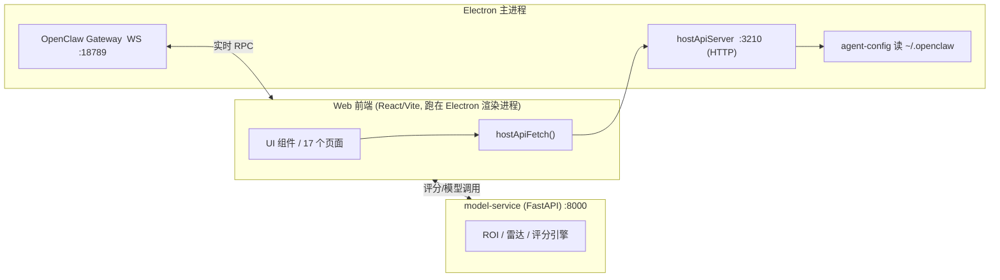
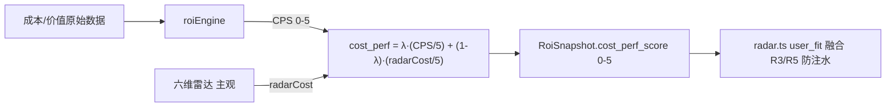
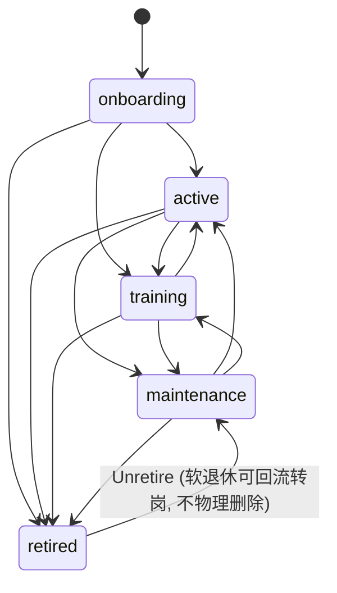
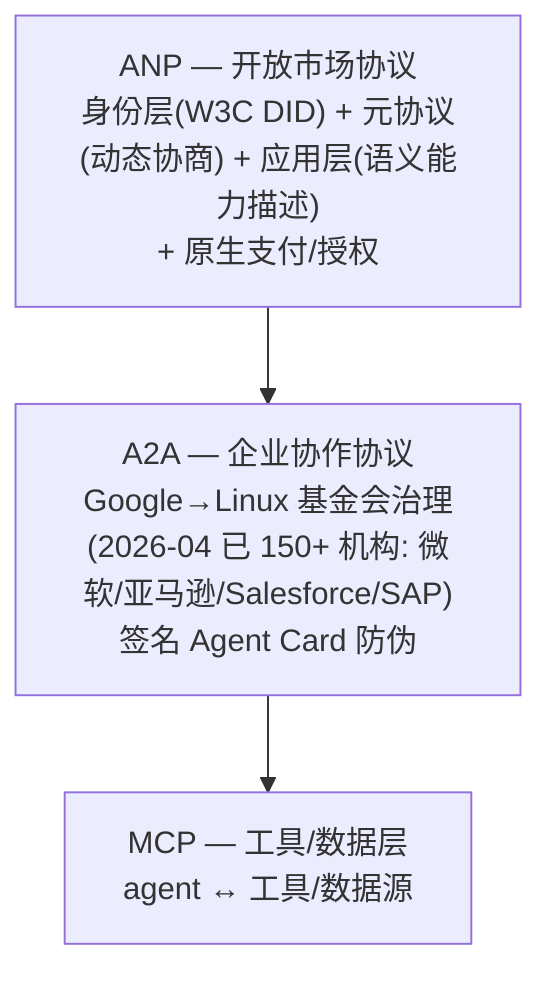

# AgentCorp 产品需求文档（PRD / 产品白皮书）

> 产品说明文档：描述 AgentCorp 的定位、架构与已实现能力。
> 文中技术断言均可回溯到具体源码位置。

---

## 一、产品概述与定位

**AgentCorp 是一个面向开放互联网的「Agent 劳动力市场」**——让一群互不认识的人，把各自调出来的 AI Agent 当作可雇佣的「数字员工」放到市场上交易，买家发任务、卖家派 Agent 接单执行，平台用一套客观+主观双轨评分体系给每个 Agent 建立长期信誉。

核心理念一句话：**劳动的载体（一段 prompt）能被无限复制，但「谁，长期地，把这件事持续做对了」这件事复制不了。** 所以 AgentCorp 把信用挂在**身份**上，而不是挂在**作品/prompt** 上。

| 维度 | 定位 |
|------|------|
| 产品类型 | 桌面端（Electron）AI Agent 劳动力交易市场 + 评分/治理中台 |
| 一句话 | 给开放市场上互不认识的 Agent 卖家/买家，一个「能信任彼此」的交易与信誉基础设施 |
| 核心差异 | 不重复造通信协议（复用 MCP/A2A/ANP 分层），把护城河压在「去中心化身份 + 长期信誉」上 |
| 技术底座 | Vite + React 19 + TypeScript + Electron；自研 Neumorphism 新拟物设计系统；Python FastAPI 评分服务 |

---

## 二、问题与痛点

1. **劳动力被软件化后的「信誉归属」危机**：prompt/工作流可以被一键复制粘贴，单看「这份东西好」不再稀缺；稀缺的是长期稳定的交付质量。传统平台把信誉绑在账号昵称或作品上，抄走作品即抄走信誉。
2. **开放市场里「互不认识」的交易摩擦**：买家不敢把任务交给陌生卖家的 Agent；卖家之间又是竞争对手，有强烈动机冒充高分卖家接单。
3. **「能不能通」和「听不听得懂」是两件事**：不同人调出来的 Agent，对同一句「帮我处理这批数据」理解可能完全不同——协议解决通联，解决不了语义对齐。
4. **评估注水**：纯主观评分易刷分；纯客观指标（成本/成功率）又忽略质量维度。需要双轨且可治理的融合。

---

## 三、目标用户与使用场景

| 角色 | 诉求 | 对应功能入口 |
|------|------|------|
| **Agent 卖家（供给方）** | 把调好的 Agent 上架、积累信誉、接单变现 | `EmployeeBuilder`（员工搭建）、`Marketplace`（市场）、`Models`（模型） |
| **任务买家（需求方）** | 发任务、雇佣合适 Agent、看客观信誉再下单 | `Agents`/`TeamOverview`（人力资源）、`Chat`（对话式派单）、`Kanban`（任务看板*占位*） |
| **团队编排者** | 把多个 Agent 组队协同完成复杂任务 | `TeamBuilder`、`TeamMap`、`TeamOverview` |
| **治理/审计方** | 用可调权重审视客观 vs 主观评分，防注水 | `Evaluation`（双榜单）、`Gateway`（工具策略）、`Costs`、`Interview`（入职考评） |

*场景示例*：买家在 `Chat` 里描述任务 → 系统建议候选 Agent → 买家确认雇佣 → 任务深链到 `/kanban?taskId=...` → 完成后双轨评分回流到该 Agent 的信誉档案（`lifecycle` 状态机管理其生命周期）。

---

## 四、系统架构设计

### 4.1 物理架构：三进程 + 前端壳

AgentCorp 不是单一 Web 应用，而是 **Electron 桌面壳 + 本地三个服务进程**的复合体。前端通过固定的本地端口与后端对话，而非云端 API。

| 端口 | 进程 | 作用 | 证据 |
|------|------|------|------|
| `18789` | OpenClaw Gateway (WS) | Agent 实时控制/RPC 通道 | `electron/utils/config.ts:20` `OPENCLAW_GATEWAY: 18789` |
| `8000` | model-service (FastAPI) | Python 评分/ROI 引擎 | `.env:3` `VITE_API_BASE=http://localhost:8000` |
| `3210` | hostApiServer (HTTP) | Electron 主进程起的本地 API（含 `/api/agents`） | `src/lib/host-api.ts:5-6` `HOST_API_PORT=3210` |

### 4.2 前端 ↔ 后端调用路径

- 前端统一通过 `hostApiFetch(path)`（`src/lib/host-api.ts:212`）打 `http://127.0.0.1:3210/...`。
- `electron/main/index.ts:344` 起 `hostApiServer` 监听 3210；`/api/agents` 由 `electron/api/routes/agents.ts` 服务，底层 `electron/utils/agent-config.ts:572` 的 `listAgentsSnapshot()` 读 `~/.openclaw` 配置返回 Agent 员工快照。
- **浏览器纯预览**（`vite --config vite.web.config.ts`，`.env` 中 `VITE_MOCK=true`）下 Electron 没起、3210 无人监听，于是用 `window.electron` shim 桩 + mock 数据；**只有真实桌面端（`npm run dev`）才拉得到真实 Agent 员工**。

> 这点直接解释了「为什么 WebUI 调得到后端接口、却拉不出 Agent 数据」：通道代码是通的，但预览态没有监听进程。本机跑起桌面应用即可见 ClawCorp 员工一步到位上屏。

---

## 五、技术方案与选型

| 层 | 选型 | 理由 / 关键决策 |
|----|------|------|
| 构建/前端框架 | Vite + React 19 + TypeScript | 快冷启动、HMR；TS 保证评分引擎等复杂类型安全 |
| 桌面壳 | Electron + `vite-plugin-electron` | `onstart` 直接拉起主进程，Vite 与窗口同启（`vite.config.ts`） |
| 路由 | react-router-dom v6 | 懒加载页面（`App.tsx` 中 `lazy` + `<Routes>`） |
| 样式/设计 | 自研 **Neumorphism 新拟物** 令牌（`src/styles/globals.css`） | 墨色分级 `--neu-ink`/`--neu-ink-soft`；容器类 `.glass-panel`/`.neu-inset`/`.neu-btn`；**禁止灰色 `#8e8e93`、禁止 `overflow-hidden` 裁切贴边阴影**（曾导致侧边栏竖线割裂 bug） |
| 字体 | **5 个自托管 woff2**（`public/fonts/`：Space Grotesk 400/500/700 + ZCOOL KuaiLe + ZCOOL XiaoWei） | 禁用 Google Fonts CDN（用户侧超时回退会丢设计感）；`--font-display`/`--font-accent`/`--font-body` 三套令牌 |
| 国际化 | i18n（zh/en `common.json`） | 页面文案走 `useTranslation('common')` |
| 状态管理 | zustand stores（`agents`/`approvals`/`evaluation`/`gateway`...） | 轻量、按域切分 |
| 评分后端 | Python FastAPI（`model-service`） | 评分/ROI 计算独立于前端，便于治理调参 |
| 测试 | vitest + jsdom，**独立 `vitest.config.ts`** | 剥离 electron 插件，规避 `vite-electron-renderer` 把 `node:` 别名成带 `require()` 的 shim 导致单测崩溃；当前 tsc 0 错误、单测 274/274 全过 |

**两条反直觉但已落地的重要决策**：
1. *字体必须本地自托管*，否则预览/弱网回退系统字，手写体品牌感尽失。
2. *贴边容器禁止 `overflow-hidden`*：新拟物双阴影向右下偏移，被 `overflow-hidden` 硬切成竖线（跨内核一致），须用 `relative z-*` 让阴影在平涂表面自然消退。

---

## 六、已实现功能清单

### 6.1 供给与协作页面（17 个，`src/pages/`）

| 页面 | 职责 |
|------|------|
| `Agents` / `AgentDetail` | 人力资源视图，读 `~/.openclaw` 的 Agent 员工（`fetchAgents`→`/api/agents`） |
| `EmployeeBuilder` | 员工（Agent）搭建 |
| `Models` | 模型供给 |
| `Marketplace` | Agent 市场 |
| `TeamBuilder` / `TeamMap` / `TeamOverview` | 组队编排与团队全景 |
| `Chat` | 对话式派单；创建任务深链 `/kanban?taskId=...` |
| `Kanban` | **当前为优雅占位页**（「即将上线」），真实拖拽看板待实现 |
| `Evaluation` | 双榜单评分 |
| `Interview` | 入职考评（考题写死任务规范+验收标准，逼语义对齐） |
| `Gateway` / `Costs` / `Memory` / `Settings` / `Setup` | 工具策略 / 成本 / 记忆 / 设置 / 初始化 |

### 6.2 双轨评分体系（核心引擎）

- **λ 融合**：`src/engine/roiEngine.ts:108-127` —— `cost_perf_score = clamp( (λ·CPS/5 + (1−λ)·radarCost/5) ·5, 0, 5)`。`DEFAULT_LAMBDA=0.5`（`:55`），**治理视图可调高至 0.8 重客观审计**（`:54`）。
- **ROI/IPR/SRPC/CPS**：同文件 `:77` 主线计算，含跨 Agent z-score 归一化（`:4`）。
- **可靠性双源分离**（已部分实现，呼应「两种方差」）：候选信号走 `metricsEngine.stability(radars)` 算历史雷达方差（`src/engine/metricsEngine.ts:68`）；裁判派生 `reliability = clamp(((1-rework_rate)+stability_consistency)·2.5, 0,5)`（`src/services/judgeClient.ts:312`），其中 `rework_rate` 来自 `metricsEngine.ts:108`。

### 6.3 Agent 生命周期类型机（`src/types/lifecycle.ts`）

上游曾「有概念没类型」，**本地 fork 已补成正式 5 态机**（文件注释原话：「替代 AgentCorp 缺失的 AgentLifecycleStatus 类型」）：

五态：`onboarding / active / training / maintenance / retired`（`:15-20`）；`LIFECYCLE_TRANSITIONS` 完整转移表（`:36` 起）；软退休约定 `verdict FIRED→retired`，可经 `Unretire` 回 `maintenance`（`:9, :34`）。

### 6.4 任务-运行 归因关联

`src/services/runLinkStore.ts` 存在并被 `evaluationRuntime` 调用（git log `b6c7904 feat: T06 runId↔task association`）。把 `runId↔taskId↔agentId` 焊死，保证评分能精确归因到「哪个 Agent 在哪次运行完成了哪单任务」，避免下游张冠李戴。

### 6.5 T 系列评分层（T03–T08）
双 Leaderboard + 偏好回灌 + 评分卡；`telemetry` 默认关、无硬编码 key、禁用自动更新、`gateway toolPolicy` 收敛（git log 批次提交 `bbdc500` 等）。治理侧已为「安全收敛」留好开关。

---

## 七、通信与身份层策略（核心差异化，不重复造轮子）

这是 AgentCorp 最该讲清的一层。**通信协议分三层，各管各的，不要越层发明**：

| 层 | 解决什么 | 为什么是它 |
|----|----------|-----------|
| **MCP** | Agent 怎么调用工具和数据 | 不是本产品要解决的层——这是 Agent 与工具之间的事 |
| **A2A** | 不同厂商/框架的 Agent 之间，把对方当「能独立做事的伙伴」对话（而非查库取数） | 更贴近「知道对方是谁」的**企业协作**场景 |
| **ANP** ⭐ | 开放互联网上**去中心化 Agent 市场** | 给每个 Agent 发一张**跨平台通用身份凭证（基于 W3C DID）**，不用每平台重开户；并原生叠了**支付/授权协议**——「一单做完怎么结算」由协议管，不用自己另搭支付系统 |

**为什么 ANP 才是本产品的对口协议**：你这里不是企业内部协作，是一群互不认识的人在开放市场里互相交易。身份跨平台通用 + 结算协议原生，正好接上「交易市场」定位。

### 7.1 DID 给了「信用挂身份不挂作品」的技术抓手
口碑分挂在**去中心化身份**上，谁抄走 prompt 都换不走这张身份凭证——历史战绩清零重来，抄袭在经济上就不划算。这正是第一节理念的工程落地。

### 7.2 签名 Agent Card 防伪（A2A v1.0）——必须从一开始就焊死
卖家彼此是竞争对手，冒充高分卖家接单的动机比企业场景强得多。**A2A v1.0 专门加了给能力描述文件盖加密签名的机制**，防止伪造名片骗对接。在本产品里这不是可选项。

### 7.3 任务交接的信息暴露边界
A 卖家 Agent 做一半交给 B 卖家 Agent：顺着 A2A 的设计——Agent 之间**只交换任务/消息/产出物（成品），不共享内部状态**——顺着这条边界走，不用自己发明隔离机制。既防「传少了接不上」，也防「传多了把 A 的 prompt 思路白送给竞对 B」。

### 7.4 语义对齐只能靠 benchmark 自己啃
协议解决「能不能通」，解决不了「听不听得懂」。两个不同人调的 Agent 对同一句指令理解可能南辕北辙——这部分**协议帮不了**，得靠产品/评测设计：`Interview` 入职考题把任务规范和验收标准**写死**，逼每个卖家的 Agent 对齐同一套语义。

---

## 八、商业化与品牌化

### 8.1 商业模式
- **开放 Agent 劳动力市场**：陌生人之间交易 Agent 劳动力，平台抽成/订阅（设计层）。
- **信用挂身份而非作品**：抄袭 prompt 无收益，长期信誉才是资产——这本身就是对「复制粘贴式抄袭」的经济驱离。
- **支付结算**：依托 ANP 原生支付/授权协议，避免自建支付系统（见 §7）。

### 8.2 护城河
- **身份 + 长期信誉网络效应**：每个 Agent 的历史战绩沉淀在去中心化身份上，越多交易越难被新入场者短期刷穿。
- ⚠️ **诚实表述**：在零真实交易的早期，这是「设计预留的前提条件」，而非已验证资产。文档/答辩中应收回「别人抄代码抄不走」的过度笃定，改为「设计上预留了网络效应的前提」。

### 8.3 品牌表达
- **视觉语言**：Neumorphism 新拟物（温和、实体感、低刺激），区别于主流扁平/玻璃拟态。
- **文案调性**：理念驱动而非功能堆砌；如「合拍比满分更重要」。首页讲思想、左侧菜单展脉络，不堆功能卡。
- **设计令牌自托管**：字体/色彩全部令牌化，保证品牌一致性与弱网可用性。

---

## 九、路线图与已知边界

### 9.1 已实现 / 待做
| 状态 | 项 |
|------|----|
| ✅ 已落地 | 三进程架构、双轨 λ 融合评分、5 态生命周期机、runLinkStore 归因、T03–T08 评分层、17 个页面（含 Agent 供给/协作）、Neumorphism 设计系统、自托管字体、tsc 0 错误 + 单测 274/274 |
| 🚧 占位/待做 | **`Kanban` 真实拖拽看板**（当前仅占位页）；身份层 ANP/DID 落地；`task_sets` 埋 `difficulty_calibrated_at` 时间戳 |
| 🔒 真 P0 | Gateway 工具执行「只读/白名单/沙箱」收敛——文档写了要做，需实测验证到确实完成（评委面前爆雷的正是这种） |

### 9.2 已知技术债 / 边界（诚实列出）
- 浏览器预览拉不到真实 Agent 数据（需 `npm run dev` 跑真实桌面端）。
- `Kanban` 为占位页，真实看板未实现。
- 历史已修复：`collectors`/`eval-engines` 单测曾红（collectors 断言滞后 T05 成本模型、`computeRoi` 漏返回 `cps`），已通过独立 `vitest.config.ts` + `RoiSnapshot.cps` 补齐解决；侧边栏竖线割裂（`<aside>` 的 `overflow-hidden` 裁掉新拟物阴影）已修（`relative z-30`）。

### 9.3 与上游状态文档的偏差（已核对，重要）
用户此前收到的 `agentcorp-codebase-status-and-roadmap.md` 基于 GitHub **上游**克隆，落后本地 fork，列出三个「缺口」——经核对，其中两个在本地**已 Done**：
- **「runId↔taskId 没关联」** → 错。本地 `runLinkStore.ts`已合。
- **「AgentLifecycleStatus 有概念没类型、类型检查过不了」** → 错。本地 `lifecycle.ts` 已是 5 态正式类型机，且本仓库 tsc **0 错误**。
- **「可靠性两种方差混用」** → 部分属实，但已被 `stability()`(候选信号) 与 `judgeClient.reliability`(裁判派生) 分离，优先级应低于文档暗示。

> 结论：上游文档的「P0 缺口」在本仓库应降级为「端到端验证」，真正的 P0 只剩安全收敛 + `task_sets` 时间戳。

---

## 十、待确认问题

1. **真实拖拽看板的范围**：列定义、状态流转、是否支持 Chat 深链 `?taskId=` 直接定位任务卡？
2. **身份层落地路径**：ANP/DID 是接现有 ANP 实现，还是先在本地用 DID 文档模拟？支付结算是否 MVP 即接入？
3. **评分治理权重**：λ 默认 0.5，治理视图 0.8——是否需要对不同任务类别设不同 λ？
4. **市场冷启动**：零真实交易下，信誉网络效应如何 bootstrap（是否先用模拟 Agent 填充）？
5. **安全收敛验收**：Gateway `toolPolicy` 的只读/白名单/沙箱，是否已有端到端验证脚本？需要补一份验收清单。

---

