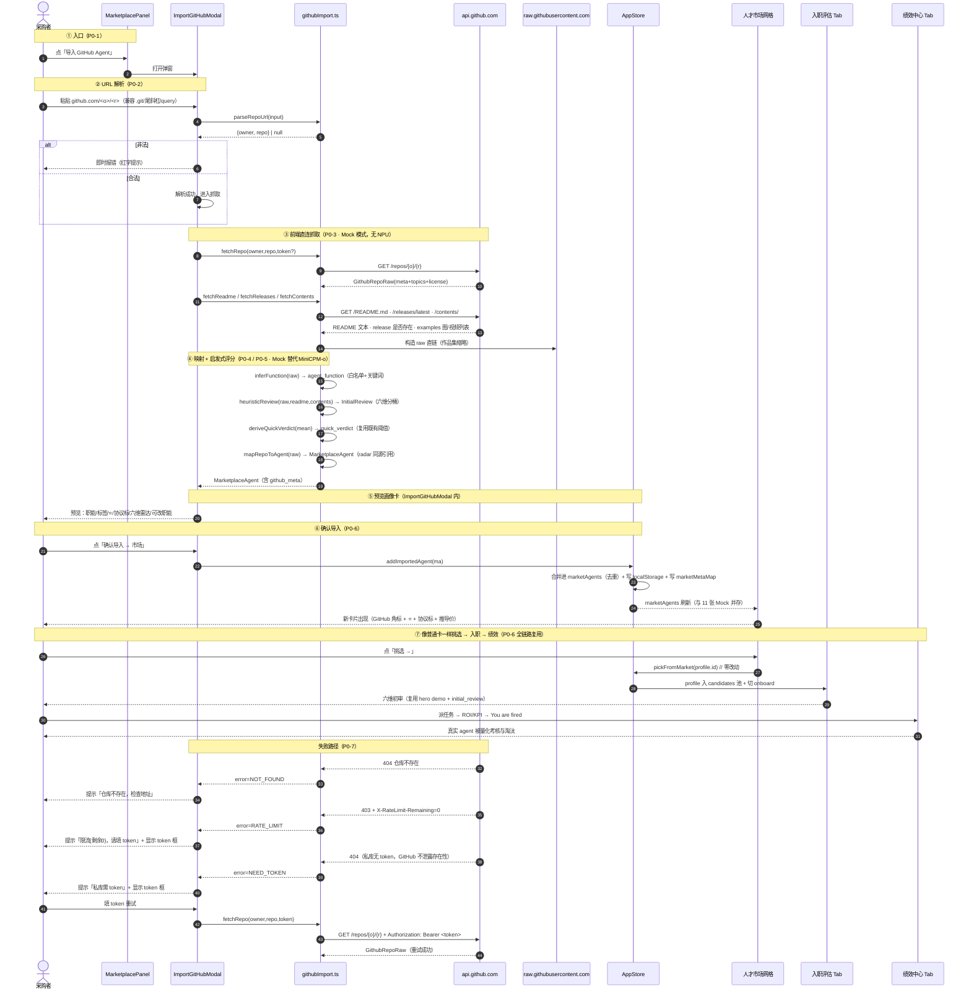
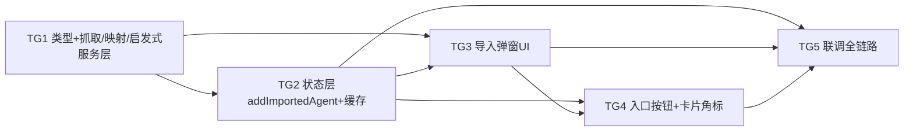

# AgentCorp · 增量架构设计：GitHub 一键导入真实 Agent

> 架构师：高见远（Gao）　|　版本：v0.3-github-import　|　日期：2025-07-26
> 依据：PRD v0.3-github-import（许清楚）· 架构 v0.2-marketplace（三 Tab）· `github-agent-import-research.md`（真实 agent 调研）· 现有代码（`src/types/marketplace.ts` / `utils/marketFilter.ts` / `services/api.ts` / `mock/marketplaceAgents.ts` / `store/useAppStore.ts` / `components/Marketplace/*`）
> 性质：**增量设计**（基于 Phase 1 + 人才市场已交付代码，不推翻、只扩展）
> 运行环境：沿用 Vite + React + TS + Tailwind + Zustand + recharts，Mock 模式默认开（`config.mock = true`）；**本期模型侧走 Mock**（启发式六维替代 MiniCPM-o），真实端点等朋友模型层就绪再接。

---

## 0. 增量设计总览与关键决策摘要

| # | 关键决策 | 结论（增量） |
|---|---|---|
| D-G1 | GitHub 抓取方式 | **前端 `fetch` 直连 `api.github.com`**，无后端、无中间层；未认证 GET 支持 CORS；可选 `token` 走 `Authorization: Bearer` 重试。作品集缩略走 `raw.githubusercontent.com` 直链（`/<video>` 无需 CORS） |
| D-G2 | `AgentSource` 扩展 | 纯增量 union：`"market_mock" \| "user_upload" \| "github_import"`，零风险；卡片/抽屉仅多一个来源分支显示「GitHub」 |
| D-G3 | 映射到 `MarketplaceAgent` | 复用既有类型，**同构**于 11 张 Mock；新增可选 `github_meta: GithubImportMeta` 承载 ⭐/协议/html_url/分支/派生报价等 GitHub 专属展示数据，Mock 卡不填该字段 |
| D-G4 | 启发式六维（Mock 替代 MiniCPM-o） | 严格复用 `utils/marketFilter.ts` 的 `deriveQuickVerdict`（阈值 ≥4 PASS / ≥3.3 OBSERVE / <3.3 REJECT）；六维由 `heuristicReview()` 按 PRD 附A 分桶公式推导；`profile.evaluation.radar` 与 `initial_review.radar` **同对象引用**（沿用 Mock 约定） |
| D-G5 | 导入落地 | 新增 `addImportedAgent(ma)` 合并进 `marketAgents`（按 `profile.id` 去重），与 11 张 Mock 并存；`pickFromMarket` **零改动**复用，入市场后全链路（入职六维初审 → 绩效 ROI/KPI/You are fired）一致可达 |
| D-G6 | 限流 / 缓存 / token | 未认证 60/h 够 Demo（单场 ≤5）；超量用可选 token（5000/h）兜底；导入结果 `localStorage` 缓存（避免重复抓取、重进市场自动恢复） |
| D-G7 | 失败友好 | 三类异常统一引导：404 仓库不存在 / 403+剩余0 限流 / 私库无 token→GitHub 对私库返回 404（不泄露存在性）；均提示「填 token 重试」，弹窗内带 token 重发一次 |

> 标注约定：下文 **【新增】** = 本次新建；**【修改】** = 在既有文件上增量改动；**【复用】** = 完全复用既有实现。

---

## 1. 实现方案 + 框架选型

### 1.1 核心难点

1. **前端直连 GitHub 的 CORS 与限流**：未认证 `GET https://api.github.com/*` 返回 `Access-Control-Allow-Origin: *`，浏览器可直接调用；核心难点是 60/h 限速（读响应头 `X-RateLimit-Remaining`）与私库/坏地址的友好降级。方案——抓取层集中在 `services/githubImport.ts`，统一封装 `fetch` + token + 错误判别；限流/私库引导 token 重试。
2. **映射成 `MarketplaceAgent` 且同构于 Mock**：抓取的 `GithubRepoRaw` 字段（name/desc/language/license/stars/forks/pushed_at/topics/owner.avatar）需映射进 `CandidateProfile` + `MarketplaceAgent`。难点是 ⭐数、协议标、派生报价、作品集直链这些 Mock 没有的字段——用新增可选 `github_meta` 承载，卡片加 `source==='github_import'` 分支渲染，不污染既有 Mock 卡。
3. **启发式六维与 `deriveQuickVerdict` 严格对齐**：PRD 附A 的分桶公式要在前端确定性实现（无 NPU）。难点是「主语言匹配职能 +0.3」「examples 是否找到图片/视频」等信号判定；方案——`heuristicReview(repo)` 纯函数实现分桶，末步直接调既有 `deriveQuickVerdict(mean)`，**不另写阈值**。
4. **导入态与既有市场列表合并且可恢复**：`useMarket` 挂载时从 `apiClient.getMarketplace()` 取 11 张 Mock；导入态需「持久化 + 重启恢复 + 与 Mock 并存 + 去重」。方案——`addImportedAgent` 追加进 `marketAgents` 并写 `localStorage`；`useMarket` 挂载时把缓存的导入态合并进来。
5. **零依赖**：全程不引入任何新 npm 包（无 OAuth SDK、无 octokit），token 仅本地文本框 + 手动 `Authorization` 头。

### 1.2 框架与库选型

| 层 | 选型 | 说明（增量） |
|---|---|---|
| 前端框架 | **Vite + React 18 + TypeScript** | 【复用】既定栈，本次不新增路由/状态库 |
| 样式 | **Tailwind CSS** | 【复用】弹窗/卡片角标/协议标全部原子类 |
| 状态管理 | **Zustand** | 【修改】`useAppStore` 增 `addImportedAgent`（合并进 `marketAgents` + 缓存），`pickFromMarket` 零改 |
| 雷达图 | **recharts** | 【复用】预览画像卡/详情抽屉共用 `RadarChart` |
| 多模态预览 | **既有 `MediaViewer`** | 【复用】`raw.githubusercontent` 缩略图/视频失败自动占位降级 |
| GitHub 抓取 | **原生 `fetch`** | 【新增】`services/githubImport.ts` 直连 `api.github.com`，无第三方 SDK |
| 缓存 | **`localStorage`** | 【新增】`utils/githubCache.ts`，仅存导入态（owner/repo + 已映射 agent），不存 token |

### 1.3 架构模式

- **服务层纯函数化**：`parseRepoUrl / fetchRepo / mapRepoToAgent / heuristicReview / inferFunction` 均为可单测纯函数（除 `fetch*` 网络）；UI 与状态层只做编排。
- **契约优先（继承）**：导入 agent 与 Mock 共用 `MarketplaceAgent` 契约；`MarketplaceAgent` 在 `CandidateProfile` 之上组合。
- **降级不变量（继承）**：`VITE_MOCK=true` 下市场/初审/绩效全本地合成；GitHub 抓取是**另一条独立前端链路**（不走 `VITE_MOCK`，但失败时友好降级而非崩溃）。

---

## 2. 文件列表（相对路径，根：`agentcorp/`）

> 仅列出本次【新增】/【修改】文件。既有未改文件（雷达引擎/ROI/KPI/useEvaluation/MediaViewer 等）均【复用】。

```
agentcorp/
├── docs/
│   ├── architecture-github-import.md     【新增】本文档
│   ├── class-github-import.mermaid        【新增】类图（抽取）
│   └── sequence-github-import.mermaid     【新增】时序图（抽取）
├── src/
│   ├── types/
│   │   └── marketplace.ts                 【修改】AgentSource 加 'github_import'；新增 GithubImportMeta；MarketplaceAgent 加 github_meta?
│   ├── services/
│   │   ├── api.ts                         【复用】本期不改（GitHub 抓取不经由 apiClient）
│   │   └── githubImport.ts                【新增】parseRepoUrl/fetchRepo/fetchReadme/fetchReleases/fetchContents/mapRepoToAgent/heuristicReview/inferFunction + 缓存读写
│   ├── utils/
│   │   ├── marketFilter.ts                【复用】deriveQuickVerdict/initialReviewScore（heuristicReview 直接调用，零改）
│   │   └── githubCache.ts                 【新增】loadImportedCache/saveImportedCache（localStorage）
│   ├── store/
│   │   └── useAppStore.ts                 【修改】增 addImportedAgent（合并进 marketAgents + 写缓存 + 写 marketMetaMap）；pickFromMarket 零改
│   ├── hooks/
│   │   └── useMarket.ts                   【修改】挂载时合并缓存导入态进 marketAgents（与 11 张 Mock 并存）
│   └── components/
│       └── Marketplace/
│           ├── MarketplacePanel.tsx       【修改】头部加「导入 GitHub Agent」按钮（与「上传自有 Agent」并列），触发 ImportGitHubModal
│           ├── MarketCard.tsx             【修改】source==='github_import' 分支：GitHub 角标 + ⭐数 + 协议标（非宽松标红「商用需复核」）+ 推导价标注
│           ├── AgentDetailDrawer.tsx      【修改】来源文案加 'github_import' 分支显示「GitHub」+ ⭐/协议/链接
│           ├── ImportGitHubModal.tsx       【新增】导入弹窗：URL 解析→加载→预览画像卡→确认→失败/token 重试
│           └── GithubPreviewCard.tsx       【新增】导入预览画像卡（复用 MarketCard 风格，展示职能/标签/⭐/协议/六维雷达/可改职能）
```

> 复用点（**零改动**）：`MarketplaceAgent` 卡片网格、`AgentDetailDrawer` 六维雷达、`pickFromMarket`/`selectCandidate`/`setActiveTab`、入职六维初审 hero demo、`dispatchDeepEvaluation`/`fireAgent`、ROI/KPI 看板、`MediaViewer` 降级、`deriveQuickVerdict`。

---

## 3. 数据结构和接口（类图 / Mermaid）

`GithubRepoRaw`（api.github.com 抓取原始数据）→ `mapRepoToAgent()` → `MarketplaceAgent`（`source='github_import'`，附 `github_meta`）；`heuristicReview()` 生成 `InitialReview`（六维），与 `profile.evaluation.radar` **同对象引用**。

```mermaid
classDiagram
    %% ===== GitHub 抓取原始数据（api.github.com 返回形状，精简）=====
    class GithubRepoRaw {
        +string full_name
        +string name
        +string description
        +string language
        +number stargazers_count
        +number forks_count
        +string pushed_at        %% ISO
        +string[] topics
        +boolean archived
        +string default_branch
        +GithubLicense license   %% {spdx_id, name}
        +GithubOwner owner        %% {login, avatar_url, html_url}
        +string html_url
    }
    class GithubLicense {
        +string spdx_id
        +string name
    }
    class GithubOwner {
        +string login
        +string avatar_url
        +string html_url
    }
    class ReadmeResult {
        +string text
        +number len
        +boolean hasBadges
        +boolean hasHeadings
    }
    class ContentsResult {
        +boolean hasExamples    %% examples/showcase/docs 下找到图片或视频
        +boolean hasVideo
        +MediaRef[] thumbnails  %% raw.githubusercontent 直链
    }

    %% ===== 本次新增导入元信息 =====
    class GithubImportMeta {
        +string owner
        +string repo
        +number stars
        +number forks
        +string license
        +string html_url
        +string branch
        +string pushed_at
        +string language
        +number notional_budget   %% clamp(round(stars/2000)+100,80,320)
        +boolean commercial_review %% 协议非宽松→true 标红
    }

    %% ===== 既有市场契约（复用 / 扩展）=====
    class AgentSource {
        <<enumeration>>
        market_mock
        user_upload
        github_import
    }
    class QuickVerdict {
        <<enumeration>>
        PASS
        OBSERVE
        REJECT
    }
    class RadarScore {
        +number task
        +number quality
        +number comm
        +number creativity
        +number reliability
        +number cost
    }
    class InitialReview {
        +RadarScore radar
        +string[] tag_eval
        +QuickVerdict quick_verdict
        +number confidence
    }
    class MarketplaceAgent {
        +CandidateProfile profile
        +AgentFunction agent_function
        +string[] style_tags
        +AgentSource source
        +string avatar_url
        +MediaRef[] work_thumbnails
        +InitialReview initial_review
        +GithubImportMeta github_meta
    }
    class CandidateProfile {
        +string id
        +string name
        +number declared_budget
        +Evaluation evaluation
        +MediaRef[] artwork
    }
    class Evaluation {
        +RadarScore radar
        +Verdict verdict
        +number user_fit
    }

    %% ===== 状态仓切片（增量）=====
    class AppStore {
        +MarketplaceAgent[] marketAgents
        +Record~string,MarketplaceAgent~ marketMetaMap
        +addImportedAgent(ma)
        +pickFromMarket(id)
    }

    %% ===== 服务层（纯函数）=====
    class GithubImportService {
        +parseRepoUrl(input): {owner,repo}|null
        +fetchRepo(owner,repo,token?): GithubRepoRaw
        +fetchReadme(owner,repo,token?): ReadmeResult
        +fetchReleases(owner,repo,token?): boolean
        +fetchContents(owner,repo,branch,token?): ContentsResult
        +inferFunction(raw, preset?): AgentFunction
        +heuristicReview(raw, readme, contents): InitialReview
        +mapRepoToAgent(raw, token?): MarketplaceAgent
    }

    %% ===== 关系 =====
    GithubRepoRaw "1" *-- "1" GithubLicense
    GithubRepoRaw "1" *-- "1" GithubOwner
    GithubImportService ..> GithubRepoRaw : fetch*
    GithubImportService ..> ReadmeResult : 解析 README
    GithubImportService ..> ContentsResult : 扫描目录
    GithubImportService ..> InitialReview : heuristicReview
    GithubImportService ..> MarketplaceAgent : mapRepoToAgent
    GithubRepoRaw ..> GithubImportMeta : 抽取展示字段
    MarketplaceAgent "1" *-- "1" GithubImportMeta : github_meta（仅 github_import）
    MarketplaceAgent "1" *-- "1" CandidateProfile : profile
    MarketplaceAgent "1" *-- "1" InitialReview : initial_review
    MarketplaceAgent "1" *-- "1" RadarScore : evaluation.radar（同引用）
    InitialReview "1" *-- "1" RadarScore : radar（同引用）
    MarketplaceAgent ..> AgentSource : source='github_import'
    CandidateProfile "1" *-- "1" Evaluation
    Evaluation "1" *-- "1" RadarScore
    AppStore "1" o-- "*" MarketplaceAgent : marketAgents
    note for MarketplaceAgent "github_import 卡：profile.evaluation.radar\n与 initial_review.radar 同一对象引用；\nevaluation.verdict 镜像 quick_verdict；\nuser_fit=0；github_meta 承载 ⭐/协议/链接/派生价"
    note for GithubImportService "全部纯函数（除 fetch*）；\nheuristicReview 末步调 deriveQuickVerdict(mean)"
```

### 3.1 关键类型增量（`src/types/marketplace.ts`）

```typescript
/** agent 来源：市场 Mock 样例 / 用户上传 / GitHub 导入（本期新增） */
export type AgentSource = "market_mock" | "user_upload" | "github_import";

/** GitHub 导入元信息（仅 source==='github_import' 时填充，供卡片角标/协议标/作品集直链/派生报价） */
export interface GithubImportMeta {
  owner: string;            // 如 "All-Hands-AI"
  repo: string;             // 如 "OpenHands"
  stars: number;            // ⭐ 角标 + 推导报价
  forks: number;
  license: string;          // spdx_id 或 "NOASSERTION"/"自定义"
  html_url: string;         // https://github.com/<owner>/<repo>
  branch: string;           // 默认分支（raw 直链用）
  pushed_at: string;        // ISO，可靠性评分 + 活跃度
  language: string | null;  // 主语言
  notional_budget: number;  // clamp(round(stars/2000)+100, 80, 320) 推导报价
  commercial_review: boolean; // license 非宽松 → 标红「商用需复核」
}

export interface MarketplaceAgent {
  profile: CandidateProfile;
  agent_function: AgentFunction;
  style_tags: string[];
  source: AgentSource;       // 新增 'github_import'
  avatar_url?: string;       // 取 owner.avatar_url（仅存不强制渲染，避免外链裂图）
  work_thumbnails: MediaRef[];
  initial_review?: InitialReview;
  github_meta?: GithubImportMeta; // 新增：GitHub 导入专用（Mock 卡不填）
}
```

### 3.2 `addImportedAgent` 契约（`src/store/useAppStore.ts`）

```typescript
/** 导入：把 GitHub 映射出的 MarketplaceAgent 合并进 marketAgents（按 profile.id 去重）+ 写缓存 + 写 metaMap。pickFromMarket 零改动。 */
addImportedAgent: (ma: MarketplaceAgent) => void;
```

---

## 4. 程序调用流程（时序图 / Mermaid）

端到端：`用户粘贴 URL → ImportGitHubModal 解析 → fetchRepo/Readme/Releases/Contents → mapRepoToAgent + heuristicReview → addImportedAgent → 市场卡片出现 → pickFromMarket → onboard 六维初审 → govern 绩效/fire`。标注 **Mock 模式**（启发式评分，无 NPU）、失败路径（404/限流/token 重试）。



### 4.1 Mock 模式实现要点

- **抓取**：`fetchRepo` 等原生 `fetch` 直连 `api.github.com`，未认证 GET 支持 CORS；带 `token` 时附加 `Authorization: Bearer`。
- **映射**：`mapRepoToAgent` 组装 `CandidateProfile`（id=`gh-<owner>-<repo>`，name=repo，declared_budget=`notional_budget`，persona_text=README 摘要，artwork=`github_meta` 作品集直链，evaluation.radar 与 initial_review.radar 同源）+ `MarketplaceAgent`（source=`github_import`，github_meta）。
- **启发式评分**：`heuristicReview` 按 PRD 附A 分桶（见 §7）输出六维，末步 `deriveQuickVerdict(mean)` 给 `quick_verdict`（**绝不另写阈值**）。
- **导入落地**：`addImportedAgent` 追加进 `marketAgents`（按 `profile.id` 去重）+ 写 `localStorage`；`pickFromMarket` 原样复用，挑选后走 onboard/govern 全链路。
- **真实模式扩展点**：`heuristicReview()` 可整体替换为 MiniCPM-o 多模态评估调用（README 文本→文本通道、examples 图/视频→视觉通道），输出同构六维（P2-2）。

---

## 5. 任务列表（有序、含依赖、按实现顺序）

> ⚠️ 增量约束适配：基础设施（配置/入口/依赖）已存在且本次不改，故首任务为「类型 + 抓取/映射/启发式服务层」作为一切基础；全部分组按功能模块，**≤5 任务、每任务 ≥3 文件、按依赖顺序实现**。

| 任务 ID | 任务名 | 涉及文件（≥3，标注新增/修改） | 依赖 | 优先级 | 验收点（可测） |
|---|---|---|---|---|---|
| **T-G1** | 类型契约 + GitHub 抓取/映射/启发式服务层（基础） | `src/types/marketplace.ts`【改·AgentSource+'github_import'+GithubImportMeta+MarketplaceAgent.github_meta】、`src/services/githubImport.ts`【新·parseRepoUrl/fetchRepo/fetchReadme/fetchReleases/fetchContents/mapRepoToAgent/heuristicReview/inferFunction】、`src/utils/marketFilter.ts`【复用·heuristicReview 调 deriveQuickVerdict 阈值对齐】 | — | P0 | `tsc` 通过；`parseRepoUrl` 对 `https://github.com/owner/repo.git`、`github.com/owner/repo/`、`github.com/owner/repo?foo=bar`、`owner/repo` 均解析出 `{owner,repo}`；`heuristicReview` 输出六维 clamp[1,5] 且 `quick_verdict===deriveQuickVerdict(mean)`；`mapRepoToAgent` 产 `source==='github_import'` 且 `evaluation.radar===initial_review.radar`（同引用） |
| **T-G2** | 状态层 addImportedAgent + localStorage 缓存恢复 | `src/store/useAppStore.ts`【改·addImportedAgent 合并进 marketAgents(去重)+写 marketMetaMap】、`src/hooks/useMarket.ts`【改·挂载时合并缓存导入态进 marketAgents 与 11 张 Mock 并存】、`src/utils/githubCache.ts`【新·loadImportedCache/saveImportedCache】 | T-G1 | P0 | `addImportedAgent(ma)` 后 `marketAgents` 含该卡且按 id 去重；刷新页面后从 `localStorage` 自动恢复导入卡；`pickFromMarket` 对导入卡可挑选并切 onboard（零改动验证） |
| **T-G3** | 导入弹窗 UI（解析 + 加载 + 预览画像卡 + 确认 + 失败/token 重试） | `src/components/Marketplace/ImportGitHubModal.tsx`【新·URL 解析/加载态/预览/确认/404·限流·私库三态 + token 框重试】、`src/components/Marketplace/GithubPreviewCard.tsx`【新·预览画像卡：职能/标签/⭐/协议标/六维雷达/可改职能】、`src/services/githubImport.ts`【复用·弹窗调用的抓取/映射函数】 | T-G1, T-G2 | P0 | 粘贴合法 URL→解析→抓取→预览卡显示 ⭐/协议/六维；非法 URL 即时报错；404→「仓库不存在」、403+剩余0→「限流请填 token」、私库 404→「需 token」；填 token 重试成功；点确认后该卡出现在市场 |
| **T-G4** | 市场入口按钮 + 卡片/抽屉 GitHub 角标 | `src/components/Marketplace/MarketplacePanel.tsx`【改·头部加「导入 GitHub Agent」按钮并列「上传自有 Agent」】、`src/components/Marketplace/MarketCard.tsx`【改·github_import 分支：GitHub 角标 + ⭐数 + 协议标(非宽松标红「商用需复核」) + 推导价标注】、`src/components/Marketplace/AgentDetailDrawer.tsx`【改·来源文案分支显示「GitHub」+ ⭐/协议/html_url 链接】 | T-G2, T-G3 | P0 | 市场头部两个入口并列；导入卡显示「🔗 GitHub · ⭐xx.xk · 协议 ✅/🔴商用需复核」+「推导价 ¥xxx」；非 MIT/Apache 协议 100% 标红；详情抽屉来源显示「GitHub」并可点 html_url |
| **T-G5** | 联调：导入→市场→pickFromMarket→入职→绩效全链路 | `src/store/useAppStore.ts`【改·addImportedAgent 与 pickFromMarket 串联最终验收】、`src/hooks/useMarket.ts`【改·恢复链路验收】、`src/components/Marketplace/ImportGitHubModal.tsx`【联调用】 | T-G2, T-G3, T-G4 | P0 | 端到端走通：导入 OpenHands→市场出现 GitHub 卡→挑选→入职六维初审(复用 hero demo)→派任务 ROI/KPI→You are fired；`npm run build` + 类型检查通过；单场导入 ≤5 不触 60/h 限速 |

### 5.1 任务依赖图（Mermaid）



### 5.2 任务分解说明

- **T-G1 是基础**：类型与抓取/映射/启发式就绪后，状态层（T-G2）与弹窗（T-G3）可并行推进；入口/卡片角标（T-G4）依赖前两者；联调（T-G5）为最后串联。
- **复用最大化**：`pickFromMarket`/`selectCandidate`/`setActiveTab`、入职六维初审、`dispatchDeepEvaluation`/`fireAgent`、ROI/KPI 看板全部零改动复用；`deriveQuickVerdict` 直接调用，不另写阈值。
- **无新依赖**：全程零新增 npm 包，token 仅本地文本框 + 手动 `Authorization` 头（不做完整 OAuth，OAuth 为 P2-1）。

---

## 6. 依赖包列表

本次**不引入任何新依赖**，全部复用既有栈（Vite/React/TS/Tailwind/Zustand/recharts）。

```
# 前端（沿用 package.json，无新增）
- react@^18.3.1 / react-dom@^18.3.1
- vite@^5.4.0 / @vitejs/plugin-react@^4.3.1
- typescript@^5.5.4
- tailwindcss@^3.4.10 / postcss@^8.4.41 / autoprefixer@^10.4.20
- zustand@^4.5.5
- recharts@^2.12.7

# 明确不引入（控制体积/复杂度）
- 不引入 GitHub SDK（@octokit/*）：原生 fetch 直连 api.github.com 足够，且避免打包体积
- 不引入 OAuth 库：本期仅「粘贴 token 文本框 + Authorization 重试」，完整 OAuth 为 P2-1
- 不引入状态库/路由库：复用既有 Zustand 单仓，无新 Tab 路由
```

---

## 7. 共享知识（跨文件约定）

### 7.1 启发式六维分桶公式（精确数值，工程师直接实现）

输入信号：`S`=stars，`F`=forks，`L`=license.spdx_id，`M`=pushed_at 距今天数/30，`T`=topics，`R`=README 文本（长度 len），`E`=examples/showcase/docs 下是否找到图片或视频，`hasRelease`=`/releases/latest` 是否成功，`hasVideo`=examples 下是否找到视频，`lang`=主语言，`fn`=推断职能。

| 维度 | 公式（结果 `clamp(v,1,5)`，保留 1 位小数） | 信号来源 |
|---|---|---|
| **task** 任务胜任力 | `starTier(S)`：`S≥50000→5, ≥20000→4.5, ≥8000→4, ≥3000→3.5, ≥1000→3, ≥200→2.5, 其余→2`；若 `lang` 匹配职能（`前端`=TS/JS，`后端`=Py/Go）→ `+0.3` | stars + language |
| **quality** 产出质量 | `readmeTier(len)`：`len≥8000→4.5, ≥4000→4, ≥1500→3.5, ≥400→3, 其余→2.5`；`hasRelease→+0.3`；`E→+0.2` | README + release + examples |
| **comm** 表达沟通 | `readmeTier(len)-0.5`；有徽章/标题结构→ `+0.3`；`T.length≥5→+0.3`；有 docs/→ `+0.2` | README + topics |
| **creativity** 创意差异化 | `E→4`（有 examples/showcase 图或视频）；有视频 demo→ `+0.5`；`T.length≥6→+0.3`；无素材→ `3` | examples/showcase |
| **reliability** 可靠性 | `M≤3→5, ≤6→4.5, ≤12→4, ≤24→3.5, ≤48→3, 其余→2.5`；`archived→×0.8`；`F≥1000→+0.2` | pushed_at + forks |
| **cost** 性价比/雇佣成本 | license 宽松度：`MIT/Apache-2.0/BSD/ISC/Unlicense→5`；`MPL-2.0/LGPL→3.8`；`GPL/AGPL→3.2`；`自定义/unknown/无协议(NOASSERTION)→2.5`；`研究/非商业→2`（并置 `commercial_review=true`） | license |

- `clamp(v,1,5)` = `Math.min(5, Math.max(1, v))`，保留 1 位（`Math.round(v*10)/10`）。
- `confidence` = 可用信号数 / 6（README、license、topics、examples、release、pushed_at 是否齐全）。
- `quick_verdict` = **`deriveQuickVerdict(mean of 6 dims)`**（复用 `utils/marketFilter.ts`，阈值 ≥4 PASS / ≥3.3 OBSERVE / <3.3 REJECT）。
- `tag_eval` 由信号拼装，如 `["后端·CodeAct","MIT 可商用","⭐69k 高人气","近期活跃"]`（维度：`${fn}·${关键词}` / `${license} 可商用` 或 `🔴商用需复核` / `⭐${k}高人气`(S≥1000) / `近期活跃`(M≤3)）。
- `profile.evaluation.radar` 与 `initial_review.radar` **同对象引用**（沿用 Mock 约定）；`profile.evaluation.verdict` 镜像 `quick_verdict`（PASS→MVP / OBSERVE→OBSERVE / REJECT→FIRED），`user_fit=0`。

### 7.2 `inferFunction` 白名单 + 关键词兜底表

**人工预设白名单（首批 4+1 + 调研候选，owner/repo 精确匹配优先）**：

| owner/repo | agent_function |
|---|---|
| All-Hands-AI/OpenHands | 后端 |
| Aider-AI/aider | 后端 |
| SWE-agent/SWE-agent | 后端 |
| abi/screenshot-to-code | 前端 |
| geekan/MetaGPT | 全栈（通用≈全栈） |
| mannaandpoem/OpenManus | 全栈 |
| assafelovic/gpt-researcher | 文案 |
| crewAIInc/crewAI | 全栈 |
| 11cafe/jaaz | 制图 |
| Paper2Poster/Paper2Poster | 制图 |
| HKUDS/VideoAgent | 短视频 |
| univa-agent/univa | 短视频 |
| rackyun/Pixelle-Video | 短视频 |
| Significant-Gravitas/AutoGPT | 全栈 |
| yoheinakajima/babyagi | 全栈 |
| camel-ai/owl | 全栈 |

**关键词兜底**（README + topics + description + name 小写拼接后匹配；命中顺序取首个，未命中→`全栈`）：
- `poster|image|png|画|海报|design|figma|海报|storyboard` → 制图
- `video|短视频|剪辑|mp4|film|短片` → 短视频
- `research|report|文案|写作|copy|write|whitepaper` → 文案
- `react|html|frontend|前端|jsx|tsx|vue` → 前端
- `backend|后端|python|api|server|docker|swe|code|agent` → 后端
- `orchestrat|framework|multi-agent|通用|agent` → 全栈
- 默认 → 全栈

> 预览画像卡允许用户在确认前**手动改职能**（P1-3），`mapRepoToAgent` 接受可选 `preset` 覆盖推断结果。

### 7.3 `raw.githubusercontent.com` 直链构造规则

```
缩略图：https://raw.githubusercontent.com/{owner}/{repo}/{default_branch}/{path}
  其中 path 来自 /contents/ 扫描结果（如 examples/demo.png、showcase/clip.mp4）
视频：  同上，<video src=...> 直链，失败由 MediaViewer 占位降级
头像：  github_meta 存 owner.avatar_url；但卡片头像仍沿用职能 emoji 色块（避免外链裂图），avatar_url 仅存不强制渲染
```

### 7.4 `X-RateLimit-Remaining` 读取与提示文案

- 每次 GitHub API 响应读 `res.headers.get('X-RateLimit-Remaining')`（字符串→Number）。
- **403 且 remaining===0** → `error=RATE_LIMIT`，提示：「⚠️ GitHub 限流（剩余 0/60），请填入 Token（5000/h）后重试」。
- **404**（含 `repos/{o}/{r}` 与私库无 token 两种）→ 统一 `error=NEED_TOKEN`（私库 GitHub 返回 404 不泄露存在性），提示：「🔒 仓库不存在或需权限，若私库请填入 Token 重试；公开库请核对地址」。
- **非 404/403 的其他非 2xx** → 通用错误提示原文 status。
- Token 仅存于本次会话内存（弹窗 state），**不写入 localStorage、不落库**；重试仅带 `Authorization: Bearer <token>` 重发一次已解析仓库。

### 7.5 跨文件状态约定（继承既有）

- `addImportedAgent(ma)`：合并进 `marketAgents`（按 `profile.id` 去重），写 `marketMetaMap[profile.id]=ma`，调用 `saveImportedCache(ma)`。
- `useMarket` 挂载：`apiClient.getMarketplace()` 取 11 张 Mock，再 `loadImportedCache()` 合并（导入态在后，与 Mock 并存）。
- `pickFromMarket(id)` **零改动**：从 `marketAgents` 取 `profile` 入 `candidates` 池（去重）+ 写 `marketMetaMap` + `selectCandidate` + `setActiveTab('onboard')`。
- 导入卡与 Mock 卡**完全同构**：入职六维初审、绩效 ROI/KPI、`fireAgent` 全链路可达（RG4 缓解割裂）。

---

## 8. 待明确事项（已收敛 · 推荐默认值直接采用）

> 以下逐项对应 PRD §5 待确认项，均按 PRD 推荐默认值采用，**无新增阻塞点**。

| # | PRD 待确认项 | 推荐默认值（本次采用） |
|---|---|---|
| 1 | 未认证 60/h 是否够 Demo | **够用**（单场 ≤5）；超量用可选 token（5000/h）兜底 + `localStorage` 缓存避免重复抓取 |
| 2 | 启发式打分权重 | **采用 PRD 附A 分桶公式**（§7.1），先上 Demo 看体感再微调；后续 P2-2 由 MiniCPM-o 真评估覆盖 |
| 3 | 私库 token 是否本期做 | **仅做「粘贴 token 文本框 + Authorization 重试一次」**，不做完整 OAuth（OAuth=P2-1） |
| 4 | `AgentSource` 加 `'github_import'` 是否破坏类型 | **纯增量 union 扩展**，仅卡片/抽屉来源文案加分支显示「GitHub」，零风险 |
| 5 | 导入 agent 的 `declared_budget` 如何定 | **`clamp(round(stars/2000)+100, 80, 320)`** 派生 notional 报价，后端/前端职能略加权（+10，封顶 320），仅排序/对比用，卡片标「推导价」 |
| 6 | 职能推断准确率 | **首批 4+1 + 调研候选用人工白名单**（§7.2），其余关键词兜底，预览卡允许手动改职能（P1-3） |
| 7 | 作品集缩略外链稳定性 | **`raw.githubusercontent.com` 直链**；加载失败由 `MediaViewer` 占位降级；头像沿用职能 emoji 色块不强制外链 |

> 仍建议与产品经理/数据确认（不影响本期实现）：① 真实 `marketplaceAdapter` 与朋友字段联调时机（P2-3）；② 首批演示具体挑哪 4+1 个仓库（调研已给推荐：OpenHands / GPT Researcher / Jaaz / MetaGPT + 备选 screenshot-to-code）。

---

## 9. 任务依赖概要（给主理人/工程师速览）

- **任务数**：5 个（T-G1 ~ T-G5），全部 P0，增量设计、不推翻既有市场与评估链路。
- **依赖链**：T-G1（基础）→ T-G2/T-G3（并行）→ T-G4 → T-G5（串联收口）。
- **新增文件**：`src/services/githubImport.ts`、`src/utils/githubCache.ts`、`src/components/Marketplace/ImportGitHubModal.tsx`、`src/components/Marketplace/GithubPreviewCard.tsx`。共 **4 个新文件**。
- **修改文件**：`src/types/marketplace.ts`、`src/store/useAppStore.ts`、`src/hooks/useMarket.ts`、`src/components/Marketplace/MarketplacePanel.tsx`、`src/components/Marketplace/MarketCard.tsx`、`src/components/Marketplace/AgentDetailDrawer.tsx`。共 **6 个修改点**。
- **复用（零改动）**：`MarketplaceAgent` 卡片网格、`AgentDetailDrawer` 六维雷达、`pickFromMarket`/`selectCandidate`/`setActiveTab`、入职 hero demo、`dispatchDeepEvaluation`/`fireAgent`、ROI/KPI 看板、`MediaViewer` 降级、`deriveQuickVerdict`、`apiClient.getMarketplace`（GitHub 抓取不经由它）、11 张 Mock 样例。
- **模型侧**：本期 Mock（启发式六维替代 MiniCPM-o），`heuristicReview()` 留真实评估扩展点（P2-2）。

---

*— 增量架构设计 v0.3-github-import 完。本文档基于三 Tab + MarketplaceAgent 已交付代码，复用评估引擎/ROI/看板/fire 与 Mock 机制，仅扩展「GitHub 一键导入真实 Agent」第 3 种来源；模型侧走 Mock（启发式），真实端点等朋友模型层就绪再接；待确认项见 §8（均附推荐默认值，已收敛）。*
