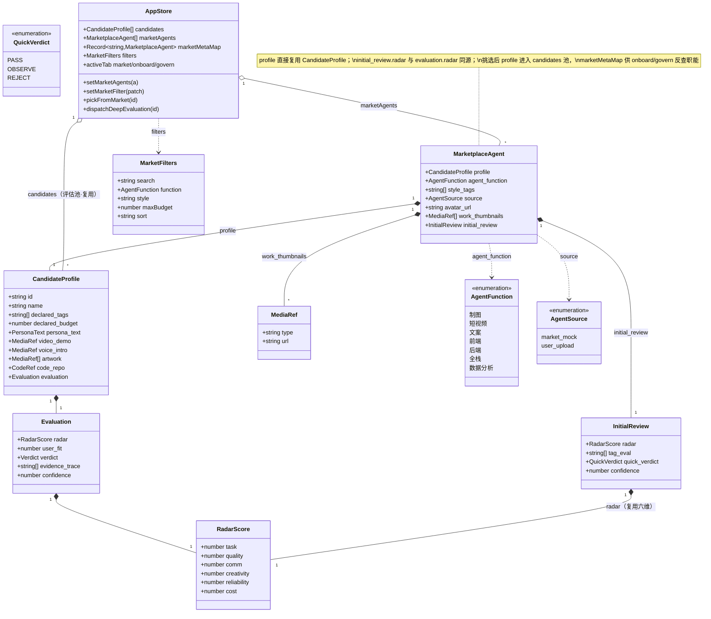
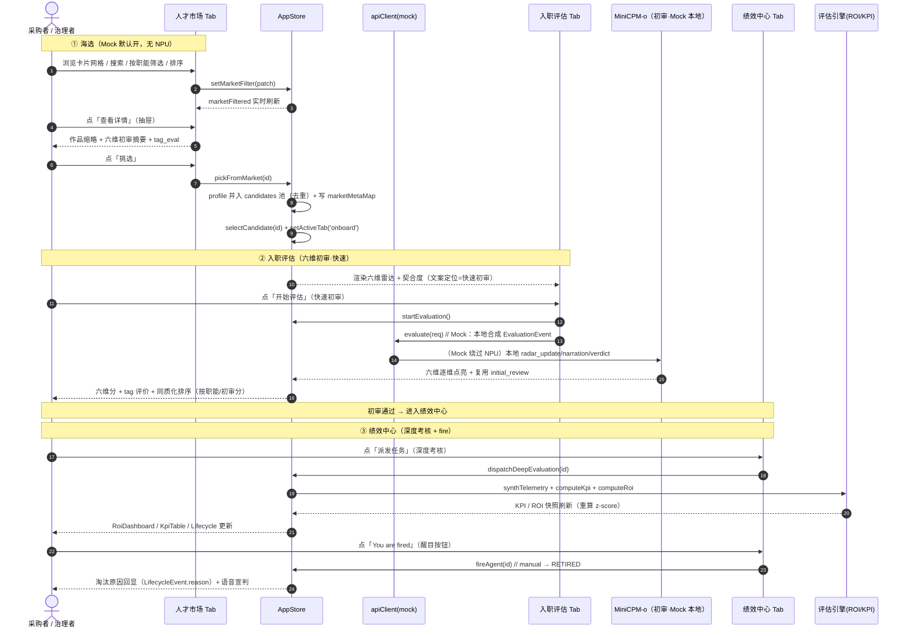
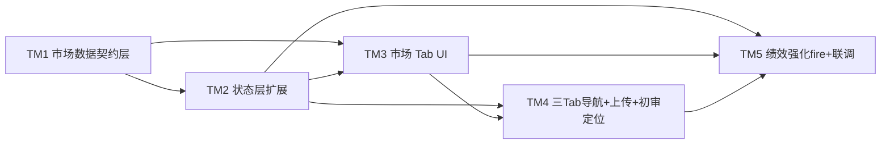

# AgentCorp · 增量架构设计：Agent 人才市场 + 三段职场叙事

> 架构师：高见远（Gao）　|　版本：v0.2-marketplace　|　日期：2025-07-26
> 依据：PRD v0.2-marketplace（许清楚）· 架构主文档 v0.1 · 评估子系统设计 v0.1-eval · 实现手册 v0.1-playbook
> 性质：**增量设计**（基于 Phase 1 已交付代码，不推翻、只扩展）
> 运行环境：沿用 Vite + React + TS + Tailwind + Zustand + recharts，Mock 模式默认开（`config.mock = true`）

---

## 0. 增量设计总览与关键决策摘要

| # | 关键决策 | 结论（增量） |
|---|---|---|
| D-M1 | 三 Tab 机制 | 顶部 Tab 由 `'onboard' \| 'govern'` 扩为 `'market' \| 'onboard' \| 'govern'`，**默认停留在 `market`（人才市场）**；复用现有 `Toolbar` Tab 按钮与 `useAppStore.activeTab`，不新增路由库 |
| D-M2 | 市场数据来源 | 沿用 Mock 模式：`apiClient.getMarketplace()` 在 mock 下返回 `MARKETPLACE_AGENTS`（≥9 张样例，覆盖制图/短视频/文案/前端/后端）；真实模式预留 `/api/marketplace`（P2-2） |
| D-M3 | 市场与评估池关系 | 市场页是**独立 `market` Tab**；底部 `CandidateList` 保留为「已入池候选」入口；二者经「挑选」(`pickFromMarket`) 联动——挑选把 `MarketplaceAgent.profile`（即 `CandidateProfile`）加入 `candidates` 池并切到 `onboard` |
| D-M4 | `MarketplaceAgent` 关键字段 | 在既有 `CandidateProfile` 之上叠加 `agent_function / style_tags / source / avatar_url / work_thumbnails / initial_review`；`initial_review.radar` 直接复用既有六维（`evaluation.radar` 同源），保证 Mock 与真实契约同源 |
| D-M5 | 初审 vs 深度考核文案边界 | 入职评估 Tab = **六维初审·快速**（看简历：制图风格/短视频质感/文案水平），复用 hero demo 仅改文案；绩效中心 Tab = **深度考核**（派任务跑 KPI/ROI）。初审结论 `quick_verdict(PASS/OBSERVE/REJECT)` 与绩效 `verdict(MVP/OBSERVE/FIRED)` 严格区分 |
| D-M6 | 上传入口并存 | 保留全局 `Toolbar` 的「上传简历」按钮（三 Tab 均可见），并在市场页头部再加一条显式「上传自有 Agent」CTA；上传后直接 `setActiveTab('onboard')` 进初审，与海选两条入口并存 |
| D-M7 | 复用原则 | 复用 Phase 1 全部：六维雷达引擎、ROI/KPI 引擎、状态机、`fireAgent`、Mock 合成（`telemetrySynth`）、`MediaViewer`、现有 `onboard/govern` 切片。仅新增市场视图与少量 store 切片 |

> 标注约定：下文 **【新增】** = 本次新建文件；**【修改】** = 在既有文件上增量改动；**【复用】** = 完全复用 Phase 1 既有实现。

---

## 1. 实现方案 + 框架选型

### 1.1 核心难点（增量视角）

1. **市场卡片的「零点击可看分」与既有评估引擎衔接**：市场卡片需直显「初审分」，而六维分本由入职评估流产生。方案——Mock 阶段在 `MarketplaceAgent.initial_review` 中**预置**六维（`evaluation.radar` 同源），市场卡片直接读 `initial_review.radar` 均值展示，无需点击即见分；入选职评估后该 `initial_review` 被 hero demo 复用。
2. **三 Tab 切换不破坏既有两段式**：现有 `activeTab: 'onboard'|'govern'` 已驱动 `App.tsx` 主区渲染与 `Toolbar` 按钮。本次仅把联合类型扩为三态、默认 `market`，并在 `App.tsx` 增加 `market` 分支渲染 `MarketplacePanel`，`onboard/govern` 分支**原样保留**。
3. **挑选 → 评估池 → 入职 → 绩效 的状态流转**：市场页只读展示 `marketAgents`；「挑选」把 `MarketplaceAgent.profile` 并入 `candidates` 池（去重），并写入 `marketMetaMap` 供 `onboard/govern` 反查 `agent_function/style_tags`，最后 `selectCandidate + setActiveTab('onboard')`。
4. **真实模式零改动**：Mock 与真实共用 `MarketplaceAgent` 契约；`apiClient.getMarketplace()` 与 `getSamples()` 同构，真实分支仅换 URL，前端 UI 不变（继承既定降级不变量）。

### 1.2 框架与库选型

| 层 | 选型 | 说明（增量） |
|---|---|---|
| 前端框架 | **Vite + React 18 + TypeScript** | 【复用】Phase 1 既定栈，本次不引入路由/状态库，沿用 Zustand 单仓 |
| 样式 | **Tailwind CSS** | 【复用】卡片网格、抽屉、筛选栏全部用 Tailwind 原子类实现 |
| 状态管理 | **Zustand** | 【修改】`useAppStore` 增加 `marketAgents / marketMetaMap / filters / activeTab(三态)` 切片与 `pickFromMarket / setMarketFilter / dispatchDeepEvaluation` 动作 |
| 雷达图 | **recharts** | 【复用】市场详情抽屉与 onboard 初审共用 `RadarChart` |
| 多模态预览 | **既有 `MediaViewer`** | 【复用】详情抽屉内嵌作品缩略，继承其优雅降级（无媒体→占位） |
| Mock 数据 | **`telemetrySynth` + `mock/samples.ts` 同模式** | 【新增】`src/mock/marketplaceAgents.ts` 以相同确定性思路造 ≥9 张样例 |

### 1.3 架构模式

- **组件化 + 单仓状态机**（【复用】既定模式）：市场视图为纯展示 + 选择器订阅，所有业务动作收敛到 `useAppStore`。
- **契约优先**：`MarketplaceAgent` 与 `CandidateProfile` 同源（前者组合后者），Mock 与真实共用；`apiClient.getMarketplace()` 与 `getSamples()` 同构。
- **降级不变量（继承）**：`VITE_MOCK=true` 时市场/初审/绩效全部本地合成，无 NPU、无朋友服务亦可完整演示；真实接口挂掉自动回退 Mock。

---

## 2. 文件列表（相对路径，根：`agentcorp/`）

> 仅列出本次【新增】/【修改】文件，既有未改文件略。

```
agentcorp/
├── docs/
│   └── architecture-marketplace.md          【新增】本文档
│   └── class-marketplace.mermaid            【新增】类图（抽取）
│   └── sequence-marketplace.mermaid         【新增】时序图（抽取）
├── src/
│   ├── types/
│   │   ├── index.ts                         【修改】re-export marketplace 契约类型
│   │   └── marketplace.ts                   【新增】AgentFunction/AgentSource/InitialReview/MarketplaceAgent/MarketFilters
│   ├── mock/
│   │   ├── samples.ts                       【复用】既有 3 候选（评估池默认）
│   │   └── marketplaceAgents.ts             【新增】≥9 张样例 MarketplaceAgent（含 style/budget/works/initial_review）
│   ├── services/
│   │   └── api.ts                           【修改】+ getMarketplace()（mock 返回 MARKETPLACE_AGENTS；real 预留 /api/marketplace）
│   ├── store/
│   │   └── useAppStore.ts                   【修改】activeTab 三态 + marketAgents/marketMetaMap/filters + pickFromMarket/setMarketFilter/dispatchDeepEvaluation
│   ├── utils/
│   │   ├── radar.ts                         【复用】computeUserFit（initial_review 复用六维）
│   │   └── marketFilter.ts                  【新增】filterMarketAgents / sortMarketAgents / uniqueStyles / initialReviewScore（纯函数，可单测）
│   ├── hooks/
│   │   ├── useMarket.ts                     【新增】装载市场数据 + 派生 marketFiltered
│   │   └── useGovern.ts                     【修改】dispatchDeepEvaluation 接入（派任务→合成遥测→重算 KPI/ROI）
│   ├── components/
│   │   ├── App.tsx (顶层)                   【修改】三 Tab 渲染（market/onboard/govern）
│   │   ├── Toolbar.tsx                      【修改】第三 Tab「人才市场」+ 上传并存
│   │   ├── UploadModal.tsx                  【修改】上传后 setActiveTab('onboard')
│   │   ├── CandidateList.tsx                【修改】按 agent_function 分组 + 按 initial_review 降序（同质化排序）
│   │   ├── GovernPanel.tsx                  【修改】显式「派发任务」按钮 + 醒目「You are fired」
│   │   ├── LifecyclePanel.tsx               【修改】onFire 升级 + 淘汰原因回显
│   │   └── Marketplace/                     【新增目录】
│   │       ├── MarketplacePanel.tsx         【新增】卡片网格容器 + 头部（上传 CTA + 计数）
│   │       ├── MarketCard.tsx               【新增】单卡片（头像/职能 badge/风格 tag/报价/初审分/查看·挑选）
│   │       ├── MarketFilterBar.tsx          【新增】搜索 + 职能 chips + 风格 + 报价 + 排序
│   │       └── AgentDetailDrawer.tsx        【新增】右侧抽屉（作品缩略 + 六维初审摘要 + tag + 挑选）
```

> 说明：既有 `RoiDashboard/KpiTable/LifecyclePanel/Leaderboard/RadarChart/FitScore/NarrationPanel/CandidateProfilePanel/MediaViewer` 全部**【复用】**，绩效中心强化仅改 `GovernPanel/LifecyclePanel` 两处外壳；`evaluationAdapter/metricsEngine/roiEngine/strategyEngine/mockEvaluator` 全部**【复用】**。

---

## 3. 数据结构和接口（类图 / Mermaid）

`MarketplaceAgent` 在既有 `CandidateProfile` 之上组合扩展，与绩效数据（`KpiRecord/RoiSnapshot/LifecycleState`）通过「挑选→加入 `candidates` 池」建立关系。



### 3.1 关键类型定义（`src/types/marketplace.ts`）

```typescript
import type { CandidateProfile, MediaRef, RadarScore } from "./index";

/** 职能分类（市场筛选用） */
export type AgentFunction =
  | "制图" | "短视频" | "文案" | "前端" | "后端" | "全栈" | "数据分析";

/** agent 来源：市场 Mock 样例 / 用户上传 */
export type AgentSource = "market_mock" | "user_upload";

/** 六维初审结论（阶段二快速审阅产出，轻于绩效终审 verdict） */
export type QuickVerdict = "PASS" | "OBSERVE" | "REJECT";

/** 六维初审结果（阶段二快速审阅产出，轻于深度评估） */
export interface InitialReview {
  radar: RadarScore;            // 复用既有六维（0–5）
  tag_eval: string[];           // tag 评价，如 ["制图·电商海报","极简风","性价比高"]
  quick_verdict: QuickVerdict;  // 初审结论（非绩效终审）
  confidence: number;           // 0–1
}

/** 人才市场列表项（在 CandidateProfile 之上叠加展示字段） */
export interface MarketplaceAgent {
  profile: CandidateProfile;     // 复用既有候选档案（多模态证据 + evaluation）
  agent_function: AgentFunction; // 职能分类（筛选用）
  style_tags: string[];         // 风格 tag（如 极简/memphis/赛博朋克）
  source: AgentSource;          // 来源
  avatar_url?: string;          // 头像（取 artwork[0] 或生成）
  work_thumbnails: MediaRef[];  // 作品缩略（复用 artwork）
  initial_review?: InitialReview; // 六维初审（P0-4），Mock 预置直显
}

/** 市场筛选/排序状态 */
export interface MarketFilters {
  search: string;                       // 关键词（名字/tag）
  function: AgentFunction | "all";
  style: string | "all";
  maxBudget: number | null;             // 报价 ≤ X
  sort: "review" | "budget" | "costperf"; // 初审分 / 报价 / 性价比
}
```

### 3.2 与既有类型的衔接（单一真相源）

| 既有字段 | 复用方式 |
|---|---|
| `CandidateProfile.declared_budget` | 市场页直接展示为「报价 ¥」 |
| `CandidateProfile.artwork` | 作为 `work_thumbnails` 与 `avatar_url` 来源（取 `artwork[0]`） |
| `CandidateProfile.declared_tags` | 与新增 `style_tags` 合并展示 |
| `CandidateProfile.evaluation.radar` | 作为 `InitialReview.radar`（初审即复用六维，同源） |
| `useAppStore.candidates` | 「挑选」→ 把 `profile` 并入此评估池，进入 `onboard` |
| `useAppStore.activeTab` | `'onboard' \| 'govern'` → 增 `'market'`，默认 `'market'` |

---

## 4. 程序调用流程（时序图 / Mermaid）

端到端：`用户在市场挑中 agent → 加入评估池 → 入职六维初审 → 进入绩效深度考核 → fire`。Mock 模式下各步均由本地合成/前端逻辑完成（无 NPU、无朋友服务）。



### 4.1 Mock 模式下各步的本地实现要点

- **海选**：`useMarket` 在挂载时 `apiClient.getMarketplace()` 取 `MARKETPLACE_AGENTS`；筛选/排序由 `utils/marketFilter.ts` 纯函数本地完成。
- **挑选**：`pickFromMarket` 纯前端状态变更（无网络）。
- **入职初审**：复用 `useEvaluation` + `mockEvaluator`，`startEvaluation` 后本地合成六维事件流；`InitialReview` 由市场预置，直接用于 onboard 摘要与 `CandidateList` 同质化排序。
- **深度考核（派任务）**：`dispatchDeepEvaluation(id)` 复用 `telemetrySynth.synthTelemetry` + `metricsEngine.computeKpi` + `roiEngine.computeRoi`，就地更新 `kpiMap/roiMap/roiTrendMap` 并重算群体 z-score（不新增网络依赖）。
- **fire**：复用既有 `fireAgent`（状态机 `manual → RETIRED`），`LifecyclePanel` 回显 `LifecycleEvent.reason`。

---

## 5. Anything UNCLEAR（待明确 + 推荐默认值）

> 以下逐项回答 PRD §6 待确认问题，给出**推荐默认值**（直接可用）；其余已在正文明确。

| # | PRD 待确认项 | 推荐默认值（本次采用） |
|---|---|---|
| 1 | Mock 样例 agent 数量与职能分布 | **11 张**：制图 3（极简插画/赛博海报/国潮电商）、短视频 3（卡点混剪/知识口播/测评种草）、文案 3（小红书种草/品牌 slogan/技术白皮书）、跨职能 2（React 前端/Python 后端）。覆盖 5 职能，≥9 张达标 |
| 2 | 六维初审「快速」与深度评估文案边界 | **初审 = 入职评估 Tab 六维（简历级）**，结论 `quick_verdict(PASS/OBSERVE/REJECT)`，文案统一加「快速初审：看简历初判」；**深度 = 绩效中心 Tab 派任务跑 KPI/ROI**，结论 `verdict(MVP/OBSERVE/FIRED)`。复用 hero demo 仅改文案，不拆两级 |
| 3 | 同质化排序维度 | **两级「职能 + 工作内容 tag」**（如「制图·电商海报」）。`InitialReview.tag_eval` 承载「职能·工作内容」组合；`CandidateList` 先按 `agent_function` 分组、组内按 `initial_review` 均值降序 |
| 4 | 市场卡片初审分数据来源 | **Mock 预置直显**（与 `evaluation.radar` 同源），保证「零点击可看分」的爽感；进入职评估后由 hero demo 复算/复亮点 |
| 5 | 朋友真实市场 API 字段形态（P2-2） | **`MarketplaceAgent` 为契约基准**；`apiClient.getMarketplace()` 真实分支预留 `/api/marketplace` + `marketplaceAdapter`（字段映射与降级 Mock）。本次先落地 Mock 与契约类型，真实对接骨架留接口 |
| 6 | 底部 `CandidateList` 与市场页关系 | **市场页为独立 `market` Tab**；底部 `CandidateList` 保留为「已入池候选」入口；二者经「挑选」联动（挑选→加入 `candidates` 池→`onboard`）。导航层级清晰，不互相替代 |

> 仍建议与产品经理/数据确认项：① 11 张样例的**最终文案与报价区间**（本设计已给建议值）；② 真实 `marketplaceAdapter` 与朋友的**字段联调**时机（不影响 Mock 演示）。

---

## 6. 依赖包列表

本次**不引入任何新依赖**，全部复用既有栈（Vite/React/TS/Tailwind/Zustand/recharts）。

```
# 前端（沿用 package.json，无新增）
- react@^18.3.1 / react-dom@^18.3.1
- vite@^5.4.0 / @vitejs/plugin-react@^4.3.1
- typescript@^5.5.4
- tailwindcss@^3.4.10 / postcss@^8.4.41 / autoprefixer@^10.4.20
- zustand@^4.5.5
- recharts@^2.12.7

# 明确不引入（控制体积/复杂度）
- 不引入虚拟列表（@tanstack/react-virtual）：9–12 张卡片普通 grid 足够，无性能压力
- 不引入拖拽（dnd-kit）：挑选用按钮即可，无需拖拽交互
- 不引入 UI 组件库（MUI 等）：Tailwind 原子类已覆盖卡片/抽屉/筛选
```

---

## 7. 任务列表（有序、含依赖，供工程师批量实现）

> ⚠️ 增量约束适配：因本项目为**增量开发**，Phase 1 的基础设施（配置/入口/依赖）已存在且本次不改，故首任务改为「市场数据契约层」作为一切基础；全部分组按功能模块，≤5 个任务、每任务 ≥3 文件、按依赖顺序实现。

| 任务 ID | 任务名 | 涉及文件（≥3，标注新增/修改） | 依赖 | 优先级 | 验收点（可测） |
|---|---|---|---|---|---|
| **T-M1** | 市场数据契约层（类型扩展 + Mock 样例 Agent） | `src/types/marketplace.ts`【新】、`src/types/index.ts`【改·re-export】、`src/mock/marketplaceAgents.ts`【新】、`src/services/api.ts`【改·getMarketplace】 | — | P0 | `MarketplaceAgent/AgentFunction/InitialReview/MarketFilters` 编译通过；`MARKETPLACE_AGENTS` ≥9 张、覆盖 ≥3 职能且各职能含 `agent_function/style_tags/initial_review`；`apiClient.getMarketplace()` mock 返回正确；真实分支预留 `/api/marketplace` 骨架 |
| **T-M2** | 状态层扩展（三 Tab + 市场选择/筛选/挑选） | `src/store/useAppStore.ts`【改·activeTab 三态 + marketAgents/marketMetaMap/filters + pickFromMarket/setMarketFilter】、`src/utils/marketFilter.ts`【新】、`src/hooks/useMarket.ts`【新】 | T-M1 | P0 | `tsc --noEmit` 通过；`pickFromMarket(id)` 把 `profile` 去重并入 `candidates` 并切 `onboard`；`filterMarketAgents/sortMarketAgents/uniqueStyles/initialReviewScore` 纯函数单测通过（给定 11 条→筛选/排序结果确定） |
| **T-M3** | 人才市场 Tab UI（卡片网格 + 筛选栏 + 详情抽屉 + 挑选） | `src/components/Marketplace/MarketplacePanel.tsx`【新】、`MarketCard.tsx`【新】、`MarketFilterBar.tsx`【新】、`AgentDetailDrawer.tsx`【新】 | T-M1, T-M2 | P0 | 卡片网格 ≥9 张；搜索/职能 chips/风格/报价/排序实时刷新；详情抽屉展示作品缩略（复用 `MediaViewer` 降级）+ 六维初审摘要 + `tag_eval`；点「挑选」调用 `pickFromMarket` 并自动切到入职评估 |
| **T-M4** | 三 Tab 导航 + 上传并存 + 入职「初审」定位 + 同质化排序 | `src/App.tsx`【改·三 Tab 渲染】、`src/components/Toolbar.tsx`【改·第三 Tab + 上传并存】、`src/components/UploadModal.tsx`【改·上传后切 onboard】、`src/components/CandidateList.tsx`【改·按职能分组 + 初审分降序】 | T-M2, T-M3 | P0 | 顶部 3 Tab 可切换且默认 `market`；「上传自有 Agent」在 Toolbar 与 MarketplacePanel 均可见、上传后落 `onboard`；onboard 文案明确「快速初审」；`CandidateList` 按 `agent_function` 分组、组内按 `initial_review` 均值降序（同质化排序） |
| **T-M5** | 绩效中心强化 fire（派任务触发 + 醒目 You are fired + 淘汰原因回显）+ 联调 | `src/store/useAppStore.ts`【改·dispatchDeepEvaluation】、`src/components/GovernPanel.tsx`【改】、`src/components/LifecyclePanel.tsx`【改】、`src/hooks/useGovern.ts`【改】 | T-M2, T-M3, T-M4 | P0 | `dispatchDeepEvaluation(id)` 复用 `telemetrySynth/metricsEngine/roiEngine` 就地刷新 `kpiMap/roiMap` 并重算 z-score；GovernPanel 有显式「派发任务」按钮与醒目「You are fired」；`LifecyclePanel` 回显 `LifecycleEvent.reason`；三 Tab 串联：`npm run build` + 海选→初审→绩效→fire 走通 |

### 7.1 任务依赖图（Mermaid）



### 7.2 任务分解说明

- **T-M1 是基础**：类型与 Mock 数据就绪后，状态层（T-M2）与市场 UI（T-M3）可并行推进；导航与入职定位（T-M4）依赖前两者；绩效强化（T-M5）为最后串联。
- **复用最大化**：T-M5 的「派任务→深度考核」完全复用 Phase 1 的 `telemetrySynth/metricsEngine/roiEngine`，不重写引擎，仅在 store 增加一个「增量重算」动作。
- **P1 项（对比抽屉、MediaViewer thumbnail 抽取）** 不在上述 5 任务内，作为后续增量；`AgentDetailDrawer` 已直接复用 `MediaViewer` 满足 P1-3 预览需求。

---

## 8. 共享知识（跨文件约定）

- **类型同源**：市场契约放 `src/types/marketplace.ts`，由 `src/types/index.ts` re-export；后端（朋友真实市场 API）须镜像 `MarketplaceAgent` 字段名/类型。
- **Mock agent 数据 schema（约定）**：每个 `MarketplaceAgent` 必须含 `profile(CandidateProfile)`、`agent_function`、`style_tags`、`source='market_mock'`、`work_thumbnails`（≥1 张，取 `profile.artwork`）、`initial_review`（含六维，均值建议 3.5–4.5 区间，制造区分度）。`avatar_url` 缺省时前端取 `work_thumbnails[0].url`。
- **卡片 → 详情 → 评估池 的状态流转约定**：
  - 市场页只读展示 `marketAgents`（静态目录，不参与评估）；
  - 「挑选」(`pickFromMarket`) 把 `profile` 并入 `candidates` 池（按 `id` 去重），并写 `marketMetaMap[id]=ma`；
  - `onboard/govern` 通过 `marketMetaMap[id]` 反查 `agent_function/style_tags`，用于同质化排序与展示；
  - 上传自有 Agent 走 `UploadModal` 直达 `candidates` 池 + `onboard`（不经过市场），`source='user_upload'`。
- **`initial_review` 复用约定**：市场卡片直显 `initial_review.radar` 均值（零点击看分）；进入职评估后 hero demo 复用同一六维做逐维点亮；`CandidateList` 同质化排序用同一均值。保证 Mock 与真实契约同源、不重复计算。
- **默认 Tab = `market`**：`useAppStore` 初始 `activeTab:'market'`，评委进入即见海选；`Toolbar` 三 Tab 顺序：人才市场 / 入职评估 / 绩效中心。
- **命名约定（继承）**：组件 PascalCase、函数/变量 camelCase、文件 kebab-case；枚举大写（`PASS/OBSERVE/REJECT`）；新增样式复用既有 `card / btn-primary / btn-ghost / text-brand / text-mvp / text-observe / text-fired` 设计令牌。
- **降级不变量（继承）**：`VITE_MOCK=true` 时市场/初审/绩效全本地合成；真实接口不可用时 `getMarketplace` 自动回退 Mock，前端无感。

---

## 9. 任务依赖概要（给主理人/工程师速览）

- **任务数**：5 个（T-M1 ~ T-M5），全部 P0，增量设计、不推翻 Phase 1。
- **依赖链**：T-M1（基础）→ T-M2/T-M3（并行）→ T-M4 → T-M5（串联收口）。
- **新增文件**：`src/types/marketplace.ts`、`src/mock/marketplaceAgents.ts`、`src/utils/marketFilter.ts`、`src/hooks/useMarket.ts`、`src/components/Marketplace/*`（4 个）。共 **9 个新文件**。
- **修改文件**：`src/types/index.ts`、`src/services/api.ts`、`src/store/useAppStore.ts`、`src/App.tsx`、`src/components/Toolbar.tsx`、`src/components/UploadModal.tsx`、`src/components/CandidateList.tsx`、`src/components/GovernPanel.tsx`、`src/components/LifecyclePanel.tsx`、`src/hooks/useGovern.ts`。共 **10 个修改点**。
- **复用（零改动）**：六维引擎、`metricsEngine/roiEngine/strategyEngine/evaluationAdapter`、`mockEvaluator`、`RoiDashboard/KpiTable/LifecyclePanel(外壳改)/Leaderboard/RadarChart/FitScore/NarrationPanel/CandidateProfilePanel/MediaViewer`、`telemetrySynth`、`config.ts`。

---

*— 增量架构设计 v0.2-marketplace 完。本设计基于 Phase 1 已交付代码，复用评估引擎/ROI/看板/fire 与 Mock 机制，仅扩展人才市场 Tab 与三段职场叙事；待确认项见 §5（均已给推荐默认值）。*
