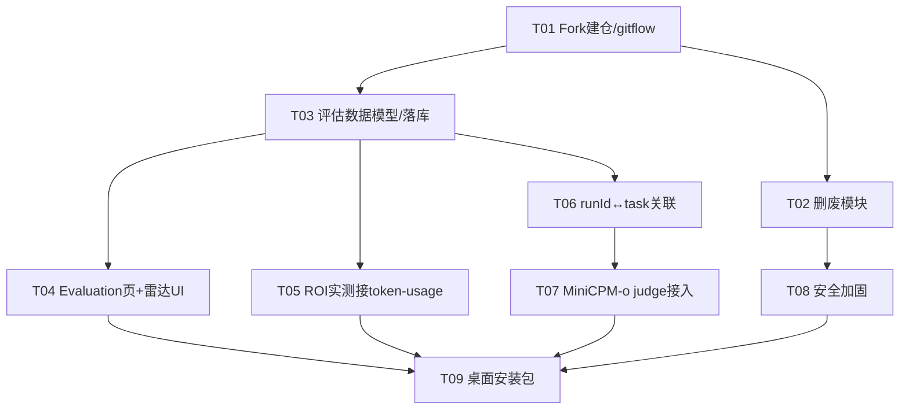

# AgentCorp 架构设计（Pivot）：以 AgentCorp 为基底 Fork 构建「Agent 绩效/评估」桌面应用

> 本文档回答的命题：把现有独立 Web Demo 版 AgentCorp 废弃，改为 **Fork 开源的 AgentCorp（基于 OpenClaw 的 Electron 桌面 AI 助手，MIT）** 作为代码基底，在其三层 Electron + React + OpenClaw 栈上叠加「让 agent 真干活 + 用 MiniCPM-o 当 HR 总监评估/筛选最能干 agent」的评估层。数据全部本地、评委本机桌面跑，适应昇腾环境。
>
> 本文只做**架构设计 + 任务分解**，不含实现代码。完成 T01（fork 建仓）后，本文应被提交到新仓库根目录 `docs/architecture-pivot.md`。

---

## Part A：系统设计

### 1. 实现方案 + 框架选型

#### 1.1 核心难点

| 难点 | 说明 |
|------|------|
| 评估原料分散 | AgentCorp 本身无任何绩效/ROI/评估逻辑，但天然拥有原料：`transcript`（agent 产出）按 `sessionKey`/`agentId` 落库于 OpenClaw `sessions/*.jsonl`，`token-usage`（含 `costUsd`/`totalTokens`，按 `agentId` 归因）在 `electron/utils/token-usage-core.ts`。 |
| 执行主键 `runId` | `chat.send` 返回 `runId`（`electron/services/session-runtime-manager.ts:179`）是「一次执行」主键，但 AgentCorp 的领域模型（`CanonicalTaskExecution`）并未携带 `runId`，需建立 `runId ↔ taskId ↔ agentId` 关联。 |
| 评估层与 OpenClaw 解耦 | 评估是叠加层，**不能侵入** OpenClaw Gateway 进程；MiniCPM-o 作为外部 judge，必须可降级（无 NPU → Mock 启发式）。 |
| 生命周期状态机缺失 | AgentCorp 有 `active/training/maintenance/onboarding/retired` 概念但 `AgentLifecycleStatus` 无正式类型（类型检查不过），`onboarding/retired` 永不赋值。需形式化并扩展为「入职评估 / 软退休」。 |
| 废品收敛 + 安全 | 需删除 IM 渠道全家桶、Cron、BroadcastChat 等；Telemetry（PostHog 硬编码 key）必须默认关闭；Gateway 工具执行需收敛为只读/白名单/沙箱；自动更新无签名需禁用。 |

#### 1.2 框架与库选型

- **基底栈（复用 AgentCorp，不替换）**：Electron（主进程 + Preload + OpenClaw Gateway 子进程，WS JSON-RPC 端口 18789）+ React + Vite（`base:'./'`、HashRouter）+ Zustand（stores）+ Tailwind CSS + `electron-store`（本地 JSON 持久化）。
- **渲染层通信抽象（复用）**：`src/lib/api-client.ts` 的 `invokeApi(channel, ...args)`，统一 IPC/WS/HTTP 三通道；评估层一律走 `gateway:rpc` 与新增 Host API 代理，不新增传输层。
- **评估引擎（移植 AgentCorp，纯函数）**：`metricsEngine.ts`（六维 KPI 聚合）、`roiEngine.ts`（ROI/IPR/SRPC/CPS）、`evaluationAdapter.ts`（事件 → 快照），已验证可单测、无副作用，直接复用，仅把「合成遥测」替换为真实 `transcript` + `token-usage`。
- **雷达可视化（新增）**：`recharts`（AgentCorp 已用 Tailwind，不引 MUI；recharts 与 React 集成成本低，提供 `RadarChart`）。
- **MiniCPM-o judge（外部服务）**：沿用 AgentCorp 的 `model-service`（Python FastAPI，`/api/evaluate` SSE）。**默认假设本地 NPU、同机 `localhost:8000`**；云端 API 为备选（仅改 `host`/`port` 配置）。前端经 **Electron Host API 代理**（`127.0.0.1:3210` 新增 `/api/evaluate` → 转发 `localhost:8000`）调用，保证模型服务只经 App 暴露、可一键禁用，且复用 `CORS=*` 已放开的事实。
- **落库（新增）**：`electron-store` 新增两个命名空间：`agentcorp.evaluation`（评估档案）+ `agentcorp.runlinks`（`runId ↔ task` 映射）；与 AgentCorp 既有 `settings` store 隔离。

#### 1.3 架构模式

- **分层叠加（Add-on Layer）**：AgentCorp 三层不变；新增「评估层」位于渲染层（stores + pages）与 Electron 主进程（Host API 代理 + 落库）两侧，通过既有 IPC/Host-API 边界通信，**不改动 OpenClaw Gateway 内部**。
- **评估引擎 = 纯函数 + 仓储（Repository）**：指标/ROI 计算无状态；`EvaluationStore` 负责读写本地 JSON。
- **Strategy/Adapter**：`evaluationAdapter` 统一消费 Mock 与真实 SSE 事件流，零改动切换 judge 实现。

#### 1.4 删除/禁用的废品模块（具体做法）

| 模块 | 位置（AgentCorp 内） | 做法 |
|------|------|------|
| IM 渠道全家桶 | `Channels` 页面 + OpenClaw 插件 `dingtalk`/`wecom`/`qqbot`/`feishu`/`weixin` | 删除页面与导航；从 Gateway 插件清单移除 5 个插件配置 |
| Cron | `src/pages/Cron/*`、`cron:*` 通道 | 删除页面与 `cron` IPC/Host 通道 |
| BroadcastChat | `src/pages/BroadcastChat/*` | 删除页面与导航 |
| Activity / Notifications | `src/pages/Activity/*`、通知订阅 | 删除页面与通知订阅 |
| Skills / MCP 浏览器 UI | `src/pages/Skills/*`（UI 层） | **仅禁用浏览器 UI**；OpenClaw 运行时 Skills/MCP 保留（废品清单注明「运行时保留」） |
| TaskKanban | `src/pages/TaskKanban/*` | 删除页面；任务执行能力改由评估层 `Evaluation` 页承载（任务仍经 `approvals.ts` 的 tasks 字段驱动） |
| Telemetry | `src/lib/telemetry.ts`（PostHog 硬编码 key） | **默认关闭**（feature flag `telemetry.enabled=false`）；移除硬编码 key，改为配置项；`api-client.ts` 中 `trackUiEvent` 调用加开关守卫 |
| 自动更新 | Electron auto-updater | 禁用（无签名）；如需则改为自托管 + 显式开启 |

> 收敛项（非删除，T08 处理）：Gateway 工具执行权限收敛为只读/白名单/沙箱；`gatewayToken` 强制；数据本地-only。

---

### 2. 文件列表（相对路径）

#### 2.A 从 AgentCorp 删除 / 禁用的清单
```
src/pages/Channels/                      # 删除（IM 渠道 UI）
src/pages/Cron/                          # 删除
src/pages/BroadcastChat/                 # 删除
src/pages/Activity/                      # 删除
src/pages/Skills/                        # 删除（仅 UI；运行时保留）
src/pages/TaskKanban/                    # 删除
electron/gateway/plugins/dingtalk/       # 从 Gateway 插件清单移除
electron/gateway/plugins/wecom/
electron/gateway/plugins/qqbot/
electron/gateway/plugins/feishu/
electron/gateway/plugins/weixin/
src/lib/telemetry.ts                     # 改造：默认关闭 + 去硬编码 key
src/components/layout/Sidebar.tsx        # 改：移除 Channels/Cron/Broadcast/Activity/Skills/Kanban 的 navItems
src/App.tsx                              # 改：移除上述路由
```

#### 2.B 新增 / 扩展（评估层，位于 fork 内）
```
src/types/lifecycle.ts                   # 新增：AgentLifecycleStatus 正式枚举 + 状态机迁移表
src/types/evaluation.ts                  # 新增：EvaluationProfile / RunTaskLink / TaskExecutionEval 等类型
src/types/agent.ts                       # 改：AgentSummary 增加 lifecycleStatus: AgentLifecycleStatus
src/engine/metricsEngine.ts              # 移植：六维 KPI 纯函数（替换合成遥测为真实）
src/engine/roiEngine.ts                  # 移植：ROI/IPR/SRPC/CPS 纯函数
src/engine/strategyEngine.ts             # 移植：擂台排名 / 末位淘汰策略
src/engine/evaluationAdapter.ts          # 移植：EvaluationEvent → 快照（radar/verdict/lifecycle）
src/services/judgeClient.ts              # 新增：调 model-service /api/evaluate（SSE 解析 + MOCK 降级）
src/services/evaluationStore.ts          # 新增：electron-store 落库（agentcorp.evaluation）
src/services/runLinkStore.ts             # 新增：electron-store 落库（agentcorp.runlinks）
src/services/telemetryCollector.ts       # 新增：从 transcript + token-usage 构造 TelemetryEvent[]
src/services/tokenUsageCollector.ts      # 新增：按 sessionId/agentId 读取 TokenUsageHistoryEntry[]
src/services/transcriptReader.ts         # 新增：按 sessionKey 读取 OpenClaw sessions/*.jsonl
src/stores/evaluation.ts                 # 新增：Zustand 评估状态（档案、雷达、ROI、生命周期、擂台）
src/pages/Evaluation/index.tsx           # 新增：评估总览页（挂载点）
src/pages/Evaluation/RadarChart.tsx      # 新增：六维雷达（recharts）
src/pages/Evaluation/RoiPanel.tsx        # 新增：ROI 面板
src/pages/Evaluation/LifecyclePanel.tsx  # 新增：生命周期 / 软退休治理面板
src/pages/Evaluation/Leaderboard.tsx     # 新增：擂台排名（末位淘汰标记）
src/components/layout/Sidebar.tsx        # 改：navItems 增加 Evaluation
src/App.tsx                              # 改：增加 /evaluation 路由
electron/main/index.ts                   # 改：注册 Host API 代理 /api/evaluate → localhost:8000
electron/api/server.ts                   # 改：新增 /api/evaluate 代理端点
electron/main/config.ts                  # 改：新增 model-service URL、telemetry.enabled、gateway.toolPolicy 配置
```

#### 2.C 复用自 AgentCorp Web Demo（保留作「导入 agent 到市场」）
```
src/services/githubImport.ts             # 复用：GitHub 一键导入真实 agent → Marketplace
samples/                                  # 复用：candidate 样本（入职评估演示）
model-service/                            # 复用：Python FastAPI，MiniCPM-o 评估服务（需扩展输入契约，见 §3）
```

#### 2.D 评估档案落库方案
- **位置**：`electron-store` 用户数据目录，默认 `<userData>/agentcorp/evaluation.json` 与 `<userData>/agentcorp/runlinks.json`（明文 JSON；加密为待明确项，见 §5/待明确）。
- **`agentcorp.evaluation`**：以 `agentId` 为键，值 = `EvaluationProfile`（含 `radarHistory[]`、`latestRoi`、`kpiHistory[]`、`lifecycle`、`runIds[]`、`updatedAt`）。
- **`agentcorp.runlinks`**：以 `runId` 为键，值 = `RunTaskLink { runId, taskId, agentId, sessionKey, sessionId, evaluatedAt }`。
- **与 AgentCorp 隔离**：不碰 OpenClaw 的 `sessions/*.jsonl`（只读读取），不碰既有 `settings` store。

---

### 3. 数据结构与接口（类图）

```mermaid
classDiagram
  %% ===== 领域模型（扩展 AgentCorp） =====
  class Agent {
    +id: string
    +name: string
    +persona: string
    +capabilities: string[]
    +rating: number
    +lifecycleStatus: AgentLifecycleStatus
  }
  class Team {
    +id: string
    +leaderId: string
    +memberIds: string[]
    +status: TeamStatus
  }
  class KanbanTask {
    +id: string
    +title: string
    +description: string
    +assigneeId: string
    +canonicalExecution: TaskExecution
  }
  class TaskExecution {
    +sessionId: string
    +sessionKey: string
    +agentId: string
    +status: TaskExecutionStatus
  }

  %% ===== 生命周期（形式化，替代 AgentCorp 缺失类型） =====
  class AgentLifecycleStatus {
    <<enum>>
    onboarding
    active
    training
    maintenance
    retired
  }

  %% ===== 评估档案核心 =====
  class EvaluationProfile {
    +agentId: string
    +radarLatest: RadarScore
    +radarHistory: RadarScore[]
    +kpiLatest: KpiRecord
    +kpiHistory: KpiRecord[]
    +roiLatest: RoiSnapshot
    +lifecycle: LifecycleState
    +runIds: string[]
    +updatedAt: string
    +evaluate() RadarScore
    +applyVerdict(v: Verdict) void
  }
  class RunTaskLink {
    +runId: string
    +taskId: string
    +agentId: string
    +sessionKey: string
    +sessionId: string
    +evaluatedAt: string
  }
  class RadarScore {
    +task: number
    +quality: number
    +comm: number
    +creativity: number
    +reliability: number
    +cost: number
  }
  class KpiRecord {
    +agentId: string
    +task_completion_rate: number
    +first_success_rate: number
    +rework_rate: number
    +avg_delivery_latency_ms: number
    +autonomy_rate: number
    +escalation_rate: number
    +cross_task_generalization: number
    +stability_consistency: number
    +sample_n: number
    +window: string
    +computedAt: string
  }
  class RoiSnapshot {
    +agentId: string
    +cost_total: number
    +value_total: number
    +roi: number
    +ipr: number
    +srpc: number
    +cost_perf_score: number
    +roi_index: number
    +roi_norm: number
    +window: string
  }
  class Verdict {
    <<enum>>
    MVP
    OBSERVE
    FIRED
  }
  class LifecycleState {
    <<enum>>
    ONBOARDING
    ACTIVE
    TRAINING
    MAINTENANCE
    RETIRED
  }

  %% ===== 评估输入原料 =====
  class TelemetryEvent {
    +agent_id: string
    +task_id: string
    +success: boolean
    +first_try: boolean
    +rework: number
    +latency_ms: number
    +human_interventions: number
    +escalations: number
    +out_of_domain: boolean
    +ts: string
  }
  class TokenUsageHistoryEntry {
    +sessionId: string
    +agentId: string
    +inputTokens: number
    +outputTokens: number
    +totalTokens: number
    +costUsd: number
  }

  %% ===== 服务/引擎 =====
  class EvaluationService {
    +runEvaluation(link: RunTaskLink) Promise~EvaluationProfile~
  }
  class MetricsEngine {
    +computeKpi(e: TelemetryEvent[], window, radars) KpiRecord
    +stability(radars) number
  }
  class RoiEngine {
    +computeRoi(cost, value, baseline, opts) RoiSnapshot
  }
  class EvaluationAdapter {
    +consume(ev: EvaluationEvent) AdapterDelta
    +ingestKpi(k: KpiRecord) void
    +ingestRoi(r: RoiSnapshot) void
    +snapshot() AdapterSnapshot
  }
  class JudgeClient {
    +evaluate(input: JudgeInput) AsyncIterable~EvaluationEvent~
    +fallbackMock(input) EvaluationEvent[]
  }
  class ModelServiceJudge {
    <<external>>
    +POST /api/evaluate (SSE)
  }
  class TelemetryCollector {
    +collect(transcript, usage) TelemetryEvent[]
  }
  class TranscriptReader {
    +read(sessionKey) string
  }
  class TokenUsageCollector {
    +collect(sessionId, agentId) TokenUsageHistoryEntry[]
  }
  class EvaluationStore {
    +save(profile: EvaluationProfile) void
    +load(agentId) EvaluationProfile
    +list() EvaluationProfile[]
  }
  class RunLinkStore {
    +save(link: RunTaskLink) void
    +getByRunId(runId) RunTaskLink
  }

  %% ===== 关系 =====
  Agent "1" --> "0..*" EvaluationProfile : has
  Agent --> AgentLifecycleStatus : status
  EvaluationProfile "1" *-- "1" RadarScore : radarLatest
  EvaluationProfile "1" *-- "1" KpiRecord : kpiLatest
  EvaluationProfile "1" *-- "1" RoiSnapshot : roiLatest
  EvaluationProfile "1" *-- "0..*" RunTaskLink : links
  RunTaskLink "1" --> "1" TaskExecution : references
  KanbanTask "1" *-- "0..1" TaskExecution : canonical
  EvaluationProfile ..> Verdict : applyVerdict maps to LifecycleState
  LifecycleState .. AgentLifecycleStatus : aligned

  EvaluationService ..> MetricsEngine : uses
  EvaluationService ..> RoiEngine : uses
  EvaluationService ..> JudgeClient : calls
  EvaluationService ..> TelemetryCollector : uses
  EvaluationService ..> EvaluationStore : persists
  EvaluationService ..> RunLinkStore : persists
  TelemetryCollector ..> TranscriptReader : reads
  TelemetryCollector ..> TokenUsageCollector : reads
  TelemetryCollector ..> TelemetryEvent : produces
  MetricsEngine ..> TelemetryEvent : consumes
  RoiEngine ..> TokenUsageHistoryEntry : consumes
  JudgeClient ..> ModelServiceJudge : SSE over Host API proxy
  JudgeClient ..> EvaluationAdapter : feeds events
```



#### 3.1 MiniCPM-o Judge 调用契约（输入 → 输出）

**输入（扩展 AgentCorp `EvaluationRequest`，适配桌面「运行期评估」）**
```ts
interface JudgeRunInput {
  agentId: string;
  agentName: string;
  persona: string;            // 来自 AgentSummary
  task: { title: string; description: string; weight: WeightVector };
  transcript: string;         // 来自 TranscriptReader（sessions/*.jsonl 聚合）
  usage: TokenUsageHistoryEntry[]; // 来自 TokenUsageCollector
  preference?: UserPreference;     // 评委偏好/维度权重
}
```
> 说明：原 Web Demo 的 `CandidateProfile`（video/voice/artwork）面向「候选人宣讲」；桌面版改为 `JudgeRunInput`（transcript + task + 真实成本）。需扩展 `model-service` 的 `EvaluationRequest` 与 `evaluator.py`（新增 `/api/evaluate-run` 或扩展 schema），但**事件输出契约不变**（radar_update ×6 + verdict + evidence + confidence），保证 `evaluationAdapter` 零改动。

**输出（SSE 事件流，与现有 `EvaluationEvent` 完全一致）**
```
event: radar_update  { dim:"task",       score:4.5, confidence:0.9, evidence:"..." }
event: radar_update  { dim:"quality",    score:4.0, ... }
event: radar_update  { dim:"comm",       score:3.5, ... }
event: radar_update  { dim:"creativity", score:4.0, ... }
event: radar_update  { dim:"reliability",score:4.5, ... }
event: radar_update  { dim:"cost",       score:3.0, ... }   // 主观维，客观 CPS 由 roiEngine 融合
event: verdict       { verdict:"MVP"|"OBSERVE"|"FIRED", user_fit:0.82, evidence_trace:[...], confidence:0.88 }
event: done          { evaluation_id:"..." }
```
- **verdict → lifecycle 映射**（复用 `evaluationAdapter.applyVerdict`）：`FIRED → RETIRED`（软退休，非删除）；`MVP/OBSERVE → ACTIVE`（入职评估通过）。
- **降级**：model-service 无 NPU 且 `MOCK=true` 时返回启发式（复用 `metricsEngine` 客观 KPI 归一化到 0–5）；若 Host API 代理收到 503，前端 `JudgeClient.fallbackMock` 用同样规则本地兜底，保证离线可用。

---

### 4. 程序调用流程（时序图）

「派任务给 agent → 抓 runId → 读 transcript/成本 → MiniCPM-o 评估 → 写回评估档案 → 市场/治理展示」全链路：

```mermaid
sequenceDiagram
  autonumber
  actor User
  participant UI as EvaluationPage
  participant TaskStore as approvals.ts(tasks)
  participant GW as GatewayManager
  participant Link as RunLinkStore
  participant TR as TranscriptReader
  participant TUC as TokenUsageCollector
  participant TC as TelemetryCollector
  participant ME as MetricsEngine
  participant RE as RoiEngine
  participant JC as JudgeClient
  participant MS as ModelService(MiniCPM-o)
  participant AD as EvaluationAdapter
  participant ES as EvaluationStore
  participant EvalUI as Evaluation UI (雷达/ROI/生命周期/擂台)

  User->>UI: 派任务给某 agent（选 task + agent）
  UI->>TaskStore: createTask + startTaskExecution(agentId, sessionKey)
  TaskStore-->>UI: taskId 已建

  UI->>GW: gateway.rpc('chat.send', {sessionKey, message})
  GW-->>UI: runId  (一次执行主键)
  UI->>Link: save(RunTaskLink{runId, taskId, agentId, sessionKey})

  Note over GW: OpenClaw 跑 agent，落库 sessions/*.jsonl + token-usage
  UI->>GW: 轮询 run 状态直至 done（session-runtime-manager.refresh）
  GW-->>UI: transcript ready

  UI->>TR: read(sessionKey)
  TR-->>TC: transcript 文本
  UI->>TUC: collect(sessionId, agentId)
  TUC-->>TC: TokenUsageHistoryEntry[]
  TC->>TC: 构造 TelemetryEvent[]
  TC-->>ME: TelemetryEvent[]
  ME-->>ME: computeKpi → KpiRecord
  TUC-->>RE: 成本五要素（token/npu/call/hum/ret）
  RE-->>RE: computeRoi → RoiSnapshot

  UI->>JC: evaluate(JudgeRunInput{transcript, usage, task})
  JC->>MS: POST /api/evaluate-run (经 Host API 代理 → localhost:8000, SSE)
  alt 有 NPU / 云端可用
    MS-->>JC: radar_update×6 + verdict + done (SSE)
  else 无 NPU → 503 / MOCK
    JC-->>JC: fallbackMock(客观 KPI 归一化)
  end
  JC->>AD: consume(event) 逐事件
  AD-->>AD: 点亮 radar / 记录 verdict / 状态机迁移

  UI->>ES: save(EvaluationProfile{radar, kpi, roi, lifecycle, runIds})
  ES-->>UI: ok
  UI->>EvalUI: 重渲染 雷达 + ROI 面板 + 生命周期 + 擂台排名
  EvalUI-->>User: 展示六维雷达 / ROI / verdict / 末位淘汰标记

  Note over User,EvalUI: 治理动作（软退休/晋升）经 approvals.ts 触发 lifecycle 迁移
```

---

### 5. 待明确 / 假设

- **数据落库加密**：`electron-store` 默认明文；「数据安全」是否要求加密（如 `electron-store` + `crypto`/系统钥匙串）待定。
- **评估触发时机**：每次任务自动评估 vs 手动/周期性擂台（影响 NPU 负载与性能），默认「手动触发 + 周期擂台」。
- **`cost` 维融合 λ**：客观 CPS 与主观雷达 `cost` 维融合权重 λ 默认 0.5（治理可调高至 0.8 重客观）。
- **AgentCorp `rating` 字段**：Marketplace 现有单一 `rating` 小数，六维雷达上线后是否保留 `rating` 作汇总分待定（建议由 `radar` 加权得出）。
- **`AgentLifecycleStatus` 与 `LifecycleState` 对齐**：采用 AgentCorp 小写命名（`onboarding/active/training/maintenance/retired`）作为唯一真相，评估层 `LifecycleState`（大写）仅作内部别名，避免双源。

---

## Part B：任务分解

### 6. 依赖包列表

**AgentCorp 已有（继续复用）**
```
electron                 # 桌面壳（主进程/Preload/Gateway 子进程）
react / react-dom        # 渲染层
vite + typescript        # 构建/类型
zustand                  # 状态（stores）
tailwindcss              # 样式
electron-store           # 本地 JSON 持久化（扩展新命名空间）
openclaw (gateway)       # agent 执行子进程（不改动）
```

**AgentCorp 需新增（前端）**
```
recharts@^2.12.0        # 六维雷达图（RadarChart）
```
> 复用：评估引擎为纯 TS，无新运行时依赖；SSE 用浏览器原生 `EventSource`/`fetch` 流，无需额外库。

**model-service 需新增/调整（Python，FastAPI）**
```
fastapi                 # 已用
sse-starlette           # SSE 流式（已用）
uvicorn / pydantic      # 已用
transformers / mindspore# MiniCPM-o 4.5 推理（本地 NPU 分支）
torch                   # 推理后端
modelscope              # 权重拉取（备选）
```
> 扩展：新增 `/api/evaluate-run`（`JudgeRunInput` 契约），`evaluator.py` 增加 transcript+usage 解析分支；保持 `MOCK=true` 降级路径。

---

### 7. 任务列表（有序，含依赖，按实现顺序）

> 注：本设计默认模板为「≤5 任务」，但团队负责人明确要求按 9 个有序阶段产出（fork→删废→建模→UI→ROI→关联→judge→加固→打包）。此处**遵循负责人显式指令**展开为 9 个任务，以保证落地保真度。每个任务仍满足「≥3 个相关文件、按功能/层次分组」原则。

| ID | 任务名 | 源文件（关键） | 依赖 | 优先级 |
|----|--------|----------------|------|--------|
| **T01** | Fork 建仓与 gitflow 初始化 | 仓库根（`.git`、`.github`）、`docs/architecture-pivot.md` | — | P0 |
| **T02** | 收敛/删除废品模块 | `src/pages/{Channels,Cron,BroadcastChat,Activity,Skills,TaskKanban}/`、`electron/gateway/plugins/{dingtalk,wecom,qqbot,feishu,weixin}/`、`src/lib/telemetry.ts`、`Sidebar.tsx`、`App.tsx` | T01 | P0 |
| **T03** | 评估数据模型与本地落库 | `src/types/lifecycle.ts`、`src/types/evaluation.ts`、`src/types/agent.ts`、`src/services/evaluationStore.ts`、`src/services/runLinkStore.ts` | T01 | P0 |
| **T04** | Evaluation 页 + 六维雷达 UI | `src/pages/Evaluation/{index,RadarChart,RoiPanel,LifecyclePanel,Leaderboard}.tsx`、`src/stores/evaluation.ts`、`Sidebar.tsx`、`App.tsx` | T03 | P1 |
| **T05** | ROI 实测接 token-usage | `src/engine/metricsEngine.ts`、`src/engine/roiEngine.ts`、`src/services/tokenUsageCollector.ts`、`src/services/telemetryCollector.ts` | T03, T02 | P1 |
| **T06** | runId ↔ task 关联 | `src/services/runLinkStore.ts`、`src/services/transcriptReader.ts`、`approvals.ts`（startTaskExecution 抓 runId）、`src/types/evaluation.ts` | T03 | P1 |
| **T07** | MiniCPM-o judge 接入 | `src/services/judgeClient.ts`、`src/engine/evaluationAdapter.ts`、`electron/main/index.ts`、`electron/api/server.ts`、`model-service/app/{serve,evaluator,schemas}.py` | T03, T06 | P0 |
| **T08** | 安全加固 | `electron/main/config.ts`、`electron/gateway/manager.ts`（toolPolicy 只读/白名单/沙箱）、`src/lib/telemetry.ts`（默认关）、auto-updater 禁用 | T02 | P0 |
| **T09** | 桌面安装包构建 | `electron-builder` 配置、`package.json`（build 脚本）、安装包 smoke test | T04, T05, T07, T08 | P1 |

---

### 8. 共享知识（跨文件约定）

- **评估档案存储位置**：`electron-store` 命名空间 `agentcorp.evaluation`（键=agentId）与 `agentcorp.runlinks`（键=runId）；位于用户数据目录，明文 JSON（加密见待明确）。OpenClaw `sessions/*.jsonl` 仅**只读**读取。
- **生命周期状态机约定**：唯一真相 = AgentCorp 小写 `AgentLifecycleStatus`（`onboarding|active|training|maintenance|retired`）。`deleteAgent`（Marketplace 辞退）改为**软退休**（`lifecycle=retired`），不物理删除。`verdict→lifecycle`：`FIRED→retired`，`MVP/OBSERVE→active`，由 `evaluationAdapter.applyVerdict` 统一映射。
- **MiniCPM-o 调用失败降级**：无 NPU / 云端不可达时，model-service `MOCK=true` 返回启发式；若 Host API 代理返回 503，`JudgeClient.fallbackMock` 用 `metricsEngine` 客观 KPI 归一化到 0–5 本地兜底，**保证离线可用**。
- **事件契约恒定**：`EvaluationEvent`（radar_update/narration/audio/verdict/done）前后端严格镜像（`src/types/index.ts` ↔ `model-service/app/schemas.py`），任一端改动须同步另一端。
- **执行主键**：`runId` 来自 `gateway.rpc('chat.send')` 返回值，是评估关联的锚点；`runId` 必须经 `RunTaskLink` 与 `taskId/agentId/sessionKey` 绑定后才触发评估。
- **通信边界**：评估层一律经既有 `invokeApi` / Host API 代理；不新增传输层；judge 调用统一走 `127.0.0.1:3210/api/evaluate` → `localhost:8000`。
- **Telemetry 默认关闭**：所有 `trackUiEvent` 调用受 `telemetry.enabled` 开关守卫，默认 `false`，无硬编码 key。

---

### 9. 任务依赖图



---

## 关键架构决策（摘要，详见正文）

1. **评估层叠加而非侵入**：在 AgentCorp 三层 Electron 之上叠加评估层，MiniCPM-o 作为外部 `localhost:8000` SSE judge，经 Host API 代理暴露、默认可降级 Mock；OpenClaw Gateway 内部零改动。
2. **数据全本地、Telemetry 默认关**：评估档案与 `runId↔task` 映射用 `electron-store`（本地 JSON），不引入中心化后端；遥测默认关闭，满足「数据本地、安全」。
3. **生命周期状态机形式化 + 软退休**：补齐 AgentCorp 缺失的 `AgentLifecycleStatus` 类型，`deleteAgent` 改软退休，`verdict→lifecycle` 复用现有 `approvals.ts` 治理内核。
4. **复用而非重写评估引擎**：直接移植 AgentCorp 已验证的 `metricsEngine`/`roiEngine`/`evaluationAdapter` 纯函数，仅把合成遥测替换为真实 `transcript`+`token-usage`。
5. **废品收敛 + 安全收紧**：删除 IM 渠道全家桶/Cron/Broadcast/Activity/Skills UI/TaskKanban；Gateway 工具执行收敛为只读/白名单/沙箱；自动更新禁用（无签名）。

---

## 待明确事项（需用户 / 朋友拍板）

1. **MiniCPM-o 最终部署**：本地 Ascend NPU（同机 `localhost:8000`，默认）还是云端 API？影响 `model-service` 部署位置与 Electron 打包是否含模型权重。
2. **是否保留 Skills 运行时**：本设计「仅禁用 Skills/MCP 浏览器 UI、运行时保留」；若彻底移除运行时可进一步缩小攻击面与体积，需确认。
3. **Web 端是否同期做**：AgentCorp 的 Host API（`127.0.0.1:3210`）可支撑 Web 对接，但本设计聚焦桌面；是否同期维护 Web 端待定。
4. **模型权重来源与许可**：MiniCPM-o 4.5 权重下载渠道、商业使用许可（与 MIT 基底的兼容）。
5. **评估触发时机与频率**：每次任务自动评估 vs 手动/周期擂台（默认手动+周期，影响 NPU 负载）。
6. **落库加密要求**：`electron-store` 是否需加密以满足「数据安全」（建议系统钥匙串/字段级加密）。
7. **许可声明**：Fork AgentCorp（MIT）后 AgentCorp 的许可与对朋友的致谢声明方式（用户已明确无需 README cite，但 LICENSE/NOTICE 处理待确认）。
