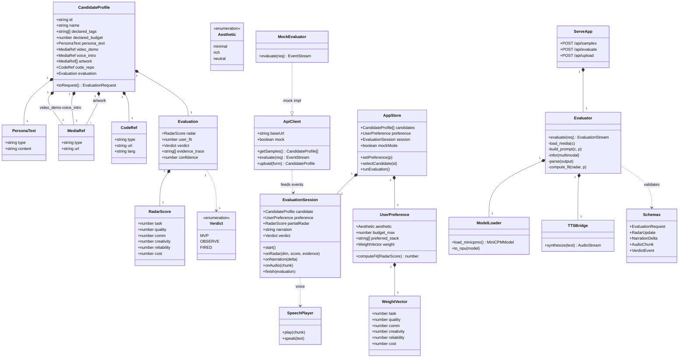
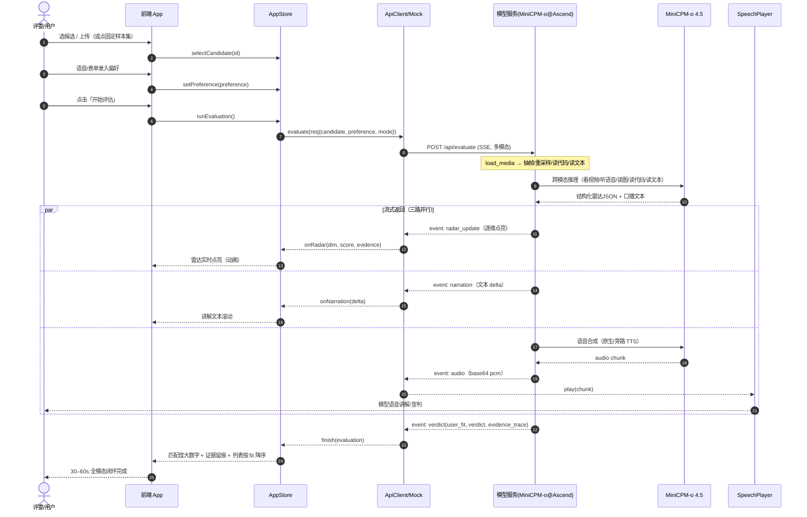
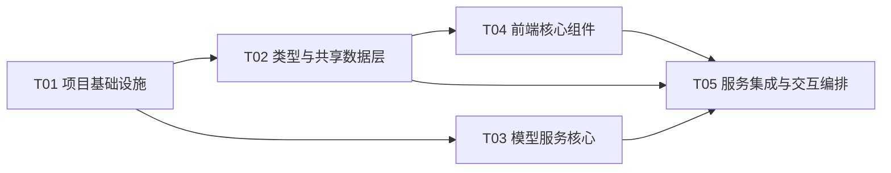

# AgentCorp · 系统架构设计文档（含任务分解）

> 架构师：高见远（Gao）　|　版本：v0.1　|　日期：2025-07-22
> 依据：PRD v0.1（许清楚）+ 项目背景（华为昇腾挑战赛·赛道二，MiniCPM-o 4.5 全模态）
> 运行环境：昇腾（Ascend NPU）统一环境 + Web Demo（Vite + React + Tailwind CSS）

---

## 0. 设计总览与关键决策摘要

| # | 关键决策 | 结论 |
|---|---|---|
| D1 | 前端形态 | Vite + React + TypeScript + Tailwind，组件化 + Zustand 单一状态仓 |
| D2 | 模型服务形态 | **本地推理服务（Self-hosted）**，对外暴露 OpenAI 风格 SSE HTTP 接口；不依赖外部网关 API |
| D3 | 昇腾 serving 栈 | 优先 MindIE + CANN + torch_npu（官方适配优先）；退路 vLLM-for-Ascend / 原生 transformers+torch_npu |
| D4 | 前后端解耦 | 契约优先：前端只认 HTTP/SSE 契约 + **Mock 评估模式**，无 NPU 也能看 UI、开发、演示 |
| D5 | 语音输出 | 默认 MiniCPM-o 4.5 原生 TTS；旁路 CosyVoice2（Ascend 适配）兜底，接口统一 |
| D6 | 流式协议 | SSE 事件流：`radar_update` / `narration` / `audio` / `verdict` / `done` |
| D7 | 复现保障 | temperature=0 + 固定 seed + 确定性抽帧 + 结构化解析重试（缓解 R4 漂移） |

---

## 1. 实现方案 + 框架选型

### 1.1 核心难点

1. **异质证据统一消费**：候选以视频/语音/图像/代码/文本五种模态自证，需统一进一个全模态模型并交叉验证（claim≠demo）。
2. **结构化 + 实时**：模型生成自由文本，但要稳定产出「六维 0–5 分 + 契合度 + 宣判 + 证据留痕」，并在 30–60s 内实时点亮雷达。
3. **可复现 + 解耦**：统一昇腾环境一键复现；评委本地无 NPU 也能看 UI；前端与模型服务彻底解耦。
4. **四模态闭环真实发生**：hero demo 必须真「看/听/说/读」，不能用假动画糊弄。

### 1.2 框架与库选型

| 层 | 选型 | 理由 |
|---|---|---|
| 前端框架 | **Vite + React 18 + TypeScript** | PRD 默认栈；快速冷启动、易解耦、易独立开发 |
| 样式 | **Tailwind CSS** | PRD 默认；原子化快速搭 UI（复用 AgentCorp 雷达/档案/fire 骨架） |
| 状态管理 | **Zustand** | 轻量单一状态仓，适合评估会话的状态机管理 |
| 雷达图 | **recharts**（RadarChart） | 声明式、易做逐维动画；若需更强动画可换自绘 SVG |
| 语音播放（前端） | **Web Audio API**（音频流）/ **Web Speech API**（Mock 模式 TTS） | 真实模式播模型音频流；无 NPU 用浏览器 TTS 补「说」 |
| 模型服务 | **Python + FastAPI + SSE（sse-starlette）** | 异步流式、易暴露 SSE、类型清晰 |
| 模型推理 | **MiniCPM-o 4.5 + torch_npu / MindIE** | 赛道指定；昇腾 NPU 推理 |
| 多模态处理 | opencv/decord（抽帧）、librosa/soundfile（音频）、Pillow（图像） | 证据预处理 |
| 校验 | **Pydantic v2** | 请求/响应契约强类型 |

### 1.3 架构模式

- **前后端分离 + 契约优先（Contract-First）**：前后端各自按 `docs/architecture.md` 第 4 节契约实现，互不阻塞；前端通过 `VITE_MOCK` 切换真实/模拟。
- **前端**：组件化 + 评估会话状态机（`idle → streaming → done`）。
- **模型服务**：Pipeline 模式 `load_media → encode → build_prompt → infer → parse → compute_fit → stream`。
- **部署**：容器化（Docker），NPU 设备透传，服务监听 `:8000`。

---

## 2. 关键决策：昇腾上 MiniCPM-o 4.5 的 serving 形态（PRD 待确认项 #1）

### 2.1 结论：采用「本地推理服务」，不采用外部网关 API 代理

| 方案 | 可复现 | 模态覆盖 | 隐私(R7) | 时延可控 | 结论 |
|---|---|---|---|---|---|
| **A. 本地推理服务（推荐）** | ✅ 离线一键起 | ✅ 全模态本地持有 | ✅ 不外流 | ✅ 本地可控 | **采用** |
| B. 外部网关 API 代理 | ❌ 依赖外网/限流 | ⚠ 视网关 | ❌ 数据出域 | ⚠ 不可控 | 不采用 |

理由：统一昇腾环境要求**离线、可一键复现**；全模态权重与多模态 encoder 必须本地持有；网关代理既不可控又触碰隐私红线（R7）。本地推理服务对外统一暴露 **OpenAI-compatible Chat Completions 风格的 SSE 接口**，前端不感知底层是 MindIE 还是 transformers。

### 2.2 本地推理栈选项（按可行性排序，版本以官方公告为准）

- **A1（首选）MindIE（Mind Inference Engine）+ CANN + torch_npu + ATB/msmodelslim**
  华为官方推理栈；若 MiniCPM-o 4.5 提供 MindIE 适配或模型转换脚本，性能与官方支持最优。需：CANN 版本（官方公告）、视频/音频 encoder 在 NPU 上运行、可选 msmodelslim 量化。
- **A2（退路）vLLM-for-Ascend（CANN vLLM）+ transformers**
  若 MiniCPM-o 有 transformers 实现，用 torch_npu 后端加载，多模态 encoder 自行适配 NPU。
- **A3（兜底）原生 transformers + torch_npu**
  最灵活、改动最小，但性能最低，适合 demo 小批量（固定样本集 3–5 人足够）。

> 无论 A1/A2/A3，对外接口形态一致（`/api/evaluate` SSE），底层替换不影响前端。

### 2.3 需要的能力清单（供昇腾环境对齐）

- ✅ **NPU 推理**（fp16 / int8；msmodelslim 量化可选）
- ✅ **视频 encoder**（抽帧 → 视觉特征）
- ✅ **音频 encoder**（重采样 → 语音特征）
- ✅ **文本/代码 tokenizer**
- ✅ **语音输出**：MiniCPM-o 4.5 原生 TTS，或旁路 CosyVoice2（Ascend 适配）
- ✅ **确定性推理**：temperature=0、固定 seed、确定性解码（复现 R4）

### 2.4 可复现部署步骤草案

```bash
# 1) 准备昇腾环境（CANN / torch_npu / MindIE 版本以官方公告为准）
# 2) 拉取 MiniCPM-o 4.5 权重（OpenBMB 官方，取 Ascend 适配版/转换脚本）
# 3) 构建镜像（内置 torch_npu/CANN + 模型加载代码）
docker build -f model-service/Dockerfile -t agentcorp-minicpmo:ascend .
# 4) 启动（NPU 设备透传，监听 :8000）
docker run --device=/dev/davinci* --device=/dev/davinci_manager \
  -v $(pwd)/samples:/app/samples -p 8000:8000 agentcorp-minicpmo:ascend
# 5) 前端配置：真实模式
#    .env => VITE_API_BASE=http://<npu-host>:8000  VITE_MOCK=false
#    无 NPU 演示/开发 => VITE_MOCK=true（走 Mock 评估模式，见 §4.4）
# 6) 一键复现：UI 点「固定样本集 → 选候选 → 开始评估」→ /api/evaluate 流式返回雷达+文本+语音
```

---

## 3. 文件列表（相对路径，根：`agentcorp/`）

```
agentcorp/
├── docs/
│   ├── prd.md
│   ├── architecture.md                # 本文档
│   ├── sequence-diagram.mermaid        # 时序图（hero demo）
│   └── class-diagram.mermaid           # 类图 + 契约
├── package.json                        # 前端依赖与脚本
├── vite.config.ts
├── tailwind.config.js
├── postcss.config.js
├── tsconfig.json / tsconfig.node.json
├── index.html
├── .env / .env.example                 # VITE_API_BASE / VITE_MOCK
├── samples/                            # 固定候选样本集（媒体 + manifest）
│   ├── candidate-01/{profile.json, demo.mp4, intro.wav, art-*.png, code.zip}
│   ├── candidate-02/...
│   └── candidate-03/...
├── src/
│   ├── main.tsx
│   ├── App.tsx                         # 顶层布局（左简历/右评估/底列表）
│   ├── index.css                       # Tailwind 指令 + 全局样式
│   ├── config.ts                       # 环境配置（API base / mock 开关）
│   ├── types/index.ts                  # ★ 单一类型真相源（前后端契约同源）
│   ├── store/useAppStore.ts            # Zustand 全局状态
│   ├── services/api.ts                 # 真实 ApiClient（fetch + SSE 解析）
│   ├── services/mockEvaluator.ts       # Mock 模式 SSE 生成器
│   ├── hooks/useEvaluation.ts          # 评估会话编排（消费事件流）
│   ├── hooks/useUserPreference.ts      # 语音/表单偏好录入
│   ├── hooks/useSpeech.ts              # 模型语音播放（Web Audio / TTS）
│   ├── utils/radar.ts                  # user_fit 计算 + 权重默认
│   ├── utils/format.ts                 # 格式化辅助
│   ├── data/samples.ts                 # 加载固定样本清单
│   ├── mock/samples.ts                 # Mock 候选数据 fixture
│   └── components/
│       ├── Toolbar.tsx                 # 固定样本集▾ / 上传 / 模式切换
│       ├── CandidateProfilePanel.tsx   # 左：多模态简历
│       ├── MediaViewer.tsx             # 视频/语音/图/代码/文本渲染
│       ├── RadarChart.tsx              # 六维雷达（实时点亮）
│       ├── FitScore.tsx                # 匹配度大数字 + 偏好轮廓
│       ├── NarrationPanel.tsx          # 语音讲解/宣判区
│       ├── PreferenceInput.tsx         # 语音+表单偏好输入
│       ├── CandidateList.tsx           # 底部按 user_fit 降序
│       └── UploadModal.tsx             # P1 上传模式
└── model-service/                       # MiniCPM-o 服务（Ascend）
    ├── requirements.txt
    ├── Dockerfile
    ├── docker-compose.yml              # 可选，便于一键起
    ├── tests/test_evaluate.py
    └── app/
        ├── serve.py                    # FastAPI 入口（SSE 端点）
        ├── config.py                   # 环境变量配置
        ├── schemas.py                  # Pydantic 请求/响应契约
        ├── model_loader.py             # MiniCPM-o 加载到 NPU
        ├── evaluator.py                # 跨模态评估 pipeline
        ├── prompt_templates.py         # 系统提示（强制六维 JSON）
        └── tts.py                      # 语音合成（原生/旁路统一接口）
```

---

## 4. 数据结构与接口（类图 + API 契约）

### 4.1 类图（Mermaid）

见 `docs/class-diagram.mermaid`（下方为同内容，便于阅读）：



### 4.2 前端 ↔ 模型服务 API 契约

> 契约以 TypeScript 类型（`src/types/index.ts`）为单一真相源，后端 `schemas.py` 严格镜像。

```typescript
// ===== 请求 =====
interface EvaluationRequest {
  candidate: CandidatePayload;        // 媒体以 URL（samples/）或 base64（上传）提供
  preference: UserPreference;          // 用户偏好（语音/表单解析所得）
  options?: {
    temperature?: number;             // 默认 0（复现）
    seed?: number;                    // 固定 seed
    frame_sample?: number;            // 视频抽帧数，默认 8
  };
}

// ===== 响应：SSE 事件流（text/event-stream）=====
type EvaluationEvent =
  | { type: "radar_update"; dim: RadarDim; score: number; confidence: number; evidence: string }
  | { type: "narration";   delta: string; is_final: boolean }
  | { type: "audio";       chunk: string; format: "pcm16" | "wav"; sample_rate: number }
  | { type: "verdict";     verdict: Verdict; user_fit: number; evidence_trace: string[]; confidence: number }
  | { type: "done";        evaluation_id: string };

type RadarDim = "task" | "quality" | "comm" | "creativity" | "reliability" | "cost";
```

- `GET /api/samples` → `CandidateProfile[]`（固定样本清单，含媒体 URL）
- `POST /api/evaluate`（SSE）→ `EvaluationEvent` 流
- `POST /api/upload`（multipart）→ 新 `CandidateProfile`（P1）

### 4.3 契合度（user_fit）计算

```
user_fit = Σ( radar[dim] / 5 × weight[dim] ) × 100%     // Σ weight = 1
硬约束：
  - declared_budget > preference.budget_max  → cost 维权重清零（或降权）
  - aesthetic 不匹配                          → 触发减分提示（证据留痕）
  - preferred_stack 命中数                    → 作为加分项
雷达不变，仅 user_fit 随偏好变化；候选列表按 user_fit 降序。
```

### 4.4 Mock 评估模式（无 NPU 演示/开发）

- `VITE_MOCK=true` 时，`MockEvaluator` 产生**与真实完全一致的事件 schema**：从 `mock/samples.ts` 读预置雷达/文本/证据，按节奏 emit `radar_update`（逐维点亮）→ `narration` → `audio`（用浏览器 `speechSynthesis` 替代真实音频流）→ `verdict` → `done`。
- 保证：无 NPU 也能完整演示四模态闭环 UI、开发前端、评委离线看界面。

---

## 5. 程序调用流程（时序图：hero demo 一段式）

见 `docs/sequence-diagram.mermaid`（下方同内容）：



---

## 6. 任务列表（有序、含依赖，供工程师一次性批量写码）

> 约束：≤5 个任务；每任务 ≥3 个相关文件；首任务必为「项目基础设施」（配置+入口+依赖同置一任务）；尽量仅依赖 T01。工程师按任务批量实现即可。

| 任务 ID | 任务名 | 源文件（≥3） | 依赖 | 优先级 |
|---|---|---|---|---|
| **T01** | 项目基础设施（配置+入口+依赖） | `package.json`, `vite.config.ts`, `tailwind.config.js`, `postcss.config.js`, `tsconfig.json`, `index.html`, `src/main.tsx`, `src/App.tsx`, `src/index.css`, `model-service/requirements.txt`, `model-service/Dockerfile`, `model-service/app/serve.py`(骨架) | — | P0 |
| **T02** | 类型与共享数据层（契约同源） | `src/types/index.ts`, `src/config.ts`, `src/store/useAppStore.ts`, `src/data/samples.ts`, `src/mock/samples.ts`, `src/utils/radar.ts` | T01 | P0 |
| **T03** | 模型服务核心（跨模态评估） | `model-service/app/schemas.py`, `model-service/app/config.py`, `model-service/app/model_loader.py`, `model-service/app/evaluator.py`, `model-service/app/prompt_templates.py`, `model-service/app/tts.py` | T01 | P0 |
| **T04** | 前端核心组件（展示层） | `src/components/Toolbar.tsx`, `src/components/CandidateProfilePanel.tsx`, `src/components/MediaViewer.tsx`, `src/components/RadarChart.tsx`, `src/components/FitScore.tsx`, `src/components/NarrationPanel.tsx` | T02 | P0 |
| **T05** | 服务集成与交互编排 | `src/services/api.ts`, `src/services/mockEvaluator.ts`, `src/hooks/useEvaluation.ts`, `src/hooks/useUserPreference.ts`, `src/hooks/useSpeech.ts`, `src/components/PreferenceInput.tsx`, `src/components/CandidateList.tsx`, `src/components/UploadModal.tsx` | T02, T03, T04 | P0 |

> 依赖关系说明：T03（模型服务）仅依赖 T01（骨架），与前端 T02/T04/T05 通过**契约**（§4.2）解耦，可并行开发。T05 为集成层，最终把 UI、状态、真实/Mock 服务、语音播放串起来。

### 任务依赖图（Mermaid）



---

## 7. 依赖包列表

### 7.1 前端（`package.json`）

```
- react@^18.3.1 / react-dom@^18.3.1            UI 框架
- vite@^5.4.0 / @vitejs/plugin-react@^4.3.1   构建与 HMR
- typescript@^5.5.4                            类型系统
- tailwindcss@^3.4.10 / postcss@^8.4.41 / autoprefixer@^10.4.20   样式
- zustand@^4.5.5                               轻量状态管理
- recharts@^2.12.7                             雷达图（实时点亮）
- (可选·仅高级组件) @mui/material@^5 / @emotion/react / @emotion/styled
```

### 7.2 模型服务（`model-service/requirements.txt`）

```
- fastapi / uvicorn[standard] / python-multipart    Web 服务
- sse-starlette                                      SSE 流式
- pydantic / pydantic-settings                       契约校验
- torch / torch_npu                                  Ascend NPU 推理（版本以官方公告为准）
- transformers                                       MiniCPM-o 加载
- numpy / pillow                                     图像
- opencv-python / decord                            视频抽帧
- librosa / soundfile                               音频重采样
- (可选 TTS 旁路) cosyvoice 或对应 Ascend 适配 TTS
- pytest                                            test_evaluate.py
```

---

## 8. 共享知识（跨文件约定）

- **类型单一真相源**：所有数据结构定义在 `src/types/index.ts`；后端 `schemas.py` 严格镜像；改动需同步两端（建议用 OpenAPI 生成或 PR 评审核对）。
- **状态管理**：只用 `src/store/useAppStore.ts` 一个 Zustand store；评估会话状态机 `idle → streaming → done` 放在 `EvaluationSession`。
- **多模态数据处理约定**：
  - 样本媒体以 **URL** 提供（服务侧 `samples/` 目录）；上传模式以 **base64** 内联。
  - 视频**确定性抽帧**：均匀取 `frame_sample`（默认 8）帧，固定起始偏移，保证复现（R4）。
  - 音频统一重采样至 16kHz mono；图像最长边 ≤1024。
- **流式协议**：SSE，`event` 字段取 `radar_update / narration / audio / verdict / done` 之一；前端 `services/api.ts` 统一解析，Mock 与真实同 schema。
- **命名约定**：组件 PascalCase、函数/变量 camelCase、文件 kebab-case；枚举用大写（`MVP/OBSERVE/FIRED`）。
- **雷达实时点亮**：`radar_update` 到达即更新对应维度顶点并触发动画；`verdict` 到达后再整体高亮 + 显示匹配度大数字。
- **语音播放**：真实模式用 Web Audio 播 `audio` 事件 PCM 流；Mock 模式用 `speechSynthesis` 朗读 narration/verdict 文本。
- **复现开关**：`VITE_MOCK` 与 `VITE_API_BASE` 写于 `.env.example`；README/部署说明标明无 NPU 走 Mock、NPU 环境走真实。

---

## 9. 待明确事项（含昇腾接口最终形态等）

1. **昇腾官方 starter kit 中 MiniCPM-o 4.5 推理接口最终形态**：A1（MindIE）/ A2（vLLM-for-Ascend）/ A3（transformers+torch_npu）待官方公告锁定；本设计已按「本地推理服务 + 统一 SSE 接口」解耦，底层可替换。**需确认 CANN / torch_npu / MindIE 版本与模型转换脚本。**
2. **语音输出形态**：默认 MiniCPM-o 4.5 原生 TTS；待实测原生语音**时延与稳定性**是否达标 hero demo，否则启用 CosyVoice2（Ascend 适配）旁路。两者经 `tts.py` 统一接口，前端无感。
3. **固定样本集人数与体量**：建议 ≥3 人、视频 ≤30s、语音 ≤30s、代码 ≤200 行，以控制 Demo 时长与复现稳定（P0-2）。待产品/数据最终确认。
4. **六维权重默认模板**：是否需要行业预设（如「重性价比采购者」），影响 `UserPreference.weight` 默认值（PRD 待确认 #4）。
5. **在职监控数据源**：hero 不跑；PPT 流程图 + 答辩口述即可（P1-2/P1-3）。真实日志接入 vs 模拟数据待定。
6. **上传模式媒体落盘**：P1 上传的媒体存于服务本地 `uploads/` 还是对象存储，影响 `POST /api/upload` 实现（暂定本地）。

---

*— 架构设计 v0.1 完。与 PRD v0.1 对齐；模型服务栈以华为昇腾官方公告为准。*
