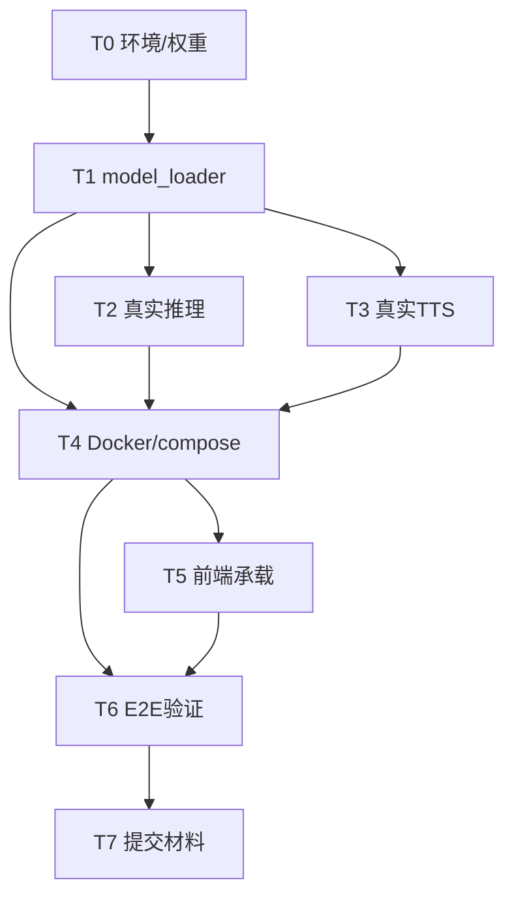

# AgentCorp 昇腾适配初步方案

> 华为昇腾挑战赛 · 赛道二（创新应用赛道）工程基础设计
> 模型：MiniCPM-o 4.5（全模态，约 9B，OpenCompass 综合 77.6）
> 作者：架构师 高见远 ｜ 版本：v0.1（starter kit 发布前初步方案）
> 适用范围：统一昇腾环境复现验证 + 赛道二「可运行 Web Demo」交付

---

## 1. 目标与范围

**目标**：让 AgentCorp 的「全模态 HR 总监」评委模型 MiniCPM-o 4.5 在官方统一昇腾环境中跑通真实多模态推理，并以**单容器可运行 Web Demo** 形态交付赛道二。

**范围边界（明确不做什么）**：

| 项 | 纳入范围 | 排除范围 |
|----|---------|---------|
| 真实推理 | ✅ model-service 接入 MiniCPM-o 真实推理（视频/语音/图像/代码/文本） | ✗ 模型本身训练/微调 |
| Demo 形态 | ✅ 统一环境下可访问的 Web Demo（浏览器打开即用） | ✗ Electron 桌面 App 作为赛道二正式提交形态 |
| 前端 | ✅ 复用现有 React 评估页（六维雷达/语音讲解/证据留痕） | ✗ 重写前端 UI |
| 后端 | ✅ model-service（FastAPI + SSE）承载真实推理 | ✗ 新增独立网关/微服务 |
| 提交材料 | ✅ Web Demo + 开源仓库 + PPT + 项目说明 + 演示视频 | ✗ 商业部署/高并发生产化 |

**交付判定（赛道二评审可映射到）**：应用完整度、交互体验、模型能力展示（四模态交叉验证）、场景价值（HR 筛选）、工程质量、演示质量、复现可行性。

---

## 2. 技术选型决策

### 2.1 三条路径对比

| 路径 | 机制 | 对现有代码改动 | 风险 | 官方支持度 |
|------|------|--------------|------|-----------|
| **(a) FlagOS 开箱即用镜像** | `import torch; import flag_gems` 后底层自动切换 Ascend 后端，无需手写算子 | **最小**：与现有 `transformers` 代码基本同构 | 低；依赖官方镜像可用性 | ★★★ 官方「发布即 6 芯适配」 |
| **(b) torch_npu 自适配** | 手动 `cuda→npu`、`torch.cuda.*→torch.npu.*`，按需替换算子 | 中：`model_loader` 改 device + 少量算子 | 中；需对齐 CANN/驱动版本 | ★★★ 官方主推路径 |
| **(c) MindSpore** | 用 MindSpore 加载权重，需重写推理栈 | **最大**：`evaluator.infer` / `model_loader` 全面重写 | 高；现有 `transformers` 代码几乎不可用 | ★★ 需自行迁移 |

### 2.2 推荐结论

> **主路径 = (a) FlagOS 开箱即用镜像；兜底路径 = (b) torch_npu 自适配。不采用 (c) MindSpore。**

理由：
1. 现有 `model_loader.load_minicpmo()` 注释里已是 `transformers.AutoModel.from_pretrained(...).to("npu")` 写法，与 FlagOS/torch_npu 路径同构，**无需重写推理栈**。
2. FlagOS 的 `import flag_gems` 自动生效后端，省去算子替换；若官方镜像不可用或遇到兼容坑，降级到 (b) 仅需改 import 段与 `torch.npu` 内存管理，改动集中。
3. MindSpore 会迫使 `evaluator.infer` 与 `model_loader` 全面重写，且 `tests/test_evaluate_run.py` 的契约回归需重做，风险/收益比最差。

### 2.3 对现有代码的最小改动点（尤其 `model_loader.py`）

现有 `model_loader.py` 已具备优雅降级骨架（`available=False` 占位、`get_model()` 单例、`to_npu()` 透传）。**真实化只需「解注释 + 用 `settings.device` + 加后端 import」三处**：

```python
# model-service/app/model_loader.py —— 改造后核心片段
def load_minicpmo(model_path: str) -> MiniCPMModel:
    try:
        import os, torch
        backend = os.getenv("ASCEND_BACKEND", "torch_npu")  # flag_gems | torch_npu
        if backend == "flag_gems":
            import flag_gems          # FlagOS：import 即生效 Ascend 后端
        else:
            import torch_npu         # 注册 npu 设备
        from transformers import AutoModel, AutoProcessor
        model = AutoModel.from_pretrained(
            model_path, trust_remote_code=True, attn_implementation="sdpa"
        ).to(settings.device)        # ★ 用 settings.device（默认 npu），不再硬编码
        processor = AutoProcessor.from_pretrained(model_path, trust_remote_code=True)
        # NPU 内存管理（按需）：torch.npu.empty_cache()
        return MiniCPMModel(model=model, processor=processor)
    except Exception as exc:          # 无 NPU / 缺依赖 → 优雅降级，与现有行为一致
        logger.error("模型加载失败：%s", exc)
        return MiniCPMModel(available=False)
```

`config.py` 已就绪：`MODEL_PATH=/models/MiniCPM-o-4.5`、`DEVICE=npu`、`TEMPERATURE=0.0`、`SEED=42`、`FRAME_SAMPLE=8` —— **复现控制已内建**，无需新增。

---

## 3. 统一环境对接

### 3.1 HiDevLab 在线开发环境申请

| 步骤 | 操作 | 备注 |
|------|------|------|
| 1 | 注册登录 HiDevLab 平台 | 华为开发者账号 |
| 2 | 进入「体验 IDE」 | 在线开发/调试 |
| 3 | 创建环境 | 选择 Ascend 算力规格（建议 910B） |
| 4 | 申请权限 | **备注「参加面壁昇腾大赛」**，审核 1–3 工作日 |
| 5 | 拉取统一环境 | 以官方公告与 starter kit 镜像为准 |

### 3.2 CANN / 驱动版本

- 官方「统一昇腾环境」会提供固定 CANN、驱动、torch_npu、昇腾版本组合。**当前版本号以官方公告/starter kit 为准**，本方案不锁定具体版本号，避免与官方冲突。
- 任何 `torch / torch_npu / transformers` 版本组合必须匹配 CANN 与驱动；镜像锁定而非手动 pip 升级。

### 3.3 NPU 设备透传

统一环境下容器需挂载 NPU 设备。`docker-compose.yml` **已预留注释段**，真实部署取消注释即可：

```yaml
# device 透传（真实部署启用）
devices:
  - /dev/davinci0:/dev/davinci0
  - /dev/davinci_manager:/dev/davinci_manager
  # 多卡/管理设备按需加：/dev/davinci1、/dev/devmm_svm、/dev/hisi_hdc
```

### 3.4 镜像与 starter kit 依赖

- 优先使用官方 FlagOS「开箱即用多芯版」镜像作基础镜像（见 §6）。
- 模型权重、测试脚本、提交包规范**以官方 starter kit 为准**。

### 3.5 官方公告前应对预案（starter kit 未发布）

| 不确定项 | 预案 |
|---------|------|
| 基础镜像未定 | 先以 `python:3.10-slim` + 占位推理跑通「MOCK=false 但模型不可用→503」闭环，镜像切换为零改动（`FROM` 一行） |
| torch_npu/FlagOS 版本未定 | `requirements.txt` 保持注释，版本在 starter kit 发布后一次性解锁 |
| 设备号未定 | compose 设备段保持可配置；先用 `/dev/davinci0` 默认 |
| 权重获取方式未定 | 先按 Modelers.cn / ModelScope 两条路径准备（§4），以官方公告为准切换 |
| 提交包规范未定 | 代码结构保持「单容器 + /health 自检 + E2E 脚本」，天然适配多数提交规范 |

---

## 4. 模型权重与加载

### 4.1 权重获取路径（二选一，以官方公告为准）

| 来源 | 地址 | 说明 |
|------|------|------|
| Modelers.cn（昇腾专用） | `FlagRelease/MiniCPM-o-4.5-ascend-FlagOS` | Apache 2.0，bf16，需 Ascend 910B/910A |
| ModelScope / HuggingFace / 魔乐 | `OpenBMB/MiniCPM-o-4_5` | 官方通用权重，torch_npu/transformers 加载 |

> 推荐先用 **Modelers.cn 的 Ascend 专用权重**（已做昇腾适配，匹配 FlagOS 路径），通用权重作兜底。

### 4.2 显存预算（bf16）

| 项 | 估算 | 备注 |
|----|------|------|
| 权重 bf16（~9B） | ~18 GB（官方称 Ascend 版可在 **≥12GB** NPU 显存跑；具体以 starter kit 为准） | 实际占用随实现与分片策略变化 |
| 激活 + KV cache | +2~6 GB | 与序列长度/批大小相关 |
| 视觉/音频编码器峰值 | +1~3 GB | 多模态输入并发时 |
| **建议 NPU** | **Ascend 910B（64GB）** | 留足余量，避免 OOM 影响延迟/吞吐评分 |

### 4.3 `model_loader.py` 改造点（汇总）

1. **后端 import**：按 `ASCEND_BACKEND` 选择 `flag_gems` 或 `torch_npu`（§2.3）。
2. **device 选择**：统一用 `settings.device`（默认 `npu`），不用硬编码字符串。
3. **NPU 内存管理**：推理前后 `torch.npu.empty_cache()`；长视频/大图前做尺寸裁剪（复用 `settings.frame_sample`、`FRAME_SAMPLE`）。
4. **优雅降级不变**：缺 NPU/权重/依赖时 `available=False`，与 `serve.py` 的 503 逻辑衔接。

`config.py` 无需改动（路径/device/复现参数已齐）。

---

## 5. ★ 部署形态关键决策

### 5.1 问题

现有前端是 **Electron 桌面壳**（`package.json` 含 `electron` / `electron-builder` / `vite-plugin-electron`），在统一昇腾环境（Linux 容器/服务器，无 GUI/显示服务、未必有 pnpm/lockfile）**无法直接作为可运行 Demo 启动**。

### 5.2 决策：赛道二 Demo 以「单容器 Web Demo」承载

**方案：model-service 容器内同时托管前端静态资源（FastAPI `StaticFiles`），浏览器访问同一端口（8000）即用。**

理由：
- 现有 `serve.py` 已是 HTTP/SSE 服务，前端与后端**彻底解耦**（契约见 `schemas.py` / `src/types/index.ts`），只需把静态资源挂到同一服务即可，无需新增 nginx。
- 统一环境复现最简单：**一个镜像、一个端口、一条 `docker compose up`**。
- `vite build`（已有 `build:vite` 脚本）产出纯 Web SPA 到 `dist/`，与 Electron 主进程产物（`dist-electron/`）解耦 —— **Web 构建不依赖 Electron 运行时**。

### 5.3 前端承载方案（推荐实现）

```text
浏览器 ──HTTP/SSE :8000──▶ AgentCorp model-service 容器
                            ├─ /            → StaticFiles(/app/web)  前端 SPA
                            ├─ /api/*       → FastAPI 真实/模拟推理
                            └─ /health      → 模型可用性自检
                            └─ (NPU)        → /dev/davinci0
```

**落地要点**：
- `model-service` 增加 `WEB_ROOT=/app/web` 环境变量；仅当该目录存在才挂载（`if os.path.isdir`），保证纯 Mock 容器不报错。
- SPA 需 history fallback：用 catch-all 路由返回 `index.html`（若用 `BrowserRouter`）。
- 构建前端时 `VITE_API_BASE` 设为**相对路径（同源）**，消除跨域/CORS 与地址配置问题。
- **Electron 仍用于本地开发/桌面演示**，但赛道二提交以 Web Demo 为准；README 增加「Web Demo（统一环境）」与「Electron（本地）」双形态说明。

### 5.4 前端在统一环境下的取舍与待补

| 项 | 状态 | 动作 |
|----|------|------|
| `vite build` 产出 Web SPA | ✅ `build:vite` 已存在 | 预构建 `dist/` 并提交到仓库 `web/` 目录，最大化复现可行性 |
| Electron 特有 import 泄漏到 renderer | ⚠ 待确认 | 检查 `src/**` 是否 `import 'electron'` 或 `@electron/*`；若有，用 `import.meta.env.MODE` 或 `VITE_TARGET` 门控 |
| 真实 wav 播放 | ⚠ 待确认 | Mock 用 `speechSynthesis`；真实模式 `audio` 事件携带 base64 wav，需 `AudioContext.decodeAudioData` 播放 —— 核对 `NarrationPanel` 已兼容 |
| 预构建提交 vs 容器内构建 | 推荐预构建 | 避开统一环境缺 pnpm/lockfile 风险（见 README 已知缺口） |

---

## 6. Dockerfile 增强清单

在现有 `model-service/Dockerfile`（`python:3.10-slim`）基础上，增量增加：

| # | 增强项 | 实现 | 说明 |
|---|--------|------|------|
| 1 | 基础镜像 | `FROM <flagos-ascend-image>` 或 `python:3.10-slim` + 安装 torch_npu | starter kit 发布前可先用原 slim 镜像占位 |
| 2 | 推理依赖 | 解锁 `requirements.txt` 中 `torch / torch_npu / transformers / opencv-python / decord / librosa / soundfile` | 版本随 CANN 锁定 |
| 3 | NPU 透传 | 运行时由 `docker-compose.yml` 挂载 `/dev/davinci*`（无需写进 Dockerfile） | 见 §3.3 |
| 4 | 权重挂载 | 运行时 `-v /path/weights:/models/MiniCPM-o-4.5` 或 compose `volumes` | `MODEL_PATH` 已指向该路径 |
| 5 | 真实推理入口 | 默认 `MOCK=false`（统一环境）；本地演示保留 `MOCK=true` | `serve.py` 已按 `settings.mock` 分流 |
| 6 | 前端静态托管 | `COPY web /app/web`；`serve.py` 增加 `StaticFiles` 挂载（§5.3） | 预构建 `dist/` → `web/` |
| 7 | 复用已有 | `VOLUME /app/samples /app/uploads`、`EXPOSE 8000`、`CMD python -m app.serve` | 保持不变 |

**增强后 Dockerfile 骨架（示意）**：

```dockerfile
FROM <flagos-ascend-image>   # starter kit 发布前：python:3.10-slim
ENV PYTHONUNBUFFERED=1 PYTHONDONTWRITEBYTECODE=1 PIP_NO_CACHE_DIR=1
WORKDIR /app
COPY requirements.txt .
RUN pip install --no-cache-dir -r requirements.txt   # 含 torch_npu/transformers
COPY app ./app
COPY tests ./tests
COPY web ./web                # ★ 预构建前端静态资源
VOLUME ["/app/samples", "/app/uploads", "/models"]
EXPOSE 8000
ENV MOCK=false \              # ★ 统一环境默认真实推理
    API_HOST=0.0.0.0 API_PORT=8000 \
    WEB_ROOT=/app/web \
    MODEL_PATH=/models/MiniCPM-o-4.5 \
    SAMPLES_DIR=/app/samples UPLOAD_DIR=/app/uploads
CMD ["python", "-m", "app.serve"]
```

---

## 7. 端到端部署 runbook（命令序列）

```bash
# ① 克隆仓库
git clone <repo-url> agentcorp && cd agentcorp

# ② 申请 HiDevLab 统一昇腾环境（备注「参加面壁昇腾大赛」，审核 1–3 工作日）—— 见 §3.1

# ③ 构建镜像（统一环境）
cd model-service
docker build -t agentcorp-minicpmo:ascend -f Dockerfile .

# ④ 放置权重（starter kit 发布后按官方方式；当前先准备 Modelers.cn 权重）
mkdir -p /models/MiniCPM-o-4.5
# 从 Modelers.cn / ModelScope 拉取 Ascend 版权重到 /models/MiniCPM-o-4.5

# ⑤ 启动（透传 NPU，真实推理）
#   docker-compose.yml 取消 devices 注释 + 设 MOCK=false
cd model-service
MOCK=false MODEL_PATH=/models/MiniCPM-o-4.5 docker compose up -d

# ⑥ 前端访问（同一端口 8000）
#   浏览器打开 http://<npu-host>:8000  →  Web Demo（六维雷达/语音讲解/证据留痕）

# ⑦ 验证 /health 与真实评估闭环
curl http://localhost:8000/health
# 期望：{"status":"ok","mock":false,"model_available":true}
curl -N -X POST http://localhost:8000/api/evaluate \
  -H 'Content-Type: application/json' \
  -d '{"candidate":{"id":"candidate-01","name":"琳达","declared_tags":["React"],"declared_budget":180,"persona_text":{"type":"text/markdown","content":"..."}},"preference":{"aesthetic":"minimal","budget_max":200,"preferred_stack":["React"],"weight":{"task":0.2,"quality":0.2,"comm":0.15,"creativity":0.15,"reliability":0.15,"cost":0.15}}}'
# 期望：SSE 流 radar_update×6 + narration/audio + verdict + done，且 model_available=true

# ⑧ 回归契约测试（离线，不依赖 NPU）
MOCK=true python -m pytest tests/ -q
```

---

## 8. 任务分解（有序、含依赖关系）

| ID | 任务 | 涉及文件 | 依赖 | 优先级 |
|----|------|---------|------|--------|
| T0 | 环境接入与权重获取 | HiDevLab 环境、/models 权重目录 | — | P0 |
| T1 | `model_loader.py` 真实加载（flag_gems/torch_npu + device） | `app/model_loader.py`、`requirements.txt` | T0（编码可并行） | P0 |
| T2 | `evaluator` 真实多模态推理（`load_media` + `infer` 接入 MiniCPM-o `chat`） | `app/evaluator.py`、`prompt_templates.py` | T1 | P0 |
| T3 | `tts.py` 真实语音（MiniCPM-o 原生 TTS / CosyVoice2 旁路） | `app/tts.py` | T1 | P1 |
| T4 | Dockerfile / compose 增强（FlagOS 基础镜像、权重挂载、MOCK=false、前端静态托管） | `Dockerfile`、`docker-compose.yml`、`serve.py`(StaticFiles) | T1–T3 | P0 |
| T5 | 前端承载改造（预构建 `dist/`→`web/`、相对 API base、真实 wav 播放、Electron import 门控） | `vite.config.ts`、`src/**`、`web/` | T4（可并行） | P1 |
| T6 | E2E 验证脚本与 `/health` 真实闭环 + 复现检查（temperature/seed 一致） | `tests/`、`scripts/e2e_ascend.sh` | T1–T5 | P1 |
| T7 | 提交材料准备（开源仓库、Web Demo、PPT、项目说明、演示视频） | 仓库根、docs/ | T4–T6 | P1 |

**依赖图**：



> T0 环境申请可与 T1–T3 的代码编写**并行**（代码无需真 NPU 即可写，靠 MOCK 路径验证）。

---

## 9. 风险与待确认

| # | 风险 / 待确认 | 影响 | 缓解 / 决策 |
|---|--------------|------|------------|
| R1 | 官方 starter kit 未发布（镜像/版本/提交规范未定） | 阻塞精确版本锁定 | §3.5 预案；结构保持零改动可切换 |
| R2 | 显存达标风险（bf16 ≥12GB，含激活/KV） | 加载失败 / OOM | 优先 910B；预留 int4/GGUF 量化后路（R5） |
| R3 | 延迟/吞吐未达标（TTFT/E2E） | 评测维度扣分 | `FRAME_SAMPLE=8` 限帧、图像最长边≤1024、temperature=0 提速；后续可加 KV 缓存/批处理 |
| R4 | FlagOS 与现有 `transformers` 代码兼容性 | 推理报错 | 先 FlagOS；不兼容即降级 torch_npu（§2.2） |
| R5 | 是否需要量化（int4/GGUF） | 显存/延迟 | **默认 bf16**；仅当 R2 触发时引入 llama.cpp-omni / vLLM-plugin-FL 量化路径 |
| R6 | MOCK 与真实路径一致性 | 提交「演示质量/复现」不符 | `evaluator` 两路径共用 `parse_output` / `compute_user_fit`；E2E 脚本双跑对比 |
| R7 | 前端 Electron import 泄漏到 Web 构建 | 容器 Web Demo 白屏 | T5 用 `VITE_TARGET` 门控；`vite build` 后人工开 8000 冒烟 |
| R8 | 真实模式 `audio` 事件（base64 wav）前端未播放 | 语音讲解缺失 | T5 核对 `NarrationPanel` 支持 wav 解码播放 |

---

## 10. 与赛道二提交材料对齐清单

| 提交材料 | 状态 | 说明 / 待补 |
|---------|------|------------|
| 开源仓库 | 🟡 已具备骨架，待补适配 | 现有仓库结构完整；补齐 T1–T5 后即为可复现仓库 |
| 可运行 Demo / Web Demo | 🟡 形态已定（单容器 Web Demo），待实现 | T4+T5 完成后 `docker compose up` 即出 Web Demo |
| App | 🟡 Electron 本地版已存在 | 赛道二以 Web Demo 为准；Electron 保留作本地演示 |
| PPT | 🔴 待补 | 基于本方案 + 演示脚本（`docs/demo-script-A.md`）制作 |
| 项目说明 | 🟡 README 已含昇腾部署章节，待更新 | 补「Web Demo 形态」「复现步骤（§7）」「评分维度映射」 |
| 演示视频 | 🔴 待补 | T6 验证通过后录制真实评估闭环（§7 ⑥⑦） |
| 鼓励：交互设计说明 | 🟡 前端组件齐全，待整理 | 六维雷达/语音/证据留痕交互可成文 |
| 鼓励：应用案例文章 | 🔴 待补 | HR 筛选场景价值文章 |

**图例**：🟢 已具备 ｜ 🟡 部分具备/待补 ｜ 🔴 待补

---

> 本方案为 starter kit 发布前初步设计，所有版本号/权重路径/提交规范以官方公告与 starter kit 为准；结构预留零改动切换点（基础镜像 `FROM`、推理后端 `ASCEND_BACKEND`、compose 设备段），降低公告后返工。
