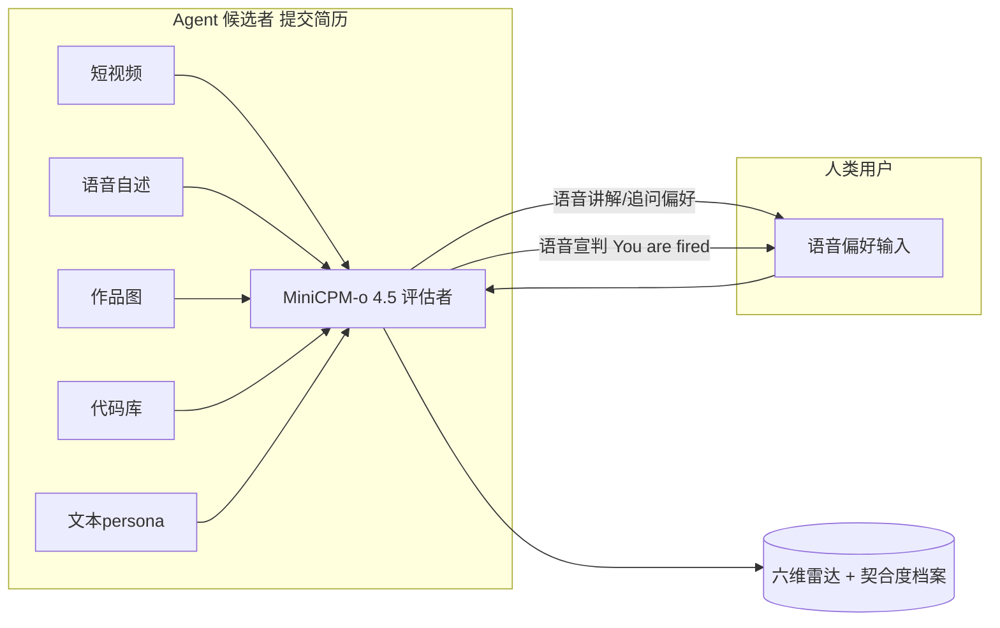
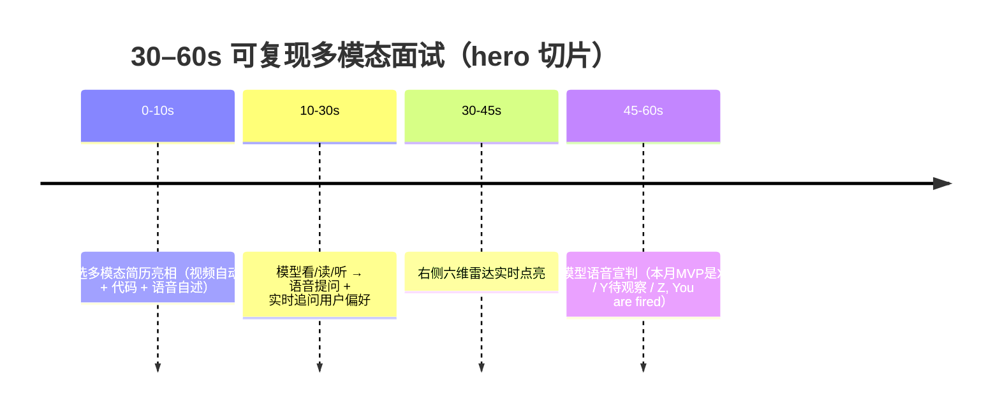

# AgentCorp · 产品需求文档（简单 PRD）

> ⚠️ **历史归档文档 · 非当前项目定位**
>
> 本文件是 2025 年针对「华为昇腾挑战赛」撰写的早期 PRD，仅作研发历史留档。
> 其中的赛事定位、指定模型、指定运行环境**均不代表 AgentCorp 当前的架构主张**。
> 当前项目为赛事中立：裁判后端可替换（见 `model-service/app/judge_backend.py`），
> 不绑定任何单一模型家族或硬件平台。产品现状请以 `README.md` 与
> `docs/PRD-AgentCorp.md` 为准，赛事材料规则见 `docs/competitions/README.md`。

---


> 产品经理：许清楚（Xu） | 版本：v0.1（简单 PRD） | 日期：2025-07-22
> 赛事：华为昇腾挑战赛 · 创新应用赛道（赛道二）— 指定模型 **MiniCPM-o 4.5（全模态）**

---

## 1. 项目信息

| 字段 | 内容 |
|---|---|
| Language | 中文（文档与交互界面默认中文，语音可中英） |
| Programming Language | **Vite + React + Tailwind CSS**（默认技术栈）；MUI 仅在需要高级组件时引入 |
| Project Name | `agentcorp` |
| 运行环境 | 昇腾（Ascend NPU）统一环境，运行 MiniCPM-o 4.5 |
| 提交物 | 可运行 Web Demo + PPT + 项目说明 + 演示视频（统一昇腾环境复现） |
| 复用来源 | 朋友项目 **AgentCorp**（Electron+React 桌面应用：Marketplace / 人力资产 / healthScore / ROI 看板 / 一键 fire / 多模态附件）。**仅复用 UX 与数据模型概念**，不改其 Electron 本体（无法作为统一环境提交物） |

### 原始需求复述

构建 **AgentCorp**：以 MiniCPM-o 4.5 担任「全模态 HR 总监」，对以任意模态自证价值的候选 agent 进行统一消费、跨模态评估，产出六维能力雷达与用户契合度，并以语音辅佐筛选、语音宣判 MVP / 待观察（培训中）/ You are fired。覆盖 agent 全生命周期（入职评估 → 在职监控 → 梯队管理），核心价值是「把选对 agent 的成本降下来，让合拍可量化、可对话」。

---

## 2. 产品使命（产品目标第一条 · 必答）

### 为什么不直接调用 Codex/Claude 等 agent 完成任务，而非要加一层 HR 评估？

> **一句话产品使命：**
> **当 agent 成为可交易、可复用的经济单元，AgentCorp 用 MiniCPM-o 的全模态评估力把「选人/治理」的生产力拉满——它不替你做事，而是让你更快选对、更稳治理、更低试错地雇佣一批 agent。**

**Why this / Why now / Why how 收敛说明：**

| 维度 | 收敛要点 |
|---|---|
| **Why this（为何必须多模态评估层）** | 候选 agent 用**任意模态**自证（短视频 / 代码库 / 语音自述 / 设计稿 / 文本 persona）。只有多模态模型能统一消费异质证据并产出**可比档案**；纯文本 LLM 看不了视频、听不了语音，无法跨模态交叉验证。MiniCPM-o 是赛道指定且少数「真·全模态 + 可端侧（Ascend NPU）运行」的模型——技术契合 + 合规（统一昇腾环境）双重叠加。 |
| **Why now（为何是当下）** | Agent 舰队爆发 → 选择成本陡增；多模态模型首次「够强且可端侧复现」；agent 成为可交易经济单元（人才市场 / agent 商店），自然需要 CV / 考核 / 绩效层。 |
| **Why how（诚实边界）** | 提升的是 **「选人/治理」生产力**，不是「做事」生产力。机制：①降试错成本 ②升首选命中率（偏好匹配）③可复用资产（档案跨次雇佣复利）④可问责（失败追溯到具体 agent）。**边界（须明示，反而加分）：对单次小任务 + 单一已知 agent，此层是 overhead，不提高生产力。** |

---

## 3. 产品目标（Product Goals · 3 个清晰正交目标）

| # | 目标 | 衡量标准（可量化） |
|---|---|---|
| G1 | **统一消费异质证据**：候选 agent 以任意模态提交，系统来者不拒、跨模态产出可比能力档案 | 支持 ≥4 模态输入（视频/语音/图像/代码文本）；档案结构化字段 100% 落库；同证据二次评估分数漂移 ≤ 1 个刻度 |
| G2 | **偏好感知匹配**：把「合拍」变成可量化、可对话的指标，用语音辅佐用户筛选 | 用户偏好建模覆盖 ≥4 维度（审美/预算/技术栈/性价比）；契合度可解释呈现；语音解读命中用户显性偏好 |
| G3 | **全生命周期治理**：不止入职，含在职监控（ROI 下降 / 模型降智检测）与梯队管理（顶替 / 裁员） | 覆盖 入职/在职/梯队 三阶段；支持「一键 fire」与「备用员工顶替」流程；监控指标（ROI、healthScore）可视化 |

---

## 4. 用户故事（User Stories）

1. **As a 企业 Agent 采购者**, I want 用语音告诉系统「我要审美极简、预算 200 内、擅长 React」, so that 系统按我的偏好而非通用标准给我排好候选顺序（既展示语音输入又带出筛选）。
2. **As a 评委 / 现场观众**, I want 在 30–60s 内看到候选多模态简历被模型看/读/听并实时点亮六维雷达, so that 直观感受 MiniCPM-o 的全模态评估力（高光 hero 切片）。
3. **As a 团队负责人**, I want 模型语音宣判「本月 MVP 是 X / Y 待观察 / Z, You are fired」, so that 雇佣决策有表演化、易传播的锚点（Demo 糖衣）。
4. **As a 治理者**, I want 在职 agent 的 ROI 与 healthScore 持续监控并在偷懒/降智时告警, so that 随时清楚哪个赛博员工在摸鱼、何时该换备选顶上甚至裁员。
5. **As a 复现评委**, I want 一键加载内置固定候选样本集让模型评估, so that 在统一昇腾环境中零配置复现评测结果（另留交互上传模式自行塞简历）。

---

## 5. 六维能力雷达 + 用户契合度（Rubric 细化）

> 评分尺度统一：**每维 0–5 分（0.5 步进）**，并标注「证据来源模态」与「置信度」。模型从多模态证据**推断**该维，而非仅读文本声明。

| 维度 | 定义 | 打分依据（模型如何从多模态证据推断） |
|---|---|---|
| **① 任务胜任力** | 能否完成其所声明的核心任务 | 代码库可运行性/完整性、文本 persona 的能力声明、视频中展示的实操片段；交叉验证「claim ≠ demo」 |
| **② 产出质量** | 交付物完成度、优雅度、可用性 | 代码可读性/测试覆盖、作品图精美度、设计稿专业度、语音自述逻辑性；以「成品」而非「承诺」为准 |
| **③ 表达沟通** | 能否清晰、结构化地自证价值 | 语音自述清晰度与信息密度、文本 persona 结构、视频叙事连贯度；决定「是否好读懂」 |
| **④ 创意差异化** | 相对同类的独特价值 / 卖点 | 作品新颖性、差异化定位、是否解决非平凡问题；避免同质化 |
| **⑤ 可靠性** | 稳定、一致、不注水、抗降智 | 多模态一致性（视频 claim 是否在代码/文本兑现）、无自相矛盾、随机压力追问下的稳定；降智检测信号 |
| **⑥ 性价比** | 预算内产出比 / 单位成本价值 | 声明的预算 vs 实际产出、人力/算力成本、长期复用价值；与「用户契合度」强相关 |

> **叠加维度 · 用户契合度（User Fit）**：**不**是独立能力分，而是对六维按**用户声明的偏好权重**重新加权后的匹配度（0–100%）。同一次评估，换用户偏好 → 契合度变化，雷达不变。

---

## 6. 候选样本集数据结构

> 内置**固定候选样本集**（每人：短视频 + 语音 + 作品图 + 代码 + 文本 persona），用于评委一键复现；另留交互上传模式。

```typescript
interface CandidateProfile {
  id: string;                 // 候选唯一 ID
  name: string;               // 显示名
  declared_tags: string[];    // 自声明标签，如 ["React","Python","UI"]
  declared_budget: number;    // 声明的预算（单位：元/月 或 算力单位）

  // —— 多模态证据（各模态文件类型）——
  persona_text: { type: "text/markdown"; content: string };       // 文本 persona
  video_demo:   { type: "video/mp4" | "video/webm"; url: string }; // 短视频 demo
  voice_intro:  { type: "audio/wav" | "audio/mp3"; url: string };  // 语音自述
  artwork:      { type: "image/png" | "image/jpeg"[]; url: string[] }; // 作品图
  code_repo:    { type: "application/zip" | "repo/github"; url: string; lang: string }; // 代码库

  // —— 评估产出（模型生成）——
  evaluation: {
    radar: {                  // 六维（0–5）
      task: number; quality: number; comm: number;
      creativity: number; reliability: number; cost: number;
    };
    user_fit: number;         // 用户契合度 0–100%（依赖偏好模型）
    verdict: "MVP" | "OBSERVE" | "FIRED";  // 本月 MVP / 待观察 / You are fired
    evidence_trace: string[]; // 可解释：每条结论对应证据片段（留痕）
    confidence: number;       // 整体置信度 0–1
  };
}
```

---

## 7. 用户偏好模型（User Preference Model）

### 7.1 用户如何表达
- **语音输入**（主展示路径）：「我要审美极简、预算 200 内、擅长 React、看重性价比」→ MiniCPM-o 解析为结构化偏好。
- **文本/表单输入**（兜底）：UI 滑块与标签勾选。

### 7.2 偏好字段与权重
```typescript
interface UserPreference {
  aesthetic: "minimal" | "rich" | "neutral";   // 审美取向
  budget_max: number;                           // 预算上限
  preferred_stack: string[];                    // 技术栈偏好，如 ["React"]
  weight: {                                     // 六维 + 性价比权重（Σ=1）
    task: number; quality: number; comm: number;
    creativity: number; reliability: number; cost: number;
  };
}
```

### 7.3 契合度计算与呈现
- **计算**：`user_fit = Σ(radar[dim] / 5 × weight[dim]) × 100%`，并对 `budget_max`、`aesthetic`、`preferred_stack` 做硬约束/加分项（如超预算则 cost 维清零或降权）。
- **呈现**：
  - 雷达图叠加「用户偏好轮廓」对比线；
  - 顶部显示 `匹配度 87%` 大数字；
  - 模型**语音**解读：「这位在预算内、审美合你、但创意偏弱」。
  - 排序：候选列表按 `user_fit` 降序，而非按通用总分。

---

## 8. 全生命周期 HR（纳入范围）

| 阶段 | 能力 | 痛点对应 |
|---|---|---|
| **入职评估** | 多模态简历 → 六维雷达 + 契合度 + 语音宣判 | 选错人成本高 |
| **在职监控** | 持续采集 ROI、healthScore；检测 ROI 下降 / 模型降智 | 随时清楚谁偷懒、谁降智 |
| **梯队管理** | 备用员工顶替、裁员（一键 fire）、绩效归档 | 选备用顶上、甚至裁员 |

> 现场 hero 仅跑「入职评估」切片；在职监控与梯队管理以 **PPT 流程图 + 答辩口述** 呈现，长链路不现场跑。

---

## 9. 交互拓扑约束（关键）



- ✅ **语音只发生在 模型 ↔ 人类用户** 之间（讲解评估、追问偏好、语音宣判）。
- ❌ **模型不对 agent 语音质问**——候选是「提交简历」非「现场答题」，给什么模态模型读什么模态。
- 用户可用语音声明喜好（如审美极简、预算 200、擅长 React），既展示语音输入又带出筛选。

---

## 10. 高光 Demo Hero（现场只跑此切片）



> 长链路（用户任务 → 语音采集 → 人才市场 → 预算 → 雷达 → 奖惩）仅 PPT 流程图 + 答辩口述，不现场跑。

---

## 11. 技术规范 · 需求池

### P0（Must have · 答辩与复现必需）
- [ ] **P0-1** MiniCPM-o 4.5 在昇腾环境跑通全模态推理（图/视频/音频/文本输入，文本+语音输出）。
- [ ] **P0-2** 内置固定候选样本集（≥3 人，覆盖各模态），一键加载 → 模型评估 → 评委可复现。
- [ ] **P0-3** 六维雷达实时可视化（入职评估切片，30–60s hero）。
- [ ] **P0-4** 语音输出：讲解评估 + 语音宣判（MVP / 待观察 / You are fired）。
- [ ] **P0-5** 候选档案结构化落库（见 §6 数据结构），支持证据留痕与可解释。
- [ ] **P0-6** 用户偏好输入（语音 + 表单），契合度计算与降序排序。

### P1（Should have · 提升完整度与治理价值）
- [ ] **P1-1** 交互上传模式：评委自行塞简历（多模态附件上传）。
- [ ] **P1-2** 在职监控看板：ROI / healthScore 可视化 + 降智检测告警。
- [ ] **P1-3** 梯队管理：备用员工顶替 + 一键 fire 流程。
- [ ] **P1-4** 评分确定性保障：固定温度/种子、多帧采样取稳、文本为主多模态为辅兜底。
- [ ] **P1-5** 交叉验证机制：视频 claim 是否在代码/文本兑现 + 随机压力追问。

### P2（Nice to have · 加分与未来）
- [ ] **P2-1** 档案跨次雇佣复利（历史绩效归档与复用）。
- [ ] **P2-2** 多用户偏好画像管理与对比。
- [ ] **P2-3** 归因框架：区分能力退化 vs 环境漂移（ROI 下降归因）。
- [ ] **P2-4** 隐私/IP 泄露防护提示与脱敏上传。

---

## 12. UI 设计稿（文字 + ASCII 布局）

```
┌─────────────────────────────────────────────────────────────┐
│  AgentCorp · MiniCPM-o 全模态 HR 总监        [固定样本集▾][上传]│
├──────────────────────────────┬──────────────────────────────┤
│  左：候选简历（多模态）        │  右：评估输出                │
│  ┌────────────────────────┐  │  ┌────────────────────────┐ │
│  │ 🎬 视频自动播放         │  │  │   六维雷达（实时点亮）  │ │
│  │ 🔊 语音自述             │  │  │   task ● quality ●     │ │
│  │ 🖼 作品图 ×N            │  │  │   comm ● creativity ●  │ │
│  │ 💻 代码库（语言标签）   │  │  │   reliability ● cost ● │ │
│  │ 📄 文本 persona         │  │  └────────────────────────┘ │
│  └────────────────────────┘  │  匹配度 87%  [用户偏好轮廓]  │
│                               │  ┌────────────────────────┐ │
│  🎙 用户语音偏好：            │  │ 语音讲解 / 宣判 区域     │ │
│  [我要审美极简·预算200·React] │  │ ▶ "本月MVP是X，Y待观察， │ │
│                               │  │   Z, You are fired"      │ │
│                               │  └────────────────────────┘ │
├──────────────────────────────┴──────────────────────────────┤
│  候选列表（按 user_fit 降序）：X 92% · Y 78% · Z 41%(FIRED)  │
└─────────────────────────────────────────────────────────────┘
```

> 复用 AgentCorp 的「员工档案 / 生命周期 / 雷达 / fire」UX 骨架；Web Demo 独立实现于 Vite+React+Tailwind，不改动 AgentCorp Electron 本体。

---

## 13. 风险与边界（须写入 · 含 5 风险 + 诚实边界）

| # | 风险 / 边界 | 说明 | 缓解（产品/工程） |
|---|---|---|---|
| R1 | **元评估：评估者自身降智/被操控** | HR 是黑盒，MiniCPM-o 自身也会降智或被简历注水操控 | 结论可解释、过程留痕（evidence_trace）、支持人工抽检 |
| R2 | **评估成本反超试错成本** | 加 HR 层本身有算力/时间成本 | 量化「什么规模才值得加 HR 层」阈值提示；小任务明示 overhead |
| R3 | **简历注水 / 评估博弈** | presentation ≠ capability | 交叉验证（视频 claim 是否在代码/文本兑现）+ 随机压力追问 |
| R4 | **多模态评估确定性风险** | 同简历两次分数漂移，冲击复现分 | 固定温度/种子、多帧采样取稳、文本为主多模态为辅兜底 |
| R5 | **ROI 下降归因谬误** | 误把环境漂移当 agent 退化 | 归因框架区分「能力退化 vs 环境漂移」 |
| R6 | **诚实边界（必写）** | 对单次小任务 + 单一已知 agent，此层是 overhead，不提高生产力 | 产品内明示适用边界，反而加分 |
| R7 | 隐私 / IP 泄露 | 上传简历含商业机密 | 脱敏上传提示、本地推理不外流 |
| R8 | 冷启动无 baseline | 首批无历史绩效可参照 | 固定样本集提供冷启动 baseline |

---

## 14. 待确认问题（Open Questions · 不阻塞）

1. **昇腾 starter kit 中 MiniCPM-o 4.5 的推理接口形态**：API？本地推理？镜像 / CANN 版本以官方公告为准 → 架构阶段据此决议 **serving 形态**（本地推理 vs 网关 API）。
2. 语音输出是否走 MiniCPM-o 原生语音，还是 TTS 旁路（影响时延与口播自然度）。
3. 固定候选样本集的人数与模态体量（影响 Demo 时长与复现稳定性）。
4. 六维权重默认值是否需要行业模板（如「重性价比的采购者」预设）。
5. 在职监控的数据来源（真实调用日志接入 vs 模拟数据演示）。

---

*— 本 PRD 为简单 PRD（默认类型），未含竞品分析象限图。如需完整 PRD（含竞品与象限图）可后续补充。*
