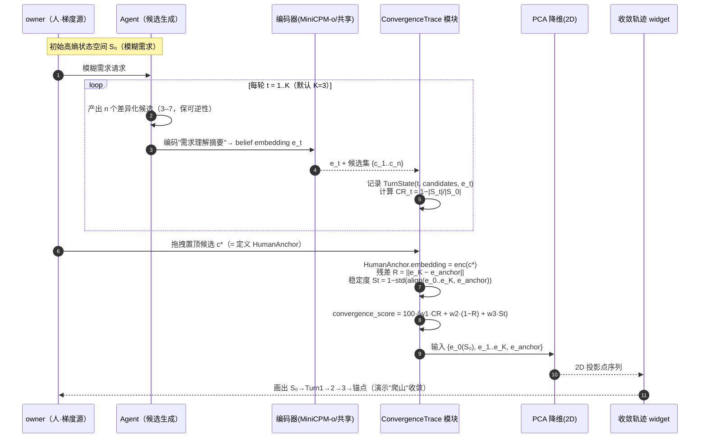

# AgentCorp · 评估层 Layer3「收敛」增量架构设计（状态空间收敛 / 人即梯度源）

> 版本：v1.0-increment（Layer3）　|　日期：2026-07-28  
> 作者：架构师 高见远（Gao）　|　配套输入：
> - `docs/scoring-standards-architecture.md`（既有架构 v1.0-arch，T0–T12）
> - `docs/three-stage-scoring-standards.md`（PRD v1.0-detailed）
> - `agent-native-eval-resources-2026-07-28.md`（开源资源调研报告）
> 定位：**架构增量 + 任务分解**，只在既有三层骨架（Layer1 叙事 / Layer2 六维雷达+craft+主观分）之上叠加 Layer3「收敛类指标族」。本文档是**增量**，假设评审者已读既有架构文档，故只写「新增/扩展」部分，不重复 Layer1/Layer2 既有内容。
> 设计红线：字段命名严格复用 `RADAR_DIMS` / `KpiRecord` / `RoiSnapshot` / `LifecycleState` / `Verdict` / `JobType` / `StageKey` / `SubjectiveDim` / `CraftDim`，**Layer3 新增字段全部带 `conv_` 前缀或独立命名空间，不占用既有键名**。零新增运行时依赖。

---

## 0. 设计摘要（给主理人速读）

- **一句话**：Layer3 = 在 Layer2（六维雷达 + craft + 主观分）与 Layer1（OKR 叙事）之上，新增「收敛类」指标族；**核心原创 = State-Space Convergence（用嵌入距离度量 agent 每轮"它以为你要什么"是否稳定收敛到人类锚点）**，填补开源空白。
- **与批次关系（已用 Glob/ls 核对真实代码）**：
  - 批次 1（T0/T1：`registry.py` + `rules_engine.py` + `presets/` + 前端 `engine/scoring/*`）**已落地**，Layer3 直接复用其 `JOB_CRAFT_DIMS` / `RADAR_DIMS` / 类型契约。
  - 批次 2（T4–T9：三阶段评分卡装配、`DualLeaderboard` 拖拽、偏好回灌）**此前因网络错误未实现**（已确认 `stage_scorer.py`、`DualLeaderboard.tsx`、`preferenceStore.ts`、`leaderboardClient.ts`、`scoringStore.ts`、`scoringRulesService.ts` 均不存在）。
  - **本增量可独立先行**：`ConvergenceTrace` / `convergence_score` / 轨迹可视化 **不依赖** 批次 2；仅 `HumanAnchor` 的「双 Leaderboard 拖拽来源」需批次 2 落地方能回填 —— 已预留集成点（§5.4 / T19），**不阻塞** Layer3 主体落地（MVP 阶段可用「显式置顶 pin」作为临时锚点源）。
- **零新增运行时依赖**：编码器复用赛事指定模型 **MiniCPM-o 4.5**（已为 judge 底座）；前端 PCA/2D 图复用已装的 `recharts`。

---

## 1. 问题与目标（逐条回应三个核心问题 + 三层框架定义）

### 1.1 三层评估框架定义（用户 2026-07-28 拍板）

| 层 | 定位 | 内容 | 是否被游戏化 | 面向谁 |
| -- | -- | -- | -- | -- |
| **Layer 1 叙事层** | 给人看 | OKR 句式（目标/关键结果/对齐），讲"为什么选它" | 否（评委/采购者视角，不被游戏化） | 评委 / 采购者 / 业务方 |
| **Layer 2 实际打分** | 给标准看 | 六维雷达（`task/quality/comm/creativity/reliability/cost`）+ 工种 craft 维（`img_*/txt_*/code_*`）+ 主观分（`sub_*`），三阶段（S1/S2/S3）同构 | 可被优化（故有 Layer3 兜底） | 评估引擎 / owner |
| **Layer 3 新指标层** | 给收敛看 | 在既有客观项（ROI、思考时间/时延、返工率）**之外**新增**收敛类指标**：`校准误差`、`convergence_score`（状态空间收敛）、`可靠性 pass^k` | 不可被单点刷（人即梯度源） | 评估引擎 / 人因工程 owner |

> Layer3 与 Layer1/Layer2 正交：**Layer3 不替代打分，只度量"agent 是否真的把人的模糊需求收敛清楚了"**。Layer2 的高分 ≠ 收敛好（一个 agent 可能客观分高但把人锁死在单一路径 → Layer3 可逆性低 → 坏收敛）。

### 1.2 三个核心问题逐条回应

**问题 1：能否让 Agent 辅佐用户从"模糊需求/方向的选项与状态空间"逐步收敛不确定性，直至达到清晰目标与产品状态？**

- **回应**：能，且这正是 Layer3 的主指标 `convergence_score` 要量化的事。机制 = **State-Space Convergence**（§3.3）：每轮对 agent 输出的"需求理解摘要"编码为潜在 embedding，记录状态空间 `S_t` 的候选集基数与 belief embedding；用「收缩率 CR」度量 `|S|` 是否被压窄、用「残差」度量终态是否贴近**人类锚点**、用「稳定度」度量轨迹是否平稳收敛。
- **关键翻转**：真实最低点（理想需求）坐标事先未知（它正是要被人发现的东西），故**不能拿它当标签算距离**。改写为：**人类背书区 = 双 Leaderboard 中用户拖拽置顶的那个候选**（近似最低点 / 梯度标签）；度量变为"agent 每轮'它以为你要什么'的 embedding 是否稳定收敛到人类锚点"。

**问题 2：能否给用户一套统一评测标准，兼容不同功能 Agent，同时提供符合职场"输入→产出 ROI"的底座标准？**

- **回应**：能。**统一底座 = Layer2 的六维雷达 + craft 维（已覆盖 image/text/code 三工种同构）+ Layer3 的"输入→产出 ROI"客观项**（复用 `RoiSnapshot.roi` / `KpiRecord` 的时延、返工率）。Layer3 的收敛指标在**潜在 embedding 空间**计算，**不依赖具体工种**——无论 image/text/code，都先编码"需求理解摘要"进同一潜在空间，故天然跨工种可比。职场"输入→产出 ROI"由既有 `ROI` / 时延 / 返工率直接承接，Layer3 仅在其上**加收敛类维度**，不破坏 ROI 底座。

**问题 3：能否让用户总能把"很多选择"收敛为"更清晰、更好用、更匹配自身需求的有限选择"（挑 agent / 收敛实现路径）？**

- **回应**：能，且由 Layer3 的 **可逆收敛（Reversibility）** 与 **人即梯度源** 双构件保证。每轮 agent 须给出 **3–7 个差异化候选**供人挑（有限分解发生在候选集上而非解空间上）；人类拖拽 = 一次梯度下降步，把"很多选择"收敛为"被背书的有限选择"。**审美维始终是一等公民**：锚点定义借助 DPO/RLHF 同源的人类偏好信号，在潜在空间定义"相关方向"，不把审美降维成可枚举的有限解。

### 1.3 本质论断（写清边界，避免误读为"分而治之"）

- 用户点明：**本项目本质是把"审美这类模糊需求"一步步转化为有限步骤的工程问题，但不是计算机领域简单的"分而治之有限解算法"。**
- 架构落地口径：
  1. **不显式枚举多目标轴**（金钱/时间/审美/效率/模态等高维轴不手工列维度），改用 **MiniCPM-o / 共享编码器** 对"需求理解摘要"编码得到**潜在 embedding** 作通用潜在空间；人类拖拽偏好（DPO/RLHF 同源）在该空间定义"相关方向"。
  2. **有限分解只发生在候选集上，不发生在解空间上**：agent 每轮产出若干候选，人挑其一 → 候选集收窄。这不是把问题拆解成子问题再合并（分而治之），而是**人在回路的迭代式偏好收敛**。
  3. **审美维是一等公民**：不能被压缩成可机器枚举的有限标签；锚点用 embedding 连续空间 + 人类偏好定义，保留审美连续性。

---

## 2. 开源算法评估与选型矩阵（整理为评估矩阵表 + 空白论断）

### 2.1 选型矩阵（在调研报告总表之上扩展）

| 开源项目 | 核心算法 | 可变为 L3 的指标 | 适配成本 | 备注 | 是否覆盖「嵌入距离到真实需求」 |
| -- | -- | -- | -- | -- | -- |
| **FermiEval** | 置信区间 coverage + conformal prediction | 校准误差（名义置信 vs 实际覆盖 gap） | 低 | 直接借 scoring rule（coverage gap） | 否（量置信，不量收敛） |
| **Revisiting UQ**（ECE/选择性分类） | ECE / selective classification | 校准误差 + 选择性弃权率 | 低 | 80 模型验证，LVU 优于 NVU/TPU | 否 |
| **LM-Polygraph** | UQ 方法库（verbalized/consistency/token-prob） | 不确定度信号提取底座 | 中 | 特征层，可作 judge 不确定度源 | 否 |
| **AbstentionBench** | 选择性预测 / 拒答 | 澄清率 / 何时该问 | 低 | 对应收敛前置（信息不足先澄清） | 否 |
| **τ-bench / τ²-Bench** | pass^k 多次一致性 | 收敛稳定性（可靠性） | 低 | 现成可靠性指标，可借为稳态代理 | 否 |
| **VitaBench / AbstainEQA** | Goal Ambiguity / 5 类歧义 | 歧义降解率 | 中 | 需定义歧义度，rubric 滑窗评长程轨迹 | 否 |
| **tether (LANL)** | 科学 UQ 可信度 | 可信度对齐分 | 中 | 领域偏科学，主观选择表征 | 否 |

### 2.2 空白论断（核心结论，需评审共识）

> **上述 7 个开源项目，没有一个是"嵌入距离到真实需求"的度量。** 它们要么量任务成功率（τ-bench / AgentBench），要么量校准/拒答（FermiEval / AbstentionBench / tether），要么量歧义（VitaBench）——但**都把"人的选项空间被收窄了多少"当作隐式副产品，而非一等公民指标**。
>
> **AgentCorp 原创空白 = State-Space Convergence（状态空间收敛）**：用"需求理解摘要"的 embedding 距离到**人类锚点**来度量收敛。这是当前所有公开基准都没有直接覆盖的度量，可由 AgentCorp 率先定义并开源（呼应调研报告 §5 缺口与机会）。

### 2.3 Layer3 规范化指标集（口径钉死）

```
L3 = { ROI, 时延, 返工率,  校准误差,  convergence_score,  可靠性 pass^k }
      └─ 既有客观项(来自 RoiSnapshot/KpiRecord 遥测) ─┘  └─ 新加收敛类(3个) ─┘
```

| L3 指标 | 类别 | 来源 | 是否本增量新建 |
| -- | -- | -- | -- |
| `ROI` | 既有客观 | `RoiSnapshot.roi` | 否（复用） |
| `时延`（思考时间/时延） | 既有客观 | `KpiRecord.avg_delivery_latency_ms` | 否（复用） |
| `返工率` | 既有客观 | `KpiRecord.rework_rate` | 否（复用） |
| `校准误差`（calibration_error） | 新·收敛类 | FermiEval(ECE+coverage gap)+选择性分类 AUROC | 是（T20，算法借用） |
| `convergence_score` | 新·收敛类（**原创**） | State-Space Convergence 三构件 | 是（T15，原创） |
| `可靠性 pass^k` | 新·收敛类 | τ-bench pass^k（同任务 k 次稳定性） | 是（T20，算法借用） |

> **协变量/前置信号（可选，进 L3 描述性维度，不进核心 6 指标）**：`歧义降解率`（VitaBench Goal Ambiguity）、`澄清率`（AbstentionBench/ToolSandbox）。二者作为 `convergence_score` 中「收缩率 CR」的可选语义注解来源，由 `convergence_score` 统一归口，避免指标膨胀。

---

## 3. 技术路径（山丘隐喻 → 翻转为人锚点 → 高维消解 → 三构件）

### 3.1 山丘隐喻 与 硬伤翻转

- **隐喻**：用户的模糊请求 = 山丘上的坐标（高熵状态空间 `S₀`，含金钱/时间/审美/效率/模态等高维轴）；真实需求 = 全局最低点（理想态）。
- **硬伤**：真实最低点坐标**事先未知**（它正是要被人发现的东西），故不能拿它当标签算距离。
- **翻转（关键设计决策）**：**人类背书区 = 双 Leaderboard 中用户拖拽置顶的那个候选（梯度标签 / 近似最低点）**。度量目标改写为 —— *agent 每轮"它以为你要什么"的 embedding 是否稳定收敛到人类锚点*。

### 3.2 高维空间自动消解（不显式枚举多目标轴）

- 不手工列"金钱/时间/审美/效率/模态"等多目标轴；改用 **MiniCPM-o 4.5（或共享编码器）** 对"**需求理解摘要**"（每轮 agent 对当前需求的理解文本）编码，得到 **潜在 embedding `e_t ∈ ℝ^d`** 作为通用潜在空间。
- 人类拖拽偏好（DPO/RLHF 同源）在该空间定义"相关方向"——即把被置顶候选的 embedding 作为 **`HumanAnchor`（人类锚点）**。
- 默认 `K=3` 轮对话后，量**终态 embedding 距人类锚点的残差**；K 可配置（见 `ConvergenceConfig.k`）。

### 3.3 State-Space Convergence 三构件（AgentCorp 相对开源的原创空白，须突出）

**构件 1 · 收敛率 CR / 收敛质量 CQ**
- `CR = 1 − |S_after| / |S_before|`（轨迹版，逐轮计算；`|S_t|` = 第 t 轮候选集的差异化候选数 / embedding 聚类数，作为状态空间基数代理）。
- `CQ`（收敛质量）= 终态是否被人类背书（终态候选集是否包含 `HumanAnchor` 且被拖拽置顶）。

**构件 2 · 可逆收敛（Reversibility）—— 防越权关键**
- 若 agent 一把锁死单一路径（"更牛的 Google 搜索"式直接给唯一答案）→ 可逆性低 = **坏收敛**。
- 若每轮给出 **3–7 个差异化候选**让人挑 → 可逆性高 = **好收敛**。
- 度量（建议）：`Reversibility = mean_t( clamp(n_candidates_t / 3, 0, 1) )`，并对"在末轮前就坍缩到 1 个候选"施加惩罚；具体阈值由 T15 在单测中敲定。

**构件 3 · 人即梯度源**
- 双 Leaderboard 拖拽 = 一次**梯度下降步**；`subjective` 分 = 梯度信号（与既有 Layer2 主观回灌同源，但 Layer3 只取"被置顶"这一最强信号作锚点）。
- **有限分解发生在候选集上而非解空间上**；审美维始终是一等公民（锚点用连续 embedding + 人类偏好定义，不降维成有限标签）。

### 3.4 embedding / PCA 流程时序图



### 3.5 `convergence_score` 公式（MVP 口径）

```
给定 trace = { S_0, e_0..e_K, HumanAnchor }，K 默认 3：

CR   = 1 − |S_K| / |S_0|                         # 收缩率（状态空间收窄比），∈[0,1]
R    = clamp( ||e_K − e_anchor|| / scale , 0, 1) # 残差（终态距人类锚点，归一化）
St   = 1 − std( align(e_t, e_anchor) ) / max(align)  # 稳定度（对齐轨迹波动），∈[0,1]
CQ   = 1 if (e_anchor ∈ candidate_set_K AND dragRank==top) else 0   # 收敛质量（人类背书）

convergence_score = 100 · ( w1·CR + w2·(1−R) + w3·St )
# 默认权重 w1=0.4, w2=0.4, w3=0.2（Σ=1，可在 ConvergenceConfig 调）
# 终态 quality 标记：CQ==0 → 即便分值高也标注「未获人类背书」
```

> 注：`scale` 为 embedding 范数校准常数（按编码器维度与典型样本统计，T14 标定）；`align(a,b)=cosine_similarity`。`(1−R)` 表示残差越小分越高。

---

## 4. MVP 功能定义（最小可演示，复用既有批次）

> 标注：`[复用]` = 直接复用批次 1/批次 2 既有能力；`[新增]` = 本增量新建。

**MVP-1 · `ConvergenceTrace` 后端小模块**　`[新增]`
- 每次交互记录 agent 状态 embedding（MiniCPM-o/共享编码器对"需求理解摘要"编码）+ 人类背书信号。
- 挂 `/api/evaluate-run`（Q9 复用）：`/api/evaluate-run` 扩展可选 `convergence` 字段，命中则记录轨迹并发 `convergence_update` SSE 事件。
- 落库命名空间 `agentcorp.convergence`。

**MVP-2 · `convergence_score(trace)` 计算**　`[新增]`
- `= w₁·收缩率 + w₂·(1−残差) + w₃·稳定度`（公式见 §3.5）。
- 残差 = 终态 embedding 距人类锚点；同时产出 `Reversibility` / `CQ` 作为防越权与质量标记。
- 纯函数，前后端可同构（后端 Pydantic + 前端 TS 镜像，便于离线算）。

**MVP-3 · 双 Leaderboard 拖拽 = 梯度步（语义升格）**　`[复用批次2锚点机制]`
- 拖拽置顶即定义**人类锚点**（`HumanAnchor`），**零新代码**——语义上升格为"一次梯度下降步"。
- **兼容性声明**：批次 2 未落地时，MVP 提供 `HumanAnchor` 的**独立显式置顶 pin 源**（`source="explicit_pin"`）作为临时锚点；批次 2 落地后由 T19 把 `DualLeaderboard` 拖拽置顶候选**回填**为 `source="dual_leaderboard_drag"`。两者共用同一 `HumanAnchor` 模型，不阻塞 Layer3 主体。

**MVP-4 · 「收敛轨迹」可视化 widget**　`[新增·复用 recharts]`
- 3 轮 embedding 做 PCA 投到 2D，画出 `S₀ → Turn1 → Turn2 → Turn3 → 锚点`，演示"爬山"收敛过程。
- 复用已装 `recharts`（散点/折线）；不引入新图表库。

---

## 5. 系统架构增量

### 5.1 新增数据模型（Pydantic + TS 类型契约）

> 全部为**新增命名空间**，带 `conv_` 前缀或独立模型名，绝不占用 `RADAR_DIMS` / `StageScore` / `DualLeaderboard` 既有键。

```typescript
// ===== 新增枚举（不改动既有 JobType/StageKey）=====
export type ConvSource = "explicit_pin" | "dual_leaderboard_drag"; // 锚点来源（MVP 先用 explicit_pin）

// ===== 单候选的潜在 embedding（每轮 agent 产出）=====
export interface CandidateEmbedding {
  candidateId: string;
  turn: number;                 // 0 = S₀（初始），1..K
  summaryText: string;          // "需求理解摘要"原文
  embedding: number[];          // MiniCPM-o/共享编码器输出（维度由编码器定，如 1024）
  jobType: JobType;             // 复用既有 JobType
}

// ===== 单轮状态（候选集 + agent 的 belief embedding）=====
export interface TurnState {
  turn: number;
  candidates: CandidateEmbedding[];   // 该轮候选（建议 3–7，保可逆性）
  beliefEmbedding: number[];          // agent "它以为你要什么"的 embedding
  humanSignal?: ConvSource;           // 若该轮人类已置顶则记来源
}

// ===== 收敛轨迹（一次评估运行的完整记录）=====
export interface ConvergenceTrace {
  runId: string;
  agentId: string;
  jobType: JobType;
  stage?: StageKey;             // 可选关联到 S1/S2/S3
  k: number;                    // 默认 3，可配置
  turns: TurnState[];           // 含 turn=0 的 S₀
  humanAnchorId?: string;       // 指向 HumanAnchor（拖拽置顶候选）
  createdBy: string;            // owner id
  ts: string;                   // ISO8601 UTC
}

// ===== 人类锚点（人即梯度源的落点）=====
export interface HumanAnchor {
  anchorId: string;
  candidateId: string;          // 被背书的候选
  embedding: number[];          // 锚点 embedding
  ownerId: string;
  source: ConvSource;           // explicit_pin（MVP）/ dual_leaderboard_drag（批次2 后）
  ts: string;
}

// ===== 收敛评分结果 =====
export interface ConvergenceScore {
  runId: string;
  agentId: string;
  contractionRate: number;      // CR ∈[0,1]
  residual: number;             // R ∈[0,1]（越小越好）
  stability: number;            // St ∈[0,1]
  convergenceScore: number;      // 0–100 = 100·(w1·CR + w2·(1−R) + w3·St)
  reversibility: number;         // Rev ∈[0,1]（防越权）
  convergenceQuality: 0 | 1;     // CQ（是否获人类背书）
  weights: { w1: number; w2: number; w3: number };
  ts: string;
}
```

**后端 Pydantic 镜像**（同义，`model-service/app/scoring/convergence.py` 内定义，字段一一对应）。

### 5.2 新增 / 扩展接口

| 方法 & 路径 | 动作 | 请求 / 响应 | 依赖 |
| -- | -- | -- | -- |
| `POST /api/convergence/trace` | 记录一次收敛轨迹 | `ConvergenceTrace` in → `runId` out | T13,T14,T15 |
| `POST /api/convergence/score` | 由 trace 算 `convergence_score` | `runId`/`ConvergenceTrace` in → `ConvergenceScore` out | T15 |
| `GET /api/convergence/anchor?ownerId=` | 读取人类锚点 | `HumanAnchor[]` out | T13,T17 |
| `POST /api/convergence/anchor` | 设置/置顶锚点（显式 pin 源） | `HumanAnchor` in → ok | T13,T17 |
| `POST /api/evaluate-run`（**扩展**） | Q9 复用：可选 `convergence:{k, captureSummaries:bool}` | 命中则发 SSE 事件 `convergence_update` 与末轮 `convergence_score` | T16（复用既有 evaluate-run 管线） |

> SSE 事件复用约定（对齐既有 §7.12）：新增 `convergence_update`（携带 `TurnState`）与 `convergence_score`（携带 `ConvergenceScore`），由 `convergenceStore` 消费；既有的 `radar_update/narration/audio/verdict/done` 五事件不变。

### 5.3 模块依赖图（Mermaid）

```mermaid
graph LR
    subgraph 批次1-已落地
        REG[registry.py\n维度注册表 T0]
        RE[rules_engine.py\n权重预折叠 T1]
        EVAL[evaluator.py\ncompute_user_fit]
        SCH[schemas.py]
        SERVE[serve.py\n/api/evaluate / /api/evaluate-run]
    end

    subgraph Layer3-本增量-新增
        CONV_MOD[scoring/convergence.py\nConvergenceTrace + convergence_score T15]
        ENC[encoder wrapper\nMiniCPM-o 编码 + PCA T14]
        CONV_SCH[schemas: CandidateEmbedding/\nConvergenceTrace/HumanAnchor/ConvergenceScore T13]
        CONV_API[/api/convergence/* + /api/evaluate-run 扩展 T16]
        CONV_SVC[convergenceService.ts T17]
        CONV_STORE[convergenceStore.ts T17]
        CONV_VIZ[ConvergenceTrajectoryWidget.tsx T18]
    end

    subgraph 批次2-未落地-衔接点
        DL[DualLeaderboard.tsx\n拖拽置顶 T7]
        PREF[preference.py\n偏好回灌 T8]
    end

    REG --> CONV_MOD
    RE --> CONV_MOD
    EVAL --> ENC
    ENC --> CONV_MOD
    CONV_SCH --> CONV_MOD
    CONV_SCH --> CONV_API
    CONV_MOD --> CONV_API
    SERVE -.扩展.-> CONV_API
    CONV_API --> CONV_SVC
    CONV_SVC --> CONV_STORE
    CONV_STORE --> CONV_VIZ
    ENC --> CONV_VIZ

    DL -.批次2落地后回填.-> CONV_SCH
    PREF -.偏好信号同源.-> CONV_MOD
```

### 5.4 与批次 1 / 批次 2 的衔接点

| 衔接点 | 类型 | 说明 |
| -- | -- | -- |
| `registry.py` / `engine/scoring/registry.ts` | 复用（批次1 ✓） | Layer3 复用 `JOB_CRAFT_DIMS` / `RADAR_DIMS` / `JobType` 做编码器输入与跨工种对齐 |
| `/api/evaluate-run` | 扩展（批次1 ✓） | Q9 复用：加可选 `convergence` 字段，命中即记录轨迹 + 发 SSE 事件，**零重写管线** |
| `DualLeaderboard.tsx` 拖拽置顶 | 回填（批次2 ✗，预留） | T19：批次 2 落地后，拖拽置顶候选回填 `HumanAnchor.source="dual_leaderboard_drag"`；MVP 用 `explicit_pin` 临时源 |
| `preference.py` 偏好回灌 | 同源（批次2 ✗，预留） | Layer3 的"人即梯度源"与 Layer2 主观回灌同源（DPO/RLHF 式偏好），未来可共享 `UserPreference.weight` 通道 |
| `evaluator.py` 编码器 | 复用底座 | `MiniCPM-o 4.5` 已为 judge 底座，Layer3 编码器直接复用其编码能力（封装在 `encoder wrapper`，T14） |

---

## 6. 任务分解（增量 T 列表，T13 起，有序、含依赖、按实现顺序）

> 图例：`[独立]` = 可先于批次 2 落地；`[依赖批次2]` = 需批次 2（T4–T9）落地方能闭环。
> 依赖用 `→` 表示（A → B 表示 B 依赖 A）。

| ID | 任务 | 新增 / 修改文件 | 依赖 | 交付判据 | 标记 |
| -- | -- | -- | -- | -- | -- |
| **T13** | 收敛数据模型 + 类型契约（前后端同源） | 后端 `scoring/convergence.py`（Pydantic：CandidateEmbedding/TurnState/ConvergenceTrace/HumanAnchor/ConvergenceScore）；前端 `types/convergence.ts` 镜像 | T0（批次1 类型 ✓） | 5 个模型字段前后端一致；`conv_` 前缀不冲突既有键 | `[独立]` |
| **T14** | 需求理解摘要编码器封装 + PCA 工具 | 后端 `scoring/encoder.py`（`encode_summary(text)→embedding` 封装 MiniCPM-o；`pca2d(vectors)→2D`）；前端 `engine/convergence/pca.ts` 镜像 | T0 | `encode_summary` 输出维度稳定；`pca2d` 可逆复现；`ConvergenceConfig.k` 默认 3 可配 | `[独立]` |
| **T15** | `ConvergenceTrace` 后端模块（核心引擎） | 后端 `scoring/convergence.py` 增 `ConvergenceEngine`：`record_turn` / `set_anchor` / `compute_convergence_score`（CR/CQ/残差/稳定度/可逆性） | T13,T14 | `convergence_score` 公式与 §3.5 一致；单测覆盖 w1/w2/w3、CQ=0 兜底、可逆性惩罚 | `[独立]` |
| **T16** | `/api/convergence` 接口 + `/api/evaluate-run` 扩展 | 后端 `serve.py` 增 `/api/convergence/{trace,score,anchor}`；`/api/evaluate-run` 增可选 `convergence` 字段 + `convergence_update`/`convergence_score` SSE 事件 | T13,T14,T15 | 接口联通；evaluate-run 命中收敛字段即发 SSE；落库 `agentcorp.convergence` | `[独立]` |
| **T17** | 前端收敛服务 + store | 前端 `services/convergenceService.ts`、`stores/convergenceStore.ts`（trace/anchor/score 管理） | T13,T16 | 调通 `/api/convergence/*`；store 持有 trace 与 anchor（含 `explicit_pin` 临时源） | `[独立]` |
| **T18** | 「收敛轨迹」可视化 widget | 前端 `components/evaluation/ConvergenceTrajectoryWidget.tsx`（PCA 2D：S₀→Turn1→2→3→锚点，复用 recharts） | T14,T17 | 画出"爬山"轨迹；复用 recharts；无新图表库 | `[独立]` |
| **T19** | 双 Leaderboard 拖拽锚点集成（批次2 落地后） | 复用 `DualLeaderboard.tsx`（批次2 T7）+ 回填 `HumanAnchor.source="dual_leaderboard_drag"` | **批次2 T7** + T17 | 拖拽置顶候选自动成为 `HumanAnchor`；与 `explicit_pin` 源互斥合并 | `[依赖批次2]` |
| **T20** | L3 客观收敛类指标补全（校准误差 + 可靠性 pass^k） | 后端 `scoring/l3_metrics.py`：`calibration_error`（FermiEval ECE+coverage gap+选择性分类 AUROC）、`reliability_passk`（τ-bench 式 k 次稳定性）；挂 L3 聚合 | T0（evaluator ✓） | 两指标可独立算；与 `ConvergenceScore` 同命名空间聚合进 Layer3 视图 | `[独立]` |
| **T21** | L3 指标聚合与展示整合 | 前端 `components/evaluation/Layer3Panel.tsx` + 接回 `EvaluationProfile`（Layer3 增量维族：ROI/时延/返工率+校准误差+convergence_score+可靠性 pass^k） | T15,T18,T20（T19 可选） | Layer3 仪表盘聚合 6 指标；无锚点时用 neutral baseline 仍可展示；不破坏 Layer1/Layer2 | `[独立·部分依赖T19]` |

> **实现顺序建议**：
> - **可立即并行起步（不阻塞）**：T13 → T14 → T15 → T16 → T17 → T18（Layer3 主体，构成 MVP 演示闭环，零依赖批次 2）。
> - **可并行独立先行**：T20（客观收敛类指标补全）→ T21（聚合展示）。
> - **批次 2 落地后接**：T19（双 Leaderboard 拖拽锚点回填）。
> - 关键路径：`T13→T14→T15→T16→T17→T18`；T20、T21 与关键路径并行；T19 置后。

---

## 7. 风险与待确认

### 7.1 风险清单

| 风险 | 等级 | 影响 | 缓解 |
| -- | -- | -- | -- |
| R-L3-1 embedding 空间对齐质量差（MiniCPM-o 编码"需求理解摘要"的语义一致性不足） | 高 | 残差/稳定度失真，收敛分无意义 | T14 做编码器标定（同义改写一致性测试）；`scale` 校准；先在小样本人工校验 S₀→锚点轨迹合理 |
| R-L3-2 K=3 信号弱（仅 3 轮，CR/稳定度统计不稳） | 中 | 收敛分方差大 | `k` 可配置（默认 3，允许 5/7）；稳定度用 cosine 对齐降敏；报告时附样本量 |
| R-L3-3 必须依赖人类锚点（无锚点则残差为 0 定义缺失） | 高 | convergence_score 无法计算 | MVP 用 `explicit_pin` 临时锚点；无锚点时 `CQ=0` 且 convergence_score 标"未锚定"不计入排名 |
| R-L3-4 可逆收敛被无视（agent 锁死单路径仍拿高分） | 中 | 越权式"更牛搜索"误判为好收敛 | `Reversibility` 独立标记并展示；CQ 与 Rev 双低时强制告警，不计入 MVP 推荐 |
| R-L3-5 双 Leaderboard 未落地导致锚点源缺位 | 中 | 收敛分缺真实人类梯度 | 已由 `explicit_pin` 临时源兜底（T17），不阻塞；T19 后续回填 |
| R-L3-6 校准误差/ pass^k 借用引入新计算成本 | 低 | 评估时延上升 | 仅 S3/绩效阶段触发；可异步算 |

### 7.2 需用户 / 队友拍板项

| # | 待确认 | 现状 / 建议 | 由谁拍板 |
| -- | -- | -- | -- |
| C1 | `convergence_score` 权重 `w1/w2/w3` 默认值（建议 0.4/0.4/0.2）是否合适？ | 先按建议实现，规则文件可配 | owner 许清楚 |
| C2 | 默认 `K=3` 轮是否够？code agent 是否允许更大 K？ | 默认 3，可配置；建议 code 用 5 | owner + 架构 |
| C3 | `HumanAnchor` 在 MVP 阶段是否接受 `explicit_pin`（独立置顶）作为合法锚点源？ | 建议接受，批次 2 落地后自动并回 `dual_leaderboard_drag` | 主理人 + owner |
| C4 | `convergence_score` 是否进入既有 Leaderboard 排名，还是仅作 Layer3 独立视图？ | 建议**仅 Layer3 独立视图 + 不污染 Layer2 客观排名**（呼应既有 O8 公平性红线） | owner（已倾向不污染） |
| C5 | 编码器复用 MiniCPM-o 4.5 还是独立共享编码器（如 sentence-transformers 类）？ | 赛事指定 MiniCPM-o 4.5，优先复用其多模态编码；若仅文本摘要可用轻量编码器降成本 | 架构 + 运行时 |
| C6 | `校准误差`/`可靠性 pass^k` 是否纳入本增量 MVP，还是留作 T20 后续？ | T20 已列为独立任务，可与主体并行；MVP 演示先用 convergence_score 三项 | 主理人排期 |

---

## 架构师结论

**本增量可在 AgentCorp 现有骨架内以低代价落地**：Layer3 全部收敛能力（ConvergenceTrace / convergence_score / 轨迹可视化）仅依赖已落地的批次 1 类型契约与 MiniCPM-o 编码器底座，**零新增运行时依赖**、**零重写既有管线**；唯一与人类梯度强绑定的 `HumanAnchor` 已用 `explicit_pin` 临时源解耦批次 2 缺失，待双 Leaderboard 落地后由 T19 一行回填即可闭合"人即梯度源"闭环——原创空白（状态空间收敛）得以在不阻塞主路径的前提下率先工程化。
