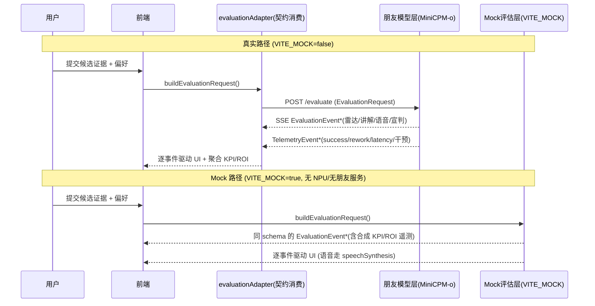
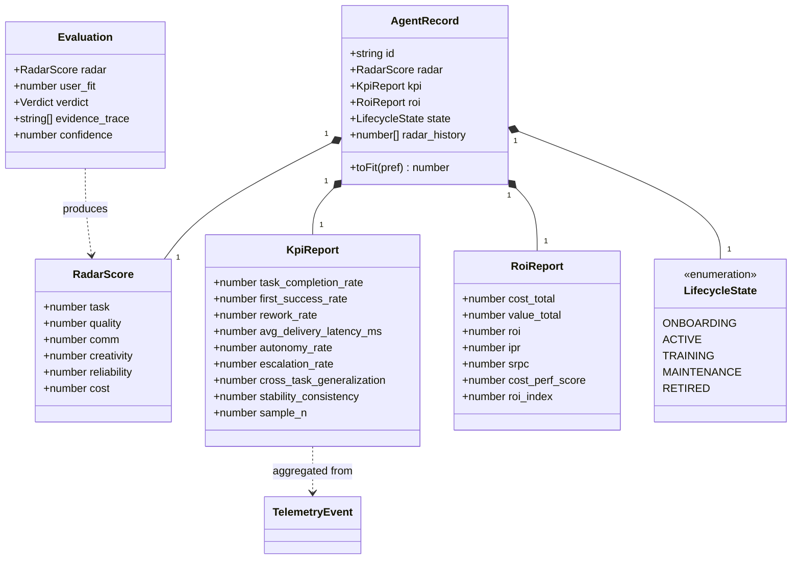
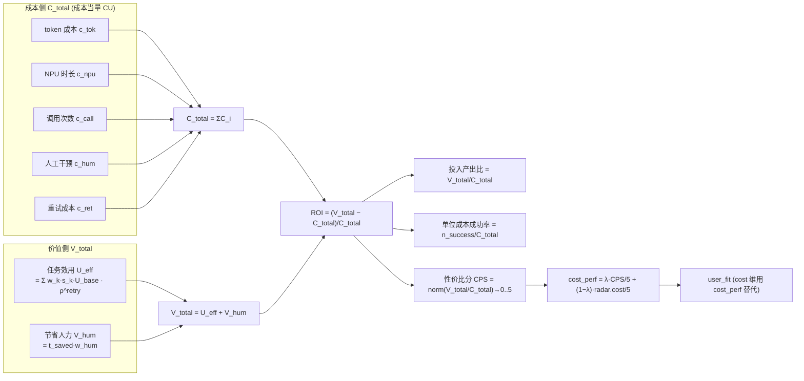
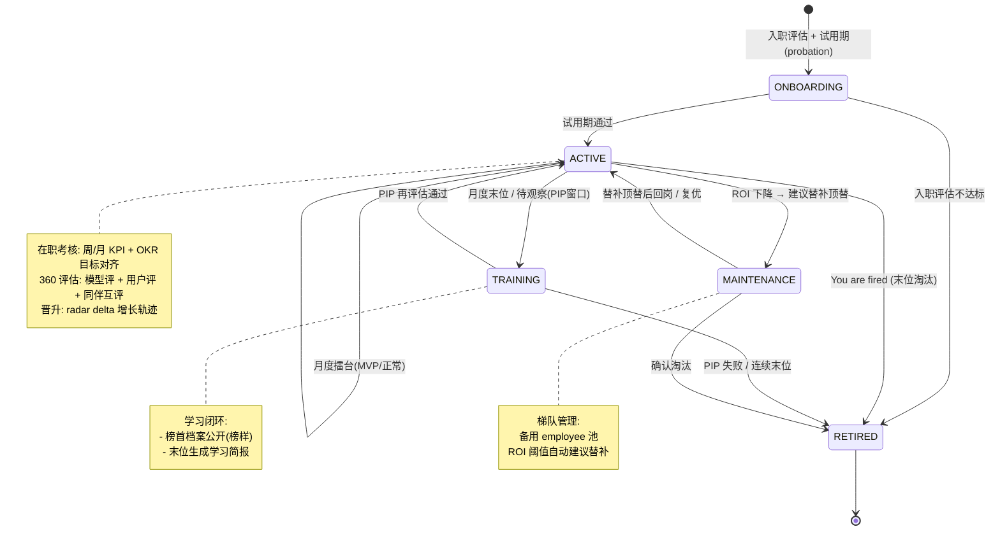
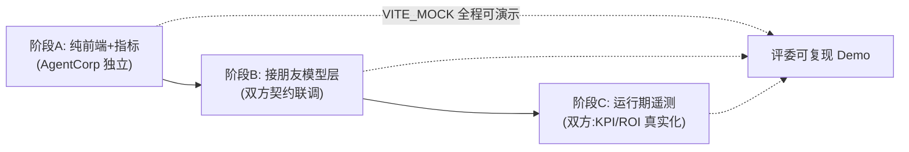

# AgentCorp · 评估子系统设计（架构澄清 + 评估/ROI/职场策略）

> 架构师：高见远（Gao）　|　版本：v0.1-eval　|　日期：2025-07-22
> 配套：PRD v0.1（许清楚）· 架构主文档 v0.1（高见远）
> 前置边界变更：**模型↔agent 的通信与对接（含 MiniCPM-o 真实推理调用、agent 运行时通信）已由另一位开发者（朋友）负责**；本项目（AgentCorp）聚焦**评估指标设计、ROI/效率度量、人类职场评价策略植入、以及承载这些的前端 + 评估编排层**。

---

## 0. 本次设计范围与定位

| 项 | 内容 |
|---|---|
| 设计目标 | 在既有 PRD/架构基础上，**重新厘清职责边界**，并把「评估」从「模型打分」升级为「可量化、可治理、可对话的 HR 评估子系统」 |
| 归朋友（模型-推理层） | MiniCPM-o 4.5 真实推理、跨模态打分、agent 运行时通信/编排、运行时遥测采集与回传 |
| 归 AgentCorp（评估层） | ①评估指标体系（六维 rubric + 量化 KPI 层）②ROI/效率引擎 ③人类职场评价策略引擎（生命周期状态机）④Web 前端与评估编排 |
| 解耦契约 | AgentCorp **单向消费**朋友服务：出参 `EvaluationEvent`（雷达/讲解/语音/宣判），入参 `EvaluationRequest`（证据+偏好）；另加遥测回传流 `TelemetryEvent` 填充客观 KPI/ROI |

> ⚠️ **建议同步更新 `architecture.md`**：本次把原 §2/§3 的 `model-service/*`（FastAPI+evaluator+model_loader+tts）整体划出 AgentCorp 范围，改为「消费朋友模型服务」；相关改动点见 §1.4 与 §5 末尾的「同步更新建议清单」。

---

## 1. 整体软件架构澄清（图示）

### 1.1 分层架构图（职责边界 + 接口契约）

```mermaid
flowchart TB
    %% ===== 层 1: 用户交互层 =====
    subgraph UI层["① 用户交互层 · Web 前端 (AgentCorp 拥有)"]
        U1[多模态简历展示]
        U2[六维雷达 + KPI 看板]
        U3[ROI / healthScore 看板]
        U4[职场生命周期面板 + 月度擂台]
        U5[语音播放(讲解/宣判)]
    end

    %% ===== 层 2: 评估编排层 =====
    subgraph EVAL层["② 评估编排层 · AgentCorp 服务 (纯逻辑, 不含模型推理)"]
        direction LR
        A1["评估指标引擎<br/>metricsEngine.ts"]
        A2["ROI 引擎<br/>roiEngine.ts"]
        A3["职场策略引擎<br/>strategyEngine.ts<br/>(状态机 + HR 机制)"]
        A4["契约适配层<br/>evaluationAdapter.ts<br/>(消费 EvaluationEvent)"]
        A5["Mock 评估层<br/>mockEvaluator.ts"]
    end

    %% ===== 层 3: 模型-推理层 =====
    subgraph MODEL层["③ 模型-推理层 · 朋友负责 (不归本项目代码)"]
        direction LR
        B1["MiniCPM-o 4.5<br/>跨模态推理/打分"]
        B2["Agent 运行时<br/>通信 / 编排"]
        B3["运行时遥测<br/>回传 (telemetry)"]
    end

    %% 依赖方向：AgentCorp 单向消费朋友模型层（解耦）
    A4 -->|"EvaluationRequest ▶ 入参(证据+偏好)"| B1
    B1 -->|"EvaluationEvent ◀ 出参(SSE 雷达/讲解/语音/宣判)"| A4
    B3 -->|"TelemetryEvent: success/rework/latency/干预"| A1
    A4 --> U2
    A1 --> U3
    A2 --> U3
    A3 --> U4
    A5 -.->|"VITE_MOCK: 同 schema 本地生成, 绕过 ③"| U2
    A5 -.-> U5
```

**边界解读**

- **单向依赖、契约解耦**：层 ② 只通过 `EvaluationRequest`（出）→ `EvaluationEvent`（入）与层 ③ 交互，不感知朋友内部是 MindIE / transformers / 原生还是旁路 TTS。朋友内部实现替换不影响 AgentCorp。
- **Mock 独立工作**：`VITE_MOCK=true` 时，层 ② 的 `mockEvaluator` 在本地按**完全相同 schema** 生成 `EvaluationEvent` + 合成 `TelemetryEvent`（含 KPI/ROI 遥测），从而**完全绕过层 ③**，无 NPU、无朋友服务也能演示/开发/评委离线看界面（继承既定 `VITE_MOCK` 设计）。
- **遥测是第二条契约**：除「评估事件流」外，朋友在 agent 运行时把 `TelemetryEvent` 回传给层 ②，用于填充**客观 KPI / ROI**（见 §2.3、§3）。

### 1.2 契约消费时序（真实路径 vs Mock 路径）



### 1.3 契约草案（AgentCorp 视角：消费方定义，朋友实现提供方）

```typescript
// ===== 入参：AgentCorp → 朋友模型层 =====
interface EvaluationRequest {
  candidate: CandidatePayload;     // 多模态证据（URL/base64）
  preference: UserPreference;      // 用户偏好（语音/表单解析所得）
  options?: { temperature?: number; seed?: number; frame_sample?: number };
}

// ===== 出参：朋友模型层 → AgentCorp（SSE 事件流）=====
type EvaluationEvent =
  | { type: "radar_update"; dim: RadarDim; score: number; confidence: number; evidence: string }
  | { type: "narration";   delta: string; is_final: boolean }
  | { type: "audio";       chunk: string; format: "pcm16" | "wav"; sample_rate: number }
  | { type: "verdict";     verdict: Verdict; user_fit: number; evidence_trace: string[]; confidence: number }
  | { type: "done";        evaluation_id: string };

// ===== 第二条契约：运行期遥测回传（朋友→AgentCorp）=====
interface TelemetryEvent {
  agent_id: string;
  task_id: string;
  success: boolean;            // 任务是否成功
  first_try: boolean;          // 是否一次成功
  rework: number;              // 返工次数
  latency_ms: number;          // 交付时延
  human_interventions: number; // 人工介入次数
  escalations: number;         // 升级/求助次数
  out_of_domain: boolean;      // 是否跨域（泛化）任务
  ts: string;                  // ISO8601 UTC
}
```

> 朋友模型层是否回传**结构化六维 JSON** 还是仅自然语言，直接决定 AgentCorp 解析层（`evaluationAdapter`）的设计（见 §6 待明确项 #1）。建议朋友直接回传结构化 `EvaluationEvent`（含六维数值），AgentCorp 不做自然语言反解析。

### 1.4 与既定 `architecture.md` 的边界差异（同步更新建议）

| 既有 architecture.md 位置 | 本次结论（需同步更新） |
|---|---|
| §0 D2「模型服务形态：本地推理服务 Self-hosted」 | 改为「**朋友负责的模型服务**，AgentCorp 仅消费 `EvaluationRequest`/`EvaluationEvent` 契约；Mock 模式保留」 |
| §2 整节「MiniCPM-o serving 形态（A1/A2/A3）」 | 移出 AgentCorp 范围，注明「由朋友开发者负责，AgentCorp 不约束其底层栈」 |
| §3 文件列表 `model-service/*`（serve.py/evaluator.py/model_loader.py/tts.py） | 从 AgentCorp 代码库移除；AgentCorp 新增 `src/engine/*`、`src/services/evaluationAdapter.ts`、`src/services/telemetryAdapter.ts` |
| §4.2 API 契约 | 明确「AgentCorp 为消费方、朋友为提供方」；新增 `TelemetryEvent` 契约 |
| §4.4 Mock 评估模式 | 保留并**扩展**：Mock 同时生成合成 `TelemetryEvent`，使 KPI/ROI 看板在无模型时也可演示 |
| §6 任务列表 T03「模型服务核心」 | T03 移交朋友；AgentCorp 用「T-E 评估引擎」替代（见 §5） |

---

## 2. 评估指标体系设计（核心）

评估指标分两层：**A. 六维能力画像（主观/模型推断的质量分）** 与 **B. 可量化绩效 KPI 层（客观/遥测度量的运营分）**。两者正交、互补，最终在「用户契合度 user_fit」与「ROI」中汇合。

### 2.1 六维画像：可观测信号来源 + 打分 Rubric

> 评分尺度：每维 **0–5（0.5 步进）**，标注「证据来源模态」与「置信度」。模型从多模态证据**推断**该维。

| 维度 | 多模态证据信号（来自简历/演示） | 运行期遥测信号（来自朋友回传） | 用户反馈信号 | 打分 Rubric（evidence → score，定性+定量） |
|---|---|---|---|---|
| ① 任务胜任力 `task` | 代码库可运行性/完整性、视频实操片段、文本 persona 能力声明 | 任务 success 率、一次成功率 | 用户「能/不能解决问题」评价 | ≥3 模态交叉验证 claim≈demo 且遥测 success≥90% → 4.5–5；claim 与 demo 明显不符 → ≤2；无实质证据 → 0.5 |
| ② 产出质量 `quality` | 代码可读性/测试覆盖、作品图精美度、设计稿专业度、语音逻辑性 | 返工率（低=高质量）、交付时延 | 用户对成品满意度 | 成品可直接复用（低 rework、高完成度）→ 4.5+；需大量返工 → ≤2.5 |
| ③ 表达沟通 `comm` | 语音自述清晰度/信息密度、文本结构、视频叙事连贯度 | — | 用户「是否好读懂」反馈 | 结构化自证、信息密度高、无废话 → 4.5+；散乱冗长 → ≤2 |
| ④ 创意差异化 `creativity` | 作品新颖性、差异化定位、是否解决非平凡问题 | 跨域任务解决率（泛化） | 用户「眼前一亮」程度 | 解决非平凡/空白问题、明显差异化 → 4.5+；同质化套模板 → ≤2 |
| ⑤ 可靠性 `reliability` | 多模态一致性（视频 claim 是否在代码/文本兑现）、无自相矛盾 | 多轮一致率、重试次数、降智信号 | 用户复测稳定性反馈 | 一致性高、随机压力追问稳定、retry 少 → 4.5+；漂移/矛盾 → ≤2 |
| ⑥ 性价比 `cost` | 声明预算 vs 实际产出、长期复用价值 | 单位成本成功率、ROI | 用户预算契合 | 预算内且单位成本产出高 → 4.5+；超预算或低效 → ≤2（最终以 §3 `cost_perf` 客观值融合覆盖） |

**Rubric 应用原则**
- 证据映射优先「多模态交叉验证」：claim 与 demo 不一致即降权（缓解 PRD R3 注水）。
- 置信度 `confidence` 随证据模态数与时长提升；单一弱模态证据 → 低置信 + 标注「待复核」。
- 模型推断分（主观）与遥测客观分（§2.3）在 `cost` 维最终融合（见 §3.4）。

### 2.2 六维画像衍生类图（评估子系统类型）



### 2.3 新增「可量化绩效指标层」（与六维画像区分）

> 六维画像 = **能力/质量的主观推断分**；KPI 层 = **运营表现客观度量**。KPI 主要来自朋友通信层 `TelemetryEvent` 回传（客观），少量来自模型评估（泛化）。

| KPI | 定义 / 公式 | 采集来源 | 对应六维（参考） |
|---|---|---|---|
| 任务完成率 `TCR` | `completed / assigned` | 遥测 `success` | task |
| 一次成功率 `FSR` | `first_try_success / assigned` | 遥测 `first_try` | task/quality |
| 返工率 `RR` | `rework_tasks / completed` | 遥测 `rework` | quality/reliability |
| 平均交付时延 `ADL` | `mean(latency_ms)` | 遥测 `latency_ms` | quality |
| 自主完成率 `AR` | `autonomous / completed`（无人工介入） | 遥测 `human_interventions=0` | reliability |
| 升级/求助率 `ER` | `escalation_tasks / assigned` | 遥测 `escalations` | reliability |
| 跨任务泛化率 `CGR` | `out_of_domain_solved / out_of_domain_attempted` | 遥测 `out_of_domain` + 模型评 | creativity |
| 稳定性/多轮一致率 `SCR` | `1 − norm(std(radar over rounds))` | 多次评估 `radar` 漂移 | reliability |

**采集路径**
- 客观 KPI（TCR/FSR/RR/ADL/AR/ER/SCR）→ 全部由朋友通信层 `TelemetryEvent` 回传，AgentCorp `metricsEngine` 聚合，无需模型推断。
- `CGR`（泛化）→ 由朋友在「跨域任务」上跑 agent 并回传 `out_of_domain` 标记，结合 `success` 计算；属于「模型评估 + 遥测」混合。
- 若朋友暂未回传遥测（阶段 A），KPI 由 `mockEvaluator` 合成，保证看板可演示。

---

## 3. ROI / 效率度量模型（超越 token 比较）

用户重点：**ROI 不能只比 token 输入输出**，要覆盖成本全要素与价值全要素。

### 3.1 ROI 公式与数据流图



### 3.2 变量定义与公式

```text
# —— 成本侧：统一折算为「成本当量 CU」（以元为基准，token 亦可折算）——
c_tok  = n_in·p_in + n_out·p_out          # token 成本（输入输出单价）
c_npu  = h_npu · p_npu                     # 计算时长成本（NPU 时 × 单价）
c_call = n_call · p_call                   # 调用次数开销（调度/编排固定开销）
c_hum  = t_hum · w_hum                     # 人工干预成本（介入工时 × 时薪）
c_ret  = Σ_i c_i(retry)                    # 失败重试的额外 CU（含重试 token+时长+人工）
C_total = c_tok + c_npu + c_call + c_hum + c_ret

# —— 价值侧 ——
U_task = Σ_k ( w_k · s_k ) · U_base         # w_k=任务难度权重, s_k=成功度{0,1}
U_eff  = U_task · ρ^(n_retry)              # ρ∈(0,1] 重试效用折损（一次成功 ρ^0=1）
V_hum  = t_saved · w_hum                    # 节省人力时长 × 时薪
V_total = U_eff + V_hum

# —— ROI 主线 ——
ROI     = (V_total − C_total) / C_total     # 投入产出净值率（可为负）
IPR     = V_total / C_total                 # 投入产出比
SRPC    = n_success / C_total               # 单位成本成功率
CPS     = norm_{[0,5]}( V_total / C_total ) # 性价比分（归一化到 0–5）

# —— 归一化 / 跨 agent 可比 ——
W       = { task_type → w∈[0,1] }           # 难度权重表（用户/朋友约定，见 §6）
ROI_idx = ROI_a / ROI_baseline              # 相对基线（baseline=标准 agent/标准任务集）
ROI_norm= (ROI_a − μ_pop)/σ_pop             # 群体标准化 z-score

# —— 与六维「性价比」维融合进 user_fit ——
cost_perf = λ·(CPS/5) + (1−λ)·(radar.cost/5)   # λ 调主观/客观权重
user_fit  = Σ_d ( radar[d]/5 · weight[d] ) × 100%   # cost 维以 cost_perf 替代 radar.cost
```

### 3.3 衍生指标语义

| 指标 | 含义 | 用途 |
|---|---|---|
| `ROI` | 投入产出净值率（可为负，负即「养不起」） | 梯队管理核心阈值（ROI<0 触发替补建议） |
| `IPR` 投入产出比 | 每 1CU 成本换回多少价值 | 横向排序 |
| `SRPC` 单位成本成功率 | 每 CU 换来几次成功任务 | 性价比代理，抗「重试刷分」 |
| `CPS` 性价比分 | 归一化 0–5 的客观性价比 | 融合进六维 `cost` 维 |

### 3.4 与六维「性价比」维的关系（重点）

- **六维 `cost` 维**：模型**主观推断**的「预算内产出比/单位成本价值」（基于简历声明与演示）。
- **ROI / `CPS`**：**客观度量**，基于真实 token/时长/重试/效用。
- **融合**：`cost_perf = λ·(CPS/5) + (1−λ)·(radar.cost/5)`，最终进入 `user_fit` 的 `cost` 维。这样既保留模型主观判断，又用客观 ROI 纠偏（缓解 PRD R1 元评估降智、R2 成本超限）。
- `λ` 默认 0.5，可在「重客观审计」场景调高（如治理者视图 λ=0.8）。

### 3.5 归一化与跨 agent 横向可比

- **难度权重表 `W`**：不同任务类型赋不同权重（如「端到端交付」w=1.0，「单步问答」w=0.3），使异构任务效用可比。
- **标准基线 `ROI_baseline`**：以固定样本集 + 标准 agent 跑出的 ROI 作为锚，计算 `ROI_idx`，消除绝对成本随环境漂移的影响（缓解 PRD R5 归因谬误）。
- **群体标准化 `ROI_norm`**：多 agent 同台擂台时用 z-score，使「末位淘汰」有统计意义。

---

## 4. 人类职场评价策略植入（重点）

把真实 HR 机制**映射**到 agent 生命周期，使「选/用/育/留/汰」在系统中可计算、可呈现。

### 4.1 HR 机制 → agent 生命周期映射表

| # | 人类职场机制 | agent 生命周期映射 | 前端/数据体现 |
|---|---|---|---|
| 1 | 入职评估 | 六维雷达 + 试用期 `probation` | `ONBOARDING` 状态；试用期窗口内低权重考核 |
| 2 | 在职考核（周/月 KPI） | 周期化 KPI 采集 + OKR 式目标对齐 | KPI 看板按周期刷新；目标对齐用 `weight` 偏好 |
| 3 | 360 评估 | 模型评 + 用户评 + 同伴 agent 互评（peer benchmark） | `radar`（模型评）+ 用户打分 + 同任务集同伴排名 |
| 4 | 绩效周期（月度擂台） | 月度排名 MVP / 待观察 / 末位 | `Leaderboard` 组件：MVP/正常/末位分区 |
| 5 | 晋升 / 降级 | 能力增长轨迹（`radar` 随时间的 delta） | `radar_history` 趋势线；delta>阈值→晋升建议 |
| 6 | PIP（绩效改进计划） | 待观察 agent 的再评估窗口 | `TRAINING` 状态 + 再评估倒计时 |
| 7 | 裁员 | You are fired（末位淘汰） | `RETIRED` 状态 + 语音宣判「You are fired」 |
| 8 | 学习闭环 | 榜首档案公开 + 末位生成学习简报 | 榜首 `AgentRecord` 公开榜样；末位自动生成简报 |
| 9 | 梯队管理 | 备用 employee 顶替（ROI 下降自动建议替补） | `MAINTENANCE` 备用池 + ROI 阈值触发替补建议 |

### 4.2 职场生命周期状态机



### 4.3 状态机与数据的对应（AgentCorp 内部）

- `strategyEngine` 持有每个 agent 的 `LifecycleState` 与触发规则（阈值来自 PRD 的 MVP/OBSERVE/FIRED + 本设计的 ROI/KPI 阈值）。
- 状态迁移事件驱动前端（`LifecyclePanel` / `Leaderboard` / 语音宣判）。
- 与 ClawCorp 概念对齐：`active/training/onboarding/maintenance/retired` 五态直接复用其健康分（healthScore）思路——本项目中 `healthScore ≈ f(ROI_norm, SCR, reliability)`。

---

## 5. 实现路径（分阶段，标注归属）

| 阶段 | 目标 | 归属 | 关键文件（复用 T01–T05，标注新增/修改） |
|---|---|---|---|
| **A. 纯前端 + 指标计算（无需模型）** | 六维雷达 UI、KPI 采集契约、ROI 引擎、职场状态机、Mock 数据驱动 | **AgentCorp** | 修改 `src/types/index.ts`（+KpiReport/RoiReport/LifecycleState/TelemetryEvent）；修改 `src/utils/radar.ts`（cost_perf 融合）；**新增** `src/engine/metricsEngine.ts`、`src/engine/roiEngine.ts`、`src/engine/strategyEngine.ts`；修改 `src/mock/samples.ts`（合成 KPI/ROI/遥测）；**新增** `src/components/RoiDashboard.tsx`、`src/components/LifecyclePanel.tsx`、`src/components/Leaderboard.tsx` |
| **B. 接朋友模型层** | `EvaluationRequest/Event` 契约对接朋友 MiniCPM-o 推理；语音 TTS 由模型层或旁路提供 | **接口联调（双方）** | **新增** `src/services/evaluationAdapter.ts`（消费 EvaluationEvent）；修改 `src/services/api.ts`（指向朋友服务 base，契约对齐）；修改 `src/services/mockEvaluator.ts`（schema 对齐 EvaluationEvent）；语音走 `useSpeech`（真实 audio 事件 / Mock speechSynthesis） |
| **C. 运行期遥测** | 朋友通信层回传 `success/rework/latency/干预`，填充客观 KPI/ROI | **双方** | **新增** `src/services/telemetryAdapter.ts`（接收/缓冲 TelemetryEvent）；修改 `src/engine/metricsEngine.ts`、`src/engine/roiEngine.ts`（接入真实遥测）；修改 `src/store/useAppStore.ts`（telemetry 聚合态） |

### 5.1 阶段流程图



### 5.2 AgentCorp 重定任务视图（替代原 T03）

| 任务 ID | 任务名 | 源文件（≥3） | 依赖 | 优先级 | 归属 |
|---|---|---|---|---|---|
| **T-A** | 评估前端基础设施（配置+入口+依赖，移除 model-service） | `package.json`, `vite.config.ts`, `tailwind.config.js`, `tsconfig.json`, `index.html`, `src/main.tsx`, `src/App.tsx` | — | P0 | AgentCorp |
| **T-B** | 评估类型与契约层（消费方定义） | `src/types/index.ts`, `src/config.ts`, `src/store/useAppStore.ts`, `src/utils/radar.ts` | T-A | P0 | AgentCorp |
| **T-C** | 评估引擎层（**新增**，替代原 T03 模型服务） | `src/engine/metricsEngine.ts`, `src/engine/roiEngine.ts`, `src/engine/strategyEngine.ts`, `src/services/evaluationAdapter.ts`, `src/services/telemetryAdapter.ts` | T-B | P0 | AgentCorp |
| **T-D** | 评估前端组件（展示层扩展） | `src/components/RadarChart.tsx`, `src/components/RoiDashboard.tsx`, `src/components/LifecyclePanel.tsx`, `src/components/Leaderboard.tsx`, `src/components/FitScore.tsx` | T-B | P0 | AgentCorp |
| **T-E** | 评估集成与编排（消费朋友契约 + Mock） | `src/services/api.ts`, `src/services/mockEvaluator.ts`, `src/hooks/useEvaluation.ts`, `src/hooks/useUserPreference.ts`, `src/hooks/useSpeech.ts` | T-B, T-C, T-D | P0 | AgentCorp |

> 原 `model-service/*`（T03）整体移交朋友开发者；AgentCorp 不再包含模型推理代码，仅通过 T-C 的 `evaluationAdapter` 消费其输出。

---

## 6. 待明确项

1. **朋友模型层暴露的接口形态**：REST？gRPC？SSE？建议沿用既定 SSE（`EvaluationEvent` 流），因其天然适配「雷达逐维点亮 + 讲解 + 语音」三路并行。遥测数据格式需约定（`TelemetryEvent` 草案见 §1.3）。**关键点**：朋友是否回传**结构化六维 JSON** 还是仅自然语言 —— 若仅自然语言，AgentCorp 需增加 NL→结构解析层（不推荐，建议结构化直出）。
2. **ROI 中「任务效用 `U_base` / 难度权重表 `W`」如何量化**：需与用户/朋友约定「标准任务集 + 每类任务难度权重 + 单位效用基准」，这是 ROI 横向可比的前提（见 §3.5）。
3. **遥测回传频率与通道**：实时 SSE 旁路流 vs 周期批回传？影响 KPI 看板刷新粒度。
4. **healthScore 公式归属**：`healthScore ≈ f(ROI_norm, SCR, reliability)` 的具体权重，建议阶段 C 与用户约定。
5. **语音 TTS 提供方**：由朋友模型层原生/旁路提供，还是 AgentCorp 侧 Web Speech 兜底（Mock 已用后者）——需阶段 B 联调明确。

---

*— 评估子系统设计 v0.1-eval 完。边界变更：模型推理/agent 通信归朋友；AgentCorp 聚焦评估指标/ROI/职场策略/前端+评估编排。建议同步更新 `architecture.md` §0 D2、§2、§3、§4.2、§4.4、§6（详见 §1.4、§5.2）。*
