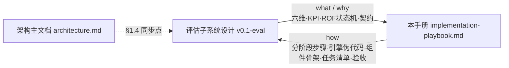
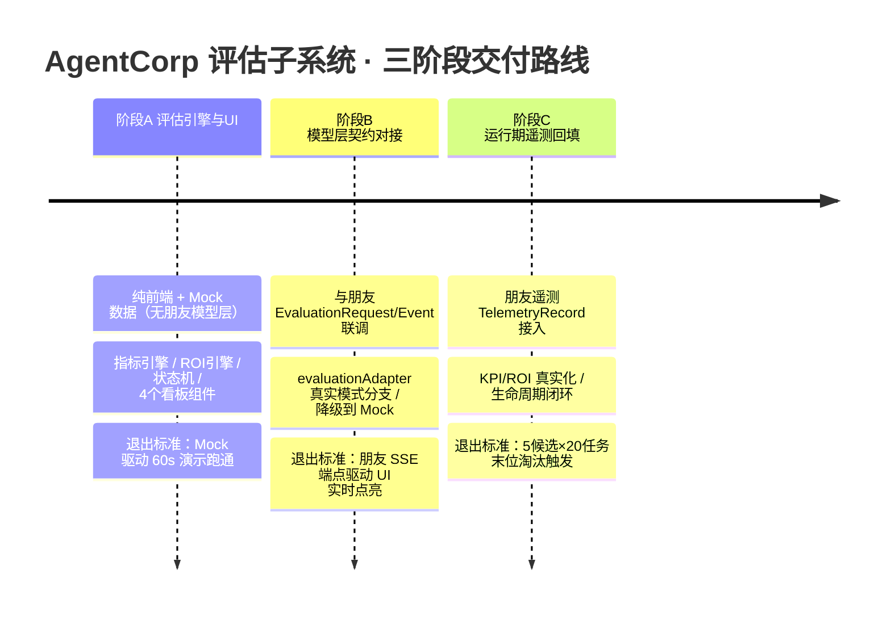
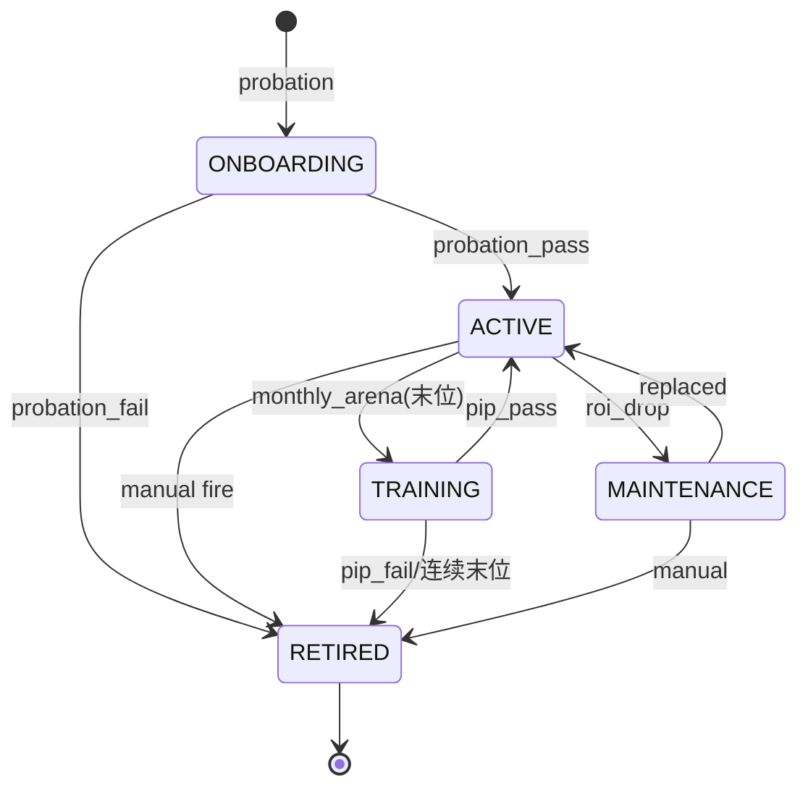
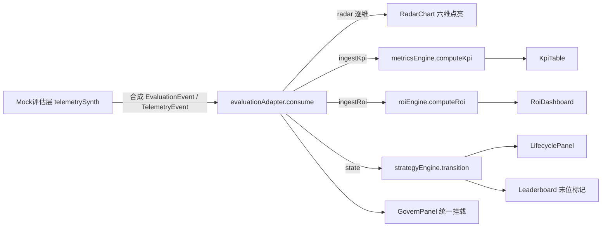
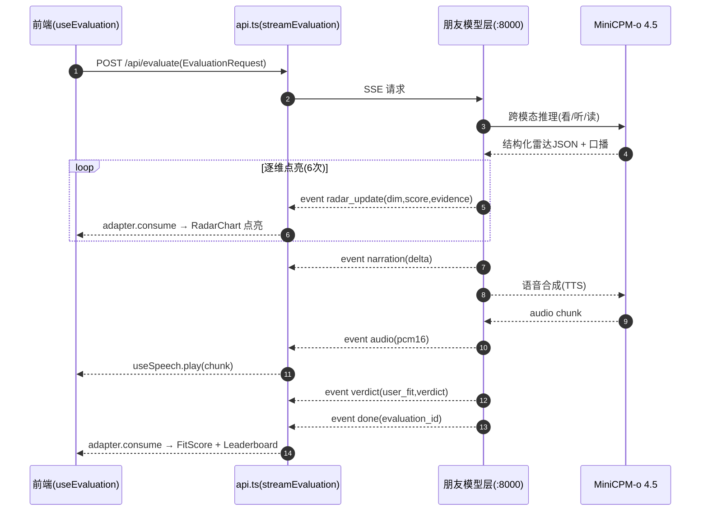
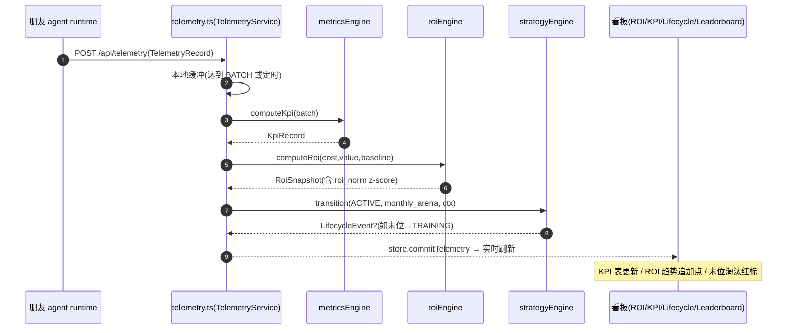
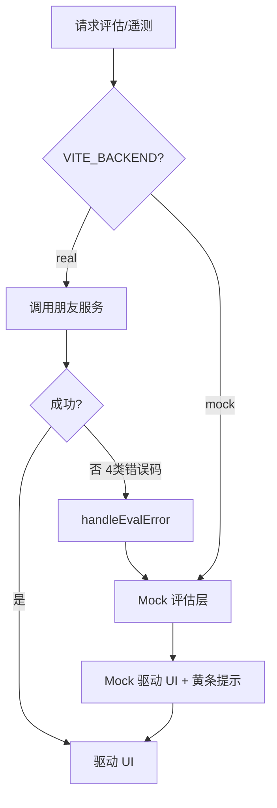

# AgentCorp · 评估Agent子系统阶段实施手册（Implementation Playbook）

> 作者：Us　|　版本：v0.1-playbook　|　日期：2025-07-22
> 配套：PRD v0.1· 架构主文档 v0.1· 评估子系统设计 v0.1-eval
> 本文件是 **「how」**：把评估子系统设计 §5 的简短 points 展开为**可分配、可验收、可演示**的三阶段实施路线图。

---

## 0. 文档目的与读者

本文档不复述「为什么这么设计」（那是 `evaluation-design.md` 的职责），而是回答 **「具体怎么做、按什么顺序、做到什么程度算完」**。

### 0.1 读者与关注点

| 读者 | 关注点 | 读完能做什么 |
|---|---|---|
| **前端/评估层开发者（AgentCorp 侧）** | 每阶段要建哪些文件、函数签名长什么样、组件 props 怎么定、Mock 怎么造数据 | 无模型也能独立开工；按 §2/§3/§4 的任务清单逐日交付 |
| **对接方（朋友，模型-推理层）** | `EvaluationRequest` / `EvaluationEvent` / `TelemetryRecord` 的字段与示例、联调脚本、错误码 | 按 §3 契约实现 SSE 端点；用 §3.5 的 curl 脚本自测契约 |
| **评审 / 评委** | 每个阶段结束能演示什么、退出标准、`IS_PASS` 清单 | 在每个里程碑节点验收，确认「可复现 Demo」达标 |
| **主理人 / PM** | 里程碑节奏、工时与风险、与既有 `architecture.md` 的同步改动 | 排期、分人、决策是否进入下一阶段 |

### 0.2 与 `evaluation-design.md` 的关系



- **设计文档（what/why）**：定义指标体系、ROI 公式、HR 生命周期状态机、AgentCorp 与朋友的契约边界。
- **本手册（how）**：把设计落成**步骤 + 代码骨架 + 任务颗粒度 + 验收门槛**，可直接派活。

---

## 1. 总体策略与里程碑

### 1.1 核心策略：**契约优先、Mock 驱动、三阶段解耦**

评估子系统与朋友的模型-推理层通过契约解耦。AgentCorp 侧在**完全没有真实模型**的情况下，用确定性 Mock 数据把「评估引擎 + 看板」整体跑通（阶段 A）；随后再与朋友做契约联调（阶段 B）；最后把运行期遥测接成闭环（阶段 C）。三阶段都可独立演示，且阶段 A 的产出是 B/C 的稳定基座。

### 1.2 路线图总览（Mermaid timeline）



### 1.3 分阶段目标 / 依赖 / 产物 / 退出标准

| 阶段 | 目标 | 前置依赖 | 可演示产物 | 退出标准（`IS_PASS`） |
|---|---|---|---|---|
| **A. 评估引擎与 UI（独立）** | 没有真实模型，把评估子系统本身跑通：六维雷达→KPI→ROI→生命周期→擂台 | 无（纯前端 + Mock） | `RoiDashboard` / `KpiTable` / `LifecyclePanel` / `Leaderboard` 四组件 + 60s Mock 演示脚本 | 见 §2.9 的 `IS_PASS_A` |
| **B. 模型层契约对接** | 与朋友模型层（MiniCPM-o 推理 + agent 通信）接通，真实推理事件流进入 AgentCorp | 阶段 A 的引擎/适配层/Mock 已实现 | `VITE_BACKEND=real` 下朋友 SSE 端点驱动全套 UI | 见 §3.7 的 `IS_PASS_B` |
| **C. 运行期遥测回填** | 朋友的 agent 运行时遥测接进 ROI 引擎与状态机，形成闭环 | 阶段 A 引擎 + 阶段 B 契约 | 真实遥测驱动 KPI/ROI 趋势刷新 + 末位淘汰自动触发 | 见 §4.6 的 `IS_PASS_C` |

> **关键不变量**：无论处于哪个阶段，`VITE_BACKEND=mock` 始终可用——真实模式挂掉时自动回退 Mock（见 §5.2），前端永远可演示、可复现。

---

## 2. 阶段 A：评估引擎与 UI（详细实施方案）

### 2.1 目标

在没有真实模型、没有朋友服务的前提下，把**评估子系统本身**完整跑通：
- 六维雷达（来自 Mock 的 `EvaluationEvent`）→ 客观 KPI（来自合成 `TelemetryEvent`）→ ROI/IPR/CPS → 生命周期状态机 → 月度擂台（MVP/末位淘汰）。
- 全部由 `src/mock/telemetrySynth.ts` 确定性合成数据驱动，UI 看起来「像真有数据在跑」。

### 2.2 数据契约（TypeScript 接口，与后端 `schemas.py` 镜像）

> 单一真相源：`src/types/index.ts`。以下接口为阶段 A 新增，后端 `schemas.py` 须严格镜像字段名与类型。

#### 2.2.1 `KpiRecord` —— 可量化绩效指标（客观，聚合自遥测）

```typescript
// src/types/index.ts（节选）
export type LifecycleState =
  | "ONBOARDING" | "ACTIVE" | "TRAINING" | "MAINTENANCE" | "RETIRED";

export interface KpiRecord {
  agentId: string;
  task_completion_rate: number;     // TCR  0–1
  first_success_rate: number;        // FSR  0–1
  rework_rate: number;              // RR   0–1
  avg_delivery_latency_ms: number;  // ADL  ms
  autonomy_rate: number;            // AR   0–1
  escalation_rate: number;          // ER   0–1
  cross_task_generalization: number;// CGR  0–1
  stability_consistency: number;     // SCR  0–1
  sample_n: number;                 // 参与聚合的遥测条数
  window: string;                   // 考核窗口，如 "2025-W30"
  computedAt: string;               // ISO8601 UTC
}
```

**JSON 示例：**
```json
{
  "agentId": "candidate-02",
  "task_completion_rate": 0.92,
  "first_success_rate": 0.78,
  "rework_rate": 0.11,
  "avg_delivery_latency_ms": 1840,
  "autonomy_rate": 0.85,
  "escalation_rate": 0.06,
  "cross_task_generalization": 0.64,
  "stability_consistency": 0.88,
  "sample_n": 20,
  "window": "2025-W30",
  "computedAt": "2025-07-22T09:30:00Z"
}
```

#### 2.2.2 `RoiSnapshot` —— ROI/效率快照

```typescript
export interface RoiSnapshot {
  agentId: string;
  cost_total: number;          // C_total 成本当量 CU
  value_total: number;         // V_total CU
  roi: number;                 // (V−C)/C，可为负
  ipr: number;                 // V/C 投入产出比
  srpc: number;                // 单位成本成功率 = n_success/C
  cost_perf_score: number;     // 0–5 性价比分（CPS 与雷达 cost 维融合）
  roi_index: number;           // 相对基线 ROI_baseline
  roi_norm?: number;           // 群体 z-score（有对照群时填充）
  window: string;
}
```

**JSON 示例：**
```json
{
  "agentId": "candidate-02",
  "cost_total": 42.5,
  "value_total": 118.3,
  "roi": 1.78,
  "ipr": 2.78,
  "srpc": 0.47,
  "cost_perf_score": 4.1,
  "roi_index": 1.22,
  "roi_norm": 0.84,
  "window": "2025-W30"
}
```

#### 2.2.3 `LifecycleEvent` —— 生命周期迁移事件

```typescript
export type LifecycleTrigger =
  | "probation_pass" | "probation_fail"
  | "monthly_arena" | "pip_pass" | "pip_fail"
  | "roi_drop" | "replaced" | "manual";

export interface LifecycleEvent {
  agentId: string;
  from: LifecycleState;
  to: LifecycleState;
  reason: string;             // 人类可读触发原因（可语音播报）
  trigger: LifecycleTrigger;
  ts: string;                 // ISO8601 UTC
}
```

**JSON 示例：**
```json
{
  "agentId": "candidate-03",
  "from": "ACTIVE",
  "to": "TRAINING",
  "reason": "月度擂台末位（fit 41%，连续 1 期垫底）",
  "trigger": "monthly_arena",
  "ts": "2025-07-22T10:00:00Z"
}
```

#### 2.2.4 `LeaderboardEntry` —— 擂台排名条目（含末位淘汰标记）

```typescript
export type LeaderboardTier = "MVP" | "NORMAL" | "BOTTOM";

export interface LeaderboardEntry {
  agentId: string;
  name: string;
  rank: number;
  user_fit: number;            // 0–100 用户契合度
  roi_norm: number;            // z-score，末位判定依据
  state: LifecycleState;
  tier: LeaderboardTier;       // MVP / NORMAL / BOTTOM（末位淘汰标记）
  radar_delta?: number;         // 能力增长轨迹（晋升依据）
}
```

**JSON 示例：**
```json
[
  { "agentId": "candidate-01", "name": "Aurora", "rank": 1, "user_fit": 92, "roi_norm": 1.31, "state": "ACTIVE", "tier": "MVP" },
  { "agentId": "candidate-02", "name": "Bolt",   "rank": 2, "user_fit": 78, "roi_norm": 0.84, "state": "ACTIVE", "tier": "NORMAL" },
  { "agentId": "candidate-03", "name": "Cyrus",  "rank": 3, "user_fit": 41, "roi_norm": -2.15, "state": "TRAINING", "tier": "BOTTOM" }
]
```

### 2.3 引擎实现一：`src/engine/metricsEngine.ts`

**职责**：把 `TelemetryEvent[]`（真实或合成）聚合为 `KpiRecord`；把多次 `RadarScore` 聚合为稳定性 `SCR`。纯函数、无副作用、可单测。

#### 2.3.1 函数签名与算法

| 函数 | 签名 | 输入 | 输出 |
|---|---|---|---|
| `computeKpi` | `(events: TelemetryEvent[], window: string): KpiRecord` | 单 agent 的遥测数组 | 聚合 KPI |
| `taskCompletionRate` | `(e: TelemetryEvent[]): number` | 遥测 | TCR |
| `firstSuccessRate` | `(e: TelemetryEvent[]): number` | 遥测 | FSR |
| `reworkRate` | `(e: TelemetryEvent[]): number` | 遥测 | RR |
| `avgLatency` | `(e: TelemetryEvent[]): number` | 遥测 | ADL(ms) |
| `autonomyRate` | `(e: TelemetryEvent[]): number` | 遥测 | AR |
| `escalationRate` | `(e: TelemetryEvent[]): number` | 遥测 | ER |
| `crossGen` | `(e: TelemetryEvent[]): number` | 遥测 | CGR |
| `stability` | `(radars: RadarScore[]): number` | 多轮雷达 | SCR |

**核心伪代码：**
```
function computeKpi(events, window):
    n = events.length
    completed = events.filter(e => e.success).length
    firstTry = events.filter(e => e.first_try && e.success).length
    reworked = events.filter(e => e.rework > 0).length
    lat = mean(events.map(e => e.latency_ms))
    auto = events.filter(e => e.human_interventions == 0).length
    esc  = events.filter(e => e.escalations > 0).length
    ood  = events.filter(e => e.out_of_domain)
    oodSolved = ood.filter(e => e.success).length

    return KpiRecord{
        task_completion_rate : completed / n,
        first_success_rate   : firstTry / n,
        rework_rate          : reworked / completed,        // 失败不计入返工分母
        avg_delivery_latency_ms : lat,
        autonomy_rate        : auto / completed,
        escalation_rate      : esc / n,
        cross_task_generalization : ood.length ? oodSolved / ood.length : 0,
        stability_consistency : stability(radarHistory),
        sample_n             : n,
        window, computedAt: nowUTC()
    }

function stability(radars):           // SCR = 1 − norm(std over rounds)
    if radars.length < 2: return 1.0
    perDim = group radars by dim, compute std per dim
    avgStd = mean(perDim.map(std))
    return clamp(1 - avgStd/5, 0, 1) // 漂移越小越稳定
```

### 2.4 引擎实现二：`src/engine/roiEngine.ts`

**职责**：把成本五要素 + 价值两要素折算为 ROI/IPR/CPS，并做跨 agent 归一化（z-score）。

#### 2.4.1 成本与价值口径

| 要素 | 字段 | 公式 |
|---|---|---|
| token 成本 | `c_tok` | `n_in·p_in + n_out·p_out` |
| NPU 时长 | `c_npu` | `h_npu · p_npu` |
| 调用次数 | `c_call` | `n_call · p_call` |
| 人工干预 | `c_hum` | `t_hum · w_hum` |
| 重试成本 | `c_ret` | `Σ c_i(retry)` |
| 任务效用 | `U_eff` | `Σ(w_k·s_k)·U_base · ρ^retry` |
| 节省人力 | `V_hum` | `t_saved · w_hum` |

#### 2.4.2 函数与伪代码

| 函数 | 签名 | 说明 |
|---|---|---|
| `computeRoi` | `(cost: CostInput, value: ValueInput, baseline: number): RoiSnapshot` | 主线计算 |
| `normCps` | `(ipr: number, refMax=5): number` | IPR→0–5 归一化 |
| `zscore` | `(pop: number[], x: number): number` | 群体标准化 |

```
function computeRoi(cost, value, baseline):
    C_total = cost.c_tok + cost.c_npu + cost.c_call + cost.c_hum + cost.c_ret
    U_task  = sum(k => cost.weight[k] * value.success[k]) * value.U_base
    U_eff   = U_task * (value.rho ** value.n_retry)
    V_total = U_eff + value.V_hum
    ROI = (V_total - C_total) / C_total
    IPR = V_total / C_total
    SRPC = value.n_success / C_total
    CPS = normCps(IPR)                       // → 0–5
    roi_index  = ROI / baseline              // 相对标准 agent
    roi_norm   = zscore(population, ROI)     // 擂台对照时填
    return RoiSnapshot{...}

function normCps(ipr, refMax=5):
    return clamp(ipr / refMax * 5, 0, 5)   // IPR=5 → 5.0 封顶

function zscore(pop, x):
    μ = mean(pop); σ = std(pop) || 1e-9
    return (x - μ) / σ
```

### 2.5 引擎实现三：`src/engine/strategyEngine.ts`

**职责**：HR 生命周期状态机。持有每个 agent 的 `LifecycleState` 与迁移规则；输入 `LifecycleTrigger` + 上下文（rank、roi_norm、reEval 分）→ 输出目标状态 + 产生的 `LifecycleEvent`。

#### 2.5.1 状态转换函数表（含守卫条件）

| 当前态 | 触发 `trigger` | 守卫 `guard` | 目标态 | 含义 |
|---|---|---|---|---|
| `ONBOARDING` | `probation_pass` | `evalScore ≥ 3.0` | `ACTIVE` | 试用期通过入职 |
| `ONBOARDING` | `probation_fail` | `evalScore < 3.0` | `RETIRED` | 入职不达标 |
| `ACTIVE` | `monthly_arena` | `rank == 1` | `ACTIVE` | MVP（留岗+徽章） |
| `ACTIVE` | `monthly_arena` | `rank == last && !consecutive` | `TRAINING` | 月度末位→PIP |
| `ACTIVE` | `roi_drop` | `roi_norm < -1.5` | `MAINTENANCE` | ROI 骤降→建议替补 |
| `ACTIVE` | `manual` | `fire==true` | `RETIRED` | 一键 fire |
| `TRAINING` | `pip_pass` | `reEval ≥ 3.0` | `ACTIVE` | PIP 通过回岗 |
| `TRAINING` | `pip_fail` \| `monthly_arena` | 连续 2 期末位 | `RETIRED` | PIP 失败/连续垫底 |
| `MAINTENANCE` | `replaced` | 替补 ROI 恢复 | `ACTIVE` | 顶替后复优 |
| `MAINTENANCE` | `manual` | 确认淘汰 | `RETIRED` | 确认裁员 |

#### 2.5.2 核心函数签名与伪代码

```typescript
export interface StrategyContext {
  agentId: string;
  rank: number;        // 擂台名次（1=榜首）
  totalCandidates: number;
  roi_norm: number;    // z-score
  consecutiveBottom: number;
  reEvalScore?: number; // PIP 再评估分
  evalScore?: number;  // 入职评估分
}

export function transition(
  state: LifecycleState,
  trigger: LifecycleTrigger,
  ctx: StrategyContext
): { to: LifecycleState; event: LifecycleEvent };
```

```
function transition(state, trigger, ctx):
    rule = TRANSITIONS[state].find(r => r.trigger===trigger && r.guard(ctx))
    if !rule: return { to: state, event: null }   // 无合法迁移，保持
    to = rule.to
    event = LifecycleEvent{
        agentId: ctx.agentId, from: state, to,
        reason: rule.reason(ctx), trigger, ts: nowUTC()
    }
    return { to, event }
```

> 状态机视图（与 §4.2 对齐，便于组件直接渲染）：


### 2.6 引擎实现四：`src/engine/evaluationAdapter.ts`

**职责**：把 `EvaluationEvent` 流（来自 Mock 或真实 SSE）**增量转换**为内部状态（`RadarScore` 逐维点亮、`KpiRecord`、`RoiSnapshot`、`LifecycleState`）。

```typescript
export class EvaluationAdapter {
  private radar: Partial<RadarScore> = {};
  private kpi?: KpiRecord;
  private roi?: RoiSnapshot;
  private state: LifecycleState = "ONBOARDING";

  /** 消费一个评估事件，返回需要 UI 刷新的切片 */
  consume(ev: EvaluationEvent): AdapterDelta {
    switch (ev.type) {
      case "radar_update":
        this.radar[ev.dim] = ev.score;          // 逐维点亮
        return { kind: "radar", dim: ev.dim, score: ev.score };
      case "verdict":
        this.state = this.applyVerdict(ev);       // 入职→ACTIVE/RETIRED
        return { kind: "verdict", verdict: ev.verdict, fit: ev.user_fit };
      case "done":
        return { kind: "done" };
      default:
        return { kind: "noop" };                // narration/audio 走语音通道
    }
  }

  /** 阶段 C 用：把聚合后的 KPI/ROI 灌入 */
  ingestKpi(kpi: KpiRecord) { this.kpi = kpi; }
  ingestRoi(roi: RoiSnapshot) { this.roi = roi; }

  snapshot() { return { radar: this.radar, kpi: this.kpi, roi: this.roi, state: this.state }; }
}
```

### 2.7 合成数据生成器：`src/mock/telemetrySynth.ts`

**职责**：用**确定性随机数种子**（mulberry32）合成 KPI 时序、ROI 趋势、生命周期事件流，让阶段 A 的 UI「看起来像真有数据在跑」，且可复现（缓解 PRD R4 漂移）。

```typescript
// 确定性 RNG：同一 seed → 同一序列（演示可复现）
function mulberry32(seed: number): () => number {
  return () => {
    seed |= 0; seed = (seed + 0x6D2B79F5) | 0;
    let t = Math.imul(seed ^ (seed >>> 15), 1 | seed);
    t = (t + Math.imul(t ^ (t >>> 7), 61 | t)) ^ t;
    return ((t ^ (t >>> 14)) >>> 0) / 4294967296;
  };
}

/** 为一个候选合成 N 条遥测（seed = hash(agentId) 保证稳定） */
export function synthTelemetry(agentId: string, n = 20): TelemetryEvent[] {
  const rng = mulberry32(hash(agentId));
  return Array.from({ length: n }, (_, i) => ({
    agent_id: agentId, task_id: `${agentId}-t${i}`,
    success: rng() > 0.12,
    first_try: rng() > 0.30,
    rework: rng() > 0.8 ? 1 : 0,
    latency_ms: 800 + Math.floor(rng() * 3000),
    human_interventions: rng() > 0.85 ? 1 : 0,
    escalations: rng() > 0.92 ? 1 : 0,
    out_of_domain: rng() > 0.7,
    ts: isoNowMinus(i * 3600_000),
  }));
}

/** 合成一条 ROI 趋势（12 个窗口，含轻微衰减模拟 ROI 下降告警） */
export function synthRoiTrend(agentId: string, weeks = 12): RoiSnapshot[] { /* ... */ }
```

> 配套更新 `src/mock/samples.ts`：为固定样本集每个候选预置 `radar` / `preference` / `telemetry` fixture，使 `RoiDashboard` 首屏即有数据。

### 2.8 新组件（props / state / 渲染骨架 / 事件）

#### 2.8.1 `RoiDashboard.tsx` —— 成本/价值/ROI 大数字 + 趋势 sparkline

| 项 | 内容 |
|---|---|
| **props** | `{ snapshot: RoiSnapshot; trend?: RoiSnapshot[]; lambda?: number }` |
| **state** | `hoverMetric: "roi" \| "cost" \| "value"` |
| **渲染骨架** | 顶部三张大数字卡（ROI / 成本 / 价值）；中部 sparkline（recharts `<LineChart>`）；底部 CPS 进度条 + IPR/SRPC 小字 |
| **事件** | `onToggleMetric(m)` 切换高亮；`onOpenDetail()` 打开 ROI 归因抽屉 |

```tsx
export function RoiDashboard({ snapshot, trend, lambda = 0.5 }: RoiDashboardProps) {
  return (
    <section className="grid grid-cols-3 gap-3">
      <MetricCard label="ROI" value={snapshot.roi} tone={snapshot.roi < 0 ? "danger" : "good"} />
      <MetricCard label="成本 CU" value={snapshot.cost_total} />
      <MetricCard label="价值 CU" value={snapshot.value_total} />
      <Sparkline data={trend ?? []} metric="roi" />
      <CpsBar score={snapshot.cost_perf_score} lambda={lambda} />
    </section>
  );
}
```

#### 2.8.2 `KpiTable.tsx` —— 8 项 KPI 网格

| 项 | 内容 |
|---|---|
| **props** | `{ kpi: KpiRecord }` |
| **state** | `sortKey: keyof KpiRecord` |
| **渲染骨架** | 8 格卡片：TCR / FSR / RR / ADL / AR / ER / CGR / SCR；百分比/毫秒自适应格式化；低于阈值的格标红 |
| **事件** | `onHover(k)` 显示该 KPI 的定义 tooltip |

#### 2.8.3 `LifecyclePanel.tsx` —— 状态机视图 + 当前状态/历史时间线

| 项 | 内容 |
|---|---|
| **props** | `{ agentId: string; current: LifecycleState; history: LifecycleEvent[] }` |
| **state** | `selectedEvent?: LifecycleEvent` |
| **渲染骨架** | 左侧五态横向流程图（高亮当前态，箭头用 §2.5.2 状态机）；右侧时间线（历史事件 + reason + ts） |
| **事件** | `onSelectEvent(e)` 展示迁移原因；`onFire()` 触发 manual→RETIRED（阶段 B/C 接语音宣判） |

#### 2.8.4 `Leaderboard.tsx` —— 排名列表 + 末位淘汰标记

| 项 | 内容 |
|---|---|
| **props** | `{ entries: LeaderboardEntry[] }` |
| **state** | `sortBy: "fit" \| "roi" \| "rank"`（默认 rank） |
| **渲染骨架** | 列表每行：名次徽章、name、fit 进度条、roi_norm 小字；`tier==="MVP"` 金色边框，`tier==="BOTTOM"` 红色「末位·待观察」标记 |
| **事件** | `onPick(id)` 选中候选联动雷达/看板；`onFireBottom()` 对末位执行淘汰 |

### 2.9 集成点：挂到现有 `App.tsx`

阶段 A 的组件**不破坏**现有入职评估切片，而是作为「在职/梯队」标签页挂载在 `Toolbar` 与 `CandidateList` 旁。复用既有 `useEvaluation` 钩子消费事件流。

```tsx
// src/App.tsx（节选，阶段 A 增量）
function App() {
  const { session, runEvaluation } = useEvaluation();   // 复用既有钩子
  const [tab, setTab] = useState<"onboard" | "govern">("onboard");

  return (
    <div className="flex flex-col h-screen">
      <Toolbar onPickSample={runEvaluation} />
      <div className="flex-1 grid grid-cols-2">
        <CandidateProfilePanel />        {/* 既有：左简历 */}
        {tab === "onboard" ? <EvaluationOutput />      {/* 既有：右六维+语音 */}
                            : <GovernPanel />}         {/* 新增：右看板 */}
      </div>
      <CandidateList onPick={selectCandidate} />      {/* 既有：底列表 */}
      <TabBar tabs={["onboard","govern"]} onChange={setTab} />
    </div>
  );
}

// 新增 GovernPanel：把四个看板组件接到 useEvaluation 的派生状态
function GovernPanel() {
  const { adapter, leaderboard } = useEvaluation();   // adapter 见 §2.6，复用钩子扩展
  const snap = adapter.snapshot();
  return (
    <>
      <RoiDashboard snapshot={snap.roi} trend={snap.roiTrend} />
      <KpiTable kpi={snap.kpi} />
      <LifecyclePanel current={snap.state} history={snap.lifecycle} />
      <Leaderboard entries={leaderboard} />
    </>
  );
}
```

> **复用要点**：`useEvaluation` 已编排 `EvaluationEvent` 流。阶段 A 在其内部挂一个 `EvaluationAdapter` 实例，事件到达即 `adapter.consume(ev)`，并额外调用 `synthTelemetry` 产出 KPI/ROI 注入 `adapter.ingestKpi/ingestRoi`。UI 订阅 `adapter.snapshot()` 刷新。无需改动既有雷达点亮逻辑。

### 2.10 阶段 A 任务清单（T-A1 ~ T-A5，每任务一人一天）

| 任务 | 任务名 | 源文件 | 依赖 | 预估行数 | 验收点 |
|---|---|---|---|---|---|
| **T-A1** | 契约类型 + Store 扩展 | `src/types/index.ts`、`src/store/useAppStore.ts`、`src/utils/radar.ts` | — | ~180 | `KpiRecord`/`RoiSnapshot`/`LifecycleEvent`/`LeaderboardEntry` 类型编译通过；`useAppStore` 增加 `govern` 切片；`radar.ts` 支持 `cost_perf` 融合（λ 默认 0.5） |
| **T-A2** | 评估引擎（纯逻辑） | `src/engine/metricsEngine.ts`、`src/engine/roiEngine.ts`、`src/engine/strategyEngine.ts` | T-A1 | ~320 | 三引擎单元测试通过（给定遥测→KPI；给定成本价值→ROI；给定 ctx→状态迁移）；无外部依赖 |
| **T-A3** | 适配层 + Mock 合成 | `src/engine/evaluationAdapter.ts`、`src/mock/telemetrySynth.ts`、`src/mock/samples.ts` | T-A1,T-A2 | ~260 | `EvaluationAdapter.consume` 能把 Mock `EvaluationEvent` 流转为内部状态；`synthTelemetry` 同 seed 可复现；`samples.ts` 含 ≥3 候选 fixture |
| **T-A4** | 四个看板组件 | `src/components/RoiDashboard.tsx`、`KpiTable.tsx`、`LifecyclePanel.tsx`、`Leaderboard.tsx` | T-A1,T-A3 | ~420 | 四组件能消费 props 渲染；末位标红、MVP 金边、ROI<0 红色可见；storybook/快照跑通 |
| **T-A5** | 集成 + 演示脚本 | `src/App.tsx`（GovernPanel 挂载）、`src/hooks/useEvaluation.ts`（挂 adapter）、`docs/demo-script-A.md` | T-A2,T-A4 | ~150 | 见下「演示脚本」；`npm run build` + `tsc --noEmit` 通过 |

### 2.11 演示脚本（阶段 A · 60s Mock 走通）

> 文件：`docs/demo-script-A.md`（节选）。前提：`VITE_BACKEND=mock`（默认）。

```text
0–5s   启动 npm run dev → 进入「govern」标签页 → 候选列表按 user_fit 降序（X 92% / Y 78% / Z 41%）
5–15s  点选 candidate-02「Bolt」→ RoiDashboard 大数字点亮（ROI≈1.78，成本 42.5CU，价值 118.3CU）
15–25s KpiTable 八格填充：TCR 92% / FSR 78% / RR 11% / ADL 1840ms / AR 85% / ER 6% / CGR 64% / SCR 88%
25–35s LifecyclePanel：当前态 ACTIVE，时间线显示「入职评估通过」事件
35–45s Leaderboard：榜首 Aurora(MVP 金边) / Bolt(NORMAL) / Cyrus(BOTTOM 红标「待观察」)
45–55s 触发月度擂台：Cyrus 末位→strategyEngine 发 monthly_arena→TRAINING，LifecyclePanel 新增一条迁移事件
55–60s 语音通道（Mock 走 speechSynthesis）：「本月 MVP 是 Aurora，Cyrus 待观察，You are fired 预审」
```

> **`IS_PASS_A`**：`npm run build` ✅ + `tsc --noEmit` ✅ + 上述 60s 脚本在 Mock 模式下逐帧跑通 ✅ + 三引擎单测绿 ✅。

### 2.12 阶段 A 数据流（Mermaid）



---

## 3. 阶段 B：模型层契约对接（详细实施方案）

### 3.1 目标

与朋友负责的模型-推理层（MiniCPM-o 4.5 跨模态推理 + agent 通信）接通，让**真实推理事件流**进入 AgentCorp，替换阶段 A 的 Mock 数据源，使六维雷达、语音宣判、KPI/ROI 看板由真实模型驱动。

### 3.2 契约规格（细化字段 + 示例）

#### 3.2.1 `EvaluationRequest`（AgentCorp → 朋友，入参）

```typescript
export interface EvaluationRequest {
  candidate_id: string;                 // 候选唯一 ID
  media: {                              // 媒体引用（URL 或 base64）
    persona_text?: string;              // 文本 persona（内联或 URL）
    video_demo?: MediaRef;
    voice_intro?: MediaRef;
    artwork?: MediaRef[];
    code_repo?: CodeRef;
  };
  preference: UserPreference;           // 用户偏好（语音/表单解析所得）
  options?: {
    temperature?: number;               // 默认 0（复现）
    seed?: number;                      // 固定 seed
    frame_sample?: number;              // 视频抽帧数，默认 8
  };
}
```

**完整 JSON 示例：**
```json
{
  "candidate_id": "candidate-02",
  "media": {
    "persona_text": "全栈 agent，擅长 React 与数据管道……",
    "video_demo": { "type": "video/mp4", "url": "http://npu-host:8000/samples/candidate-02/demo.mp4" },
    "voice_intro": { "type": "audio/wav", "url": "http://npu-host:8000/samples/candidate-02/intro.wav" },
    "artwork": [{ "type": "image/png", "url": "http://npu-host:8000/samples/candidate-02/art-1.png" }],
    "code_repo": { "type": "repo/github", "url": "https://github.com/xxx/agent-02", "lang": "TypeScript" }
  },
  "preference": {
    "aesthetic": "minimal",
    "budget_max": 200,
    "preferred_stack": ["React"],
    "weight": { "task": 0.2, "quality": 0.2, "comm": 0.15, "creativity": 0.15, "reliability": 0.15, "cost": 0.15 }
  },
  "options": { "temperature": 0, "seed": 42, "frame_sample": 8 }
}
```

#### 3.2.2 `EvaluationEvent`（朋友 → AgentCorp，SSE 出参序列）

> 与 `architecture.md` §4.2 一致，朋友**直接结构化直出**（不回自然语言，避免 AgentCorp 增加 NL→结构解析层，见 eval-design §6 #1）。

| # | event.type | 字段 | 含义 |
|---|---|---|---|
| 1 | `radar_update` | `dim: RadarDim; score: number; confidence: number; evidence: string` | 逐维点亮（6 维） |
| 2 | `narration` | `delta: string; is_final: boolean` | 讲解文本增量 |
| 3 | `audio` | `chunk: string; format: "pcm16"\|"wav"; sample_rate: number` | 语音流（原生 TTS 或旁路 CosyVoice2） |
| 4 | `verdict` | `verdict: Verdict; user_fit: number; evidence_trace: string[]; confidence: number` | 宣判 + 契合度 |
| 5 | `done` | `evaluation_id: string` | 流结束 |

**时序示例（SSE 原始流）：**
```
event: radar_update
data: {"dim":"task","score":4.5,"confidence":0.91,"evidence":"代码库可运行，3/3 测试通过"}

event: radar_update
data: {"dim":"quality","score":4.0,"confidence":0.88,"evidence":"成品复用度高，少量返工"}

event: narration
data: {"delta":"这位候选在预算内、审美合你，但创意偏弱。","is_final":false}

event: audio
data: {"chunk":"<base64 pcm16>","format":"pcm16","sample_rate":16000}

event: verdict
data: {"verdict":"MVP","user_fit":92,"evidence_trace":["预算内","审美匹配","reliability 高"],"confidence":0.9}

event: done
data: {"evaluation_id":"evt-20250722-001"}
```

### 3.3 接口约定（REST / SSE / gRPC 推荐）

| 维度 | 推荐 | 理由（基于架构决策 + 朋友能力假设） |
|---|---|---|
| **主通道** | **SSE（`POST /api/evaluate`，`text/event-stream`）** | 架构主文档 §0 D6 已定「流式协议 SSE」；天然适配「雷达逐维点亮 + 讲解 + 语音」三路并行；前端 `services/api.ts` 已有 SSE 解析骨架 |
| **样本/状态查询** | **REST（`GET /api/samples`、`GET /api/status`）** | 低频、非流式，REST 足够 |
| **遥测回传（阶段 C）** | **独立 SSE 旁路流 或 REST 批回传**（待 §4 定） | 见 §4.2 |
| **gRPC** | ❌ 不采用 | 前端浏览器原生不支持 gRPC，需额外代理；与既定 SSE 栈不一致，增加联调成本 |

> **双向协议选择理由**：AgentCorp→朋友 是「请求-响应」语义，用 `POST` 携带 `EvaluationRequest`；朋友→AgentCorp 是「长时推理 + 多路增量」，用 SSE 单向推送。这是「请求用 POST、推送用 SSE」的标准解耦组合，朋友侧实现简单（FastAPI + sse-starlette），前端无需 WebSocket 握手。

### 3.4 对接步骤

#### 步骤 1：`evaluationAdapter.ts` 加「真实模式」分支

```typescript
// src/services/api.ts（阶段 B 增量）
export async function* streamEvaluation(req: EvaluationRequest, backend: "mock" | "real") {
  if (backend === "mock") {
    yield* mockEvaluator.evaluate(req);          // 阶段 A 既有
    return;
  }
  const res = await fetch(`${API_BASE}/api/evaluate`, {
    method: "POST", headers: { "Content-Type": "application/json" },
    body: JSON.stringify(req),
  });
  if (!res.ok || !res.body) throw new ApiError(res.status, "eval_start_failed");
  yield* parseSSE(res.body);                    // 复用既有 SSE 解析
}
```

#### 步骤 2：错误码约定（失败→前端降级 Mock）

| 错误码 | 场景 | 前端行为 |
|---|---|---|
| `EVAL_TIMEOUT` | 网络超时（>30s 无首事件） | 降级 Mock + 顶部黄条「真实模型不可用，已切换演示模式」 |
| `MODEL_OOM` | 朋友侧 NPU 显存溢出 | 降级 Mock + 告警「模型过载」 |
| `INFERENCE_ERROR` | 推理异常 / 返回非结构化 | 降级 Mock + 控制台留痕 `evidence_trace` |
| `CONTRACT_MISMATCH` | 事件字段缺失/类型不符 | 降级 Mock + 上报契约不一致（见 §5.3 风险 R3） |

```typescript
function handleEvalError(err: ApiError) {
  if (["EVAL_TIMEOUT","MODEL_OOM","INFERENCE_ERROR","CONTRACT_MISMATCH"].includes(err.code)) {
    notify("真实模型不可用，已切演示模式");   // 无感降级
    return "mock";
  }
  throw err;
}
```

#### 步骤 3：联调清单（双方分工）

| 事项 | 朋友（模型-推理层） | AgentCorp（评估层） |
|---|---|---|
| 先 Mock 谁 | 朋友先按 §3.2 契约**自测 SSE 端点**（用 §3.5 curl 脚本） | AgentCorp 先保证 Mock 全链路（阶段 A 已完成） |
| 联调顺序 | 朋友起 `:8000` 暴露 `/api/evaluate` | AgentCorp 切 `VITE_BACKEND=real` 指向该地址 |
| 字段对齐 | 保证 5 类事件字段名/类型与 §3.2 完全一致 | 提供 `MOCK_FIXTURES` 对照样本供朋友比对 |
| 语音 | 决定原生 TTS 还是旁路 CosyVoice2（统一 `audio` 事件） | `useSpeech` 播 `audio` 事件 PCM；Mock 兜底 speechSynthesis |

> **约定**：朋友**先**用 §3.5 脚本自测契约通过，再与 AgentCorp 联调——避免双方同时排错。AgentCorp 侧联调环境用 `VITE_BACKEND=real VITE_API_BASE=http://<npu-host>:8000`。

### 3.5 Mock 与真实模式切换设计

```bash
# .env（阶段 B 新增 VITE_BACKEND，替代原 VITE_MOCK 语义，向后兼容）
VITE_BACKEND=mock          # mock | real
VITE_API_BASE=http://localhost:8000
MOCK_FIXTURES=./src/mock/fixtures   # 对照样本路径约定
```

```typescript
// src/config.ts
export const BACKEND: "mock" | "real" =
  (import.meta.env.VITE_BACKEND as any) ?? "mock";
export const API_BASE = import.meta.env.VITE_API_BASE ?? "http://localhost:8000";
export const MOCK_FIXTURES = import.meta.env.MOCK_FIXTURES ?? "./src/mock/fixtures";
```

### 3.6 阶段 B 任务清单（T-B1 ~ T-B4）

| 任务 | 任务名 | 源文件 | 依赖 | 预估行数 | 验收点 |
|---|---|---|---|---|---|
| **T-B1** | 契约规格落地 | `src/types/index.ts`、`src/services/api.ts`（类型）、`docs/contract-eval.md` | T-A1 | ~120 | `EvaluationRequest`/`EvaluationEvent` 字段与 §3.2 一致；生成 OpenAPI/对照表供朋友 |
| **T-B2** | evaluationAdapter 真实模式 | `src/services/api.ts`、`src/engine/evaluationAdapter.ts` | T-A3,T-B1 | ~160 | `streamEvaluation(real)` 能消费 SSE 并驱动 UI 点亮；与 Mock 同 `adapter.consume` 路径 |
| **T-B3** | 错误码 + 无感降级 | `src/services/api.ts`、`src/hooks/useEvaluation.ts` | T-B2 | ~110 | 4 类错误码触发降级 Mock，黄条提示，演示不中断 |
| **T-B4** | 联调 + 切换 | `.env.example`、`src/config.ts`、`docs/contract-eval.md`(curl)、`src/mock/fixtures/*` | T-B2,T-B3 | ~90 | 朋友端点经 §3.5 脚本自测通过；`VITE_BACKEND=real` 跑通 60s 演示 |

### 3.7 联调脚本（直接验证朋友契约）

```bash
# 1) 启动 SSE 流，验证 5 类事件齐全（用 curl 的 -N 保持流）
curl -N -X POST http://<npu-host>:8000/api/evaluate \
  -H "Content-Type: application/json" \
  -d @./src/mock/fixtures/candidate-02.request.json \
  | grep -E "event:|dim:|verdict:|evaluation_id:"

# 2) 用 Node SSE 客户端断言字段结构（契约一致性自检）
npx tsx scripts/check-contract.ts --base http://<npu-host>:8000 \
  --fixture ./src/mock/fixtures/candidate-02.request.json
# 期望输出：PASS / radar_update×6, narration≥1, audio≥1, verdict×1, done×1
```

> **`IS_PASS_B`**：朋友端点经 `check-contract.ts` 自检 5 类事件结构全绿 ✅ + `VITE_BACKEND=real` 下 60s 演示逐帧点亮 ✅ + 4 类错误码降级 Mock 验证 ✅ + `tsc --noEmit` ✅。

### 3.8 阶段 B 契约时序（Mermaid）



---

## 4. 阶段 C：运行期遥测回填（详细实施方案）

### 4.1 目标

把朋友的 **agent 运行时遥测** 接进 ROI 引擎与生命周期状态机，使 KPI/ROI 由**真实运营数据**驱动（替代阶段 A 的合成数据），形成「评估→上岗→运行→考核→汰换」闭环。

### 4.2 遥测契约：`TelemetryRecord`

```typescript
export interface TelemetryRecord {
  task_id: string;            // 任务 ID
  agent_id: string;           // 执行 agent
  success: boolean;           // 任务是否成功
  first_try: boolean;         // 是否一次成功
  retry_count: number;        // 重试次数
  latency_ms: number;         // 交付时延
  human_intervention: number; // 人工介入次数
  difficulty: number;         // 任务难度权重 w_k（0–1，见 eval-design §3.5 W 表）
  out_of_domain: boolean;     // 是否跨域（泛化）任务
  ts: string;                 // ISO8601 UTC
}
```

**JSON 示例：**
```json
{
  "task_id": "candidate-02-t07",
  "agent_id": "candidate-02",
  "success": true,
  "first_try": true,
  "retry_count": 0,
  "latency_ms": 1620,
  "human_intervention": 0,
  "difficulty": 0.8,
  "out_of_domain": false,
  "ts": "2025-07-22T11:05:33Z"
}
```

> 与 `EvaluationEvent` 是**两条独立契约**：评估事件走 SSE 评估流；遥测走**独立通道**（推荐 SSE 旁路流，低频则 REST 批回传）。

### 4.3 接入点

#### 4.3.1 AgentCorp 侧：`src/services/telemetry.ts`

```typescript
// 接收朋友遥测：HTTP POST 入口 + 本地缓冲批量上传
export class TelemetryService {
  private buffer: TelemetryRecord[] = [];
  private flushTimer?: number;

  /** REST 入口：朋友 runtime 每完成一个任务调用 */
  ingest(rec: TelemetryRecord) {
    this.buffer.push(rec);
    if (this.buffer.length >= BATCH_SIZE) this.flush();
    else this.scheduleFlush();
  }

  private scheduleFlush() {
    this.flushTimer ??= setTimeout(() => this.flush(), FLUSH_MS);
  }

  private flush() {
    const batch = this.buffer.splice(0);
    clearTimeout(this.flushTimer); this.flushTimer = undefined;
    // 灌入引擎：聚合 KPI + 重算 ROI + 触发状态机
    const kpi = metricsEngine.computeKpi(batch, currentWindow());
    const roi = roiEngine.computeRoi(costOf(batch), valueOf(batch), BASELINE);
    store.commitTelemetry({ kpi, roi });   // → useAppStore 更新 → UI 实时刷新
  }
}
```

#### 4.3.2 朋友侧 runtime 钩子（告知朋友在哪些函数后打点）

> 以下为给朋友的**埋点指引**（非 AgentCorp 代码）：

```python
# 朋友 agent runtime（伪代码，朋友实现）
def on_task_complete(task, agent, result):
    emit_telemetry(TelemetryRecord(
        task_id=task.id, agent_id=agent.id,
        success=result.ok,
        first_try=result.attempt == 1,
        retry_count=result.attempt - 1,
        latency_ms=result.latency_ms,
        human_intervention=result.human_helps,
        difficulty=task.difficulty,
        out_of_domain=task.out_of_domain,
        ts=now_iso(),
    ))   # → POST AgentCorp /api/telemetry
```

### 4.4 数据流（Mermaid 序列图）



### 4.5 阶段 C 任务清单（T-C1 ~ T-C3）

| 任务 | 任务名 | 源文件 | 依赖 | 预估行数 | 验收点 |
|---|---|---|---|---|---|
| **T-C1** | 遥测契约 + 接收服务 | `src/types/index.ts`（+TelemetryRecord）、`src/services/telemetry.ts` | T-B1 | ~150 | `TelemetryService.ingest` 接收 `TelemetryRecord` 并缓冲；REST 端点 `/api/telemetry` 通 |
| **T-C2** | 引擎接入真实遥测 | `src/engine/metricsEngine.ts`、`src/engine/roiEngine.ts`、`src/store/useAppStore.ts` | T-A2,T-C1 | ~140 | `computeKpi/computeRoi` 以真实 `TelemetryRecord` 聚合；`useAppStore` 增加 `telemetry` 聚合态；KPI/ROI 不再依赖 synth |
| **T-C3** | 闭环验收 | `src/services/telemetry.ts`(flush 联调)、`docs/demo-script-C.md` | T-C2,T-B4 | ~120 | 见下「验收」；`IS_PASS_C` 全绿 |

### 4.6 验收（5 候选 × 20 任务）

> 文件：`docs/demo-script-C.md`。跑批脚本 `scripts/run-telemetry-batch.ts` 为 5 个候选各发 20 条 `TelemetryRecord`（含不同 success/latency/rework 分布）。

**验收矩阵：**

| 检查项 | 预期 |
|---|---|
| KPI 表 | 5 行 × 8 KPI 全部由真实遥测聚合；TCR/FSR/RR 与注入分布一致（误差 <1%） |
| ROI 趋势 | 每个候选 ROI 曲线随批次刷新；至少 1 个候选 ROI<0（成本超支）标红 |
| 末位淘汰 | `roi_norm` z-score 最低的候选 → `strategyEngine` 发 `monthly_arena` → `TRAINING`，`Leaderboard` 红标「末位·待观察」 |
| 实时刷新 | 遥测 flush 后 UI 在 <500ms 内更新（无整页刷新） |
| 降级 | 停掉朋友遥测服务 → `VITE_BACKEND=mock` 仍可演示，无崩溃 |

> **`IS_PASS_C`**：5×20 批跑通 ✅ + 末位淘汰自动触发 ✅ + KPI/ROI 误差 <1% ✅ + 实时刷新 <500ms ✅ + 降级 Mock 无感 ✅。

---

## 5. 跨阶段：质量门控与回滚策略

### 5.1 每阶段 `IS_PASS` 检查清单（汇总）

| 阶段 | 构建 | 类型 | 测试 | 演示流 |
|---|---|---|---|---|
| A | `npm run build` ✅ | `tsc --noEmit` ✅ | 三引擎单测绿 ✅ | 60s Mock 走通 ✅ |
| B | `npm run build` ✅ | `tsc --noEmit` ✅ | `check-contract.ts` 绿 ✅ | real 模式 60s 点亮 ✅ |
| C | `npm run build` ✅ | `tsc --noEmit` ✅ | 5×20 批跑 ✅ | 末位淘汰触发 ✅ |

### 5.2 降级路径（真实模式挂掉 → 自动回退 Mock，前端无感）



> 关键：`handleEvalError` 捕获 `EVAL_TIMEOUT/MODEL_OOM/INFERENCE_ERROR/CONTRACT_MISMATCH` 后**不抛错**，而是切换为 Mock 数据源并提示，保证演示永不中断（缓解 PRD R2 成本风险、R7 隐私场景下的可用性）。

### 5.3 风险登记（每阶段 3–5 个 + 缓解）

#### 阶段 A 风险

| # | 风险 | 缓解 |
|---|---|---|
| RA1 | 合成数据「太假」，演示说服力不足 | `telemetrySynth` 用真实分布参数（成功率~0.88、时延长尾）；seed 固定可复现 |
| RA2 | 引擎单测覆盖不足，阶段 B/C 返工 | T-A2 强制三引擎单测；公式与 eval-design §2/§3 逐行对齐 |
| RA3 | 组件与既有 `App.tsx` 布局冲突 | 用 `govern` 独立标签页，不改动 onboard 切片（§2.9） |
| RA4 | `cost_perf` 融合 λ 取值争议 | λ 默认 0.5，可经 `RoiDashboard` props 注入，治理视图可调高 |

#### 阶段 B 风险

| # | 风险 | 缓解 |
|---|---|---|
| RB1 | **契约不一致**（字段名/类型偏差） | 朋友先自测 `check-contract.ts`；`CONTRACT_MISMATCH` 自动降级 + 上报 |
| RB2 | 网络断连/超时 | `EVAL_TIMEOUT` 30s 阈值 + 降级 Mock |
| RB3 | 模型 OOM / 推理异常 | `MODEL_OOM`/`INFERENCE_ERROR` 降级；朋友侧限流 + 重试 |
| RB4 | 语音 TTS 提供方未定 | `audio` 事件统一接口；Mock 兜底 speechSynthesis，前端无感 |

#### 阶段 C 风险

| # | 风险 | 缓解 |
|---|---|---|
| RC1 | **模型漂移**（同候选分数随环境变） | 固定 seed + 难度权重表 `W` + `ROI_idx` 相对基线（缓解 R4/R5） |
| RC2 | 遥测频率/通道未定 | 默认本地缓冲批回传（BATCH_SIZE/FLUSH_MS 可配）；SSE 旁路可选 |
| RC3 | 隐私/IP 泄露（任务内容含机密） | 遥测仅回传**聚合指标**（success/latency 等），不含任务原文；本地推理不出域（R7） |
| RC4 | 性能（5×20 实时刷新卡顿） | 批量 flush + store 切片订阅，避免整页重渲；z-score 增量计算 |

---

## 6. 时间 / 资源估算表

| 阶段 | 工时估计（人日） | 文件数估计 | 关键里程碑 |
|---|---|---|---|
| **A. 评估引擎与 UI** | **8–12 人日**（T-A1~T-A5，可 1–2 人并行） | ~14 个（4 引擎/适配 + 4 组件 + 类型/Store/Mock/集成） | Mock 驱动 60s 演示跑通；三引擎单测绿 |
| **B. 模型层契约对接** | **5–8 人日**（T-B1~T-B4，含与朋友联调等待） | ~7 个（类型/服务/配置/文档/fixtures） | 朋友端点 `check-contract` 绿；real 模式点亮 |
| **C. 运行期遥测回填** | **4–6 人日**（T-C1~T-C3） | ~5 个（遥测契约/服务/引擎改动/脚本） | 5×20 批跑；末位淘汰触发；实时刷新 |
| **合计** | **17–26 人日** | **~26 个文件** | 三阶段均可独立演示、可复现 |

> 注：阶段 A 与阶段 B 的「朋友自测契约」可并行；联调等待时间已计入 B 的工时上限。

---

## 7. 与现有架构的同步建议

### 7.1 需立即落地的同步点（来自 eval-design §1.4）

| eval-design §1.4 位置 | 本次确认 | 落地动作 |
|---|---|---|
| §0 D2「模型服务形态 Self-hosted」 | 改为「**朋友负责的模型服务**，AgentCorp 仅消费契约」 | 在 `architecture.md` §0 D2 加注「模型服务移交朋友」 |
| §2 整节「MiniCPM-o serving 形态」 | 移出 AgentCorp 范围 | `architecture.md` §2 标注「由朋友负责，AgentCorp 不约束底层栈」 |
| §3 文件列表 `model-service/*` | 从 AgentCorp 代码库移除 | 删除 `model-service/` 目录规划；新增 `src/engine/*`、`src/services/evaluationAdapter.ts`、`src/services/telemetry.ts` |
| §4.2 API 契约 | 明确「AgentCorp 消费方、朋友提供方」+ 新增 `TelemetryRecord` | `architecture.md` §4.2 增加双向契约说明与 `TelemetryRecord` |
| §4.4 Mock 模式 | 扩展：Mock 同时生成合成 `TelemetryRecord` | 在 `architecture.md` §4.4 补 `telemetrySynth` 说明 |
| §6 任务列表 T03 | T03 移交朋友 | AgentCorp 用 T-A~T-E（本手册 §2.10/§3.6/§4.5）替代 |

### 7.2 `architecture.md` §2/§3 最小改动清单（移交朋友）

```diff
# architecture.md §3 文件列表（AgentCorp 侧）
- model-service/                       # MiniCPM-o 服务（Ascend）  ← 删除
+ src/engine/                         # 评估引擎（AgentCorp 拥有）
+   metricsEngine.ts  roiEngine.ts  strategyEngine.ts  evaluationAdapter.ts
+ src/services/
+   evaluationAdapter.ts  telemetry.ts   # 消费朋友契约 + 接收遥测
+ src/mock/telemetrySynth.ts             # 确定性合成遥测
+ src/components/
+   RoiDashboard.tsx  KpiTable.tsx  LifecyclePanel.tsx  Leaderboard.tsx

# architecture.md §2 增加移交说明
+ ## 2.5 模型-推理层移交朋友（边界变更）
+ 自 v0.1-eval 起，model-service/* 整体由朋友开发者负责。
+ AgentCorp 仅通过 EvaluationRequest/EvaluationEvent（评估流）
+ 与 TelemetryRecord（遥测流）两条契约消费其输出，不持有模型推理代码。
```

> **边界红线**：AgentCorp 不 import 任何 MiniCPM-o / torch_npu / MindIE 代码；所有模型相关能力必须经上述两条契约进入。这保证朋友侧底层栈（A1/A2/A3）任意替换不影响 AgentCorp（eval-design §0）。

---

*— 实施手册 v0.1-playbook 完。本文件是评估子系统设计 v0.1-eval §5 的展开版（how）；设计依据见 PRD v0.1、架构主文档 v0.1、评估子系统设计 v0.1-eval。三阶段 A/B/C 均以 Mock 可演示为不变量，真实模式挂掉自动回退。*
