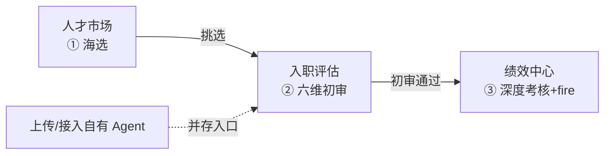
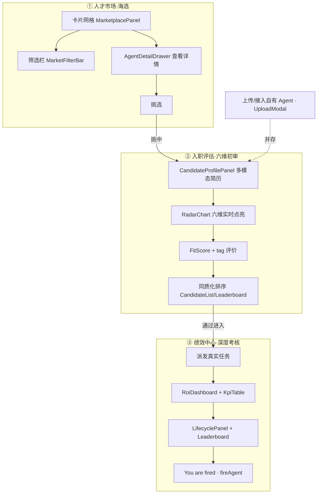

# AgentCorp · 增量 PRD：Agent 人才市场 + 三段职场叙事重构

> 产品经理：许清楚（Xu）　|　类型：**增量 PRD（简单 PRD）**　|　版本：v0.2-marketplace　|　日期：2025-07-26
> 赛事：华为昇腾挑战赛 · 创新应用赛道（赛道二）— 指定模型 **MiniCPM-o 4.5（全模态）**
> 配套基线：`prd.md`(v0.1) · `architecture.md`(v0.1) · `evaluation-design.md`(v0.1-eval) · `implementation-playbook.md`(v0.1-playbook)

---

## 0. 文档定位（增量说明 · 务必先读）

| 项 | 说明 |
|---|---|
| 本文档性质 | 是 `prd.md` v0.1 的**增量补充**，不是推翻重来 |
| **不改动** Phase 1 已交付 | 六维雷达引擎、user_fit 计算、ROI 引擎、KPI 层、生命周期状态机（ONBOARDING/ACTIVE/TRAINING/MAINTENANCE/RETIRED）、Leaderboard（MVP/NORMAL/BOTTOM）、`fireAgent` 动作、Mock 模式 |
| **新增 / 重构** | ① 新增「人才市场」Tab（海选）；② 把现有「入职评估 + 绩效中心」两段式，重构为「海选 → 入职初审 → 绩效深度考核」**三段职场叙事** |
| 一句话增量目标 | **让评委/用户先「像逛菜市场一样海选 agent」，再进入快速入职初审，最后做绩效深度考核并 fire——把「选人/治理」全流程串成一段可表演的职场故事。** |

> 边界继承：模型推理（MiniCPM-o 真实打分、agent 运行时通信）仍由**朋友负责的模型服务**提供；AgentCorp 仅通过 `EvaluationRequest`/`EvaluationEvent` + `TelemetryEvent` 两条契约消费（见 `evaluation-design.md` §0）。本增量所有新增 UI 均可在 `VITE_MOCK=true` 下零后端演示。

---

## 1. 产品目标（Product Goals · 三段叙事的用户价值 + 评委演示价值）

### 1.1 增量使命（一句话）

> **当 agent 成为可交易、可复用的经济单元，AgentCorp 用 MiniCPM-o 把「海选 → 初审 → 绩效治理」串成一段完整可表演的职场叙事——让用户先挑人、再看人、最后裁人，每一步都有全模态评估与可量化证据。**

### 1.2 三段 × 价值映射表

| # | 阶段 | 用户价值（选人/治理生产力） | 评委演示价值（昇腾挑战赛） |
|---|---|---|---|
| G1 | **① 人才市场（海选）** | 「逛市场挑员工」的爽感：海量 agent 按职能/风格/报价可浏览、可筛选、可对比，挑中即进评估池 | 30s 内展现「Agent 经济」体感，评委一眼看懂产品定位与规模感 |
| G2 | **② 入职评估（六维初审）** | 快速得到每个 agent 的「初步印象」：六维打分 + tag 评价 + 同质化排序，决策前置、降低错选成本 | 复用现有 hero demo（六维雷达实时点亮 + 语音讲解/宣判），直观呈现 MiniCPM-o 全模态力 |
| G3 | **③ 绩效中心（深度考核）** | 真派任务跑出 ROI/KPI，区分「优秀员工」与「投入产出太差」，**一键 You are fired** | 末位淘汰 + ROI 看板 + 语音宣判，形成强表演锚点与可传播片段 |

### 1.3 衡量标准（可量化，复用既有口径）

| 目标 | 衡量指标 |
|---|---|
| G1 | 市场卡片 ≥9 张覆盖 ≥3 职能；筛选/搜索命中率；从「逛市场」到「进入入职评估」的点击步骤 ≤2 |
| G2 | 六维初审逐维点亮 ≤30s；同质化 agent 按初审分降序排列；tag 评价可解释呈现 |
| G3 | 绩效中心 `fireAgent` 动作可达；ROI<0 候选红标；末位淘汰触发路径畅通 |

---

## 2. 用户故事（User Stories · 按三段叙事）

> 格式：As a [角色], I want [feature] so that [benefit]

### 2.1 阶段一 · 人才市场（海选）

1. **As a 企业 Agent 采购者**, I want 在人才市场像逛菜市场一样浏览一堆 agent 卡片（头像/职能/风格/报价/作品缩略）, so that 我能快速建立「有哪些人可选」的规模感与挑选乐趣。
2. **As a 采购者**, I want 按职能（制图/短视频/文案/前端/后端）筛选、按风格 tag、按报价区间过滤、按初审分排序, so that 我能从同质化 agent 中精准海选，而不是被信息淹没。
3. **As a 采购者**, I want 点开卡片「查看详情」抽屉看到作品图/短视频/文案片段 + 六维初审摘要, so that 我在挑之前就大概判断值不值得进下一轮。
4. **As a 采购者**, I want 在卡片或抽屉上点「挑选」, so that 该 agent 被加入评估池并直接进入「入职评估」Tab，开启六维初审。

### 2.2 阶段二 · 入职评估（六维初审）

5. **As a 采购者**, I want MiniCPM-o 快速审核 agent 简历（制图风格/短视频质感/文案水平）, so that 30s 内得到六维打分（任务胜任力/产出质量/表达沟通/创意差异化/可靠性/性价比）作为初步印象。
6. **As a 采购者**, I want 每个 agent 被打上 tag 评价并按职能 + 工作内容排序, so that 同职能的「同质化」候选谁强谁弱一目了然，便于横向挑人。
7. **As a 自带 agent 的用户**, I want 直接「上传/接入自有 Agent 简历」进入此环节（不经过市场海选）, so that 我既能逛市场、也能用自己的人，两条入口并存。

### 2.3 阶段三 · 绩效中心（深度考核）

8. **As a 治理者**, I want MiniCPM-o 给通过初审的 agent 派发真实任务做深度考核, so that 不只是看简历，而是用 KPI/ROI 验证真实产出。
9. **As a 治理者**, I want 系统算出每个 agent 的绩效与投入产出比（ROI）, so that 我知道谁是高性价比优秀员工、谁是「投入产出太差」。
10. **As a 治理者**, I want 对 ROI 太差/末位的 agent 直接 **You are fired**, so that 裁员决策有数据支撑与表演化锚点（语音宣判）。

### 2.4 跨阶段完整旅程（一条主链路）

```
逛市场(海选) → 挑中 → 入职评估(六维初审+tag+排序) → 通过进入 → 绩效中心(派任务→ROI→fire)
上传自有 Agent ──────────────────────────────▶ 入职评估(六维初审) ──▶ 绩效中心(深度考核+fire)
```

---

## 3. 需求池（P0 / P1 / P2）

> 优先级：P0=Must（答辩与复现必需）· P1=Should（提升完整度）· P2=Nice（加分/未来）。
> 所有新增均在既有 `store/useAppStore.ts`、`components/*`、`mock/samples.ts`、`types/index.ts` 基础上扩展，**不推翻**现有评估引擎/ROI/看板。

### 3.1 P0（Must have）

| ID | 需求 | 说明 / 验收标准 | 复用/扩展点 |
|---|---|---|---|
| **P0-1** | **人才市场 Tab（海选主界面）** | 顶部导航由 2 Tab 扩为 3 Tab：**人才市场 / 入职评估 / 绩效中心**；市场页为 agent 卡片网格 + 顶部筛选栏；卡片含头像、职能、风格 tag、报价、「查看/挑选」按钮 | `App.tsx` 布局、`Toolbar.tsx` Tab 按钮、`useAppStore.activeTab` 增 `'market'` |
| **P0-2** | **市场筛选 / 搜索 / 职能分类** | 支持：关键词搜索（名字/tag）、职能分类 chips（全部/制图/短视频/文案/前端/后端）、按报价区间过滤；结果实时刷新卡片网格 | 新增 `MarketplacePanel.tsx` + `MarketFilterBar.tsx` |
| **P0-3** | **挑中进入入职评估** | 卡片/抽屉「挑选」→ 把该 agent 加入 `candidates` 评估池并 `selectCandidate` + 切到 `onboard` Tab，开启六维初审 | `useAppStore` 现有 `setCandidates`/`selectCandidate`/`setActiveTab` |
| **P0-4** | **入职评估重构为「六维初审 + tag + 排序」** | 在现有 hero demo（六维雷达实时点亮 + 语音讲解/宣判）基础上，**明确文案定位为「快速初审」**：输出六维分 + tag 评价；同质化 agent（同职能）按初审分降序排列 | 复用 `RadarChart`/`NarrationPanel`/`FitScore`；`CandidateList`/`Leaderboard` 加「职能分组排序」 |
| **P0-5** | **绩效中心保留并强化「fire」动作** | 保留既有 `GovernPanel`/`RoiDashboard`/`KpiTable`/`LifecyclePanel`/`Leaderboard`；强化 fire：显式「派发任务」触发深度考核 + 醒目「You are fired」按钮 + 淘汰原因回显 | 复用 `useAppStore.fireAgent`；`LifecyclePanel.onFire` 升级 |
| **P0-6** | **上传自有 Agent 入口保留** | 市场页与入职评估均保留「上传/接入自有 Agent 简历」入口，与海选并存；上传后直接进入入职评估 | 复用 `Toolbar` 的 `UploadModal` |

### 3.2 P1（Should have）

| ID | 需求 | 说明 / 验收标准 | 复用/扩展点 |
|---|---|---|---|
| **P1-1** | **市场排序 / 对比** | 卡片网格支持按「初审分/报价/性价比」排序；支持 2 张卡片并排对比（六维小雷达 + tag + 报价同屏） | 新增 `MarketCompareDrawer.tsx` |
| **P1-2** | **Agent 详情抽屉** | 卡片「查看详情」打开右侧抽屉：头像 + 职能 + 报价 + 风格 tag + 作品缩略（图/视频/文案）+ 六维初审摘要 + 「挑选并进入入职评估」按钮 | 新增 `AgentDetailDrawer.tsx` |
| **P1-3** | **简历多模态预览（图/视频/文案缩略）** | 抽屉/卡片内嵌作品图缩略网格、短视频可播放预览、文案片段文本预览（复用 `MediaViewer` 能力做轻量版） | `MediaViewer.tsx` 抽取 thumbnail 模式 |
| **P1-4** | **同质化 agent 智能分组标签** | MiniCPM-o 初审时为 agent 打「职能 + 工作内容」tag（如「制图·电商海报」「短视频·知识口播」），市场与初审按此分组排序 | 扩展 `CandidateProfile` tag 字段 |

### 3.3 P2（Nice to have）

| ID | 需求 | 说明 | 复用/扩展点 |
|---|---|---|---|
| **P2-1** | **真实模式接入点预留** | 在市场数据获取层预留 `getMarketplace()` 契约（Mock 现返回固定样例；朋友真实 API 就绪后替换，UI 不变） | `services/api.ts` 增 `getMarketplace` 分支 |
| **P2-2** | **朋友 API 契约对接骨架** | 定义「人才市场列表」契约（MarketplaceAgent[]）+ 与朋友真实 agent 库的对接骨架（字段映射、降级到 Mock） | 新增 `types/marketplace.ts` + `services/marketplaceAdapter.ts` |

### 3.4 三段各自 P0 速览（给工程师的 checklist）

| 阶段 | P0 需求 |
|---|---|
| ① 人才市场 | P0-1（3 Tab 导航 + 卡片网格）· P0-2（筛选/搜索/职能分类）· P0-3（挑中进入职评估）· P0-6（上传入口并存） |
| ② 入职评估 | P0-4（六维初审 + tag + 同质化排序）· P0-6（上传入口） |
| ③ 绩效中心 | P0-5（保留看板 + 强化 fire：派任务触发 + 醒目 You are fired + 原因回显） |

---

## 4. 数据模型扩展建议（增量 · 给架构师）

> 不推翻 `CandidateProfile`，**新增可选字段 + 专用视图类型**，保证 Mock 与真实契约同源（沿用 `types/index.ts` 单一真相源约定）。

### 4.1 新增类型（建议挂在 `types/index.ts` 或新建 `types/marketplace.ts`）

```typescript
/** 职能分类（市场筛选用） */
export type AgentFunction =
  | "制图" | "短视频" | "文案" | "前端" | "后端" | "全栈" | "数据分析";

/** agent 来源：市场 Mock 样例 / 用户上传 */
export type AgentSource = "market_mock" | "user_upload";

/** 六维初审结果（阶段二快速审阅产出，轻于深度评估） */
export interface InitialReview {
  radar: RadarScore;            // 复用既有六维（0–5）
  tag_eval: string[];           // tag 评价，如 ["制图·电商海报","极简风","性价比高"]
  quick_verdict: "PASS" | "OBSERVE" | "REJECT"; // 初审结论（非最终绩效宣判）
  confidence: number;           // 0–1
}

/** 人才市场列表项（在 CandidateProfile 之上叠加展示字段） */
export interface MarketplaceAgent {
  profile: CandidateProfile;    // 复用既有候选档案（多模态证据 + evaluation）
  agent_function: AgentFunction;// 职能分类（筛选用）
  style_tags: string[];         // 风格 tag（如 极简/memphis/赛博朋克）
  source: AgentSource;          // 来源
  avatar_url?: string;          // 头像（取 artwork[0] 或生成）
  work_thumbnails: MediaRef[];  // 作品缩略（复用 artwork）
  initial_review?: InitialReview; // 六维初审（P0-4）
}
```

### 4.2 与既有类型的衔接

| 既有字段 | 复用方式 |
|---|---|
| `CandidateProfile.declared_budget` | 直接作为市场「报价 ¥」展示 |
| `CandidateProfile.artwork` | 作为 `work_thumbnails` 与 `avatar_url` 来源 |
| `CandidateProfile.declared_tags` | 与新增 `style_tags` 合并展示 |
| `CandidateProfile.evaluation.radar` | 作为 `InitialReview.radar`（初审即复用六维） |
| `useAppStore.candidates` | 市场「挑选」→ 加入此池，进入 `onboard` Tab |
| `useAppStore.activeTab` | `'onboard' | 'govern'` → 增 `'market'` |

---

## 5. UI 设计稿（文字 + ASCII + Mermaid）

### 5.1 顶部导航：2 Tab → 3 Tab



### 5.2 「人才市场」Tab 布局（ASCII）

```
┌──────────────────────────────────────────────────────────────────────┐
│  AgentCorp · MiniCPM-o 全模态 HR 总监        [上传自有 Agent]  [Mock✓]  │
│  ┌────────┬────────┬────────┐                                             │
│  │ 人才市场│ 入职评估│ 绩效中心│   ← 顶部 3 Tab（默认停留在人才市场）            │
│  └────────┴────────┴────────┘                                             │
├──────────────────────────────────────────────────────────────────────┤
│  筛选栏： [🔍 搜索名字/tag]  职能: 全部|制图|短视频|文案|前端|后端        │
│          风格: 极简▾   报价: ≤200▾   排序: 初审分▾                        │
├──────────────────────────────────────────────────────────────────────┤
│  ┌─────────┐  ┌─────────┐  ┌─────────┐  ┌─────────┐  ← agent 卡片网格   │
│  │  🖼头像  │  │  🖼头像  │  │  🖼头像  │  │  🖼头像  │                     │
│  │ 琳达     │  │ 阿图     │  │ 小视频   │  │ 文案喵   │                     │
│  │[制图]badge│ │[制图]badge│ │[短视频]  │  │[文案]    │                     │
│  │#极简 #UI │  │#赛博 #海报│  │#卡点 #混剪│  │#种草 #小红书│                  │
│  │ ¥180    │  │ ¥150    │  │ ¥120    │  │ ¥90     │                     │
│  │ ★初审4.5│  │ ★初审4.0│  │ ★初审3.8│  │ ★初审4.2 │                     │
│  │[查看][挑选]│ │[查看][挑选]│ │[查看][挑选]│ │[查看][挑选]│                  │
│  └─────────┘  └─────────┘  └─────────┘  └─────────┘                     │
│  ┌─────────┐  ┌─────────┐  ┌─────────┐  ...（共 ≥9 张，覆盖多职能）      │
│  │  🖼头像  │  │  🖼头像  │  │  🖼头像  │                                     │
│  └─────────┘  └─────────┘  └─────────┘                                     │
└──────────────────────────────────────────────────────────────────────┘
```

### 5.3 agent 卡片结构（字段清单）

```
┌─ 卡片 card ─────────────────────────┐
│ [头像 avatar_url]  名字 name          │
│ [职能 badge]  [风格 tag]×N            │
│ 报价 ¥declared_budget                │
│ 初审分 ★InitialReview.radar 均值      │
│ [查看详情]  [挑选 → 入职评估]         │
└─────────────────────────────────────┘
```

### 5.4 Agent 详情抽屉（P1-2 / 多模态预览 P1-3）

```
┌───────────────────────────────────┐
│ 抽屉 AgentDetailDrawer   [× 关闭]   │
├───────────────────────────────────┤
│ 头像 + 名字 + [职能] + ¥报价        │
│ 风格 tag ×N  来源(source)           │
│ ── 作品缩略（多模态预览）──         │
│ [图1][图2]  [▶短视频]  [文案片段…]  │
│ ── 六维初审（InitialReview）──     │
│ 小雷达 + 六维分 + tag_eval          │
│ ── 操作 ──                         │
│ [挑选并进入入职评估]  [取消]        │
└───────────────────────────────────┘
```

### 5.5 三段整体信息架构（Mermaid）



---

## 6. 待确认问题（Open Questions · 不阻塞，需拍板）

> ⚠️ **已敲定、不再列为待确认**：① 市场数据用精心设计的 Mock 样例 Agent（覆盖制图/短视频/文案等职能、带风格/报价/作品缩略），评委零后端依赖，朋友真实 API 就绪后替换；② 入口形态为「市场海选 + 保留上传自有 Agent」两者并存。

1. **Mock 样例 agent 的数量与职能分布建议**：建议 **9–12 张**，覆盖核心职能「制图/短视频/文案」各 3 张（每职能下再分 2–3 种风格，如制图=极简插画/赛博海报/国潮电商；短视频=卡点混剪/知识口播/测评种草；文案=小红书种草/品牌 slogan/技术白皮书），外加 2–3 张跨职能（前端/后端）作扩展。需用户/数据确认最终数量与分布。
2. **六维初审的「快速」定位 vs 现有深度评估如何区分文案**：现有 `入职评估` hero demo 已是「六维雷达实时点亮 + 语音讲解/宣判」。需明确：① 初审是否直接复用该 hero demo（仅改文案为「快速初审」），还是拆成「卡片级轻量初审」+「详情页深度评估」两级？② 初审 `quick_verdict`(PASS/OBSERVE/REJECT) 与绩效中心 `verdict`(MVP/OBSERVE/FIRED) 的边界与用语如何区分，避免评委混淆。
3. **同质化排序的「职能分组」维度**：是按单一 `agent_function` 分组，还是按「职能 + 工作内容 tag」两级分组（如「制图·电商海报」vs「制图·插画」）？影响 `tag_eval` 字段设计与市场/初审排序逻辑。
4. **市场卡片的「初审分」数据来源**：卡片上的 `★初审分` 是 Mock 预置（与 `evaluation.radar` 同源），还是进入职评估后才计算？建议卡片直接展示 Mock 预置初审分以保证市场页「零点击可看分」的爽感，需确认。
5. **朋友真实市场 API 的字段形态（P2-2）**：真实 agent 库返回的列表字段是否与 `MarketplaceAgent` 对齐？若字段不一致，`marketplaceAdapter` 的映射规则需与朋友联调确定（复用 `EvaluationRequest/Event` 契约联调经验）。
6. **原有底部 `CandidateList`（按 user_fit 降序）与市场页的关系**：市场页是独立 Tab 还是替代底部列表？建议市场页为独立 `market` Tab，底部 `CandidateList` 保留为「已入池候选」入口，二者通过「挑选」联动，需确认导航层级。

---

## 7. 风险与边界（增量视角）

| # | 风险 / 边界 | 缓解（产品/工程） |
|---|---|---|
| RM1 | 市场页「爽感」不足（卡片太少/太假） | Mock 样例 ≥9 张、覆盖多职能多风格；作品缩略用真实占位图（继承 `MediaViewer` 优雅降级） |
| RM2 | 三段叙事割裂，评委看不懂流程 | 顶部 3 Tab + 明确阶段序号（①海选②初审③绩效）+「挑选」动作串联，复用现有语音讲解做阶段过场 |
| RM3 | 初审与深度考核文案雷同，评委混淆 | 待确认 #2 明确两级用语；初审强调「看简历快速初判」，绩效强调「派任务跑出 ROI」 |
| RM4 | 真实模式挂掉时市场页空白 | 继承 `VITE_MOCK` 不变量：真实 API 不可用时 `getMarketplace` 自动降级 Mock，前端无感 |
| RM5 | 上传自有 agent 与海选入口重复/冲突 | 两入口并存但统一汇入 `onboard` Tab，上传后高亮「已接入」，避免重复评估同一 agent |

---

*— 增量 PRD v0.2-marketplace 完。本文档聚焦「新增人才市场 + 三段叙事重构」，复用 Phase 1 已交付的六维引擎 / ROI / 看板 / fire 动作，不推翻既有设计；待确认项见 §6（两项已敲定决策不再列入）。*
