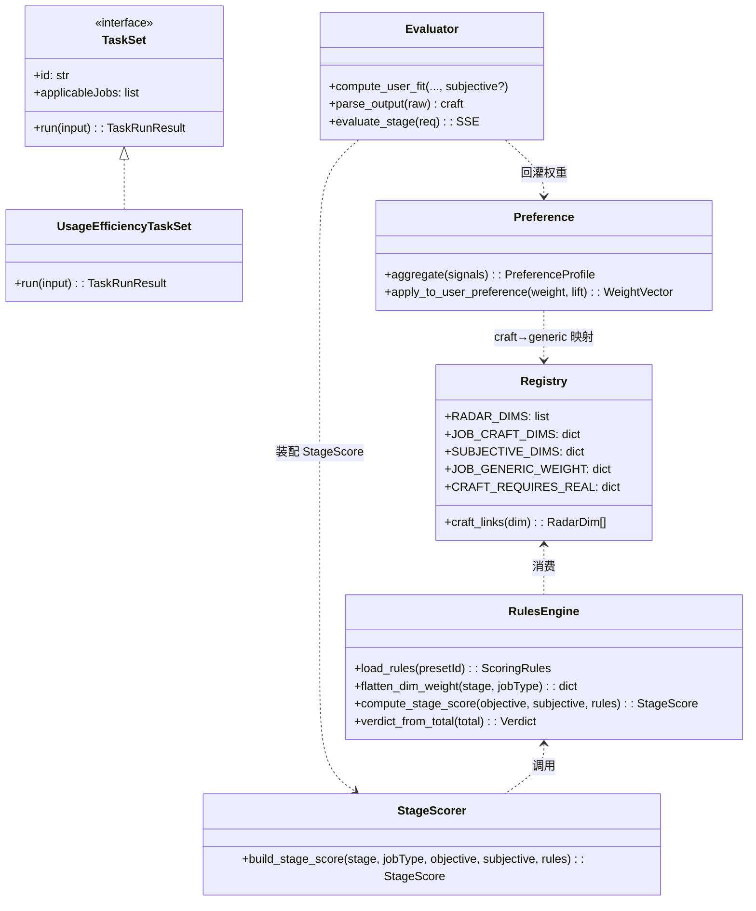
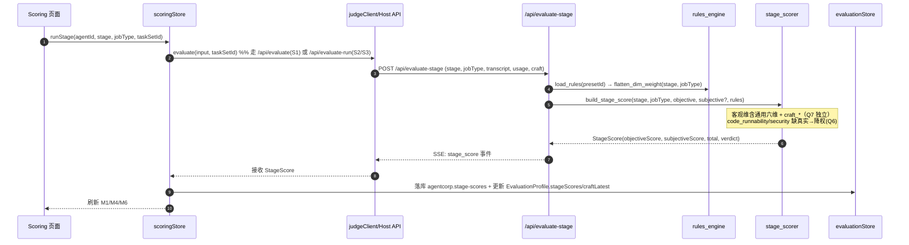
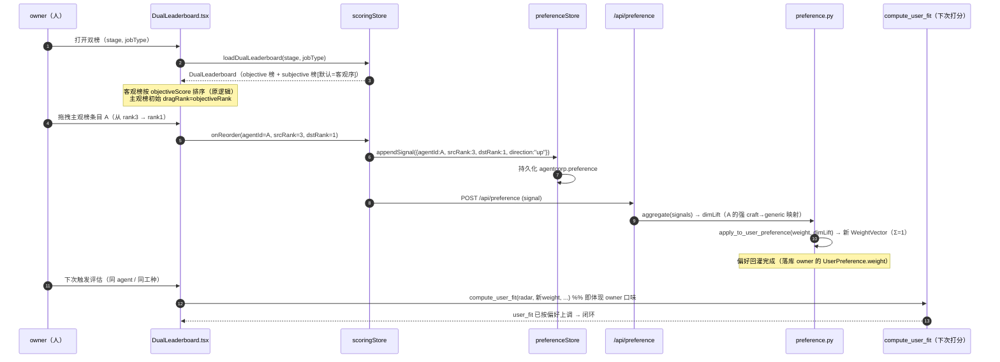
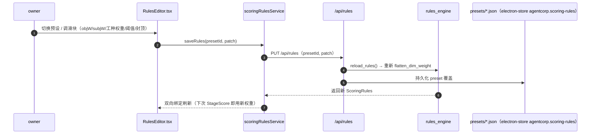

# AgentCorp · 评估层扩展架构设计（三阶段 × 三工种 + 双 Leaderboard + 偏好回灌 + Task-Set 可插拔）

> 版本：v1.0-arch　|　日期：2026-07-28  
> 作者：架构师 高见远（general-purpose agent 承载）  
> 配套输入：`docs/three-stage-scoring-standards.md`（PRD v1.0-detailed，许清楚）  
> 定位：**架构设计 + 任务分解**，把 PRD 的「标准/规范」落地为「模块 / 接口 / 调用流 / 任务序列」。  
> 设计红线：字段命名严格复用 `RADAR_DIMS` / `KpiRecord` / `RoiSnapshot` / `LifecycleState` / `Verdict`，**不另起冲突命名**。

---

## 0. 设计摘要（给主理人速读）

- **复用栈**：后端 `FastAPI + SSE`（`model-service/app/`），前端 `React + MUI + Tailwind + Zustand + react-router`，落库 `electron-store`。**不引入新框架**。
- **新增核心模块**：
  - 后端 `app/scoring/`（规则引擎 `rules_engine.py`、维度注册表 `registry.py`、阶段评分器 `stage_scorer.py`、任务集 `task_sets.py`）+ 规则预设 `app/scoring/presets/*.json`。
  - 前端 `src/engine/scoring/`（规则引擎镜像、任务集注册表）、`src/services/{scoringRulesService,preferenceStore,leaderboardClient}.ts`、`src/stores/scoringStore.ts`、`src/pages/Scoring/`（M1–M6 + 双 Leaderboard 组件）。
- **9 项 owner 决策全部落地**（见 §1.4 决策映射表），其中 **Q5 已按「★变更」改为双 Leaderboard + 偏好回灌**。
- **双 Leaderboard**：客观榜（原 `computeLeaderboard` 逻辑，按客观分 + ROI 排名）；主观榜（默认序=客观序预排，用户可拖拽重排，拖拽=偏好信号→回灌 `UserPreference.weight`→下一次 `compute_user_fit` 即体现）。
- **Task-Set 可插拔**：`evaluate-run` 管线抽象为「任务集无关」，新增 `TaskSet` 接口与 `TaskSetRegistry`；本期只内置复用 `/api/evaluate-run` 语义的 `UsageEfficiencyTaskSet`，「有价值任务集」（稳定性 + 复现性）作为未来里程碑，仅留扩展点。

---

## 1. 实现方案 + 框架选型

### 1.1 总体方案

在**既有评估层**（阶段 A：`EvaluationProfile` + `judgeClient` + `metricsEngine` + `roiEngine` + `evaluationStore`）之上，**叠加三阶段 × 三工种评分能力**，不重写既有管线：

| 层 | 既有（复用） | 本次新增（叠加） |
| -- | -- | -- |
| 后端契约 | `schemas.py`（RadarScore/Verdict/UserPreference/JudgeRunRequest） | 扩展 `CraftScores` / `SubjectiveScore` / `StageScore` / `DualLeaderboard` / `PreferenceSignal` / `ScoringRules` |
| 后端引擎 | `evaluator.py` `compute_user_fit` / `evaluate` / `evaluate_run` | `scoring/rules_engine.py`（权重预折叠 + 阶段计分）、`scoring/registry.py`（维度注册表）、`scoring/stage_scorer.py`（三阶段评分卡）、`scoring/task_sets.py`（可插拔任务集） |
| 裁判 prompt | `prompt_templates.py` SYSTEM_PROMPT | 增 `craft` 子对象输出（img_*/txt_*/code_*）与硬规则（注水/跨模态自洽/可靠性） |
| 前端类型 | `src/types/evaluation.ts` | 增 `JobType`/`StageKey`/`SubjectiveDim`/`CraftScores`/`StageScore`/`DualLeaderboard`/`PreferenceSignal`/`ScoringRules` |
| 前端引擎 | `metricsEngine`/`roiEngine`/`evaluationAdapter` | `engine/scoring/rulesEngine.ts`（镜像后端）、`engine/scoring/taskSets.ts`（前端注册表镜像） |
| 前端服务 | `judgeClient`/`evaluationStore` | `scoringRulesService`（规则加载/保存）、`preferenceStore`（偏好信号落库）、`leaderboardClient`（双榜） |
| 前端 store | `stores/evaluation.ts` | 扩展 `stores/scoringStore.ts`（主观打分、拖拽、偏好捕获；编排三阶段） |
| 前端 UI | `pages/Evaluation/*`（RadarChart 复用） | `pages/Scoring/*`（M1–M6 + 双 Leaderboard） |
| 落库 | `electron-store` 命名空间 `agentcorp.evaluation` | 新增 `agentcorp.scoring-rules` / `agentcorp.preference` / `agentcorp.stage-scores` |

### 1.2 框架选型结论

| 维度 | 选型 | 理由 |
| -- | -- | -- |
| 后端服务 | **维持 FastAPI + SSE**（`sse-starlette`） | 与既有 `/api/evaluate`、`/api/evaluate-run` 同构；三阶段评分、双榜、偏好捕获均走 SSE 或 JSON 接口 |
| 后端规则引擎 | **纯 Python（无新依赖）** | 仅做 JSON 加载 + 权重预折叠 + 加权求和，Pydantic 已够用 |
| 前端框架 | **维持 React 19 + Vite + TS** | 不换框架 |
| 状态 | **维持 Zustand** | 新增 `scoringStore` 编排主观分/拖拽/偏好 |
| 图表 | **复用 `recharts` + 现成 `RadarChart.tsx`** | 已装；M1/M3/M4 直接复用，避免重造 |
| 拖拽 | **复用 `@dnd-kit/core`** | 已装；双 Leaderboard 主观榜拖拽重排直接用 |
| 落库 | **维持 `electron-store`** | 多命名空间隔离（规则/偏好/阶段分） |

> 结论：**零新运行时依赖**（见 §6）。

### 1.3 目录与模块边界（新增部分）

```text
model-service/app/
├── scoring/                      # ★ 新增：评估层扩展核心
│   ├── __init__.py
│   ├── registry.py               # 维度注册表（RADAR_DIMS + craft + sub，前缀隔离）
│   ├── rules_engine.py           # 加载 scoring-rules.json → 预折叠 dimWeight；compute_stage_score
│   ├── stage_scorer.py           # 三阶段评分卡装配（S1/S2/S3）
│   ├── preference.py             # 偏好信号聚合 → 重加权 UserPreference.weight（回灌）
│   ├── task_sets.py              # ★ TaskSet 接口 + TaskSetRegistry（可插拔）
│   └── presets/                  # ★ 多预设规则 JSON
│       ├── default.json         # 默认（PRD §7 样例）
│       ├── cost-focused.json     # 「重性价比采购者」预设
│       └── quality-focused.json # 「重质量」预设
├── evaluator.py                  # 修改：compute_user_fit 增 subjective 可选叠加；parse_output 增 craft；新增 stage 流
├── prompt_templates.py           # 修改：SYSTEM_PROMPT 增 craft 子对象输出
├── schemas.py                    # 修改：增 CraftScores/SubjectiveScore/StageScore/DualLeaderboard/PreferenceSignal/ScoringRules
└── serve.py                      # 修改：增 /api/evaluate-stage /api/leaderboard /api/preference /api/rules

src/
├── types/evaluation.ts           # 修改：增 JobType/StageKey/SubjectiveDim/CraftScores/StageScore/DualLeaderboard/PreferenceSignal/ScoringRules
├── engine/
│   ├── scoring/                  # ★ 新增：前端引擎镜像
│   │   ├── registry.ts           # 维度注册表 TS 镜像
│   │   ├── rulesEngine.ts         # 规则加载/预折叠/阶段计分（与后端同公式）
│   │   └── taskSets.ts            # TaskSet 注册表 TS 镜像
│   ├── metricsEngine.ts          # 复用（KPI 直出）
│   └── roiEngine.ts              # 复用（ROI 直出）
├── services/
│   ├── scoringRulesService.ts    # ★ 规则预设拉取/保存（经 Host API → /api/rules）
│   ├── preferenceStore.ts        # ★ 偏好信号落库（electron-store agentcorp.preference）
│   ├── leaderboardClient.ts      # ★ 双 Leaderboard 拉取（经 /api/leaderboard）
│   └── judgeClient.ts            # 复用（evaluate-run SSE）
├── stores/scoringStore.ts        # ★ 主观打分/拖拽/偏好捕获/三阶段编排
├── components/                    # ★ 新增评估组件（或置于 pages/Scoring）
│   └── evaluation/
│       ├── StageTrajectoryChart.tsx   # M1
│       ├── RulesEditor.tsx            # M2
│       ├── CraftRadarCompare.tsx      # M3
│       ├── ObjectiveSubjectiveGauge.tsx # M4
│       ├── SubjectiveScorePanel.tsx   # M5
│       ├── StageCardDetail.tsx        # M6
│       └── DualLeaderboard.tsx        # Q5 双榜（拖拽）
└── pages/Scoring/index.tsx       # ★ 评估中心页面（M1–M6 + 双榜容器）
```

### 1.4 owner 9 项决策 → 设计落点映射

| # | 决策 | 落点（文件 / 字段 / 逻辑） |
| -- | -- | -- |
| Q1 | S1 0.6/0.4、S2 0.5/0.5、S3 0.7/0.3 | `scoring/presets/*.json` 各 stage `objectiveWeight`/`subjectiveWeight`；`rules_engine.compute_stage_score` 按此加权 |
| Q2 | 工种六维权重差异化 | `registry.JOB_GENERIC_WEIGHT`（§3.3 表）；`rules_engine` 预折叠为 `dimWeight` |
| Q3 | 主观回灌封顶 ±8% | `ScoringRules.subjective.capPercent=8`；`evaluator.compute_user_fit` 中 `subjective` 叠加 `delta=clamp(±8)` |
| Q4 | 阈值 MVP/OBSERVE/FIRED = 78/50 | `rules_engine.verdict_from_total`（≥78→MVP；50–78→OBSERVE；<50→FIRED） |
| Q5 | ★双 Leaderboard + 偏好回灌 | `DualLeaderboard` 模型 + `DualLeaderboard.tsx` 拖拽 + `preference.py`/`preferenceStore.ts` 回灌 `UserPreference.weight`（见 §4.3、§7） |
| Q6 | code_runnability/code_security 强制真实执行/扫描 | `stage_scorer` 中 `craft_evidence` 缺失真实结果时该维 `weight` 降权（乘 `0.4`，其余归一）；`registry` 标 `requires_real=true` |
| Q7 | craft 维单独存库 + 参与工种对比雷达 | `CraftScores` 独立存 `StageScore.objective[].source`，`CraftRadarCompare.tsx` 读 `craft_*` 维 |
| Q8 | 规则格式 = JSON + 多预设 | `scoring/presets/*.json` + `/api/rules` 读写；`scoringRulesService` 切换预设 |
| Q9 | 先复用 /api/evaluate-run；未来「有价值任务集」可插拔 | `task_sets.TaskSet` 接口 + `TaskSetRegistry`；本期内置 `UsageEfficiencyTaskSet`（复用 evaluate-run 语义），扩展点就绪（见 §5、§8） |

---

## 2. 文件列表及相对路径（新增 / 修改）

### 2.1 后端（model-service/app/）

| 路径 | 动作 | 职责 |
| -- | -- | -- |
| `app/scoring/__init__.py` | 新增 | 包导出 |
| `app/scoring/registry.py` | 新增 | 维度注册表：`RADAR_DIMS` 镜像 + `JOB_CRAFT_DIMS` + `SUBJECTIVE_DIMS` + `JOB_GENERIC_WEIGHT` + `requires_real` 标记 |
| `app/scoring/rules_engine.py` | 新增 | `load_rules(path)` → `flatten_dim_weight(stage, jobType)` → `compute_stage_score(...)` → `verdict_from_total` |
| `app/scoring/stage_scorer.py` | 新增 | 装配 `StageScore`：`build_stage_score(stage, jobType, objective, subjective, rules)`；注入 craft/telemetry/kpi |
| `app/scoring/preference.py` | 新增 | `aggregate_preference(signals)` → `dim_lift` → `apply_to_user_preference(weight, lift)`（回灌，Σ=1 重归一） |
| `app/scoring/task_sets.py` | 新增 | `TaskSet`(Protocol) + `TaskSetRegistry` + `UsageEfficiencyTaskSet`（内置）+ `get_task_set(id)` |
| `app/scoring/presets/default.json` | 新增 | 默认规则（PRD §7 样例） |
| `app/scoring/presets/cost-focused.json` | 新增 | 「重性价比采购者」预设 |
| `app/scoring/presets/quality-focused.json` | 新增 | 「重质量」预设 |
| `app/evaluator.py` | 修改 | `compute_user_fit` 增 `subjective: Optional[Dict[str,float]]`（向后兼容）；`parse_output` 增 `craft`；新增 `evaluate_stage` SSE 流 |
| `app/prompt_templates.py` | 修改 | SYSTEM_PROMPT 增 `craft` 子对象（image/text/code）与硬规则 |
| `app/schemas.py` | 修改 | 增 `CraftScores`/`SubjectiveScore`/`StageScore`/`DualLeaderboard`/`PreferenceSignal`/`ScoringRules`/`StageRules` |
| `app/serve.py` | 修改 | 增 `POST /api/evaluate-stage`、`GET /api/leaderboard`、`POST /api/preference`、`GET|PUT /api/rules` |

### 2.2 前端（src/）

| 路径 | 动作 | 职责 |
| -- | -- | -- | 
| `src/types/evaluation.ts` | 修改 | 增 `JobType`/`StageKey`/`SubjectiveDim`/`CraftScores`/`StageScore`/`DualLeaderboard`/`PreferenceSignal`/`ScoringRules`/`TaskSet` 等 |
| `src/engine/scoring/registry.ts` | 新增 | 维度注册表 TS 镜像（与后端 `registry.py` 同义） |
| `src/engine/scoring/rulesEngine.ts` | 新增 | 规则加载/预折叠/阶段计分（与 `rules_engine.py` 同公式，前端可离线算） |
| `src/engine/scoring/taskSets.ts` | 新增 | `TaskSet` 接口 + `TaskSetRegistry`（前端镜像，预留未来任务集 UI 选择） |
| `src/services/scoringRulesService.ts` | 新增 | 预设拉取/保存（Host API → `/api/rules`）；本地缓存到 `agentcorp.scoring-rules` |
| `src/services/preferenceStore.ts` | 新增 | 偏好信号落库（`agentcorp.preference`）；`appendSignal`/`loadProfile`/`clear` |
| `src/services/leaderboardClient.ts` | 新增 | 双 Leaderboard 拉取（Host API → `/api/leaderboard`） |
| `src/stores/scoringStore.ts` | 新增 | 主观打分 `onScore`、拖拽 `onReorder`、偏好捕获 `capturePreference`、三阶段编排 `runStage` |
| `src/components/evaluation/StageTrajectoryChart.tsx` | 新增 | M1 三阶段能力轨迹（复用 `RadarChart` + recharts 折线） |
| `src/components/evaluation/RulesEditor.tsx` | 新增 | M2 规则编辑器（双向绑定 preset JSON） |
| `src/components/evaluation/CraftRadarCompare.tsx` | 新增 | M3 工种 craft 维并排雷达（复用 `RadarChart`） |
| `src/components/evaluation/ObjectiveSubjectiveGauge.tsx` | 新增 | M4 主客观分仪表盘（recharts 双环） |
| `src/components/evaluation/SubjectiveScorePanel.tsx` | 新增 | M5 主观打分控件（滑块/星标 + 注解） |
| `src/components/evaluation/StageCardDetail.tsx` | 新增 | M6 评分卡详情（逐维证据 + 主观注解 + 总分推算） |
| `src/components/evaluation/DualLeaderboard.tsx` | 新增 | Q5 双 Leaderboard（客观榜 + 可拖拽主观榜 + 复核发散） |
| `src/pages/Scoring/index.tsx` | 新增 | 评估中心容器（工种/阶段切换 + M1–M6 + 双榜） |
| `src/types/lifecycle.ts` | 复用 | `LifecycleState`/`verdictToLifecycleState` 不变 |
| `src/stores/evaluation.ts` | 修改（小） | `runLeaderboard` 改为调用双榜逻辑（客观榜复用，主观榜由 `scoringStore` 提供），或保持原样、双榜独立编排 |

---

## 3. 数据结构与接口（JSON Schema / 类图）

### 3.1 维度注册表（`registry.py` / `engine/scoring/registry.ts`）

```typescript
// —— 新增枚举（不改动 RADAR_DIMS / Verdict / LifecycleState）——
export type JobType = "image" | "text" | "code";
export type StageKey = "preScreen" | "interview" | "performance"; // S1/S2/S3
export type SubjectiveDim =
  | "sub_potential" | "sub_aesthetic_lean" | "sub_task_feel"
  | "sub_communication" | "sub_surprise" | "sub_trust" | "sub_rehire";

// —— 工种 craft 维（前缀隔离，PRD §2.2）——
export type CraftDim =
  | "img_composition" | "img_style_fit" | "img_fidelity"
  | "img_aesthetic_consistency" | "img_multimodal_follow"
  | "txt_factuality" | "txt_coherence" | "txt_tone_fit"
  | "txt_info_density" | "txt_instruction_follow"
  | "code_runnability" | "code_efficiency" | "code_test_coverage"
  | "code_maintainability" | "code_security";

export interface CraftDimMeta {
  key: CraftDim;
  jobType: JobType;
  links: RadarDim[];        // 关联通用六维（回灌/加权）
  requiresReal: boolean;    // Q6：code_runnability/code_security = true
  anchor: { 0: string; 3: string; 5: string }; // 0–5 锚点
}
```

后端 `registry.py`（与 TS 同义，Pydantic 镜像）：

```python
RADAR_DIMS = ["task","quality","comm","creativity","reliability","cost"]  # 复用 evaluator.RADAR_DIMS

JOB_CRAFT_DIMS: dict[JobType, list[CraftDim]] = {
    "image": ["img_composition","img_style_fit","img_fidelity","img_aesthetic_consistency","img_multimodal_follow"],
    "text":  ["txt_factuality","txt_coherence","txt_tone_fit","txt_info_density","txt_instruction_follow"],
    "code":  ["code_runnability","code_efficiency","code_test_coverage","code_maintainability","code_security"],
}
SUBJECTIVE_DIMS: dict[StageKey, list[SubjectiveDim]] = {
    "preScreen":   ["sub_potential","sub_aesthetic_lean"],
    "interview":   ["sub_task_feel","sub_communication","sub_surprise"],
    "performance": ["sub_trust","sub_rehire","sub_aesthetic_lean"],
}
# 工种通用六维权重（PRD §3.3，Σ=1，仅通用六维内部）
JOB_GENERIC_WEIGHT: dict[JobType, dict[str,float]] = {
    "image": {"task":.18,"quality":.17,"comm":.15,"creativity":.17,"reliability":.17,"cost":.16},
    "text":  {"task":.18,"quality":.17,"comm":.18,"creativity":.12,"reliability":.18,"cost":.17},
    "code":  {"task":.18,"quality":.17,"comm":.12,"creativity":.13,"reliability":.20,"cost":.20},
}
# Q6：requires_real 标记
CRAFT_REQUIRES_REAL = {"code_runnability": True, "code_security": True}
```

### 3.2 规则预设 JSON（多预设，`scoring/presets/*.json`，PRD §7）

```json
{
  "$schema": "agentcorp.scoring-rules/v1",
  "version": "1.0",
  "presetId": "default",
  "genericRadar": ["task","quality","comm","creativity","reliability","cost"],
  "jobs": {
    "image":  { "craftDims": ["img_composition","img_style_fit","img_fidelity","img_aesthetic_consistency","img_multimodal_follow"] },
    "text":   { "craftDims": ["txt_factuality","txt_coherence","txt_tone_fit","txt_info_density","txt_instruction_follow"] },
    "code":   { "craftDims": ["code_runnability","code_efficiency","code_test_coverage","code_maintainability","code_security"] }
  },
  "stages": {
    "preScreen": {
      "enabledObjective": ["__generic__","__craft__"],
      "enabledSubjective": ["sub_potential","sub_aesthetic_lean"],
      "objectiveBlockWeight": { "generic": 0.6, "craft": 0.4 },
      "objectiveWeight": 0.6, "subjectiveWeight": 0.4,
      "genericRadarWeight": { "task":0.18,"quality":0.17,"comm":0.15,"creativity":0.17,"reliability":0.17,"cost":0.16 },
      "thresholds": { "mvp": 78, "observe": 50 }
    },
    "interview": {
      "enabledObjective": ["__generic__","__craft__","kpi:completion/latency/rework"],
      "enabledSubjective": ["sub_task_feel","sub_communication","sub_surprise"],
      "objectiveBlockWeight": { "generic": 0.5, "craft": 0.5 },
      "objectiveWeight": 0.5, "subjectiveWeight": 0.5,
      "genericRadarWeight": { "task":0.18,"quality":0.17,"comm":0.15,"creativity":0.17,"reliability":0.17,"cost":0.16 },
      "thresholds": { "mvp": 78, "observe": 50 }
    },
    "performance": {
      "enabledObjective": ["__generic__","__craft__","kpi:*","roi:*"],
      "enabledSubjective": ["sub_trust","sub_rehire","sub_aesthetic_lean"],
      "objectiveBlockWeight": { "generic": 0.4, "craft": 0.3, "kpiRoi": 0.3 },
      "objectiveWeight": 0.7, "subjectiveWeight": 0.3,
      "genericRadarWeight": { "task":0.18,"quality":0.17,"comm":0.15,"creativity":0.17,"reliability":0.17,"cost":0.16 },
      "thresholds": { "mvp": 78, "observe": 50 }
    }
  },
  "subjective": { "capPercent": 8, "neutralBaseline": 3 }
}
```

> 引擎消费约定：`__generic__`=`genericRadar`；`__craft__`=当前 `jobType.craftDims`；`kpi:*`/`roi:*`=`KpiRecord`/`RoiSnapshot`（已折叠进六维或单独加权）。`rules_engine.flatten_dim_weight` 在加载时**预折叠为扁平 `dimWeight: Record<dimKey, number>`（Σ=1，仅含本阶段启用维）**，简化计分。

### 3.3 三阶段评分卡（`StageScore`）+ craft 独立存储

```typescript
// 单次客观维得分（含来源，供 Q7 craft 独立存库/工种雷达）
export interface ObjectiveScoreItem {
  dim: string;                       // 通用六维 / craft_* / kpi衍生
  score: number;                    // 0–5
  source: "judge" | "telemetry" | "mixed";
  weight: number;                   // 扁平 dimWeight（来自 rules_engine 预折叠）
  evidence?: string;
}

// 单次主观赋分（人类 owner，PRD §5.2）
export interface SubjectiveScore {
  agentId: string;
  stage: StageKey;
  scores: Partial<Record<SubjectiveDim, number>>; // 0–5，仅本阶段启用维
  notes?: string;
  scoredBy: string;                 // owner id
  ts: string;                       // ISO8601 UTC
}

// 单阶段评分卡（客观+主观+总分，三阶段同构）
export interface StageScore {
  agentId: string;
  stage: StageKey;
  jobType: JobType;
  objective: ObjectiveScoreItem[];  // 通用六维 + craft_*(Q7 独立存) + kpi/roi 折叠
  subjective: SubjectiveScore;
  objectiveWeight: number;          // objW（阶段级 0–1）
  subjectiveWeight: number;         // subjW（阶段级 0–1）
  objectiveScore: number;           // 0–100 = objective_raw/5×100
  subjectiveScore: number;          // 0–100
  total: number;                    // 0–100 = objectiveScore×objW + subjectiveScore×subjW
  verdict: Verdict;                 // total → MVP/OBSERVE/FIRED（Q4）
  window?: string;
  ts: string;
}
```

### 3.4 双 Leaderboard 模型（Q5 ★变更）

```typescript
export interface LeaderboardEntry {        // 客观榜条目（复用 PRD 原 LeaderboardEntry 语义，按客观分排序）
  agentId: string;
  name: string;
  jobType: JobType;
  objectiveScore: number;     // = StageScore.objectiveScore
  roiNorm: number;            // 来自 RoiSnapshot.roi_norm
  rank: number;               // 客观名次（1=榜首）
  state: LifecycleState;
  tier: "MVP" | "NORMAL" | "BOTTOM";
}

export interface SubjectiveRankEntry {      // 主观榜条目（可拖拽）
  agentId: string;
  name: string;
  jobType: JobType;
  subjectiveScore: number;   // = StageScore.subjectiveScore
  objectiveRank: number;     // 客观预排名次（默认序来源）
  dragRank: number;          // 用户拖拽后的名次（持久化）
}

export interface RankDivergence {           // 复核：客观序 vs 拖拽序发散
  agentId: string;
  objectiveRank: number;
  dragRank: number;
  delta: number;             // dragRank - objectiveRank（负=被提升）
}

export interface DualLeaderboard {
  stage: StageKey;
  jobType: JobType | "all";
  objective: LeaderboardEntry[];        // 客观榜（原逻辑）
  subjective: SubjectiveRankEntry[];    // 默认序=客观序预排；用户可拖拽
  divergences: RankDivergence[];        // 自动派生
  updatedAt: string;
}
```

### 3.5 偏好反馈存储（Q5 回灌）

```typescript
export interface PreferenceSignal {         // 一次拖拽 = 一个偏好信号
  id: string;
  ownerId: string;
  stage: StageKey;
  jobType: JobType;
  agentId: string;
  srcRank: number;             // 拖拽前名次
  dstRank: number;             // 拖拽后名次
  direction: "up" | "down";
  ts: string;                  // ISO8601 UTC
}

export interface PreferenceProfile {        // 聚合后回灌 UserPreference.weight
  ownerId: string;
  signals: PreferenceSignal[];
  pairwiseWins: Record<string, number>;          // agentId → 被偏好胜场
  dimLift: Partial<Record<RadarDim, number>>;    // 通用六维提升量（来自被提升 agent 的 craft→generic 映射）
  updatedAt: string;
}
```

> **回灌算法（见 §4.3 / §7）**：`preference.aggregate(signals)` → 对被提升 agent A，取其最强 craft 维 → 查 `registry.CRAFT_LINKS` 得关联通用六维 `g` → `dimLift[g] += 1`；`apply_to_user_preference(weight, dimLift)`：  
> `w'[d] = weight[d] * (1 + α · dimLift[d] / N)`，`α=0.15`（可调，上限 ±50% 相对），再 `normalize(Σ=1)`。  
> 该 `UserPreference.weight` 下一次传入 `compute_user_fit` 即体现 owner 口味 → 闭合「偏好反馈回路」。

### 3.6 EvaluationProfile 扩展（PRD §5.2，仅做加法）

```typescript
export interface EvaluationProfile {
  // —— 既有字段（不变）——
  agentId: string;
  radarLatest: RadarScore;
  radarHistory: RadarScore[];
  kpiLatest: KpiRecord;
  kpiHistory: KpiRecord[];
  roiLatest: RoiSnapshot;
  lifecycle: LifecycleState;
  runIds: string[];
  updatedAt: string;
  // —— 本规范新增（三阶段×三工种）——
  jobType: JobType;                     // 工种标签
  stageScores: StageScore[];           // S1/S2/S3 评分卡
  subjectiveLatest: SubjectiveScore;    // 最新主观分（回灌）
  subjectiveHistory: SubjectiveScore[];// 主观分轨迹
  craftLatest?: Record<CraftDim, number>; // Q7 craft 维独立存库（工种对比雷达）
}
```

### 3.7 TaskSet 可插拔接口（Q9 扩展点）

```typescript
// 任务集抽象：管线无关，仅产出标准化 TaskRunResult 供 scoring 引擎消费
export interface TaskRunResult {
  agentId: string;
  taskSetId: string;
  jobType: JobType;
  objectiveScores: Partial<Record<string, number>>; // 0–5 各启用客观维
  telemetry: TelemetryEvent[];                        // 复用既有 TelemetryEvent
  usage: TokenUsageHistoryEntryLike[];                // 复用 judgeClient 用法
  craftEvidence: Record<string, string>;              // 各 craft 维证据文本
  meta: { repeats?: number; stability?: number; costPerRun?: number };
}

export interface TaskSet {
  id: string;
  title: string;
  description: string;
  applicableJobs: JobType[];
  // 运行任务集（未来实现：真实调度 agent N 次；本期 = 复用 evaluate-run 语义）
  run(input: JudgeRunInput, opts?: { repeats?: number }): Promise<TaskRunResult>;
}

// 注册表（前端镜像同构）
export class TaskSetRegistry {
  register(ts: TaskSet): void;
  get(id: string): TaskSet | undefined;
  list(): TaskSet[];
}
```

后端 `task_sets.py` 镜像（Python Protocol + Registry），`UsageEfficiencyTaskSet` 内置，把既有 `_derive_run_radar` + `JudgeRunRequest` 包装为 `TaskRunResult`。

### 3.8 类图（Mermaid）



---

## 4. 程序调用流程（时序图）

### 4.1 三阶段评分管线（S1/S2/S3）



> S1 入口 = `/api/evaluate`（多模态简历）；S2/S3 入口 = `/api/evaluate-run`（transcript+usage）。两者都由 `evaluate_stage` 统一装配 `StageScore`，保证三阶段同构。

### 4.2 双 Leaderboard 渲染 + 拖拽→偏好回灌（Q5 ★）



### 4.3 规则引擎加载（M2 双向绑定）



---

## 5. 任务列表（有序、含依赖、按实现顺序）

> 依赖用 `→` 表示（A → B 表示 B 依赖 A 先完成）。T0 为基础契约，务必最先落。

| ID | 任务 | 新增/修改文件 | 依赖 | 交付判据 |
| -- | -- | -- | -- | -- |
| **T0** | 维度注册表 + 类型契约（前后端同源） | `registry.py`、`engine/scoring/registry.ts`、`evaluation.ts` 增枚举 | — | `JobType`/`StageKey`/`SubjectiveDim`/`CraftDim` 定义；六维权重 `Σ=1`；前后端字段一致 |
| **T1** | 规则引擎（加载 + 权重预折叠 + 阶段计分 + verdict） | `rules_engine.py`、`engine/scoring/rulesEngine.ts` | T0 | `flatten_dim_weight` 产出 `Σ=1`；`compute_stage_score` 公式与 PRD §10 一致；单测覆盖 Q1/Q4 |
| **T2** | judge prompt 增 craft 子对象 + 硬规则 | `prompt_templates.py` | T0 | SYSTEM_PROMPT 含 `craft` 子对象（img/text/code）；注水/跨模态自洽/可靠性为硬规则 |
| **T3** | `compute_user_fit` 增 subjective 叠加（±8% 封顶，向后兼容） | `evaluator.py` | T0 | 不传 `subjective` 行为不变；传则 `delta=clamp(±8)`（Q3） |
| **T4** | 三阶段评分卡装配 + craft 独立存库 | `stage_scorer.py`、`schemas.py`(StageScore/CraftScores)、`serve.py`(/api/evaluate-stage) | T1,T2,T3 | S1/S2/S3 同构 StageScore；code_* 缺真实结果降权（Q6）；craft 独立写库（Q7） |
| **T5** | 规则预设 JSON + 读写接口 | `presets/*.json`、`serve.py`(/api/rules)、`scoringRulesService.ts` | T1 | default/cost-focused/quality-focused 三预设；M2 双向绑定可保存 |
| **T6** | 主观打分通道 + 落库 | `SubjectiveScorePanel.tsx`、`scoringStore.onScore`、`evaluationStore`(subjectiveLatest/H) | T0 | M5 滑块/星标→`SubjectiveScore`→回灌 `StageScore.subjective` |
| **T7** | 双 Leaderboard（客观榜 + 可拖拽主观榜 + 复核发散） | `DualLeaderboard.tsx`、`leaderboardClient.ts`、`schemas.py`(DualLeaderboard) | T4,T6 | 客观榜按客观分排序（原逻辑）；主观榜默认=客观序；拖拽持久化；`divergences` 自动派生 |
| **T8** | 偏好回灌回路 | `preference.py`、`preferenceStore.ts`、`serve.py`(/api/preference)、`scoringStore.capturePreference` | T7 | 拖拽→`PreferenceSignal`→`dimLift`→`UserPreference.weight`（Σ=1）→下次 `compute_user_fit` 体现（Q5） |
| **T9** | Task-Set 可插拔扩展点 | `task_sets.py`、`engine/scoring/taskSets.ts`、`UsageEfficiencyTaskSet`、serve 接 `taskSetId` | T4 | `TaskSet`/`TaskSetRegistry` 就绪；`evaluate-run` 经 `taskSetId` 调度；本期内置复用 evaluate-run 语义 |
| **T10** | 可视化 M1/M3/M4/M6 | `StageTrajectoryChart/CraftRadarCompare/ObjectiveSubjectiveGauge/StageCardDetail` | T4,T6 | M1 三阶段轨迹；M3 craft 雷达；M4 主客观仪表盘；M6 评分卡详情 |
| **T11** | 评估中心容器 + 路由集成 | `pages/Scoring/index.tsx`、路由注册 | T5,T7,T10 | 工种/阶段切换；M1–M6 + 双榜同屏；复用 `RadarChart` |
| **T12** | 任务集设计启动（未来里程碑，仅留扩展点） | 见 §8 待明确事项 | T9 | 「有价值任务集」规格由 owner 拍板后启动；本期不实现内容 |

> **实现顺序建议**：T0 → T1 → T2/T3（并行）→ T4 → T5 → T6 → T7 → T8 → T9 → T10 → T11。（T2/T3 互不依赖，可并行；T9 与可视化可并行。）

---

## 6. 依赖包列表

### 6.1 后端（model-service）

| 包 | 版本 | 用途 | 状态 |
| -- | -- | -- | -- |
| `fastapi` | 既有 | 服务框架 | 复用 |
| `sse-starlette` | 既有 | SSE 流 | 复用 |
| `pydantic` | 既有 | 契约建模 | 复用（仅扩展 schema） |
| `uvicorn` | 既有 | ASGI 服务 | 复用 |
| — | — | **无新增运行时依赖** | ✅ |

### 6.2 前端（src/）

| 包 | 版本 | 用途 | 状态 |
| -- | -- | -- | -- |
| `react` / `react-dom` | ^19 | UI | 复用 |
| `zustand` | ^5 | 状态（`scoringStore`） | 复用 |
| `recharts` | ^2.12 | M1/M3/M4 图表 | **已装，复用** |
| `@dnd-kit/core` + `@dnd-kit/utilities` | ^6.3 / ^3.2 | 双榜拖拽 | **已装，复用** |
| `tailwindcss` / `tailwind-merge` | 既有 | 样式 | 复用 |
| `electron-store`（渲染进程经由 Host API） | 既有 | 落库多命名空间 | 复用 |
| — | — | **无新增依赖** | ✅ |

> 结论：本次扩展 **零新增依赖**，全部复用既有栈，降低落地风险。

---

## 7. 共享知识（跨文件约定，避免命名冲突）

1. **六维基线唯一真相**：`RADAR_DIMS = [task,quality,comm,creativity,reliability,cost]`（后端 `evaluator.RADAR_DIMS` / 前端 `RadarDim`）。任何 craft/sub 维**不得**占用这六个键名。
2. **前缀隔离**：craft 维 `img_*`/`txt_*`/`code_*`（PRD §2.2）；主观维 `sub_*`（PRD §2.4）。新增维度必须带前缀。
3. **分数语义统一**：所有维度 0–5、0.5 步进；`objectiveScore`/`subjectiveScore`/`total` 均为 0–100。
4. **Verdict 映射统一**：`total ≥ 78 → MVP`；`50 ≤ total < 78 → OBSERVE`；`total < 50 → FIRED`（Q4）。后端 `verdict_from_total` 与前端 `rulesEngine` 必须同实现。
5. **LifecycleState 映射**：`FIRED→RETIRED`；`MVP/OBSERVE→ACTIVE`（复用 `lifecycle.ts` `verdictToLifecycleState`）。三阶段→生命周期态见 PRD §3.4（S1 通过→ONBOARDING；S2 通过→ACTIVE；S3 驱动 TRAINING/MAINTENANCE/RETIRED）。
6. **user_fit 公式唯一**：`user_fit = Σ(radar[d]/5 × weight[d]) × 100%`（后端 `compute_user_fit` / 前端 `src/utils/radar.ts` 镜像）。主观叠加仅追加 `±8%` 封顶项（Q3），**不得**改动客观基座。
7. **KPI/ROI 全量复用**：`KpiRecord` / `RoiSnapshot`（含 `cost_perf_score` 融合进 `cost` 维）直接作为 S3 客观源，字段名不变。
8. **权重预折叠约定**：规则 JSON 的两层级权重（通用 vs craft 子块 + 阶段级 objW/subjW）在 `rules_engine.flatten_dim_weight` 加载时**预折叠为扁平 `dimWeight`（Σ=1，仅含本阶段启用维）**，前后端必须产相同扁平权重。
9. **Q6 降权约定**：`code_runnability`/`code_security` 缺真实执行/扫描证据时，该维 `weight` 乘 `0.4`，其余维归一（保证 `Σ=1` 不变），并在 `evidence` 标注「缺真实结果·降权」。
10. **偏好回灌约定**：`dimLift` 仅作用于 `UserPreference.weight`（通用六维），**不**改 `subjective` 计算；回灌后必须 `normalize(Σ=1)`；`α` 默认 0.15、上限 ±50% 相对（可在规则 `subjective` 扩展 `preferenceAlpha`）。
11. **落库命名空间**：`agentcorp.evaluation`（既有）/ `agentcorp.scoring-rules`（新增）/ `agentcorp.preference`（新增）/ `agentcorp.stage-scores`（新增）。各命名空间 key 分别为 `agentId` / `presetId` / `ownerId` / `agentId+stage`。
12. **SSE 事件复用**：三阶段评分仍走既有 `radar_update/narration/audio/verdict/done` 五事件；新增 `stage_score` 事件（携带 `StageScore`）由 `/api/evaluate-stage` 在 `done` 前发出，前端 `evaluationAdapter.consume` 需兼容（默认 noop，由 `scoringStore` 消费）。

---

## 8. 待明确事项（含任务集设计启动条件）

| # | 待明确 | 现状 / 建议 | 由谁拍板 | 启动条件 |
| -- | -- | -- | -- | -- |
| O1 | 主观榜「拖拽即回灌」是否对所有 stage 生效，还是仅 performance？ | 建议全 stage 生效（S1/S2/S3 拖拽都进 `PreferenceProfile`，但 `dimLift` 仅作用于未来 `compute_user_fit` 的 `UserPreference.weight`） | owner 许清楚 | 架构评审通过即生效 |
| O2 | 多 owner 场景：`PreferenceProfile` 是否按 `ownerId` 隔离？ | 按 `ownerId` 隔离（预设 `agentcorp.preference` 以 ownerId 为键）；单人场景 `ownerId="default"` | owner | 接入多 owner 前确认 |
| O3 | `TaskSetRegistry` 未来任务集的「真实调度」由谁执行（gateway 还是独立 runner）？ | 本期 `UsageEfficiencyTaskSet` 仅包装既有 evaluate-run；真实调度扩展点预留，不实现 | 架构/运行时负责人 | 见 O4 |
| **O4** | **「有价值任务集」设计启动**（Q9 未来） | **本期只建可插拔扩展点（T9），不实现内容**。任务集规格需满足 owner 原话：**测 agent 在「又快又省 token（性价比）」约束下稳定得到平均以上结果的能力 → 测稳定性 + 复现性**；哲学：agent 从「prompt 概率预测」走向「辅佐人从模糊状态空间逐步收敛到目标」（梯度下降隐喻）。反模式警示：agent 越过人直接抓结果 → 退化成「更牛的 Google 搜索/猜你喜欢」，人仍迷失在发散状态空间。 | **owner 许清楚 拍板规格；架构师高见远 负责扩展点 + 评审；具体实现由评估层/任务集负责人承接** | **启动条件**：① 三阶段评分管线（T0–T11）上线且双榜回灌跑通；② owner 提供首个「有价值任务」自然语言规格（含：模糊 prompt 模板、平均以上质量基线、N 次复跑次数、稳定性/复现性量化口径）；③ 选定首个落地工种（建议 code agent，最易客观量化 token/复现）。三者齐备即启动 T12 及其子任务。 |
| O5 | 「人机人机」协调扩展（owner 社会层面愿景） | 本期不纳入；在 `TaskSet` 接口预留 `collaborators?: string[]` 字段备用 | owner | 远期 |
| O6 | craft 维「真实执行/扫描」结果来源（Q6） | 代码：`code_runnability` 接 CI/构建结果，`code_security` 接扫描报告（如 semgrep/trivy）；图像/文本 craft 纯 judge（J）。具体接入点待定 | 架构 + CI/安全负责人 | 性能/安全模块就绪后 |
| O7 | 规则编辑器「免改码」的边界 | M2 仅调权重/占比/阈值/封顶/预设切换；**维度增删（新 craft 维）仍需改 `registry.py`**，不在 M2 范围 | owner | 首版上线即明确 |
| O8 | 主观分是否参与客观榜（原 Q5 默认不纳入） | 按 ★变更：**客观榜仅客观分+ROI**（原逻辑不变）；主观分只在「主观榜 + 回灌」生效，不污染客观排名公平性 | owner（已确认变更） | 已定 |

---

## 9. 风险清单

| 风险 | 等级 | 影响 | 缓解 |
| -- | -- | -- | -- |
| R1 主观回灌被单点拖拽带偏 | 中 | user_fit 失真 | `±8%` 封顶（Q3）+ `α` 上限 ±50% 相对 + `dimLift` 需多信号聚合（单信号不立即生效，累计 N≥3 才落权） |
| R2 craft 维缺真实结果仍计满分 | 高 | 注水（Q6 反模式） | `code_runnability`/`code_security` 缺真实证据 → 权重 ×0.4 + evidence 标记；M6 明示 |
| R3 前后端权重预折叠不一致 | 中 | 同数据总分不同 | 共享 `flatten_dim_weight` 算法文档（§7.8）+ 单测对拍（T1 含契约测试） |
| R4 judge 输出漂移（craft 子对象） | 中 | 解析失败 | `parse_output` 增强：缺 craft 子对象时降级为空 dict + 标记；结构化 JSON 强制（复用既有重试） |
| R5 拖拽频繁写库性能 | 低 | UI 卡顿 | `preferenceStore` 批量合并 + 防抖；`/api/preference` 异步聚合 |
| R6 任务集「有价值」定义模糊 | 高（未来） | 任务集无意义 | O4 明确定义启动条件 + owner 规格前置评审（梯度下降隐喻量化） |
| R7 双榜序与客观排名矛盾引发信任危机 | 中 | owner 不信任系统 | `divergences` 自动高亮 + M6 展示客观证据，说明拖拽仅为「偏好 overlay」非改客观结论 |
| R8 规则 JSON 多预设冲突 | 低 | 误用预设 | `presetId` 显式切换 + 落库记录 `updatedAt` + M2 显示当前预设名 |

---

*— 本文档为《三阶段 × 三工种评分标准规范》的**架构设计 + 任务分解**（v1.0-arch），由架构师高见远基于 `model-service/app/{evaluator,prompt_templates,schemas,config,serve}.py`、`src/types/{evaluation,lifecycle}.ts`、`src/services/judgeClient.ts`、`src/stores/evaluation.ts`、`src/engine/{metricsEngine,roiEngine,evaluationAdapter}.ts` 真实代码起草。字段严格复用 `RADAR_DIMS` / `KpiRecord` / `RoiSnapshot` / `LifecycleState` / `Verdict`，未另起冲突命名；9 项 owner 决策（含 Q5 ★双 Leaderboard + 偏好回灌）全部落地；Task-Set 可插拔扩展点就绪，内容设计按 O4 条件启动。—*
