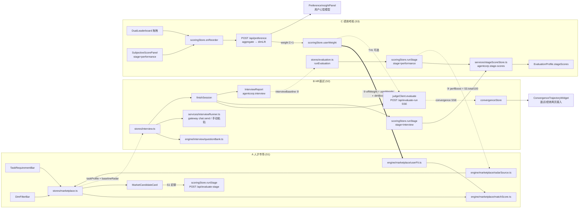

# AgentCorp · 三模块前端增量架构设计（人才市场 / HR面试 / 绩效考核 + 数据流贯通）

> 版本：v1.0-frontend-increment　|　日期：2026-07-30
> 作者：架构师 高见远（Gao）
> 配套输入：
> - `docs/scoring-standards-architecture.md`（后端契约 v1.0-arch，§3/§5/§7 必读）
> - `docs/convergence-layer3-architecture-increment.md`（Layer3 增量，§5/§6 必读）
> - 后端已 QA（133 pytest 全绿）：`model-service/app/scoring/{registry,rules_engine,stage_scorer,preference,task_sets,convergence,encoder}.py`、`serve.py`、`schemas.py`
>
> 定位：**前端增量架构设计 + 任务分解**。只做设计，不写实现代码。供主理人转交工程师实现。
> 设计红线：
> 1. **复用既有后端契约与前端引擎**（`RADAR_DIMS` / `StageScore` / `DualLeaderboard` / `PreferenceSignal` / `ConvergenceTrace`），**不重写后端**。
> 2. **Radix UI + Tailwind**（本工程无 @mui，且**不得引入** @mui 或任何新重依赖）；风格基准 = `components/ui/tabs.tsx`（Radix + `cn()`）与 `pages/Evaluation/Leaderboard.tsx`（`rounded-2xl border bg-white/60`）。
> 3. 类型命名严格复用 `types/evaluation.ts` / `types/convergence.ts` / `types/marketplace.ts` 既有键；**新增字段全部仅加法（optional）**，不破坏既有落库数据。
> 4. 落库沿用惰性 electron-store 模式（动态 `import('electron-store')`，参照 `services/preferenceStore.ts`）。

---

## 0. 设计摘要（给主理人速读）

- **一句话**：三模块 = 三阶段的前端载体 —— **人才市场 ≈ S1 初审**（六维雷达 + 智能匹配排序）、**HR面试 ≈ S2**（结构化多轮对话 + 多维评估 + 关键能力记录）、**绩效考核 ≈ S3**（双轨评分 + 双榜拖拽 + 偏好回灌 = 用户心智模型）；闭环靠一条已验证的后端通道落地：**绩效拖拽/主观分 → `/api/preference` → `dimLift` → `UserPreference.weight`（前端 `scoringStore.userWeight`）→ 人才市场 `matchScore` 的 `userFit` 项即时改序**。
- **页面动作**：增强 `pages/Marketplace`（六维筛选 + 任务需求智能排序 + S1 初审入口）、**新建 `pages/Interview`**（路由 `/interview` + Sidebar 导航）、增强 `pages/Evaluation`（新增 双轨/双榜/收敛/心智 四个面板，接入三个孤儿组件）。
- **重写 2 个 MUI 组件**（`SubjectiveScorePanel.tsx`、`DualLeaderboard.tsx`）为 Radix+Tailwind；`ConvergenceTrajectoryWidget.tsx` 已是 Radix，直接接入页面。
- **零新增重依赖**：滑块用原生 `<input type="range">` + Tailwind（不引 `@radix-ui/react-slider`）；拖拽复用已装 `@dnd-kit/*`；图表复用 `recharts`。
- **新增 2 个 store + 3 个服务 + 2 个引擎目录**，全部镜像既有模式（zustand / hostApiFetch / 惰性 electron-store）。
- 任务编号 **T30–T41**（接既有 T0–T21，不冲突），关键路径 `T30→T31→T32→T33`（市场）与 `T30→T34→T35→T36→T37`（面试）可双线并行，`T38/T39`（MUI 重写）随时并行。

---

## 1. 三模块 ↔ 三阶段映射（每个模块调哪些后端 API / 前端 store）

| 模块 | 阶段 | 后端 API（已存在，不重写） | 前端 store / 引擎（已存在 → 本次动作） | 前端 store / 引擎（本次新增） |
| -- | -- | -- | -- | -- |
| **A 人才市场** | S1 初审（preScreen） | `POST /api/evaluate-stage`（stage=preScreen，装配 S1 StageScore）；`GET /api/rules`（阶段权重/阈值） | `scoringStore.runStage` → 调 evaluate-stage；`scoringStore.userWeight`（心智权重，排序用）；`engine/scoring/registry.ts`（`RADAR_DIMS`/`JOB_GENERIC_WEIGHT`）；`utils/marketFilter.ts`（筛选/排序纯函数，**当前孤儿，本期接入**）；`services/githubImport.ts`（`heuristicReview` 六维启发式初审，**当前孤儿，本期接入**） | `engine/marketplace/{radarSource,userFit,taskMatch,matchScore}.ts`；`stores/marketplace.ts` |
| **B HR面试** | S2 面试（interview） | `POST /api/evaluate-run`（transcript+usage → judge 六维/craft，SSE）；`POST /api/evaluate-stage`（stage=interview 装配 S2 评分卡）；`POST /api/convergence/{trace,score,anchor}`（面试收敛轨迹） | `judgeClient.evaluate`（SSE 裁判，增可选 `convergence` 入参 + 两个 SSE 事件解析，仅加法）；`scoringStore.runStage/onScore/getSubjective`；`convergenceStore.initTrace/recordTurn/pinCandidate/commitPin/computeScore`；`engine/scoring/registry.ts`（`JOB_CRAFT_DIMS`/`SUBJECTIVE_DIMS`） | `engine/interview/{questionBank,dimTracker}.ts`；`stores/interview.ts`；`services/{interviewRunner,interviewStore,stageScoreStore}.ts` |
| **C 绩效考核** | S3 绩效（performance） | `POST /api/evaluate-run`（token/返工/完成度/时延客观评分）；`POST /api/evaluate-stage`（stage=performance 装配 S3 双轨评分卡）；`GET /api/leaderboard`（双榜）；`POST /api/preference`（偏好回灌）；`POST /api/convergence/score` | `stores/evaluation.ts`（`runEvaluation` 产出 radar/kpi/roi，**增 baseline 注入**，仅加法）；`scoringStore.onScore/onReorder/loadDualLeaderboard/userWeight/preferenceProfile`；`preferenceStore`（落库）；`leaderboardClient`；`convergenceStore` | `services/stageScoreStore.ts`（与 B 共用）；绩效页新增 4 个面板组件 |

> 三阶段权重契约（后端 rules preset 已钉死）：S1 obj/sub=0.6/0.4、S2 0.5/0.5、S3 0.7/0.3；verdict 阈值 78/50。前端只读 `/api/rules` 展示，不另写阈值（`utils/marketFilter.deriveQuickVerdict` 复用既有阈值同理）。

---

## 2. 前端现状复核结论（设计基线，已 Read 核实）

| 事实 | 证据 | 设计含义 |
| -- | -- | -- |
| 路由集中在 `src/App.tsx`（lazy + `MainLayout` 包裹），无独立 router 文件 | `App.tsx:204-226` | 新增 `/interview` 只需在 App.tsx 注册一条 lazy Route |
| Sidebar 导航在 `components/layout/Sidebar.tsx` `navItems` | `Sidebar.tsx:215-241` | 新增面试入口插一行 NavItem（lucide 图标，已装） |
| `Marketplace` 页用本地 `MarketplaceTemplate` 类型 + IPC `marketplace:listTemplates`，无六维 | `pages/Marketplace/index.tsx:14-34,79` | 六维不来自模板 IPC，需「六维解析层」三源供给（§5.1） |
| `types/marketplace.ts`（`MarketplaceAgent`/`InitialReview`/`MarketFilters`）与 `utils/marketFilter.ts` 已存在但**无人引用** | Glob + Read 复核 | 本期接入为市场筛选/排序底座，不重造 |
| `services/githubImport.ts` `heuristicReview()` 已产出六维 `InitialReview`，**无人引用** | `githubImport.ts:570-623` | 复用为「无评估数据候选」的 S1 启发式初审 |
| `EvaluationProfile` 当前**无** stageScores/jobType/craftLatest 字段 | `types/evaluation.ts:342-352` | §5.4 仅加法扩展 |
| `scoringStore.runStage` 只写内存、未落库 `agentcorp.stage-scores` | `stores/scoringStore.ts:179-199` | 新增 `services/stageScoreStore.ts` 并在 T37 接入 |
| `JudgeRunInput.preference.weight` 契约已存在但无人传 | `services/judgeClient.ts:37-41` | T41 把 `scoringStore.userWeight` 注入（心智模型进裁判 user_fit） |
| 前端**无** `compute_user_fit` 镜像（`utils/radar.ts` 不存在） | Grep 全仓 | T31 新建 `engine/marketplace/userFit.ts`，公式镜像后端 §7.6 |
| `RadarChart` 已支持 `baseline` prop | `pages/Evaluation/RadarChart.tsx:17-21,49` | 绩效页「面试基线 vs 当前」零改造成本；市场卡片迷你雷达直接复用 |
| `ChatInput` 接口简单（`onSend/onStop/disabled/sending`） | `pages/Chat/ChatInput.tsx:54,106` | 面试页直接复用；`ChatMessage` 与 session 体系耦合深，面试气泡自建轻量组件 |
| 三个孤儿组件：`SubjectiveScorePanel`（MUI）、`DualLeaderboard`（MUI）、`ConvergenceTrajectoryWidget`（Radix） | Read 复核 | 前两个重写（§8），第三个直接接页面 |
| 无 `@radix-ui/react-slider`；有 dialog/select/switch/progress/tabs/tooltip/radio-group 等 | `package.json:100-112` | 滑块 = 原生 range input + Tailwind，零新依赖 |

---

## 3. 页面结构与组件树

### 3.1 A) 人才市场（增强 `src/pages/Marketplace/index.tsx`）— S1 初审 + 智能匹配

```text
Marketplace（增强）
├── Header（既有：标题 + 上架我的员工）
├── <TaskRequirementBar/>            【新增】任务需求输入条
│     ├── Input：自然语言需求（"要一个稳定又便宜的后端 agent"）
│     ├── Select：工种（全部 / image / text / code）—— ui/select
│     ├── Select：排序（智能匹配 matchScore / 初审分 / 报价 / 性价比）
│     └── 心智权重指示：当前 userWeight 相对默认的 top-2 偏移（tooltip 展示，证明回灌生效）
├── <DimFilterBar/>                  【新增】六维能力标签筛选条
│     └── 6 个维度 chip（task/quality/comm/creativity/reliability/cost），
│         点击循环阈值 0→3→3.5→4→4.5，>0 即硬过滤（候选六维 ≥ 阈值）
├── Search & 既有 tag Filter / HireType Toggle（既有，保留）
├── CandidateGrid（既有 grid 改造）
│     └── <MarketCandidateCard/>     【新增，替换现有内联卡片】
│           ├── 头像/名称/tags/价格/已雇佣（既有视觉元素平移）
│           ├── <RadarChartView score={radar} height={140}/>  【复用】迷你六维
│           ├── <MatchScoreBadge/>   【新增】matchScore 总分 + tooltip 分解
│           │     （fit / tag / costPerf / perfBoost 四项，ui/tooltip）
│           ├── 「S1 初审」按钮（无六维时显示）→ scoringStore.runStage(preScreen)
│           ├── 绩效徽章（有 S3 StageScore 时：total 分 + verdict 色块）
│           └── 雇佣按钮（既有 IPC marketplace:hireSingle/hireTeam，不动）
└── 上架 / 购买成功 Modal（既有，不动）
```

交互要点：无六维的候选卡片**先显示「S1 初审」按钮**（点击后启发式种子 + `/api/evaluate-stage` 得六维），有六维后直接显示雷达与 matchScore；筛选/排序全部前端纯函数（离线可用）。

### 3.2 B) HR面试（新建 `src/pages/Interview/index.tsx` + 路由 `/interview`）— S2 结构化对话评估

```text
Interview（新建，三栏布局，风格对齐 Evaluation 页）
├── 左栏 <InterviewCandidatePanel/>          【新增】
│     ├── agent 列表（stores/agents + 市场带来的 taskProfile 摘要卡）
│     ├── 当前面试的 taskRequirement 展示（来自市场 TaskRequirementBar）
│     └── 「开始面试」→ interviewStore.startSession(agentId, taskProfile)
├── 中栏 <InterviewThread/>                  【新增】
│     ├── 消息流：<InterviewBubble/>（HR 问 / Agent 答，轻量自建，不碰 Chat session 体系）
│     ├── <FollowupSuggestChips/>（追问建议 = 当前证据覆盖最低的 2 个维度）
│     └── <ChatInput onSend/>（复用 pages/Chat/ChatInput）
├── 右栏 Tabs（ui/tabs：评估 / 收敛 / 基线）
│     ├── 评估：<DimScoreboard/>             【新增】六维+craft 覆盖度与评分（ui/progress 条）
│     │        + <SubjectiveScorePanel stage="interview"/>（重写版，§8.1）
│     ├── 收敛：<ConvergenceTrajectoryWidget trace score anchor/>（孤儿组件接入）
│     │        + 「置顶理想方向」按钮 → convergenceStore.pinCandidate（explicit_pin）
│     └── 基线：<RadarChartView score={currentRadar} baseline={marketBaseline}/>（复用）
└── FooterBar：「结束面试」→ interviewStore.finishSession()
        → judgeClient.evaluate(transcript)（SSE 六维）
        → scoringStore.runStage(stage=interview) 装配 S2 StageScore
        → InterviewReport 落库（agentcorp.interview）→ 写入 EvaluationProfile.interviewBaseline
```

面试流程（多轮递进）：`questionBank` 按工种给出三阶段题序 —— **P1 理解力轮**（复述需求/澄清提问，target=`task/comm`）、**P2 craft 探针轮**（按 `JOB_CRAFT_DIMS[jobType]` 逐维出题，如 code 出「跑一下这段代码并解释输出」探 `code_runnability`）、**P3 压力轮**（可靠性/成本取舍题，target=`reliability/cost`）。每轮记录 `InterviewTurn`（§5.3），HR 可随时点追问建议 chip 插入针对弱维的追加题。

### 3.3 C) 绩效考核（增强 `src/pages/Evaluation/index.tsx`）— S3 双轨 + 心智模型

左栏 agent 列表既有不动（增加一个「有面试基线」小标记）。右栏 `PANELS` 由 4 个扩到 7 个：

| Panel | 状态 | 内容 |
| -- | -- | -- |
| `radar` | 增强 | `<RadarChartView score baseline={interviewBaseline.radar}/>`（baseline prop 已存在，只传值） |
| `roi` / `lifecycle` / `leaderboard` | 既有 | 不动 |
| `dual` | **新增** | `<DualTrackScoreCard/>`（客观轨：token 用量/返工率/完成度/思考时延 来自 `kpiLatest`+`roiLatest`+judge；主观轨：`SubjectiveScorePanel stage="performance"`；加权 total = `runStage(performance)` 返回的 `StageScore.total`，权重 0.7/0.3 来自 rules preset 展示） |
| `dualBoard` | **新增** | `<DualLeaderboard stage="performance" jobType/>`（重写版 §8.2，客观榜 + 可拖拽主观榜 + 发散高亮；拖拽即偏好回灌） |
| `convergence` | **新增** | `<ConvergenceTrajectoryWidget/>`（孤儿组件接入，按当前 runId 取 `convergenceStore`） |
| `preference` | **新增** | `<PreferenceInsightPanel/>`（用户心智模型：当前 `userWeight` vs `DEFAULT_WEIGHT` 六维条形对比 + `preferenceProfile.dimLift` 累计 + 信号数 N；recharts BarChart） |

---

## 4. 文件清单（新增 / 增强 / 重写，相对 `agentcorp/`）

### 4.1 新增

| 路径 | 模块 | 职责 |
| -- | -- | -- |
| `src/engine/marketplace/radarSource.ts` | A | 六维三源解析（§5.1）：evaluation profile → S1 stageScore → 启发式初审 |
| `src/engine/marketplace/userFit.ts` | A | `computeUserFit(radar, weight)` 镜像后端公式（§7.6 契约）+ `applyTaskBoost` |
| `src/engine/marketplace/taskMatch.ts` | A | 需求文本 → `TaskProfile`（关键词 → dimBoost/jobType/tags，确定性词典） |
| `src/engine/marketplace/matchScore.ts` | A | `matchScore(candidate, taskProfile, ctx)` 排序纯函数（§6） |
| `src/engine/interview/questionBank.ts` | B | 三工种结构化递进题库（P1/P2/P3，每题带 `targetDims`） |
| `src/engine/interview/dimTracker.ts` | B | 逐轮聚合维度证据覆盖度 → 追问建议（覆盖最低 2 维） |
| `src/stores/marketplace.ts` | A | 市场页状态：taskProfile、dimFilters、sortKey、candidates（含六维/matchScore）、`runPrescreen` 动作 |
| `src/stores/interview.ts` | B | 面试会话编排：startSession/appendTurn/finishSession、dimCoverage、baseline 对接 |
| `src/services/interviewRunner.ts` | B | Agent 回答通道：优先 gateway `chat.send`（真实调度，取 runId），降级「手动粘贴回答」模式 |
| `src/services/interviewStore.ts` | B | `InterviewReport` 落库（electron-store `agentcorp.interview`，惰性模式） |
| `src/services/stageScoreStore.ts` | B/C | `StageScore` 落库（electron-store `agentcorp.stage-scores`，key=`agentId:stage`）；补 `scoringStore.runStage` 的落库缺口 |
| `src/types/interview.ts` | B | 面试类型契约（§5.3） |
| `src/components/marketplace/TaskRequirementBar.tsx` | A | 需求输入 + 工种/排序选择 |
| `src/components/marketplace/DimFilterBar.tsx` | A | 六维阈值筛选 chips |
| `src/components/marketplace/MarketCandidateCard.tsx` | A | 候选卡（迷你雷达 + matchScore + S1 初审 + 绩效徽章） |
| `src/components/marketplace/MatchScoreBadge.tsx` | A | 匹配分徽章 + 四项分解 tooltip |
| `src/components/interview/InterviewCandidatePanel.tsx` | B | 左栏候选与任务摘要 |
| `src/components/interview/InterviewThread.tsx` | B | 中栏消息流容器 |
| `src/components/interview/InterviewBubble.tsx` | B | 单条问答气泡（Radix 风 Tailwind） |
| `src/components/interview/FollowupSuggestChips.tsx` | B | 追问建议 chips |
| `src/components/interview/DimScoreboard.tsx` | B | 维度覆盖度/评分面板 |
| `src/components/evaluation/DualTrackScoreCard.tsx` | C | 双轨评分卡（客观轨 KPI/ROI/token 指标条 + 主观轨 + 加权 total） |
| `src/components/evaluation/PreferenceInsightPanel.tsx` | C | 用户心智模型面板（weight 对比 + dimLift） |

### 4.2 增强（修改既有文件，仅加法）

| 路径 | 模块 | 改动 |
| -- | -- | -- |
| `src/types/marketplace.ts` | A | 增 `TaskRequirement`/`TaskProfile`/`MatchScoreBreakdown`/`MarketCandidateView`（§5.2） |
| `src/types/evaluation.ts` | B/C | `EvaluationProfile` 增 `jobType?`/`stageScores?`/`subjectiveLatest?`/`subjectiveHistory?`/`craftLatest?`/`interviewBaseline?`（§5.4） |
| `src/pages/Marketplace/index.tsx` | A | 接入 marketplaceStore：TaskRequirementBar/DimFilterBar/卡片网格换 `MarketCandidateCard`；保留 IPC 雇佣与 Modal |
| `src/pages/Evaluation/index.tsx` | C | `PANELS` 增 dual/dualBoard/convergence/preference；radar 面板传 baseline；左栏加基线标记 |
| `src/services/judgeClient.ts` | B | `JudgeRunInput` 增可选 `convergence?: { k?: number; captureSummaries?: boolean }`；SSE `parseBlock` 增 `convergence_update`/`convergence_score` 两类事件解析（当前对未知事件返回 null，纯加法） |
| `src/stores/scoringStore.ts` | B/C | `runStage` 成功后调 `stageScoreStore.save` + 回写 `EvaluationProfile.stageScores`（经 evaluation store） |
| `src/stores/evaluation.ts` | C | `runEvaluation` 增：读取最新 `InterviewReport` → 写 `profile.interviewBaseline`；judgeInput.preference.weight 注入 `scoringStore.userWeight`（T41） |
| `src/App.tsx` | B | 注册 `/interview` lazy Route |
| `src/components/layout/Sidebar.tsx` | B | `navItems` 增面试入口（lucide `MessagesSquare` 图标） |

### 4.3 重写（MUI → Radix+Tailwind）

| 路径 | 动作 | 说明 |
| -- | -- | -- |
| `src/components/evaluation/SubjectiveScorePanel.tsx` | **重写** | 去 `@mui/material/{Box,Typography,Slider,Stack}` → Tailwind 布局 + 原生 `<input type="range">`（0–5/0.5 步进）+ `ui/tooltip`；props 契约不变（`agentId/stage/labels`），调用方零改 |
| `src/components/evaluation/DualLeaderboard.tsx` | **重写** | 去 `@mui/material/{List,ListItem,Chip,Paper,...}` → Tailwind 双栏卡片（`rounded-2xl border bg-white/60` 风格）；**保留** `@dnd-kit` 拖拽与 `onReorder`/`setAnchor` 逻辑不变；props 契约不变（`stage/jobType`） |

> `ConvergenceTrajectoryWidget.tsx` 已是 Radix+Tailwind，**不重写**，仅接入页面。

---

## 5. 数据模型 / 类型增补

### 5.1 AgentSummary 如何获得六维（**不改 host `/api/agents` 契约**）

`AgentSummary`（`types/agent.ts:8-31`）不加字段。六维由**解析层** `engine/marketplace/radarSource.ts` 按优先级三源供给：

```typescript
// src/engine/marketplace/radarSource.ts（新增）
export type RadarSourceKind = 'evaluation' | 'prescreen' | 'heuristic' | 'none';
export interface AgentRadarResolution {
  radar: RadarScore | null;
  source: RadarSourceKind;          // 供卡片角标「已评估/初审/预估」
  stageScoreTotal?: number;         // S3 total（绩效徽章 + perfBoost）
  verdict?: Verdict;
}
// 优先级：
// 1. evaluation  —— evaluationStore.profiles[agentId].radarLatest（绩效域真相）
// 2. prescreen   —— stageScoreStore 最新 S1 StageScore 的六维（市场初审）
// 3. heuristic   —— githubImport.heuristicReview / persona 启发式（仅 github_import 候选）
// 4. none        —— 卡片显示「S1 初审」按钮
```

市场模板卡（IPC `marketplace:listTemplates`）雇佣后产生真实 agentId，六维走同一解析层；模板态用 `heuristicReview` 的 persona 启发式种子或「S1 初审」按钮触发 `runStage(preScreen)`。

### 5.2 `src/types/marketplace.ts` 增补（仅加法）

```typescript
/** 任务需求（市场页输入，流向面试维度与排序） */
export interface TaskRequirement {
  text: string;                     // 自然语言需求
  jobType: JobType | 'all';         // 期望工种（UI 选择）
  tags: string[];                   // 需求关键词标签（taskMatch 派生 + 手改）
}

/** taskMatch.ts 派生的任务画像（排序输入） */
export interface TaskProfile {
  jobType: JobType | null;          // 文本推断工种（null=不限）
  dimBoost: Partial<Record<RadarDim, number>>;  // 维度强调系数（缺省 1）
  tags: string[];                   // 需求标签（Jaccard 匹配用）
}

/** 匹配分分解（MatchScoreBadge tooltip 用） */
export interface MatchScoreBreakdown {
  total: number;                    // 0–100
  userFit: number;                  // 0–1，六维加权契合（含心智权重 × 任务强调）
  tagMatch: number;                 // 0–1，Jaccard
  costPerf: number;                 // 0–1，性价比归一
  perfBoost: number;                // 0–1，S3 绩效回流（无绩效=0.5 中性）
  weights: { fit: number; tag: number; cost: number; perf: number };
}

/** 市场候选统一视图（模板卡 / 已雇佣 agent / github 导入 三源归一） */
export interface MarketCandidateView {
  id: string;                       // templateId 或 agentId
  agentId?: string;                 // 已雇佣时存在
  name: string; description: string; tags: string[];
  hireType: 'single' | 'team'; price: string; budgetNum: number;
  avatar: string; rating: number; hiredCount: number;
  jobType: JobType | null;
  radarResolution: AgentRadarResolution;   // §5.1
  match?: MatchScoreBreakdown;
}
```

### 5.3 `src/types/interview.ts`（新增）—「面试关键能力数据」= S3 绩效基线输入

```typescript
import type { JobType, RadarDim, RadarScore, SubjectiveDim, SubjectiveScore, CraftDim } from './evaluation';

export type InterviewPhase = 'P1_understanding' | 'P2_craft_probe' | 'P3_pressure';

/** 题库单题（questionBank.ts） */
export interface InterviewQuestion {
  qId: string;
  phase: InterviewPhase;
  jobType: JobType | 'any';
  prompt: string;                   // HR 提问文本
  targetDims: (RadarDim | CraftDim)[];  // 本题考查维度（流向 DimScoreboard/追问建议）
  followups?: string[];             // 预设追问
}

/** 单轮关键能力数据（自动记录 + HR 标注） */
export interface InterviewTurn {
  turn: number;                     // 1..N
  qId: string;
  question: string;
  targetDims: (RadarDim | CraftDim)[];
  replyText: string;                // agent 回答（interviewRunner 真实调度或手动粘贴）
  replyLatencyMs: number | null;    // 思考时间（真实调度可测，手动=null）
  tokensUsed: number | null;        // token 用量（捕获 runId 时由 tokenUsageCollector 补）
  runId?: string;                   // gateway chat.send 返回的执行主键（对齐评估捕获点）
  hrRatings: Partial<Record<RadarDim, number>>;  // HR 快评 0–5（可选，进主观分先验）
  evidenceNote?: string;            // HR 证据备注
  ts: string;
}

/** 面试报告（落库 agentcorp.interview，key=interviewId；S3 基线的载体） */
export interface InterviewReport {
  interviewId: string;
  agentId: string;
  jobType: JobType;
  stage: 'interview';
  taskRequirement: TaskRequirement;          // ① 市场能力标签/需求流入的锚点
  baselineRadar: RadarScore | null;          // 面试前六维（市场/评估域带来）
  turns: InterviewTurn[];
  dimEvidence: Partial<Record<string, string[]>>; // 维度 → 证据句聚合（dimTracker）
  metrics: {                                 // 自动记录的关键能力数据（S3 基线输入）
    avgReplyLatencyMs: number | null;        //   思考时间基线
    totalTokens: number | null;              //   token 消耗基线
    clarificationCount: number;              //   agent 主动澄清次数（收敛前置信号）
    followupCount: number;                   //   被追问次数（理解力负向信号）
    coverageRatio: number;                   //   targetDims 覆盖比（题库命中度）
  };
  finalRadar: RadarScore | null;             // judge 全程 transcript 评分（S2 六维）
  stageScoreTotal: number | null;            // runStage(interview) 的 S2 total
  subjective: SubjectiveScore | null;        // SubjectiveScorePanel(stage=interview)
  convergenceRunId?: string;                 // 关联 ConvergenceTrace（收敛轨迹）
  recommendation: 'hire' | 'hold' | 'reject';
  notes?: string;
  createdBy: string;
  ts: string;
}
```

**作为 S3 基线的消费方式**（T37/T40 落地）：
1. `evaluationStore.runEvaluation` 启动时读最新 `InterviewReport` → 写 `EvaluationProfile.interviewBaseline = { radar: finalRadar ?? baselineRadar, metrics, reportId, ts }`；
2. 绩效页 radar 面板 `<RadarChartView baseline>` 叠加「面试基线 vs 当前绩效」delta；
3. `metrics`（时延/token/澄清率）仅作**基线展示与 HR 主观打分参考**，不并入 `KpiRecord` 客观聚合（防污染遥测真相）；
4. `stageScoreTotal`（S2）进入 `profile.stageScores[]`，供三阶段轨迹与绩效页展示。

### 5.4 `src/types/evaluation.ts` 增补（仅加法，对齐架构 §3.6 既有规划）

```typescript
export interface EvaluationProfile {
  // —— 既有字段（不变）——
  agentId: string; radarLatest: RadarScore; radarHistory: RadarScore[];
  kpiLatest: KpiRecord; kpiHistory: KpiRecord[]; roiLatest: RoiSnapshot;
  lifecycle: LifecycleState; runIds: string[]; updatedAt: string;
  // —— 本期加法（全部 optional，向后兼容既有落库）——
  jobType?: JobType;
  stageScores?: StageScore[];                 // S1/S2/S3 评分卡（stageScoreStore 同步）
  subjectiveLatest?: SubjectiveScore;
  subjectiveHistory?: SubjectiveScore[];
  craftLatest?: Record<string, number>;       // Q7 craft 维
  interviewBaseline?: {                       // ② 面试 → 绩效基线
    radar: RadarScore;
    metrics: InterviewReport['metrics'];
    reportId: string;
    ts: string;
  };
}
```

---

## 6. 智能排序 / 匹配算法（人才市场，可直接实现）

全部纯函数，落在 `engine/marketplace/{userFit,taskMatch,matchScore}.ts`，可单测。

**Step 1 · 任务画像抽取**（`taskMatch.ts`，确定性词典，不调模型）：

```text
extractTaskProfile(text) → TaskProfile
  - jobType 推断：图/画/海报/UI→image；文/稿/翻译/文案→text；码/脚本/接口/bug→code（无命中=null）
  - dimBoost 词典（可配，默认）：
      快|省|便宜|低成本        → cost ×1.5
      稳定|靠谱|不翻车|生产级   → reliability ×1.5
      创意|好看|设计|审美       → creativity ×1.4, quality ×1.2
      沟通|解释|文档            → comm ×1.4
      质量|精致|高质量          → quality ×1.4
      全能|独立完成             → task ×1.3
  - tags = 命中的关键词集合（Jaccard 用）
```

**Step 2 · 有效权重（心智 × 任务）**（`userFit.ts`）：

```text
effWeight = normalize( userWeight[d] × (dimBoost[d] ?? 1) )     // Σ=1
userFit   = Σ_d (radar[d] / 5) × effWeight[d]                   // ∈[0,1]
```

`userWeight` 来自 `scoringStore.userWeight`（默认 `DEFAULT_WEIGHT`，拖拽回灌后更新）——**这就是「绩效结果 → 市场匹配权重」的执行点**（§7.3）。

**Step 3 · 四维加权**（`matchScore.ts`）：

```text
tagMatch  = |tags(task) ∩ tags(candidate)| / |tags(task) ∪ tags(candidate)|   // 空集→0.5 中性
costPerf  = clamp( (mean(radar)/5) / (budgetNum / budgetRef), 0, 1 )          // budgetRef=当前列表最高报价
perfBoost = s3Total != null ? s3Total/100 : 0.5                                // S3 回流，无绩效中性

matchScore.total = 100 × ( 0.50·userFit + 0.20·tagMatch + 0.15·costPerf + 0.15·perfBoost )
```

- 无六维候选：`userFit` 用 `null`，排序沉底 + 显示「S1 初审」按钮（不参与 matchScore 计算）；
- 权重 `(0.5/0.2/0.15/0.15)` 为默认值，放入 `MarketFilters` 扩展或常量，主理人可在验收时拍板微调；
- 与既有 `sortMarketAgents` 的关系：新 sort key `'match'` 走 `matchScore.total`，既有 review/budget/costperf 三档保留（复用 `initialReviewScore`/`costPerfScore`）。

---

## 7. 数据流闭环设计（重点）

### 7.1 ① 人才市场能力标签 → 面试评估维度

**载体**：`TaskRequirement` / `TaskProfile`（types/marketplace.ts）+ `MarketCandidateView.radarResolution`。

**机制**：市场页 `marketplaceStore` 持有 `taskProfile` 与选中候选；「发起面试」按钮 `navigate('/interview?agentId=…')` 后，`interviewStore.startSession(agentId, taskProfile)` 消费：
- `taskProfile.jobType` → 选题库（`questionBank[jobType]`）与 craft 探针维（`JOB_CRAFT_DIMS[jobType]`）；
- `taskProfile.dimBoost` 的高权维 → 追加进 P2/P3 的 `targetDims`（市场筛的是什么，面试就重点验什么）；
- `radarResolution.radar` → `InterviewReport.baselineRadar`（右栏基线 Tab 的对比锚点）。

### 7.2 ② 面试记录 → 绩效考核基线

**载体**：`InterviewReport`（electron-store `agentcorp.interview`）+ `EvaluationProfile.interviewBaseline` + `profile.stageScores[]`。

**机制**：面试结束 `finishSession()` 依次：
1. 全程 transcript → `judgeClient.evaluate`（SSE 六维，即 `/api/evaluate-run`）→ `finalRadar`；
2. `scoringStore.runStage({stage:'interview', objective: finalRadar∪hrRatings, subjective: getSubjective(...)})` → S2 `StageScore`（0.5/0.5 权重）→ `stageScoreStore.save` + 回写 `profile.stageScores`；
3. `InterviewReport` 落库（含 `metrics` 关键能力数据）；
4. 绩效页下次 `runEvaluation` 自动读取 → `interviewBaseline`（§5.3 四种消费方式）。

### 7.3 ③ 绩效结果 → 人才市场匹配权重（dimLift → UserPreference.weight 落地）

**载体**：`PreferenceSignal` / `PreferenceProfile.dimLift` / `scoringStore.userWeight` / `matchScore.userFit` / `perfBoost`。两条通道均已由后端 QA 验证，前端只需接线：

**通道 A（心智权重，主通道）**——复用既有 T8 回灌链，零后端改动：
```text
绩效页 DualLeaderboard 拖拽（或 SubjectiveScorePanel 打分）
  → scoringStore.onReorder(agentId, src, dst, {stage:'performance', jobType, craftScores})
  → preferenceStore.appendSignal（agentcorp.preference 落库）
  → POST /api/preference（signals + currentWeight）
  → preference.py aggregate → dimLift（被提升 agent 的强 craft 维 → CRAFT_LINKS → 通用六维）
  → apply_to_user_preference：w'[d] = w[d]·(1 + α·dimLift[d]/N)，α=0.15，Σ=1 重归一
  → 响应 weight → scoringStore.userWeight 更新
  → 市场页 matchScore 的 effWeight = normalize(userWeight ∘ dimBoost) 即时改变 → 列表重排
```
「用户心智模型」由此成形：不同工种的评分倾向（在 performance 阶段的拖拽/主观分）经 `dimLift` 聚合进六维权重，市场排序下一帧即反映 owner 口味。心智模型可视化 = `PreferenceInsightPanel`（weight vs 默认 + dimLift 累计）。

**通道 B（绩效分回流，辅通道）**：S3 `StageScore.total` → `radarSource` 解析层的 `stageScoreTotal` → `matchScore.perfBoost = total/100`（权重 0.15），干得好的人在市场直接升序。

**通道 C（裁判侧体现，可选增强，T41）**：`evaluationStore.runEvaluation` 组装 `JudgeRunInput.preference.weight = scoringStore.userWeight`（契约字段已存在，`judgeClient.ts:37-41`），让 S3 裁判的 `user_fit` 也按心智权重计算——闭环在客观分内部再深一层。

### 7.4 收敛支撑（Layer3 贯穿三模块）

- **面试 = 天然收敛场景**：`judgeClient` 增可选 `convergence` 入参（后端 T16 已支持）→ SSE `convergence_update`/`convergence_score` → `convergenceStore.recordTurn/score`；HR「置顶理想方向」= `pinCandidate`（explicit_pin 锚点，MVP 合法源）；面试页收敛 Tab 直接挂 `ConvergenceTrajectoryWidget`。
- **绩效页**：convergence 面板按 runId 展示同一 widget；`convergence_score` 仅作 Layer3 独立视图，**不进客观榜**（遵守既有 C4/O8 红线）。
- **市场页**（可选徽章）：候选最近 `convergence_score ≥ 阈值` 显示「收敛佳」小标（数据从 `agentcorp.convergence` 缓存读，失败静默）。

### 7.5 数据流图（Mermaid）



---

## 8. MUI → Radix+Tailwind 重写方案

### 8.1 `SubjectiveScorePanel.tsx`（T38）

| 现状（MUI） | 重写为 |
| -- | -- |
| `Box/Stack spacing` | `div className="space-y-4 rounded-2xl border bg-white/60 p-4"` |
| `Typography variant/caption` | `h3/p` + Tailwind 文字阶（对齐 Evaluation 页风格） |
| `Slider min0 max5 step0.5 marks valueLabelDisplay` | 原生 `<input type="range" min=0 max=5 step=0.5>` + `accent-[#FFD233]` + 右侧 `span` 实时值；刻度用 `flex justify-between` 的 0/1/2/3/4/5 文本行 |

**props 契约不变**（`agentId/stage/labels`），`useScoringStore` 读写逻辑原样保留 —— 调用方（面试页/绩效页）零适配。

### 8.2 `DualLeaderboard.tsx`（T39）

| 现状（MUI） | 重写为 |
| -- | -- |
| `Paper variant=outlined` | `section className="flex-1 min-w-[280px] rounded-2xl border bg-white/60 p-3"` |
| `List/ListItem/ListItemText` | `ul/li` + Tailwind（行 = `flex items-center justify-between rounded-xl px-3 py-2`） |
| `Chip color=warning Δ` | `span className="rounded-full bg-amber-100 px-2 py-0.5 text-[10px] font-bold text-amber-700"` |
| `Divider` | `ui/separator` |

**保留不动**：`@dnd-kit/core+sortable` 全部拖拽逻辑、`handleDragEnd` 中 `onReorder`（T8 回灌）与 `setAnchor`（T19 锚点回填）调用、发散高亮规则、底部「拖拽仅为偏好 overlay」说明文案。props（`stage/jobType`）不变。

---

## 9. 任务列表（T30–T41，有序、含依赖、按实现顺序）

> 依赖 `A → B` 表示 B 依赖 A。双主线可并行：市场线 T30→T31→T32→T33；面试线 T30→T34→T35→T36→T37；MUI 重写 T38/T39 独立并行。

| ID | 任务 | 新增/修改文件 | 依赖 | 交付判据 |
| -- | -- | -- | -- | -- |
| **T30** | 类型契约增补（三模块同源） | `types/marketplace.ts`（§5.2）、`types/interview.ts`（新，§5.3）、`types/evaluation.ts`（EvaluationProfile 加法，§5.4） | — | 三类增补编译通过；全部为 optional 加法；命名复用 RadarDim/JobType/StageScore |
| **T31** | 六维解析层 + userFit 引擎 | `engine/marketplace/radarSource.ts`、`engine/marketplace/userFit.ts` | T30 | 三源优先级正确；`computeUserFit` 与后端 §7.6 公式一致（单测对拍：给定 radar+weight 值相同）；`applyTaskBoost` 归一 Σ=1 |
| **T32** | 匹配排序引擎 + 市场 store | `engine/marketplace/taskMatch.ts`、`engine/marketplace/matchScore.ts`、`stores/marketplace.ts`、`services/stageScoreStore.ts`（新，供解析层读 S1/S3） | T31 | §6 公式实现；matchScore 四项分解正确；taskMatch 词典单测覆盖 6 类关键词；无六维候选沉底 |
| **T33** | 市场页 UI 增强 | `pages/Marketplace/index.tsx`、`components/marketplace/{TaskRequirementBar,DimFilterBar,MarketCandidateCard,MatchScoreBadge}.tsx` | T32 | 六维阈值硬过滤生效；智能排序实时反映 userWeight 变化（改 scoringStore.userWeight 即重排）；S1 初审按钮 → runStage(preScreen) 后卡片出雷达；雇佣 IPC 流程回归不破 |
| **T34** | 面试题库引擎 + 维度追踪 | `engine/interview/questionBank.ts`、`engine/interview/dimTracker.ts` | T30 | 三工种 × P1/P2/P3 题库各 ≥6 题且带 targetDims；dimTracker 输出覆盖最低 2 维作为追问建议；taskProfile.dimBoost 高权维注入 targetDims |
| **T35** | 面试 store + 回答通道 + 落库服务 | `stores/interview.ts`、`services/interviewRunner.ts`、`services/interviewStore.ts` | T34 | startSession 消费 taskProfile+baseline（①贯通）；appendTurn 记录 metrics（时延/token/澄清/追问）；runner 双模式（gateway 真实调度 / 手动粘贴）可切换；finishSession 产出完整 InterviewReport 落库 |
| **T36** | 面试页面 + 路由 + 导航 | `pages/Interview/index.tsx`、`components/interview/*`（5 个）、`App.tsx`、`components/layout/Sidebar.tsx` | T35 | 三栏布局成跑；ChatInput 复用正常；DimScoreboard 随轮次更新；右栏 Tabs 挂 SubjectiveScorePanel（重写版接口）与 ConvergenceTrajectoryWidget；路由 `/interview` 与 Sidebar 入口可见 |
| **T37** | 面试 → S2 评分卡 + 基线回写（②贯通） | `services/judgeClient.ts`（convergence 可选入参 + 2 事件解析）、`stores/scoringStore.ts`（runStage 接 stageScoreStore + 回写 profile.stageScores）、`stores/evaluation.ts`（interviewBaseline 读取） | T35 | finishSession 后：finalRadar 由 judge 产出；S2 StageScore 落库并回写 profile；绩效页再评估时 interviewBaseline 自动注入；convergence 事件进 convergenceStore |
| **T38** | 重写 SubjectiveScorePanel（MUI→Radix+Tailwind） | `components/evaluation/SubjectiveScorePanel.tsx` | —（建议 T30 后做，类型对齐） | 零 @mui import；原生 range 0–5/0.5；props 契约不变；onScore 行为回归一致 |
| **T39** | 重写 DualLeaderboard（MUI→Tailwind）+ 接入绩效页 | `components/evaluation/DualLeaderboard.tsx`、`pages/Evaluation/index.tsx`（dualBoard 面板） | T38 | 零 @mui import；拖拽/onReorder/setAnchor 逻辑不变；绩效页双榜面板可视可拖，发散高亮正确 |
| **T40** | 绩效页双轨 + 心智 + 收敛 + 基线面板 | `components/evaluation/{DualTrackScoreCard,PreferenceInsightPanel}.tsx`、`pages/Evaluation/index.tsx`（dual/convergence/preference 面板、radar 传 baseline） | T37,T38,T39 | dual 面板客观轨（token/返工/完成度/时延）+ 主观轨 + 加权 total（0.7/0.3）正确；preference 面板展示 weight 偏移与 dimLift；convergence 面板 widget 出图；radar 面板基线叠加 |
| **T41** | 闭环联调 + 裁判侧心智注入（③贯通收口） | `stores/evaluation.ts`（judgeInput.preference.weight=userWeight）、`engine/marketplace/radarSource.ts`（perfBoost 接 S3 total）、E2E 冒烟脚本/手测清单 | T33,T40 | 全链路冒烟：市场筛选 → 发起面试 → 完成面试 → 绩效双轨评分 → 双榜拖拽 → 市场排序即时变化（userWeight 生效）+ perfBoost 徽章出现；typecheck/lint 全绿 |

> **实现顺序建议**：T30 →（T31→T32→T33 ∥ T34→T35→T36→T37 ∥ T38→T39）→ T40 → T41。

---

## 10. 待确认事项（需主理人 / 用户拍板）

| # | 事项 | 现状 / 建议 | 由谁拍板 |
| -- | -- | -- | -- |
| Q1 | **Agent 回答通道默认模式**：interviewRunner 设计了「gateway `chat.send` 真实调度（可测时延/token、拿 runId）」与「手动粘贴回答」双模式。默认开哪个？ | 建议默认真实调度、失败自动降级手动；但真实调度消耗 token，需确认 | 主理人 + owner |
| Q2 | **面试官是人还是模型**：本期题库由 HR（人）逐题点选/发送，`FollowupSuggestChips` 仅给建议。是否要做「LLM 自动面试官」（judge 代问）？ | 建议本期不做，题库+追问建议已满足「结构化多轮」；自动面试官列为后续里程碑 | owner |
| Q3 | **matchScore 权重**（0.50 fit / 0.20 tag / 0.15 cost / 0.15 perf）与 dimBoost 词典系数（1.2–1.5） | 建议值已实现即可调；验收时按体感拍板 | owner |
| Q4 | **userWeight 是否注入裁判**（T41 通道 C：`JudgeRunInput.preference.weight`） | 契约字段已存在、注入仅加法；建议注入让 S3 的 user_fit 也体现心智模型，但会改变既有评估数值口径 | owner |
| Q5 | **模板卡 S1 初审的深度**：IPC 模板无六维，「S1 初审」用启发式种子（零成本）还是直接调 judge（有成本、更准）？ | 建议默认启发式 + 卡片提供「深度初审」二级动作调 judge | 主理人 |
| Q6 | **收敛徽章进市场**（§7.4 可选）：候选展示最近 convergence_score | 建议首版不进市场卡，收敛视图留在面试/绩效页，避免市场信息过载 | owner |
| Q7 | **ownerId**：偏好/锚点均按 ownerId 隔离，本期单机默认 `'default'`（沿用既有 scoringStore 默认） | 维持 default；多 owner 接入前再议（对齐既有 O2） | 主理人 |
| Q8 | **面试基线是否参与 KpiRecord**：本期设计 metrics 仅展示、不并入遥测聚合（防污染） | 建议维持不并入；若要做「基线 vs 实际」的量化偏离度指标，另立任务 | 架构 + owner |

---

## 11. 风险与缓解

| 风险 | 等级 | 影响 | 缓解 |
| -- | -- | -- | -- |
| R-F1 市场模板卡六维缺失导致排序大量沉底 | 中 | 首屏匹配体验差 | 启发式种子（githubImport.heuristicReview / persona 词典）兜底 + 「S1 初审」一键补全 |
| R-F2 userWeight 被少量拖拽带偏，市场排序抖动 | 中 | 排序不稳、owner 困惑 | 既有后端封顶（α=0.15、±50% 相对、N≥3 才落权）+ TaskRequirementBar 心智偏移指示（可见即可疑） |
| R-F3 面试真实调度失败（gateway 未跑/agent 不在线） | 中 | 面试流程断 | interviewRunner 双模式降级手动粘贴；metrics 时延/token 记 null 不阻塞 |
| R-F4 MUI 重写引入视觉回归 | 低 | UI 不一致 | props 契约不变 + 风格基准文件对齐（tabs.tsx / Leaderboard.tsx）+ 重写后两页面截图走查 |
| R-F5 judgeClient 增 convergence 入参破坏既有评估 | 低 | 回归 | 纯加法 optional；parseBlock 本就对未知事件返回 null；T37 含 runEvaluation 回归 |
| R-F6 InterviewReport 与 stageScores 双写不一致 | 低 | 基线过期 | finishSession 单点顺序写；evaluation store 读时取最新 reportId 校验 ts |

---

*— 本文档为三模块（人才市场 / HR面试 / 绩效考核）的**前端增量架构设计 + 任务分解**（v1.0-frontend-increment），由架构师高见远基于真实代码复核起草：后端契约复用 `scoring-standards-architecture.md` 与 `convergence-layer3-architecture-increment.md`（均已 QA），前端复用 `engine/scoring`、`engine/convergence`、`stores/{scoringStore,convergenceStore,evaluation}`、`services/*` 与孤儿组件；零新增重依赖、零后端重写、零 MUI；S1→S2→S3→S1 数据流闭环经既有 dimLift→UserPreference.weight 通道落地。—*
