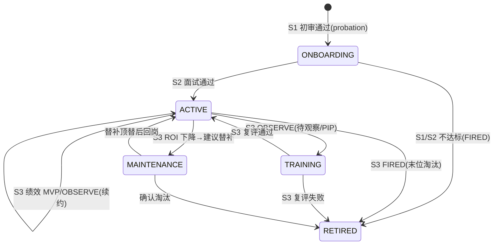
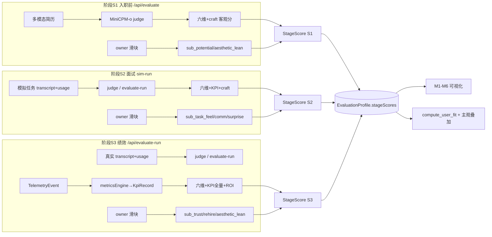

# AgentCorp · 《三阶段 × 三工种评分标准规范》详细版 PRD

> 产品经理（人因工程 owner）：许清楚（Xu）　|　版本：v1.0-detailed　|　日期：2025-07-27
> 配套：PRD v0.1（许清楚）· 评估子系统设计 v0.1-eval（高见远）· 架构主文档 v0.1 / pivot（高见远）
> 赛事：华为昇腾挑战赛 · 赛道二（指定模型 **MiniCPM-o 4.5 全模态**）
> 定位：**人因工程范畴**——由人类 owner 制定打分标准与可视化；模型推理/昇腾部署由其他队友负责。

---

## 0. 元数据与复用边界（不另起冲突命名）

### 0.1 项目信息

| 字段 | 内容 |
|---|---|
| Language | 中文（文档与界面默认中文；语音可中英） |
| Programming Language | **Vite + React + MUI + Tailwind CSS**（沿用既定栈，详见 `prd.md` §1） |
| Project Name | `agentcorp`（沿用，不新建项目代号） |
| 本文档性质 | **规范类 PRD（详细版）**：只产出标准/规范，**不写实现代码**；交付给架构师（高见远）做下一阶段设计 |
| 复用裁判服务 | `model-service/`（FastAPI + SSE，`MiniCPM-o 4.5`）：`/api/evaluate`（候选 agent 多模态简历评估）、`/api/evaluate-run`（基于真实 transcript+usage 的运行期裁判） |

### 0.2 本文档直接复用的既有契约（必须沿用，禁止重命名）

> 评审红线：**不得另起一套与下列字段冲突的命名**。工种维度、主观维度均为「在既有六维基线之上做加法」。

| 既有契约（源文件） | 字段 / 符号 | 本文档用法 |
|---|---|---|
| `model-service/app/evaluator.py` `RADAR_DIMS` | `task / quality / comm / creativity / reliability / cost` | **通用六维基线**，三阶段×三工种全部启用，0–5、0.5 步进 |
| `model-service/app/evaluator.py` `compute_user_fit` | `user_fit = Σ(radar[d]/5 × weight[d]) × 100%` | 客观契合度基座；主观分以**叠加项**回灌（见 §5、§11） |
| `src/types/evaluation.ts` `KpiRecord` | `task_completion_rate / first_success_rate / rework_rate / avg_delivery_latency_ms / autonomy_rate / escalation_rate / cross_task_generalization / stability_consistency / sample_n / window / computedAt` | 绩效阶段客观 KPI 直出源（**全量复用**） |
| `src/types/evaluation.ts` `RoiSnapshot` | `cost_total / value_total / roi / ipr / srpc / cost_perf_score / roi_index / roi_norm / window` | 绩效阶段 ROI 客观源（**全量复用**） |
| `src/types/evaluation.ts` `LifecycleState` | `ONBOARDING / ACTIVE / TRAINING / MAINTENANCE / RETIRED` | 三阶段 ↔ 生命周期态映射（见 §3.4） |
| `src/types/evaluation.ts` `Verdict` | `MVP / OBSERVE / FIRED` | 各阶段总分 → 宣判映射 |

### 0.3 原始需求复述（owner 原话提炼）

为「**擅长图像 / 擅长文本 / 擅长代码**」三类不同工种 agent，制定**统一的初审打分标准、面试考核标准、绩效审核标准**。除通用的 ROI、思考时延、任务返工率等 benchmark 外，还须明确：① **MiniCPM-o 可以通用考核的部分**（模型给出的通用审核打分 + 标准规则）；② **人类用户使用时的非清晰规则赋分**（审美倾向、任务理解能力等偏主观项）。落地形态为「入职前 / 面试时 / 绩效考核后」**三阶段**，每阶段均含**客观分 + 主观分**，并配套可视化与功能模块。

---

## 1. 产品目标与 owner 故事（交付项 1）

### 1.1 产品目标（3 个清晰正交目标）

| # | 目标 | 衡量标准（可量化） |
|---|---|---|
| G1 | **三工种同一把尺**：在通用六维基线上叠加工种专属维度，使「图像/文本/代码」三类 agent 既可在通用尺度横比，又能在工种内细评 | 工种专属维度注册表覆盖 3 工种 × ≥5 维；六维字段 100% 复用 `RADAR_DIMS`；跨工种对比落到同一 `RadarScore` |
| G2 | **三阶段连续治理**：入职前（简历初审）→ 面试（模拟任务交互）→ 绩效后（运行期遥测），标准可继承、可比对、可回灌 | 三阶段均产出「客观分 + 主观分 + 总分」同构评分卡；阶段间维度权重可继承；`EvaluationProfile` 存全阶段轨迹 |
| G3 | **owner 自定标准（人因工程定位）**：非开发的 owner 能可视化查看、调参、沉淀打分规则，主观赋分可持久化并回灌模型契合度 | 规则编辑器支持权重/阈值免改码调整；主观打分控件落库进 `EvaluationProfile`；规则以声明式文件外置（见 §7） |

### 1.2 owner 用户故事（人因工程视角：制定 / 调整 / 查看）

1. **As a 人因工程 owner**，I want 在「工种维度注册表」里为图像/文本/代码三类 agent 看到各自专属维度与 0–5 锚点，so that 我制定和讲解标准时「有表可依」，人类与 MiniCPM-o 照同一张表打分。
2. **As a owner**，I want 在入职前用 `/api/evaluate` 对简历/作品集打「客观六维 + 主观潜力/审美倾向」，so that 初审不靠拍脑袋，且主观赋分留痕。
3. **As a owner**，I want 在面试阶段用模拟任务 transcript 触发 `/api/evaluate-run` 风格裁判，拿到「任务完成/时延/返工」客观分 + 「任务理解手感/沟通/惊喜度」主观分，so that 面试有可量化卡。
4. **As a owner**，I want 在绩效阶段基于真实 transcript+usage 遥测拿到 KPI 全量 + ROI + 「信任度/再雇佣意愿」主观分，so that 谁该续约、谁该 fire 有数据支撑。
5. **As a owner**，I want 用规则编辑器把各阶段「客观/主观占比、工种权重、分段阈值」调成我的偏好，so that 标准随我的判断演进、无需找开发改代码。
6. **As a owner**，I want 在工种维度对比雷达、三阶段能力轨迹、主客观仪表盘上直观查看，so that 我向评委/业务方讲解「为什么选它」时可解释、可对话。

---

## 2. 工种维度注册表（交付项 2 · 核心交付）

### 2.1 通用六维基线（所有工种、所有阶段必启用）

> 直接复用 `RADAR_DIMS`。每个工种、每个阶段都先打这六维，保证**跨工种可比**；工种专属维度是「放大镜」，不改变六维基线。

| 维度 key | 定义 | 数据来源 | 0–5 锚点（0.5 步进） |
|---|---|---|---|
| `task` | 任务胜任力：能否完成所声明核心任务 | 混合（judge 推理简历/演示 + telemetry `success`） | 0 无证据 / 2 claim≈demo 弱 / 3 基本胜任 / 4 多模态交叉验证通过 / 5 远超声明 |
| `quality` | 产出质量：完成度/优雅/可用 | 混合（judge 推理 + telemetry `rework`/`latency`） | 0 不可用 / 2 需大量返工 / 3 可复用 / 4 高质量低返工 / 5 成品级 |
| `comm` | 表达沟通：清晰结构化自证 | judge 推理（语音/文本/视频叙事） | 0 散乱 / 2 信息密度低 / 3 结构清楚 / 4 高密度 / 5 极佳表达 |
| `creativity` | 创意差异化：独特价值/卖点 | 混合（judge 推理 + telemetry `cross_task_generalization`） | 0 同质 / 2 套模板 / 3 有差异 / 4 明显差异化 / 5 解决非平凡问题 |
| `reliability` | 可靠性：一致/不注水/抗降智 | 混合（judge 一致性 + telemetry `retry`/一致率） | 0 自相矛盾 / 2 漂移 / 3 稳定 / 4 高压稳定 / 5 极稳抗降智 |
| `cost` | 性价比：预算内产出比 | 混合（judge 推理声明 + **ROI 客观 `cost_perf_score` 融合纠偏**） | 0 超预算低效 / 2 偏贵 / 3 预算内 / 4 高效 / 5 高性价比（客观 ROI 校准） |

### 2.2 工种专属维度注册表（主映射表）

> 命名前缀避免与 `RADAR_DIMS` 冲突：`img_*` / `txt_*` / `code_*`。「关联通用六维」表示该项得分**回灌/加权进**对应六维（见 §3.3 权重预设），同时单独存 `craft` 字段供工种内细评与工种对比雷达。

| 工种 | 维度 key | 定义 | 关联通用六维 | 数据来源 |
|---|---|---|---|---|
| **图像 agent** | `img_composition` | 构图合理性（主体/留白/平衡） | `quality` / `creativity` | judge 推理（视觉直判） |
| | `img_style_fit` | 风格与需求/指令贴合度 | `quality` / `task` | judge 推理（视觉直判） |
| | `img_fidelity` | 细节保真度（无错构/无幻觉纹理） | `quality` / `reliability` | judge 推理（视觉直判） |
| | `img_aesthetic_consistency` | 审美一致性（系列作品统一调性） | `creativity` / `quality` | judge 推理（视觉 + 跨图一致性） |
| | `img_multimodal_follow` | 多模态指令遵循（图文/语音→图一致） | `task` / `reliability` | judge 推理（跨模态对齐） |
| **文本 agent** | `txt_factuality` | 事实性（无误/可核查） | `reliability` / `quality` | judge 推理（文本事实核查） |
| | `txt_coherence` | 连贯性（逻辑/结构顺畅） | `quality` / `comm` | judge 推理（文本推理） |
| | `txt_tone_fit` | 语气贴合（受众/场景匹配） | `comm` / `quality` | judge 推理（文本推理） |
| | `txt_info_density` | 信息密度（无冗余/无缺漏） | `comm` / `creativity` | judge 推理（文本推理） |
| | `txt_instruction_follow` | 指令遵循（格式/约束遵守） | `task` / `reliability` | judge 推理（文本推理） |
| **代码 agent** | `code_runnability` | 可运行性（可构建/可跑通） | `task` / `reliability` | **混合**（judge 读码 + CI/telemetry 执行结果） |
| | `code_efficiency` | 效率（时间/空间/资源） | `cost` / `quality` | 混合（judge 静态分析 + telemetry 时延） |
| | `code_test_coverage` | 测试覆盖（单测/边界） | `reliability` / `quality` | 混合（judge 读测试 + coverage 报告） |
| | `code_maintainability` | 可维护性（可读/模块/注释） | `quality` / `creativity` | judge 推理（代码评审） |
| | `code_security` | 安全性（无漏洞/无敏感泄露） | `reliability` / `cost` | **混合**（judge 审计 + 人工/扫描确认） |

### 2.3 工种专属维度 0–5 锚点（让 MiniCPM-o 与人类同表打分）

**图像 agent（img_\*）**

| 维度 | 0 | 2 | 3（合格） | 4 | 5 |
|---|---|---|---|---|---|
| `img_composition` | 无构图/乱 | 基本平衡但呆板 | 主体清晰、留白合理 | 构图有章法 | 专业级构图语言 |
| `img_style_fit` | 风格跑偏 | 部分贴合 | 总体贴合需求 | 高度贴合且有克制 | 精准命中且惊艳 |
| `img_fidelity` | 大量错构/幻觉 | 明显瑕疵 | 细节基本真实 | 细节可信 | 像素级保真 |
| `img_aesthetic_consistency` | 各图调性割裂 | 偶发不一致 | 系列基本统一 | 统一且有辨识度 | 强一致品牌感 |
| `img_multimodal_follow` | 完全背离指令 | 漏关键约束 | 遵循主指令 | 多约束全遵循 | 跨模态严丝合缝 |

**文本 agent（txt_\*）**

| 维度 | 0 | 2 | 3（合格） | 4 | 5 |
|---|---|---|---|---|---|
| `txt_factuality` | 事实错误多 | 偶发误述 | 主体可核查正确 | 高准确引证 | 严谨可追溯 |
| `txt_coherence` | 逻辑断裂 | 偶有跳脱 | 通顺可读 | 逻辑严密 | 行云流水 |
| `txt_tone_fit` | 语气错配 | 略违和 | 基本合场景 | 贴合受众 | 分寸精准 |
| `txt_info_density` | 注水/缺漏 | 冗余或单薄 | 信息适中 | 高密度无废话 | 极简而完整 |
| `txt_instruction_follow` | 无视约束 | 漏部分约束 | 遵循格式 | 全约束遵守 | 约束+隐含意图皆中 |

**代码 agent（code_\*）**

| 维度 | 0 | 2 | 3（合格） | 4 | 5 |
|---|---|---|---|---|---|
| `code_runnability` | 跑不起来 | 需改多处才跑 | 构建可跑通 | 开箱即跑 | 含示例一键跑通 |
| `code_efficiency` | 严重浪费 | 明显可优化 | 可接受 | 良好 | 接近最优 |
| `code_test_coverage` | 无测试 | 少量冒烟 | 主路径覆盖 | 边界覆盖 | 高覆盖+异常用例 |
| `code_maintainability` | 难读/强耦合 | 部分混乱 | 可读可改 | 结构清晰 | 自解释易扩展 |
| `code_security` | 有高危漏洞 | 中危隐患 | 基本安全 | 无已知隐患 | 经审计加固 |

### 2.4 主观维度注册表（人类 owner 赋分，0–5）

> 数据来源恒为「**人类主观**」。键名 `sub_*`，与通用六维、工种维度均不冲突。分阶段启用（见 §3）。

| 维度 key | 启用阶段 | 定义 | 0–5 锚点 |
|---|---|---|---|
| `sub_potential` | 初审（S1） | 潜力：成长/上限直觉 | 0 无感 / 3 有培养空间 / 5 一眼黑马 |
| `sub_aesthetic_lean` | 初审（S1）/ 绩效（S3） | 审美倾向契合（owner 个人口味） | 0 反感 / 3 顺眼 / 5 正中审美 |
| `sub_task_feel` | 面试（S2） | 任务理解「手感」：是否 get 到点 | 0 完全歪 / 3 理解到位 / 5 超越预期 |
| `sub_communication` | 面试（S2） | 沟通质感：协作是否舒服 | 0 摩擦 / 3 顺畅 / 5 愉悦默契 |
| `sub_surprise` | 面试（S2） | 惊喜度：是否眼前一亮 | 0 平庸 / 3 合格 / 5 哇塞 |
| `sub_trust` | 绩效（S3） | 信任度：敢不敢放手交活 | 0 不敢交 / 3 基本可信 / 5 闭眼委托 |
| `sub_rehire` | 绩效（S3） | 再雇佣意愿：下次还选它吗 | 0 绝不 / 3 可以考虑 / 5 首发必选 |

---

## 3. 三阶段规则集（交付项 3）

### 3.1 三阶段总览

| 阶段 | 业务语义 | 对应既有裁判入口 | 证据形态 | 客观分来源 | 主观分来源 |
|---|---|---|---|---|---|
| **S1 入职前（初审）** | 简历/作品集筛选 | `/api/evaluate`（`EvaluationRequest`：多模态简历 + 偏好） | 视频/语音/图/码/文本 persona | judge 推理六维 + 工种 craft 维 | `sub_potential` / `sub_aesthetic_lean` |
| **S2 面试** | 模拟任务 + 交互考核 | 模拟任务 transcript → 走 `/api/evaluate-run` 形态裁判 | 任务 transcript + usage | 六维（sim-run 推理）+ KPI(完成/时延/返工) + craft 维 | `sub_task_feel` / `sub_communication` / `sub_surprise` |
| **S3 绩效后** | 运行期真实绩效审核 | `/api/evaluate-run`（`JudgeRunRequest`：真实 transcript + usage） | 真实 transcript + usage 遥测 | 六维（telemetry 派生）+ KPI 全量 + ROI 全量 + craft 维 | `sub_trust` / `sub_rehire` / `sub_aesthetic_lean` |

### 3.2 每阶段「启用维度集 + 权重预设 + 客观/主观占比」

> 权重为**建议默认值**，外置于规则文件（§7），owner 可在规则编辑器改。括号内为「客观块内」各子块的权重占比，子块权重之和=1；`objW`/`subjW` 为阶段级客观/主观占比，之和=1。

**S1 入职前（初审）**

| 项 | 内容 |
|---|---|
| 启用客观维 | 通用六维（6）+ 本工种 craft 维（5） |
| 客观块权重 | 通用六维 60% · 工种 craft 维 40%（权重预设见 §3.3） |
| 启用主观维 | `sub_potential`、`sub_aesthetic_lean` |
| **客观/主观占比建议** | **objW = 0.6 / subjW = 0.4**（初审重证据但保留 owner 审美与潜力判断） |
| 总分阈值（→Verdict） | ≥78 → MVP；50–78 → OBSERVE；<50 → FIRED（owner 可调） |

**S2 面试**

| 项 | 内容 |
|---|---|
| 启用客观维 | 通用六维（6，sim-run 推理）+ KPI 派生（完成率/时延/返工 折叠进六维）+ 本工种 craft 维（5） |
| 客观块权重 | 通用六维 50% · 工种 craft 维 50% |
| 启用主观维 | `sub_task_feel`、`sub_communication`、`sub_surprise` |
| **客观/主观占比建议** | **objW = 0.5 / subjW = 0.5**（面试强调「手感」等主观体验） |
| 总分阈值 | ≥78 → MVP；50–78 → OBSERVE；<50 → FIRED |

**S3 绩效后（运行期）**

| 项 | 内容 |
|---|---|
| 启用客观维 | 通用六维（6，telemetry 派生）+ KPI 全量（8）+ ROI 全量（含 `cost_perf_score` 融合进 `cost` 维）+ 本工种 craft 维（5） |
| 客观块权重 | 通用六维 40% · 工种 craft 维 30% · KPI/ROI 30% |
| 启用主观维 | `sub_trust`、`sub_rehire`、`sub_aesthetic_lean` |
| **客观/主观占比建议** | **objW = 0.7 / subjW = 0.3**（运行期以真实遥测客观为主，主观只补「信任/再雇佣」） |
| 总分阈值 | ≥78 → MVP（续约/晋升）；50–78 → OBSERVE（留用观察）；<50 → FIRED（淘汰/替补） |

### 3.3 工种权重预设（客观块内「通用六维 vs 工种 craft 维」的细化）

> 让不同工种在客观分里「扬长」：代码 agent 更看 craft（可运行/测试/安全），图像 agent 更看 craft（构图/审美），文本 agent 更看 craft（事实/连贯）。以下为**客观块内**的通用六维聚合权重（Σ=1），供架构师做 `stageRule.objectiveWeighting`。

| 通用六维 | 图像 agent | 文本 agent | 代码 agent | 说明 |
|---|---|---|---|---|
| `task` | 0.18 | 0.18 | 0.18 | 基线一致 |
| `quality` | 0.17 | 0.17 | 0.17 | 基线一致 |
| `comm` | 0.15 | 0.18 | 0.12 | 文本更高、代码略低 |
| `creativity` | 0.17 | 0.12 | 0.13 | 图像更高 |
| `reliability` | 0.17 | 0.18 | 0.20 | 代码更高（安全/稳定） |
| `cost` | 0.16 | 0.17 | 0.20 | 代码更高（效率/成本） |
| **→ 工种 craft 维整体占比** | **40%** | **40%** | **40%** | 见 §3.2 客观块权重 |

> 注：上表「通用六维」六数之和=1，代表客观块中「通用六维子块」内部权重；再按 §3.2 的「通用六维 60% / craft 40%」折叠为客观总分。架构师可把这套两层级权重收敛为一个扁平 `dimWeight: Record<dimKey, number>`（Σ=1，仅含本阶段启用维）以简化引擎（见 §11）。

### 3.4 三阶段 ↔ 生命周期态映射



---

## 4. MiniCPM-o 通用可考核清单（交付项 4）

> 除通用 benchmark（ROI、`avg_delivery_latency_ms` 时延、`rework_rate` 返工率，均来自 `RoiSnapshot`/`KpiRecord` telemetry 直出）外，下列项声明**哪些可由 judge prompt 直接判定、哪些需人类确认**。判定标记：`J`=judge 直接判定（写入 `prompt_templates.py` 的 JSON 输出）；`H`=需人类确认（走 §5 主观通道）；`M`=混合（judge 出初值 + telemetry/人类校准）。

| 考核项 | 映射维度 | 判定方 | 落到 judge prompt 的指令要点 |
|---|---|---|---|
| 声明–交付一致性（注水检测） | `reliability`/`task` | **J**（核心） | 视频/语音 claim 是否在代码/文本兑现；`claim≠demo` 即降权（现有 `SYSTEM_PROMPT` 已有，强化为硬规则） |
| 任务理解力 | `task` | **J** | 从 persona + 任务描述判断其是否 get 到核心意图 |
| 跨模态自洽 | `reliability`/`comm` | **J** | 图/文/码/语音多模态是否自相矛盾 |
| 表达沟通力 | `comm` | **J** | 结构化/信息密度/叙事连贯（六维 `comm`） |
| 可靠性（抗降智/一致性） | `reliability` | **J** + `M`（telemetry `stability_consistency` 校准） | 随机压力追问稳定、多轮一致 |
| 图像·构图/风格/细节/审美一致性 | `img_*` | **J**（视觉直判） | 在 judge prompt 增 `image_craft` 子对象输出 |
| 文本·事实/连贯/语气/密度/指令 | `txt_*` | **J**（文本推理） | 在 judge prompt 增 `text_craft` 子对象输出 |
| 代码·可运行性 | `code_runnability` | **M**（judge 读码初判 + CI/执行结果） | judge 给「可读性可运行推断」，真实跑通由 telemetry 校正 |
| 代码·效率/可维护性 | `code_efficiency`/`code_maintainability` | **J**（静态分析） | judge prompt 增 `code_craft` 子对象 |
| 代码·测试覆盖/安全性 | `code_test_coverage`/`code_security` | **M**（judge 初判 + 覆盖率报告/人工扫描确认） | judge 出初值，安全项**必须**人工/扫描复核（H 兜底） |
| 审美倾向 / 任务理解手感 / 惊喜度 | `sub_*` | **H**（人类主观） | **不**进 judge prompt；仅走 §5 主观通道 |
| 信任度 / 再雇佣意愿 / 潜力 | `sub_*` | **H**（人类主观） | **不**进 judge prompt |

> 关键边界（呼应 `prd.md` R1/R3）：**注水检测、跨模态自洽、可靠性由 judge 直接判定并可机器复核**；**审美/手感/惊喜/信任等「非清晰规则」纯主观项不交给模型**，由 owner 在主观通道赋分，避免模型越权替人类做口味决策。

---

## 5. 主观打分通道设计（交付项 5）

### 5.1 控件与持久化路径

```
owner 实时赋分控件(滑块/星标) → onScore(stage, dim, value, note)
   → 写入 EvaluationProfile.subjectiveLatest / subjectiveHistory[]
   → 聚合进 StageScore.subjective → 推算阶段总分
   → 以叠加项回灌 compute_user_fit（见 §5.3）
```

### 5.2 字段扩展建议（对齐 `src/types/evaluation.ts`，仅做加法）

```typescript
// ===== 新增枚举（不改动既有 RadarDim/Verdict/LifecycleState）=====
export type JobType = "image" | "text" | "code";
export type StageKey = "preScreen" | "interview" | "performance"; // S1/S2/S3
export type SubjectiveDim =
  | "sub_potential" | "sub_aesthetic_lean" | "sub_task_feel"
  | "sub_communication" | "sub_surprise" | "sub_trust" | "sub_rehire";

// ===== 单次主观赋分（人类 owner）=====
export interface SubjectiveScore {
  agentId: string;
  stage: StageKey;            // 关联阶段
  scores: Partial<Record<SubjectiveDim, number>>; // 0–5，仅含本阶段启用维
  notes?: string;             // 非清晰规则的自由注解（如"审美偏极简但略冷"）
  scoredBy: string;           // owner id
  ts: string;                 // ISO8601 UTC
}

// ===== 单阶段评分卡（客观+主观+总分，三阶段同构）=====
export interface StageScore {
  agentId: string;
  stage: StageKey;
  jobType: JobType;
  objective: { dim: string; score: number; source: "judge" | "telemetry" | "mixed" }[];
  subjective: SubjectiveScore;
  objectiveWeight: number;    // objW（阶段级，0–1）
  subjectiveWeight: number;   // subjW（阶段级，0–1）
  total: number;              // 0–100 推算（见 §10 公式）
  verdict: Verdict;           // 由 total 映射
  window?: string;
  ts: string;
}

// ===== 扩展 EvaluationProfile（在既有字段后追加，不破坏既有）=====
export interface EvaluationProfile {
  agentId: string;
  radarLatest: RadarScore;
  radarHistory: RadarScore[];
  kpiLatest: KpiRecord;
  kpiHistory: KpiRecord[];
  roiLatest: RoiSnapshot;
  lifecycle: LifecycleState;
  runIds: string[];
  updatedAt: string;
  // —— 本规范新增（三阶段×三工种）——
  jobType: JobType;                       // 工种标签
  stageScores: StageScore[];             // 三阶段评分卡（S1/S2/S3）
  subjectiveLatest: SubjectiveScore;     // 最新主观分（用于回灌）
  subjectiveHistory: SubjectiveScore[];  // 主观分轨迹
}
```

### 5.3 主观分回灌 `compute_user_fit`（与 `evaluator.py` 严格一致）

> 不改动 `compute_user_fit` 既有客观公式，仅**追加可选主观叠加项**（保持向后兼容：不传 `subjective` 时行为不变）。

```python
# evaluator.py compute_user_fit 签名扩展（向后兼容）
def compute_user_fit(
    radar: RadarScore, preference: UserPreference,
    declared_budget: float, declared_tags: List[str],
    inferred_aesthetic: Optional[str] = None,
    subjective: Optional[Dict[str, float]] = None,   # 新增：主观分 {dim: 0-5}
) -> tuple[float, List[str]]:
    # —— 既有客观基座（不变）——
    fit, evidence = _fit_objective(...)   # = Σ(radar/5 × weight) × 100% + 预算/审美/技术栈修正
    # —— 新增：主观叠加（owner 口味修正，封顶 ±8%）——
    if subjective:
        sub_avg = mean(subjective.values()) / 5.0     # 0–1
        delta = (sub_avg - 0.6) * 20.0                # 以 0.6(=3/5)为中性基准，±8% 封顶
        delta = max(-8.0, min(8.0, round(delta, 1)))
        fit = max(0.0, min(100.0, fit + delta))
        evidence.append(f"主观叠加(sub_avg={sub_avg:.2f})→{delta:+.1f}%")
    return fit, evidence
```

> 设计要点：**主观分只做 ±8% 的「owner 口味修正」**，不颠覆客观结论（缓解 `prd.md` R1 元评估被单点主观带偏）。owner 可在规则文件里调 `subjective_cap`（默认 8）。

---

## 6. 可视化与功能模块需求（交付项 6）

### 6.1 功能模块清单

| 模块 | 功能 | 数据来源 |
|---|---|---|
| **M1 三阶段能力轨迹对比** | 同一 agent 在 S1/S2/S3 的六维雷达叠加 + 总分折线 | `EvaluationProfile.stageScores` / `radarHistory` |
| **M2 规则编辑器** | 非开发 owner 调「客观/主观占比、工种权重、分段阈值、主观封顶」 | 外置规则文件（§7）双向绑定 |
| **M3 工种维度对比雷达** | 同工种多 agent 的 craft 维（如 `code_*`）并排雷达 | `stageScores.objective` 中 `code_*` 维 |
| **M4 主客观分仪表盘** | 每阶段客观分 vs 主观分双环/双进度 + 总分 | `StageScore.objectiveWeight/ subjectiveWeight/ total` |
| **M5 主观打分控件** | 阶段相关主观维的滑块/星标 + 注解 | `SubjectiveScore`（§5.2） |
| **M6 评分卡详情** | 单阶段评分卡（逐维证据 + 主观注解 + 总分推算） | `StageScore` |

### 6.2 UI 区块草图（ASCII）

```
┌──────────────────────────────────────────────────────────────────────┐
│ AgentCorp · 三阶段×三工种评分中心   [工种▾image/text/code] [阶段▾S1/S2/S3]│
├───────────────────────────────┬──────────────────────────────────────┤
│ 左：M4 主客观分仪表盘            │ 右：M1 三阶段能力轨迹                │
│  ┌──────────┐ ┌──────────┐     │  ┌────────────────────────────────┐  │
│  │ 客观分 78 │ │ 主观分 70 │     │  │ 六维雷达：S1● S2◆ S3▲ 叠加      │  │
│  │  /100    │ │  /100    │     │  │ task quality comm … cost        │  │
│  └──────────┘ └──────────┘     │  └────────────────────────────────┘  │
│  总分 74.1  [MVP/OBSERVE/FIRED] │  ┌────────────────────────────────┐  │
│                                │  │ 总分折线：S1 75.8→S2 74.1→S3 … │  │
│ M5 主观打分控件（本阶段启用维） │  └────────────────────────────────┘  │
│  ☆ sub_task_feel   [----●----]4.0   M3 工种维度对比雷达(同工种)      │
│  ☆ sub_communication[---●-----]3.5   code_runnability/eff/cov/...     │
│  ☆ sub_surprise    [--●------]3.0   agentA◆ agentB◆ agentC◆          │
│  [注解：理解到位但偏保守]        │                                     │
├───────────────────────────────┴──────────────────────────────────────┤
│ M2 规则编辑器（owner 自定，免改码）                                   │
│  客观/主观占比 S1 0.6/0.4 · S2 0.5/0.5 · S3 0.7/0.3  [滑块]          │
│  工种权重预设 [image/text/code▾] · 分段阈值 MVP≥78/OBS≥50 [输入]      │
│  主观封顶 ±[8]% · [保存为 scoring-rules.json]                          │
└──────────────────────────────────────────────────────────────────────┘
```

### 6.3 三阶段管线（数据流，供架构师）



---

## 7. 打分规则外置化建议（交付项 7）

> 把「维度权重、阶段占比、分段阈值、主观封顶」抽成**声明式 JSON/YAML**，owner 在规则编辑器改、免改码。下为 JSON Schema 样例（`scoring-rules.json`），与 §2/§3 严格对应。

```json
{
  "$schema": "agentcorp.scoring-rules/v1",
  "version": "1.0",
  "genericRadar": ["task","quality","comm","creativity","reliability","cost"],
  "jobs": {
    "image":  { "craftDims": ["img_composition","img_style_fit","img_fidelity","img_aesthetic_consistency","img_multimodal_follow"] },
    "text":   { "craftDims": ["txt_factuality","txt_coherence","txt_tone_fit","txt_info_density","txt_instruction_follow"] },
    "code":   { "craftDims": ["code_runnability","code_efficiency","code_test_coverage","code_maintainability","code_security"] }
  },
  "stages": {
    "preScreen": {
      "enabledObjective": ["__generic__","__craft__"],
      "enabledSubjective": ["sub_potential","sub_aesthetic_lean"],
      "objectiveBlockWeight": { "generic": 0.6, "craft": 0.4 },
      "objectiveWeight": 0.6, "subjectiveWeight": 0.4,
      "genericRadarWeight": { "task":0.18,"quality":0.17,"comm":0.15,"creativity":0.17,"reliability":0.17,"cost":0.16 },
      "thresholds": { "mvp": 78, "observe": 50 }
    },
    "interview": {
      "enabledObjective": ["__generic__","__craft__","kpi:completion/latency/rework"],
      "enabledSubjective": ["sub_task_feel","sub_communication","sub_surprise"],
      "objectiveBlockWeight": { "generic": 0.5, "craft": 0.5 },
      "objectiveWeight": 0.5, "subjectiveWeight": 0.5,
      "genericRadarWeight": { "task":0.18,"quality":0.17,"comm":0.15,"creativity":0.17,"reliability":0.17,"cost":0.16 },
      "thresholds": { "mvp": 78, "observe": 50 }
    },
    "performance": {
      "enabledObjective": ["__generic__","__craft__","kpi:*","roi:*"],
      "enabledSubjective": ["sub_trust","sub_rehire","sub_aesthetic_lean"],
      "objectiveBlockWeight": { "generic": 0.4, "craft": 0.3, "kpiRoi": 0.3 },
      "objectiveWeight": 0.7, "subjectiveWeight": 0.3,
      "genericRadarWeight": { "task":0.18,"quality":0.17,"comm":0.15,"creativity":0.17,"reliability":0.17,"cost":0.16 },
      "thresholds": { "mvp": 78, "observe": 50 }
    }
  },
  "subjective": {
    "capPercent": 8,
    "neutralBaseline": 3
  }
}
```

> 引擎消费约定：`__generic__` = `genericRadar`；`__craft__` = 当前 `jobType` 的 `craftDims`；`kpi:*`/`roi:*` = 全量 `KpiRecord`/`RoiSnapshot`（已折叠进六维或单独加权）。架构师应把「两层级权重（通用 vs craft 子块 + 阶段级 objW/subjW）」在加载时**预折叠为扁平 `dimWeight`** 以简化打分计算（见 §11 输入 2）。

---

## 8. 竞品与定位分析（详细版增值 · 供评委理解差异化）

> 定位结论：现有 agent 评估多为「单能力 benchmark / 纯文本 LLM-as-judge / 运行观测」，本规范首创「**全模态 + 三阶段 + 三工种 + 主客观同构**」的 HR 式评估标准。

| 框架 | 模态覆盖 | 评估深度 | 多工种 | 主客观同构 | 短板 |
|---|---|---|---|---|---|
| AgentBench / WebArena / Tau-bench | 文本/工具 | 单点能力 benchmark | 否 | 客观为主 | 无全模态、无 HR 阶段 |
| SWE-bench / HumanEval | 代码 | 单点代码 | 代码单工种 | 客观 | 不覆盖图像/文本 |
| MT-Bench（LLM-as-judge） | 文本 | 对话质量 | 否 | 偏主观 | 非全模态、无 telemetry |
| LangSmith / Arize（agent 观测） | 多（运行） | 运行观测 | 否 | 客观 KPI | 无工种维度、无主观通道 |
| AgentCorp 原版 healthScore/ROI | 文本为主 | 全生命周期 | 否（通用） | 客观为主 | 无工种细分、无主观 |
| **本规范（三阶段×三工种）** | **全模态** | **全生命周期三阶段** | **图像/文本/代码** | **客观+主观同构** | 需 owner 持续打磨规则 |

```mermaid
quadrantChart
    title Agent 评估框架定位（X=模态覆盖 0-1，Y=评估深度 0-1）
    x-axis "单/文本模态" "全模态"
    y-axis "单点 benchmark" "全生命周期多阶段"
    "AgentBench/WebArena": [0.2, 0.25]
    "SWE-bench/HumanEval": [0.1, 0.3]
    "MT-Bench(LLM-as-judge)": [0.15, 0.35]
    "LangSmith/Arize(运行观测)": [0.35, 0.6]
    "AgentCorp 原版 healthScore/ROI": [0.4, 0.7]
    "本规范:三阶段×三工种": [0.85, 0.92]
```

---

## 9. 待确认问题清单（交付项 8 · 需 owner 拍板）

| # | 决策点 | 本文档建议默认值 | 影响 |
|---|---|---|---|
| Q1 | 各阶段客观/主观占比默认值（S1/S2/S3） | 0.6/0.4 · 0.5/0.5 · 0.7/0.3 | 阶段总分构成、Verdict 分布 |
| Q2 | 工种通用六维权重预设是否如上表（图像/文本/代码差异化） | 是（§3.3） | 跨工种可比性 vs 扬长 |
| Q3 | 主观分回灌 `compute_user_fit` 的封顶 `subjective_cap` | ±8% | 主观对契合度的影响上限 |
| Q4 | 分段阈值（MVP/OBSERVE/FIRED）默认 78/50 | 是 | 淘汰率松紧 |
| Q5 | **主观维度是否纳入 leaderboard 排名** | 默认**不纳入**（仅客观分+ROI 排名），主观分作展示/复核 | 排名公平性 |
| Q6 | 代码 agent 的 `code_runnability`/`code_security` 是否强制要求 CI/扫描真实结果才计客观分 | 是（混合 M，缺真实结果则该维降权） | 注水风险 |
| Q7 | 工种 craft 维在六维之外**是否单独存库并参与工种对比雷达** | 是（§2.2、M3） | 存储与可视化 |
| Q8 | 规则文件格式 JSON 还是 YAML；是否支持多套预设（如「重性价比采购者」） | JSON；支持多预设 | 编辑器实现 |
| Q9 | S2 面试的「模拟任务」由谁提供（题库/owner 现场给） | 复用 `/api/evaluate-run` 形态，题库待定 | 需要任务集 |

---

## 10. 完整打分样例（交付项 · 3 个）

> 统一公式（与 §3/§7 一致）：
> `objective_raw = mean(本阶段启用客观维 score)`（0–5）；`objective_score = objective_raw/5 × 100`
> `subjective_raw = mean(本阶段启用主观维 score)`（0–5）；`subjective_score = subjective_raw/5 × 100`
> `total = objective_score × objW + subjective_score × subjW`（0–100）
> `verdict`：total≥78→MVP；50–78→OBSERVE；<50→FIRED。

### 样例 1 · 代码 agent「老张」面试评分卡（S2 / interview / code）

| 客观维 | 来源 | 分 | 主观维 | 分 |
|---|---|---|---|---|
| task | judge(sim-run) | 4.5 | sub_task_feel | 4.0 |
| quality | judge | 4.0 | sub_communication | 3.5 |
| comm | judge | 3.5 | sub_surprise | 3.0 |
| creativity | judge | 3.5 | | |
| reliability | judge | 4.0 | | |
| cost | judge | 3.5 | | |
| code_runnability | mixed | 5.0 | | |
| code_efficiency | mixed | 3.5 | | |
| code_test_coverage | mixed | 4.0 | | |
| code_maintainability | judge | 4.0 | | |
| code_security | mixed | 3.5 | | |

- 客观均 = (4.5+4.0+3.5+3.5+4.0+3.5+5.0+3.5+4.0+4.0+3.5)/11 = 43.0/11 = **3.909** → 客观分 **78.2**
- 主观均 = (4.0+3.5+3.0)/3 = 3.5 → 主观分 **70.0**
- **total = 78.2×0.5 + 70.0×0.5 = 74.1** → **OBSERVE**（可入职但需观察沟通/惊喜度）

### 样例 2 · 图像 agent「琳达」绩效评分卡（S3 / performance / image）

| 客观维 | 来源 | 分 | 主观维 | 分 |
|---|---|---|---|---|
| task | telemetry 派生 | 4.0 | sub_trust | 4.5 |
| quality | telemetry 派生 | 4.5 | sub_rehire | 4.0 |
| comm | telemetry 派生 | 3.5 | sub_aesthetic_lean | 4.5 |
| creativity | telemetry 派生 | 4.5 | | |
| reliability | telemetry 派生 | 4.0 | | |
| cost | ROI `cost_perf_score` 融合 | 4.0 | | |
| img_composition | judge | 4.5 | | |
| img_style_fit | judge | 4.5 | | |
| img_fidelity | judge | 4.0 | | |
| img_aesthetic_consistency | judge | 4.5 | | |
| img_multimodal_follow | judge | 4.0 | | |

- 客观均 = (4.0+4.5+3.5+4.5+4.0+4.0+4.5+4.5+4.0+4.5+4.0)/11 = 46.0/11 = **4.182** → 客观分 **83.6**
- 主观均 = (4.5+4.0+4.5)/3 = 4.33 → 主观分 **86.7**
- **total = 83.6×0.7 + 86.7×0.3 = 58.52 + 26.01 = 84.5** → **MVP**（续约/晋升；与 `MOCK_FIXTURES` candidate-01 极简审美契合一致）

### 样例 3 · 文本 agent「阿强」初审评分卡（S1 / preScreen / text）

| 客观维 | 来源 | 分 | 主观维 | 分 |
|---|---|---|---|---|
| task | judge(简历) | 3.5 | sub_potential | 4.0 |
| quality | judge | 4.0 | sub_aesthetic_lean | 3.5 |
| comm | judge | 4.5 | | |
| creativity | judge | 3.5 | | |
| reliability | judge | 3.5 | | |
| cost | judge | 3.0 | | |
| txt_factuality | judge | 4.0 | | |
| txt_coherence | judge | 4.5 | | |
| txt_tone_fit | judge | 4.0 | | |
| txt_info_density | judge | 3.5 | | |
| txt_instruction_follow | judge | 4.0 | | |

- 客观均 = (3.5+4.0+4.5+3.5+3.5+3.0+4.0+4.5+4.0+3.5+4.0)/11 = 42.0/11 = **3.818** → 客观分 **76.4**
- 主观均 = (4.0+3.5)/2 = 3.75 → 主观分 **75.0**
- **total = 76.4×0.6 + 75.0×0.4 = 45.84 + 30.0 = 75.8** → **OBSERVE**（进入面试 S2）

> 注：样例 3 与 `MOCK_FIXTURES` candidate-03「阿强」不同——此处阿强为文本 agent 初审达标进面试，说明同人名在不同工种/阶段结论可不同，凸显「工种维度注册表」价值。

---

## 11. 下一步给架构师的输入清单（高见远设计用）

> 本文档已固化「标准与字段」，以下 4 类为需要架构师落地的工程输入。

**输入 1 · 维度注册表数据结构**
- 类型：`JobType`、`StageKey`、`SubjectiveDim`（§5.2）；`DimensionRegistry`（§2.2 主映射表 → TS interface + 后端 Pydantic 镜像）。
- 要求：与 `RADAR_DIMS` 共存；`craft`/`sub` 维键名前缀隔离，避免与六维冲突；六维权重 `Σ=1`。
- 落点：`src/types/evaluation.ts`（前端）、`model-service/app/schemas.py`（后端 judge 输出增 `craft` 子对象）。

**输入 2 · 规则引擎**
- 消费 `scoring-rules.json`（§7）：加载时把「两层级权重」**预折叠为扁平 `dimWeight: Record<dimKey, number>`（Σ=1，仅含本阶段启用维）**。
- 计算：`objective_raw`/`subjective_raw`/`total`/`verdict`（§10 公式）；`compute_user_fit` 追加 `subjective` 可选叠加（§5.3，向后兼容）。
- 边界：`code_runnability`/`code_security` 缺真实执行/扫描结果时该维降权（Q6）。

**输入 3 · 三阶段管线**
- S1 → `/api/evaluate`；S2/S3 → `/api/evaluate-run`（模拟/真实 transcript+usage）。
- judge prompt（`prompt_templates.py`）增 `craft` 子对象输出（图像 `img_*`、文本 `txt_*`、代码 `code_*`），注水检测/跨模态自洽/可靠性为硬规则（§4）。
- 主观项**不进 judge prompt**，仅走 §5 主观通道。

**输入 4 · 可视化组件**
- M1 三阶段能力轨迹对比、M2 规则编辑器（双向绑定外置规则）、M3 工种维度对比雷达、M4 主客观分仪表盘、M5 主观打分控件、M6 评分卡详情（§6.1/§6.2）。
- 数据契约：读 `EvaluationProfile.stageScores` / `subjectiveHistory` / `radarHistory` / `kpiHistory`。
- 复用既有：`RadarChart`、`RoiDashboard`、`LifecyclePanel`、`Leaderboard`（不新建冲突组件）。

---

*— 本文档为《三阶段 × 三工种评分标准规范》详细版 PRD（v1.0-detailed），由人因工程 owner 许清楚基于 `model-service/app/{evaluator,prompt_templates,schemas}.py`、`src/types/{evaluation,lifecycle}.ts`、`docs/evaluation-design.md`、`docs/prd.md`、`src/services/judgeClient.ts` 真实代码起草，仅产出规范、不写实现。字段严格复用 `RADAR_DIMS` / `KpiRecord` / `RoiSnapshot` / `LifecycleState` / `Verdict`，未另起冲突命名。—*
